<div align="center">

# uav-nav-lab

**A Python lab for UAV motion planning that proves — or disproves — what actually works.**
Swap planners, sensors and swarm rules in YAML; settle every claim with seed-paired McNemar tests and Wilson 95 % CIs.

[](https://github.com/rsasaki0109/uav-nav-lab/actions/workflows/ci.yml)
[](https://github.com/rsasaki0109/uav-nav-lab/actions/workflows/ci.yml)
[](https://github.com/rsasaki0109/uav-nav-lab/releases)
[](LICENSE)
[](https://github.com/rsasaki0109/uav-nav-lab/stargazers)

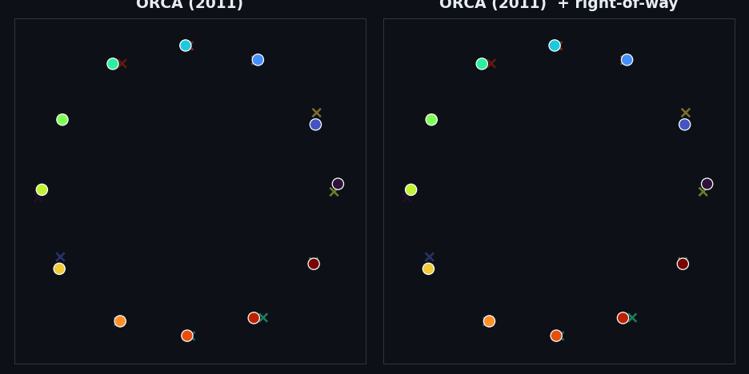

<i><b>One rule turns a pile-up into a roundabout.</b> Twelve drones swap across a single hub. <b>Stock ORCA</b> (left) drives every path into the centre and collides; add a decentralised <b>right-of-way</b> (right) — each drone passes neighbours on a consistent side — and the same fleet spirals into a clean roundabout, collision-free. One of ~40 seed-paired findings — <a href="docs/findings.md">see them all</a>.</i>

</div>

## Why this exists

Most planning repos *ship* a method. This one *interrogates* it. Every headline is a paired, seed-controlled experiment with an exact p-value — and several overturn the textbook intuition:

- **The "optimal" planner is the dangerous one.** `rrt_star`'s shortest-path rewiring collides *more* than plain `rrt` in dynamic avoidance (21.7 % vs 76.7 %, p<1e-3, ~30× the compute) — the shortest path hugs minimum clearance.
- **The classical-planner ladder is a clearance ladder.** straight < astar < rrt\_star < rrt < mpc tracks path *directness*, not cleverness — the two "optimal" planners are the straightest and collide most.
- **Smarter prediction backfires under symmetry.** A goal-aware predictor wins head-on (+26 pp) but *inverts* on the antipodal swap (down to 1/40) — a correct shared symmetric forecast makes every drone mirror-swerve into the same hub.
- **The fix is a convention, not a better forecast.** A decentralised right-of-way (everyone veers the same way) turns the deadlock into a roundabout and reaches 100 %; once it is on, the predictor is *free* — smart and dumb forecasts tie.
- **"Team-size-agnostic" carrying is geometric, not learned.** Interrogating [TeamHOI](https://splionar.github.io/TeamHOI/) (CVPR 2026): N drones carry a rigid beam through a doorway. A *fixed* formation collapses to 0/60 for every N≥3 (the beam outgrows the gap); one that *reorients* the beam holds 57–60/60 flat across N=2–8 (p≤1.7e-18). What makes cooperative carrying scale to any team size is active formation reshaping — and it costs runway, not cleverness.
- **…and only where the workspace is convex.** Reorientation makes carrying size-agnostic at a *doorway*, but an *L-corner* obeys the classical ladder-around-a-corner bound `L_max = 2.83·width`: a beam longer than that cannot round the corner in any sequence of moves. So a non-convex passage imposes a hard ceiling `N_max ≈ 2.83·width/spacing` — at corridor width 4 m the corner ties the doorway to N=4 then collapses to 0/60 by N=6, and is restored only by *widening the corridor*, not by a cleverer team.
- **A learned teammate-token policy is only as symmetry-breaking as its teacher.** Distilling a [TeamHOI](https://splionar.github.io/TeamHOI/)-style permutation-invariant deep set (NumPy, behavioral cloning on *random scenes only*) from a **symmetric** avoider reimports — and *amplifies* — the antipodal deadlock (`8/1/0` of 60 at N=4/6/8, worse than its own teacher despite `bc_mse=1e-4`); the **same** architecture distilled from a right-of-way **convention** clears the unseen hub and generalises zero-shot to N=8 (`60/58/41`, p≤9e-13 between them). The teammate-token network neither creates nor cures the deadlock — it transports whatever convention the training signal had, bounding what "any team size" can come from.
- **…and the representation must be able to *represent* that handedness.** The teacher carrying the convention is necessary but *not sufficient*: quotient the left/right mirror out of the policy's frame (a reflection-canonical, chirality-free representation) and the **same convention teacher** distils to `2/4/0` of 60 — the deadlock floor — versus `60/58/41` for the chirality-preserving frame (p≤7e-18), at the same `bc_mse≈1e-4`. A learned convention needs the symmetry-breaker in *both* the training signal **and** the representation; remove either and the antipodal deadlock returns.
- **RL *discovers* the convention from a symmetric reward — but needs the same chirality-capable representation.** Train the same deep set by **REINFORCE** on a reflection-symmetric reward (no built-in handedness): in the chirality-capable frame it clears far above the symmetric-teacher floor (`24.8`/`14.3`/`9.3` of 30 at N=4/6/8 vs `4`/`0`/`0`) and settles on a self-generated side (handedness consistency `0.97`) — *spontaneous* symmetry breaking, no teacher required. So the convention is discoverable, not merely teachable. But the chirality-free frame collapses RL discovery to the floor too (`0.5`/`0` at N≥6): the representation requirement is the **common** necessary condition for both *taught* and *found* conventions. (Taught still beats found — BC-from-convention reaches `30/29/20`.)
- **A roundabout can be negotiated locally — but only where symmetry hands over agreement.** A faithful decentralised [Merry-Go-Round](https://arxiv.org/abs/2503.05848) (triggered on a local deadlock, ring centre = the *centroid of the ego's conflict cluster*, no global hub knowledge) breaks the antipodal CBF deadlock 40/40 at every N=4–20 and *ties the fixed-centre roundabout* (p=1.0) — agents agree on a common ring from sensing alone, because on the symmetric hub every local centroid coincides. The catch first looked like the same fact — on dense *unstructured* traffic the ungated trigger collapsed (N=16: 5/40, worse than stock) — but it was **over-triggering, not disagreement**: a **symmetry gate** that fires only on a genuine shared hub (ego *and* peers all crossing the cluster centroid) restores the off-switch the always-on convention can never have — it keeps the full 40/40 antipodal cure *and* is harmless on unstructured traffic (a tie with stock at every N).
- **…but a roundabout makes a hub *obstacle* worse, not better.** The intuition that the Merry-Go-Round "evacuates" the contested centre is backwards: against an external body crossing the hub it is **significantly worse** than the always-on peer convention on the same avoider — 7/40 vs 26/40 at N=6, a total 0/40 vs 9/40 collapse at N=8 (p≤0.004), every failure a collision, while a far-corner obstacle leaves both untouched. The convention drives a *current* that transits the hub quickly; the roundabout *holds* the fleet orbiting in the swept region, so a reflecting obstacle mows it down. The way to beat the wrong-threat cap is to *leave* the contested space, not to orbit it.
- **The convention assumes a shared turning budget, not interchangeable drones.** Mixing *acceleration* limits across the fleet (a 7× agility ratio, mean held fixed) does not break the right-of-way roundabout — it ties a homogeneous fleet at the standard operating point, and mixed agility *alone* (no bias) deadlocks just as the [AVO](https://gamma.cs.unc.edu/AVO/) regime and [recent work](https://arxiv.org/abs/2501.10447) predict. But it is robust only because the roundabout's centripetal demand (v²/r) sits below even the sluggish drones' limit: drive it faster (speed 11) and the mixed fleet collapses (15/40 vs a uniform fleet's 34/40, p=0.0002) while the slow-*turning* drones cut the hub — a speed-gated boundary the [speed-heterogeneity axis](docs/findings.md#the-right-of-way-convention-is-robust-to-speed-heterogeneity--a-4-mismatched-fleet-still-rounds-the-hub) never exposed.
- **A comms-free rule beats a "smarter" one when sensing drops out.** The global veer-right reads only each drone's *own* goal; the pairwise winding rule must *see* each neighbour to pick a side. Drop peer observations (Bernoulli packet loss) and the global convention is essentially immune — 31/40 even at 60 % dropout — while the pairwise rule collapses to, and then *below*, the no-convention floor (3/40, partial neighbour info misleads the side choice; p<1e-4). The roundabout's spatial structure is *passive safety*; the local rule's coordination signal is exactly what the channel loses. Prefer the convention each agent can compute alone.
- **Free flocking fragments — and you cannot cohesion-gain your way out.** Reproducing [Olfati-Saber's](https://ieeexplore.ieee.org/document/1605401) two flocking algorithms: "free flocking" (cohesion + alignment only) splits the group into several flocks, and turning the cohesion gain *up* makes it **worse, monotonically** (the symmetric potential scales the repulsion too, and its finite support can never reach an agent past the interaction range). The fix is not a bigger potential but a *different structure* — a shared navigational goal reunites the flock into one migrating α-lattice at every group size (0/40 → 40/40, p<1e-9). The flocking echo of ORCA-half-plane-not-sampling and convention-not-predictor: a swarm pathology dissolves under added **structure**, never added **magnitude**.
- **…but an obstacle is a *cut*, and structure can't heal a cut.** Adding Olfati-Saber's third algorithm (obstacle-avoiding β-agents): drive that one migrating flock at a disk on its path and there is a **critical radius ≈ r/2** (half the interaction range) — below it the flock threads the disk intact, above it the disk splits it (40/40 → 1/40, monotone, p<1e-11). And the navigational term that *reunited* a scattered flock **cannot re-merge a severed one**: turning it up is flat-to-worse (9/40 → 0/40), because once the obstacle pushes the lobes past range *r* no force bridges the gap. The same finite-support wall, now triggered dynamically — and the damage threshold is the flock's *reach*, not how hard it chases its goal.
- **A cut *can* be healed — by a global term, if it waits.** Build the across-the-gap term the cut needs: a rendezvous pull toward the flock's *global centroid* (global information, unlike the comms-free local rules). It re-merges the severed flock where local rules can't (R=6: 8/40 → 27/40, p=4e-6). But re-cohesion **conflicts with passage** — a centroid pull that is on *while* the flock splits around the disk drags the lobes back into it, so an always-on version only heals by brute force; **gating** it to act once each agent has cleared the obstacle heals with a fraction of the coupling (at weak gain, 22/40 vs always-on's 9/40). A global term still has to be *timed*: avoid first, re-cohere second. *(But the global rendezvous turns out to be the wrong mechanism — see next.)*
- **…and healing a cut is actually LOCAL, not global.** Replace the centroid rendezvous with a comms-free *adaptive reach* rule — an agent that has lost neighbours simply senses farther — and it heals the cut at **every** obstacle size (40/40), while the global rendezvous **collapses** as the obstacle grows (16/40 → 0/40); the paired gap widens monotonically with R (c=24→40, p down to 2e-12). The centroid of a flock split into two lobes sits *on the obstacle*, so a pull toward it drives the lobes back into the disk; the local rule bridges lobe-to-lobe directly, around nothing. Spanning the gap is local — the same lesson as the comms-free convention. This **corrects** the previous result's "irreducibly global" interpretation (its data stand; the reading was backwards).
- **…but that local cure is not free: it buys cohesion with obstacle *clearance*.** Score the same heal by its worst-case distance to the disk, not just its topology: the boosted reach pulls the abandoned lobe *across* the obstacle, so the re-cohering agents **hug its surface**. Adaptive heals far more (c=36–40) *and* breaches a drone-radius safety margin far more (c=18–24, p down to 1e-7) — two paired McNemar legs with opposite signs. The trap: the cost is a **tail**, not a mean — adaptive's *average* clearance is often *larger* (many runs route wide), so a mean metric would certify it the *safer* policy while the worst case (the only thing a collision cares about) breaches in ~half the seeds. And it is the boost, not the crossing (baseline runs that heal keep full clearance). The cure is tunable — but, unusually for this repo, only by **magnitude**: widening the obstacle's influence margin does nothing (the gap is a force-balance equilibrium at the repulsion barrier), while raising the repulsion *gain* restores clearance 0.40→0.87 at 8× with the heal intact.
- **Two cohesive flocks crossing head-on JAM — but never collide — and the right-of-way convention clears the gridlock.** This bridges the flocking thread and the convention thread. Drive two Olfati-Saber flocks at each other (one migrating right, one left, goals crossing the centre): the **universal** α-repulsion makes them a mutual wall, so they **jam** at the centre and stall there while their goals run on ahead (0/40 clear the crossing in time) — yet the inter-flock spacing never drops below ~`d` (4.1 vs desired 7), so **they jam, they do not crash**. Cohesive flocking converts the antipodal *collision* of the MPC/ORCA lineage into a non-colliding *gridlock*. The same `lateral_bias` right-of-way veer that fixes the goal-directed deadlock clears the jam too — 0/40 → 40/40 at every flock size N=16/24/32 (c=40, b=0, p=1.8e-12), comms-free. But it is an **operating band, not a switch**: too weak leaves the jam, too strong slips them past *but flings them off their lane* (on-time is an inverted-U peaking at bias≈1) — the same tunable-rotation character as the [density cliff](docs/findings.md#the-right-of-way-convention-has-a-density-cliff--but-a-stronger-bias-pushes-it-out) and ORCA's over-rotation.
- **…and that jam is a *head-on* phenomenon — the convention earns its keep only where the jam is.** Sweep the encounter angle: at 90–105° the flocks **slip past with no convention at all** (passed 40/40, 38/40 — a perpendicular crossing has no symmetric stand-off to jam), so the right-of-way bias is a **no-op** there (90°: 40/40 vs 40/40, p=1.0). The jam appears abruptly between 105° and 120° and holds to head-on, and there the convention is the full jam-break (0/40 → 40/40 at 120/135/180°, c=40, p=1.8e-12). But breaking the jam and *keeping the lane* are different thresholds: the veer clears the jam at every angle ≥120°, yet clears it *cleanly* (on-lane too) only from ~150° — a nested structure of slip-through (≤105°) / broken-but-off-lane (120–135°) / clean (≥150°). The convention is worth running exactly on the near-head-on geometry whose symmetry it exists to break — harmless where unneeded, the flocking echo of the bias being a no-op on a [perpendicular crossing](docs/findings.md#the-right-of-way-bias-is-safe-everywhere-and-general-to-head-on-convergence).
- **The right-of-way convention survives non-holonomic drones.** The whole convention arc assumed *holonomic* point-mass drones that can strafe — "veer right" is a free sideways nudge. Swap in a unicycle simulator (forward drive + rate-limited turn, so a drone must *turn* to veer) and keep the MPC controller identical: the convention still drives the antipodal fleet to ≈100 % at *every* turn rate (38–40/40 vs an unprotected baseline of 10–32/40; p down to 7e-9). And the baseline's dependence on agility is **non-monotone** — the *most* sluggish drones deadlock the *least* (32/40, beating holonomic's 21/40), because a drone too slow to re-aim cannot perform the symmetric mirror-swerve that locks a fleet head-on (non-holonomy is a free, partial symmetry-breaker, like [HRVO](docs/findings.md#hrvo-confirms-it-constructively)'s side-commitment but from the dynamics). The central result is not an artefact of point-mass freedom; it works on drones that have to turn.
- **…and the convention you *need* is set by agility — sluggish drones need less.** Sweeping `lateral_bias` × turn rate: at no/weak bias the sluggish fleet significantly out-coordinates the agile one (bias 0: 30/40 vs 19/40, p=0.027; bias 1.0: 39/40 vs 32/40, p=0.016) — the agile drones re-aim into the symmetric mirror-swerve and re-collide, the sluggish ones glide past. The bias needed to saturate tracks manoeuvrability (sluggish: done by bias 1.0; agile: needs the full bias 2.0), and at strong bias every turn rate ties at 40/40. The counterintuitive reading: harder-to-steer drones need *less* coordination help, because the same turning limit that makes them clumsy also makes them unable to deadlock — required convention is *what the dynamics don't break for free*.
- **ORCA's edge over RVO is structure, not continuity.** Refining RVO's sampling never smooths it; HRVO's side-commitment recovers 4.1× of the gain *and all the safety* while staying sampled — ORCA's LP only polishes the residual.
- **Risk-aversion's win is just ensembling.** CVaR-MPPI's collision drop is captured entirely by averaging sampled futures; the worst-case tail adds nothing significant.
- **Faster-is-slower at a doorway.** Holding the rule fixed and raising every drone's *desired* speed makes the bottleneck an inverted-U: success peaks at a moderate speed and is significantly worse at both ends — too slow **gridlocks** (timeouts, the streams mutually block), too fast **collides** (can't brake at the gap, p≤5e-4). When a crossing does succeed it is faster, so the penalty for greed is paid purely in collision risk — the classic [crowd-dynamics effect](https://www.nature.com/articles/35035023). There is an optimal cruise speed, and flooring it is as wrong as crawling.
- **…and the same effect at the hub obeys a √ law.** Faster-is-slower is general: the antipodal-hub roundabout also collapses above a critical speed (all collisions — drones flung off the curved lane). Varying the acceleration budget *proves the mechanism is centripetal*: the critical speed scales as **v_crit ∝ √(a·r)** (v_crit/√a ≈ 4.6/4.9/4.0 — flat across a 4× change in budget; the inferred radius matches the ring). So the safe cruise speed of a roundabout grows only as the **square root** of the turning budget — doubling your acceleration buys a √2 speed-up, not 2×. Unifies the doorway effect with the [acceleration-heterogeneity boundary](docs/findings.md#the-right-of-way-convention-is-robust-to-acceleration-heterogeneity--until-the-roundabout-out-turns-the-sluggish-drones).

Full write-ups — methods, tables, p-values — in **[`docs/findings.md`](docs/findings.md)** (≈40 studies). Working paper draft: [`docs/paper_a/`](docs/paper_a/).

## Gallery

<div align="center">
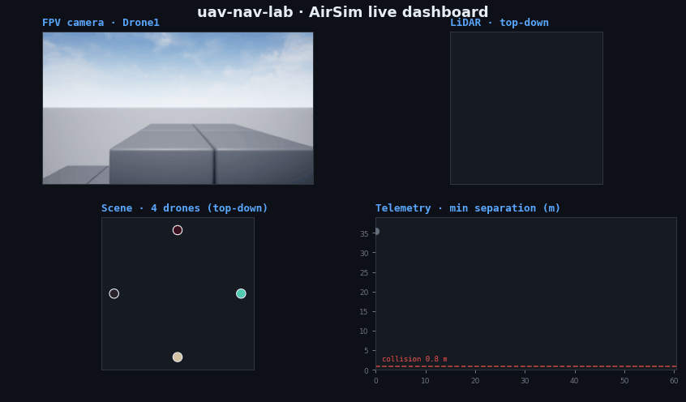
<br><sub><b>Live AirSim dashboard</b> — one flight, four synced panels: Drone1's FPV camera, its LiDAR top-down, the 4-drone scene, and min-separation telemetry (the closest approach dips to ~2 m at the hub, above the 0.8 m collision line).</sub>
</div>

<div align="center">
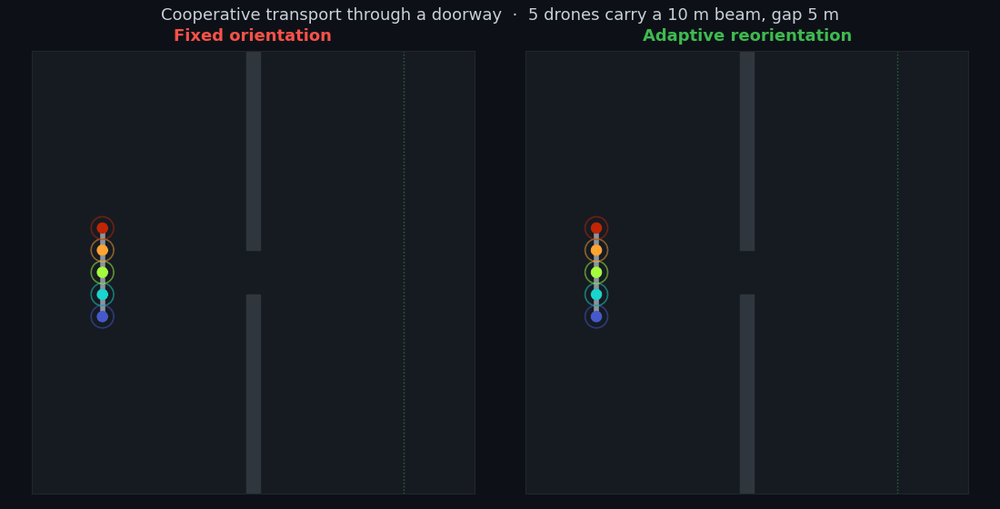
<br><sub><b>Cooperative carrying through a doorway</b> — five drones carry a rigid beam, same seed both sides. <b>Fixed</b> orientation (left) slams the wall; <b>reorienting</b> (right) the beam to align with travel threads the same gap. The mechanism behind "team-size-agnostic" carrying (<a href="docs/findings.md#cooperative-carrying-scales-to-any-team-size-only-if-the-formation-can-reorient--testing-teamhois-size-agnostic-claim">TeamHOI probe</a>).</sub>
</div>

<div align="center">
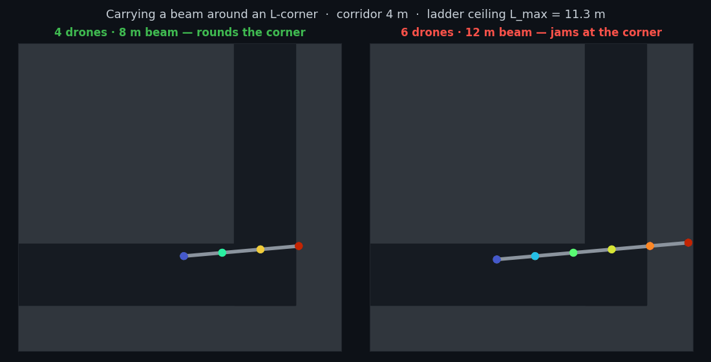
<br><sub><b>…but a corner has a hard ceiling.</b> The same reorientation that clears a doorway cannot beat the <b>ladder-around-a-corner</b> bound: a 4-drone beam (left) rounds the L-junction, a 6-drone beam (right) <b>jams</b> at the critical 45° pose — its length exceeds <code>L_max = 2.83·width</code>, so no reshaping fits it (<a href="docs/findings.md#reorientation-makes-a-straight-doorway-size-agnostic--an-l-corner-imposes-a-hard-ceiling-no-reshaping-beats">corner ceiling</a>).</sub>
</div>

<div align="center">
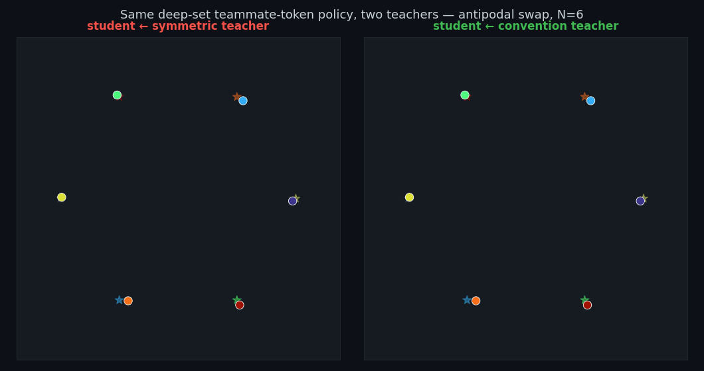
<br><sub><b>A learned policy inherits the convention, not the architecture.</b> The <b>same</b> NumPy teammate-token deep set, behavior-cloned (<code>bc_mse=1e-4</code>) on random scenes only — then dropped on the unseen antipodal hub. From a <b>symmetric teacher</b> (left) it reimports the deadlock; from a <b>convention teacher</b> (right) it learns the right-of-way and spirals into a roundabout (a <a href="docs/findings.md#a-teammate-token-policy-is-only-as-symmetry-breaking-as-its-teacher--distilling-the-convention-transfers-the-antipodal-cure-distilling-a-symmetric-avoider-reimports-and-amplifies-the-deadlock">TeamHOI probe</a>).</sub>
</div>

<div align="center">

<br><sub><b>The lab's first learned policy, flown in photoreal 3-D.</b> The <b>same</b> convention-distilled teammate-token deep set above — now driving four quadrotors in <a href="https://github.com/microsoft/AirSim">AirSim</a> (Unreal Engine). The planar policy's rollout is replayed on the fleet while an external camera orbits the converging swarm: the <b>learned right-of-way roundabout</b>, in photorealistic 3-D (<code>scripts/record_airsim_swarm_policy.py</code>).</sub>
</div>

<div align="center">
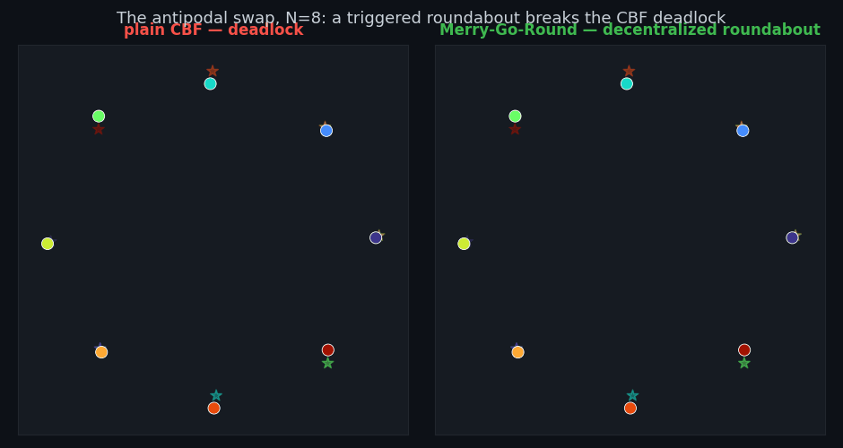
<br><sub><b>A roundabout negotiated from sensing alone.</b> Eight drones swap across one hub. <b>Plain CBF</b> (left) brakes everyone to a safe stop and <b>deadlocks</b> — a frozen clump. The <b>Merry-Go-Round</b> (right, <a href="https://arxiv.org/abs/2503.05848">Zhou et al. 2025</a>) is the <b>same</b> CBF, but each drone detects the local jam and agrees on a common ring <b>centre from sensing only</b> — no handed symmetry — and the fleet spirals through, matching the fixed-centre ring it was never told (<code>scripts/render_mgr_gif.py</code>; a <a href="docs/findings.md#a-decentralized-merry-go-round-negotiates-its-ring-from-sensing-alone--agents-agree-on-the-symmetric-hub-but-the-same-local-agreement-is-what-fails-on-unstructured-traffic">two-sided result</a>).</sub>
</div>

<div align="center">
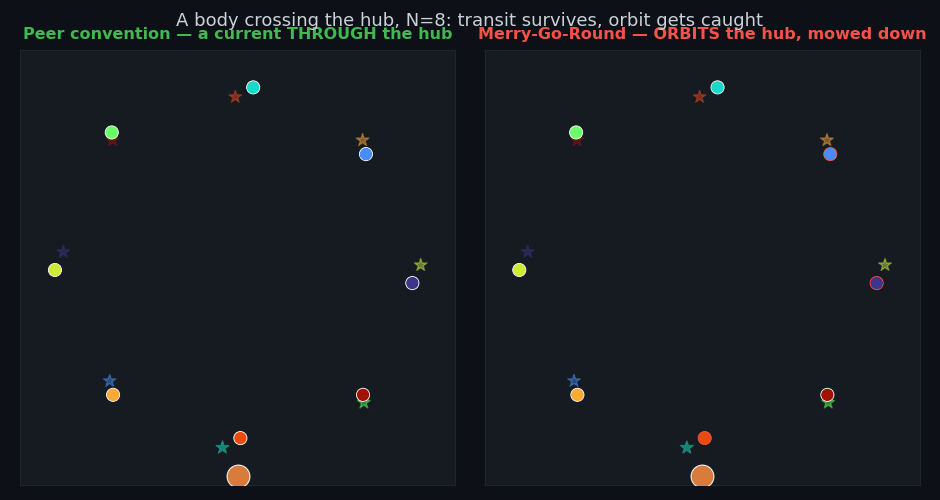
<br><sub><b>…but orbiting the hub makes an <i>obstacle</i> worse.</b> The same swap with a body <b>crossing the hub</b>. The <b>peer convention</b> (left) drives a current that <b>transits</b> the hub — drones pass through and reach goal. The <b>Merry-Go-Round</b> (right) <b>holds</b> the fleet orbiting the contested centre, so the crossing obstacle <b>mows it down</b> (0/40 vs the convention's 9/40 at N=8, p≤0.004). "Evacuate the centre" is backwards — the way to beat a hub threat is to <i>leave</i>, not orbit (<code>scripts/render_mgr_obstacle_gif.py</code>; <a href="docs/findings.md#the-merry-go-round-amplifies-a-hub-crossing-obstacle--orbiting-the-contested-centre-is-worse-than-a-current-through-it">the bound</a>).</sub>
</div>

<div align="center">
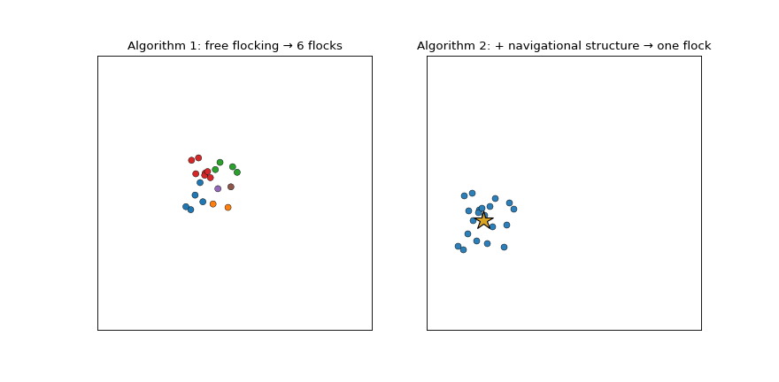
<br><sub><b>Free flocking fragments; structure — not a bigger potential — is the fix.</b> Twenty agents, identical start both sides. <b>Algorithm 1</b> (left, <a href="https://ieeexplore.ieee.org/document/1605401">Olfati-Saber 2006</a>) — cohesion + alignment only — <b>splinters into 6 flocks</b>, and cranking the cohesion gain only makes it worse. <b>Algorithm 2</b> (right) adds one <b>navigational term</b> (the moving star) and the <i>same</i> swarm reunites into a single α-lattice that <b>migrates cohesively</b> (<code>scripts/render_flocking_gif.py</code>; <a href="docs/findings.md#free-flocking-fragments--and-you-cannot-cohesion-gain-your-way-out-the-navigational-structure-is-the-fix-not-a-bigger-potential">the result</a>).</sub>
</div>

<div align="center">
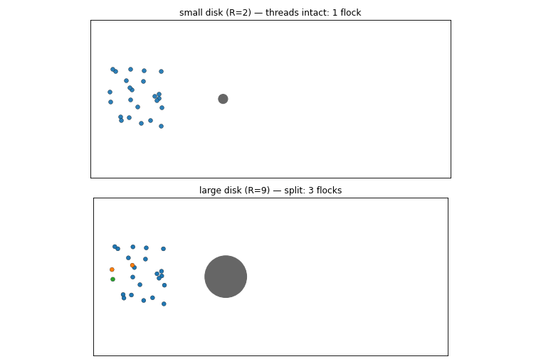
<br><sub><b>…but an obstacle is a cut, and structure can't heal a cut.</b> The same migrating flock (Algorithm 2 + obstacle-avoiding β-agents) flows past a disk. A <b>small disk</b> (top) it <b>threads intact</b>; a <b>large disk</b> (bottom) <b>splits</b> it into lobes the navigational term migrates onward but <b>never re-merges</b>. The damage threshold is a <b>critical radius ≈ r/2</b> — half the interaction range — because once the obstacle pushes the lobes past range <i>r</i>, no force bridges the gap (<code>scripts/render_flocking_obstacle_gif.py</code>; <a href="docs/findings.md#an-obstacle-splits-a-migrating-flock-past-a-critical-radius--r2--and-the-navigational-structure-that-migrates-it-cannot-re-merge-the-halves">the bound</a>).</sub>
</div>

<div align="center">
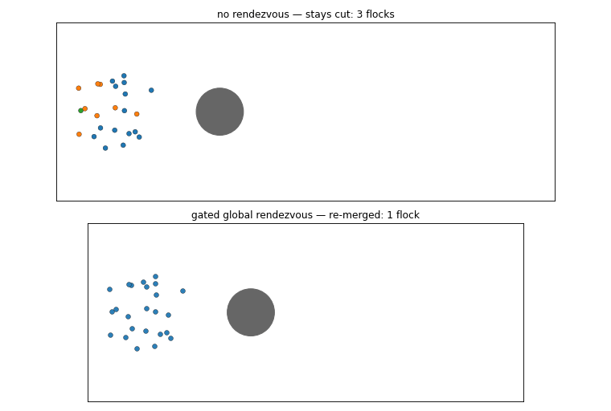
<br><sub><b>…but a cut can be healed — by a global term, if it waits.</b> The same flock severed by a large disk. <b>No rendezvous</b> (top) leaves it permanently <b>cut into 3 flocks</b>. A <b>gated global rendezvous</b> (bottom) — each agent pulled toward the flock's centroid <i>once it has cleared the disk</i> — <b>re-merges</b> them into one. Healing a cut is irreducibly global (unlike comms-free symmetry-breaking) and must be <b>timed</b>: an always-on pull fights the detour, so you avoid first and re-cohere second (<code>scripts/render_flocking_rendezvous_gif.py</code>; <a href="docs/findings.md#a-cut-flock-can-be-healed--but-only-by-a-global-term-and-only-if-it-waits-a-gated-rendezvous-re-merges-what-local-rules-cannot">the cure</a>).</sub>
</div>

<div align="center">
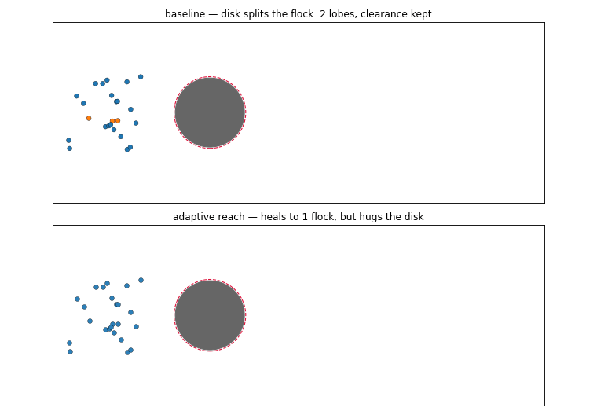
<br><sub><b>…but that local cure is not free — it buys cohesion with clearance.</b> The same flock cut by a disk, scored now by its distance to it (dashed ring = a drone-radius safety margin). <b>Baseline</b> (top) <b>splits</b> — but every agent keeps its distance. <b>Adaptive reach</b> (bottom) <b>heals into one flock</b> by pulling the abandoned lobe <i>across</i> the disk, so the re-cohering agents <b>hug the surface</b> and breach the ring. The cost is a <b>tail</b>: adaptive's <i>average</i> clearance is often larger (many runs route wide), so a mean metric would call it safer — yet its worst case breaches in ~half the seeds where the baseline never does. Tunable only by <b>magnitude</b> (the repulsion gain), not structure (<code>scripts/render_reach_clearance_gif.py</code>; <a href="docs/findings.md#the-local-reach-cure-is-not-free-it-buys-cohesion-with-obstacle-clearance--a-cost-that-only-the-worst-case-sees-and-only-magnitude-removes">the cost</a>).</sub>
</div>

<div align="center">
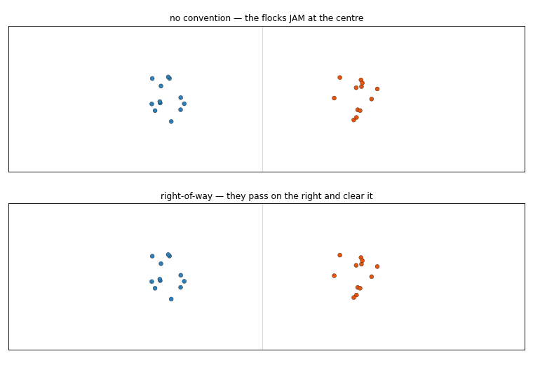
<br><sub><b>The antipodal deadlock reappears in flocking as a jam — and the same convention clears it.</b> Two Olfati-Saber flocks driven head-on (blue left→right, orange right→left). <b>No convention</b> (top) the universal α-repulsion makes them a mutual wall — they <b>JAM</b> at the centre and stall while their goals run on ahead, yet <b>never collide</b> (spacing held by the same repulsion). <b>Right-of-way</b> (bottom) — each agent veers right of its goal — and they <b>pass on the right</b>, clearing the crossing (0/40→40/40 at every flock size, p=1.8e-12). Cohesive flocking turns the MPC/ORCA <i>collision</i> into a non-colliding <i>gridlock</i>; the same `lateral_bias` dissolves it, within a tunable band (<code>scripts/render_crossing_gif.py</code>; <a href="docs/findings.md#two-cohesive-flocks-crossing-head-on-jam-but-never-collide--the-right-of-way-convention-clears-the-gridlock-within-an-operating-band">the bridge</a>).</sub>
</div>

<div align="center">
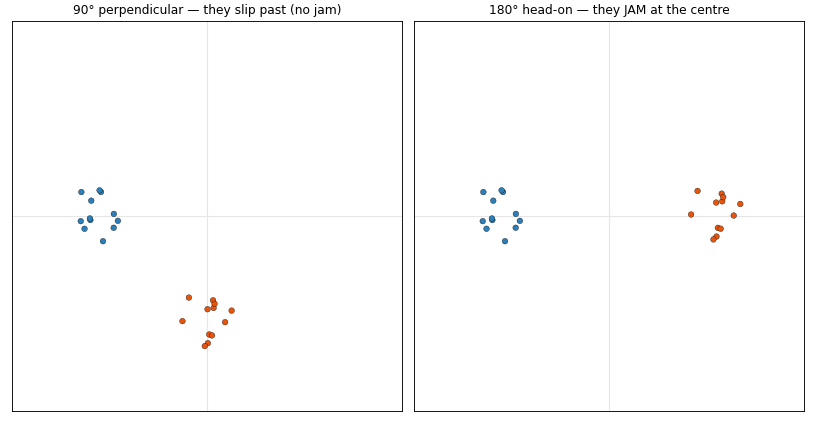
<br><sub><b>The jam is a head-on phenomenon.</b> The same two flocks with <b>no convention</b>, at two encounter angles. <b>90° perpendicular</b> (left) they <b>slip past</b> — a crossing with no symmetric stand-off does not jam (passed 40/40 with no convention). <b>180° head-on</b> (right) they <b>JAM</b>. Sweeping the angle: the jam onsets abruptly between 105° and 120°, and the right-of-way convention is a <b>no-op where there is no jam</b> (90°: 40/40 either way, p=1.0) and the <b>full jam-break where there is</b> (0/40→40/40 at ≥120°, p=1.8e-12) — worth running exactly on the head-on geometry whose symmetry it breaks (<code>scripts/render_crossing_angle_gif.py</code>; <a href="docs/findings.md#the-crossing-flock-jam-is-gated-by-encounter-angle-it-is-a-head-on-phenomenon-and-the-convention-earns-its-keep-only-where-the-jam-is">the angle gate</a>).</sub>
</div>

<div align="center">
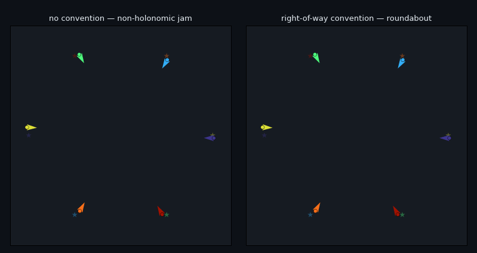
<br><sub><b>The right-of-way convention works on drones that can't strafe.</b> The antipodal swap flown by <b>non-holonomic unicycles</b> (arrows = heading; each must <i>turn</i> to veer, no side-stepping). The MPC controller is identical — only the convention differs. <b>No convention</b> (left) the symmetric hub makes them turn into each other and <b>collide</b> (red flash); the <b>right-of-way convention</b> (right) turns it into a <b>roundabout</b> the non-holonomic fleet flies cleanly. The central result is not an artefact of point-mass freedom (<code>scripts/render_nonholonomic_gif.py</code>; <a href="docs/findings.md#the-right-of-way-convention-survives-non-holonomic-drones--and-without-it-agility-is-a-non-monotone-liability">the stress-test</a>).</sub>
</div>

<div align="center">
<table>
<tr>
<td align="center"><br><sub><b>AirSim chase-cam</b> — an external camera trails the lead quadrotor as the fleet crosses.</sub></td>
<td align="center"><br><sub><b>AirSim orbit</b> — the camera circles the fleet centroid as all four converge.</sub></td>
<td align="center"><br><sub><b>AirSim top-down</b> — the 4-drone hub crossing from a fixed overhead cam.</sub></td>
<td align="center">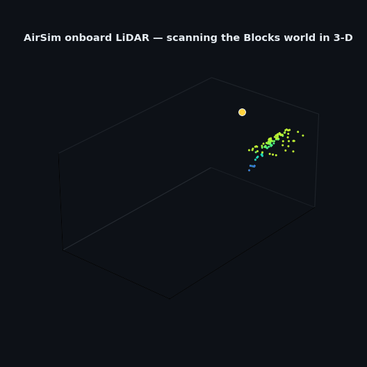<br><sub><b>AirSim onboard LiDAR</b> — the 16-beam sensor reconstructs the world as a 3-D point cloud.</sub></td>
</tr>
<tr>
<td align="center">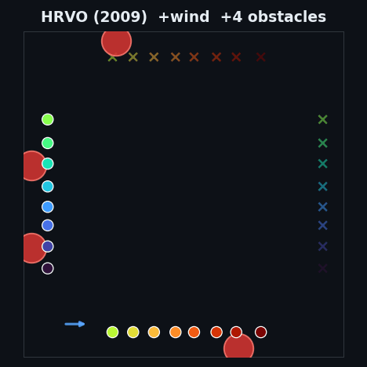<br><sub><b>Everything at once</b> — 16 drones, four sweeping bodies, a gusting crosswind.</sub></td>
<td align="center">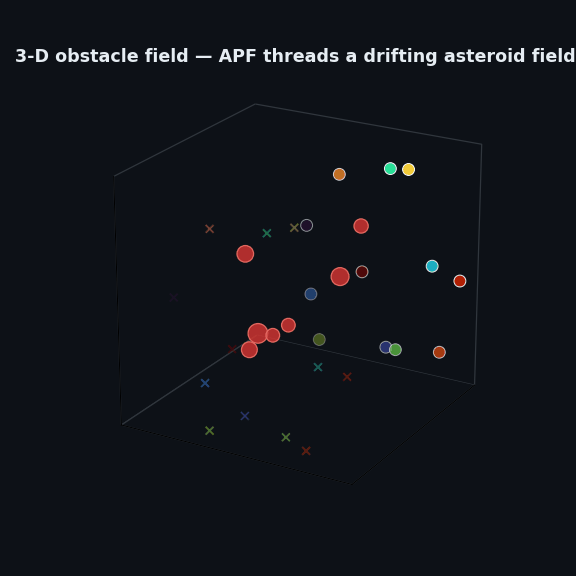<br><sub><b>3-D asteroid field</b> — 12 drones thread a drifting field of obstacles in full 3-D.</sub></td>
<td align="center">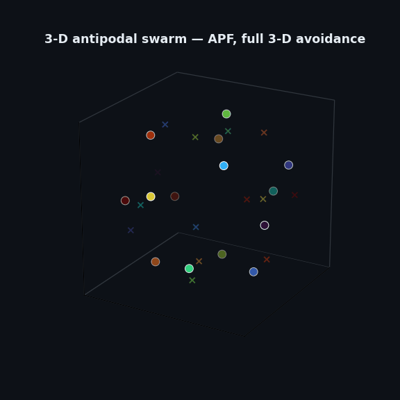<br><sub><b>3-D sphere swap</b> — 14 drones cross one centre, camera orbiting.</sub></td>
</tr>
</table>
</div>

| | | |
|---|---|---|
| 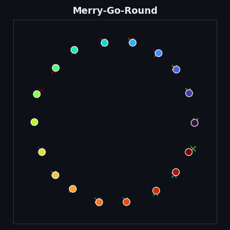<br><sub>**18-drone roundabout** — an explicit shared ring clears the hub collision-free at any density.</sub> | 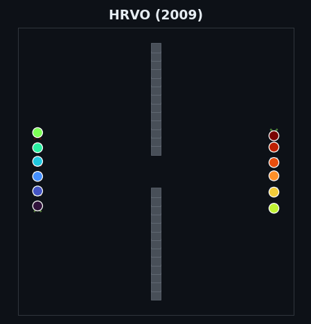<br><sub>**Doorway** — two opposing streams funnel through one gap.</sub> | 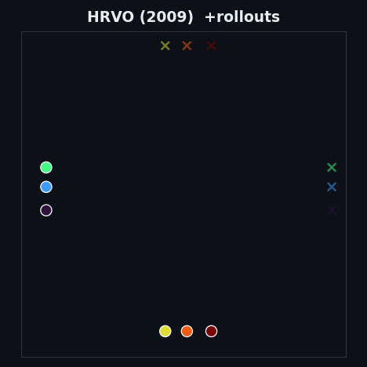<br><sub>**Sampling cloud** — each drone's fan of scored candidate velocities.</sub> |
| 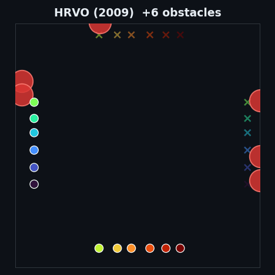<br><sub>**Obstacle gauntlet** — a dozen drones weave through six sweeping bodies.</sub> | 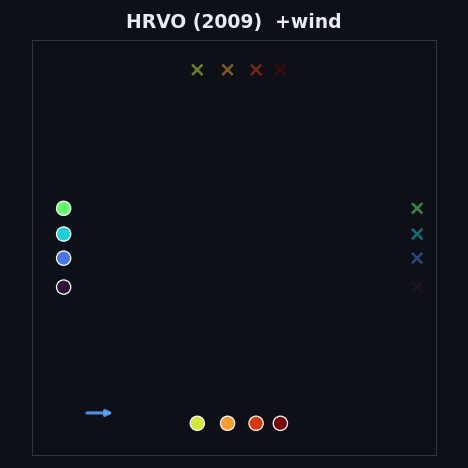<br><sub>**Crosswind** — a gusting wind field bows every track.</sub> | 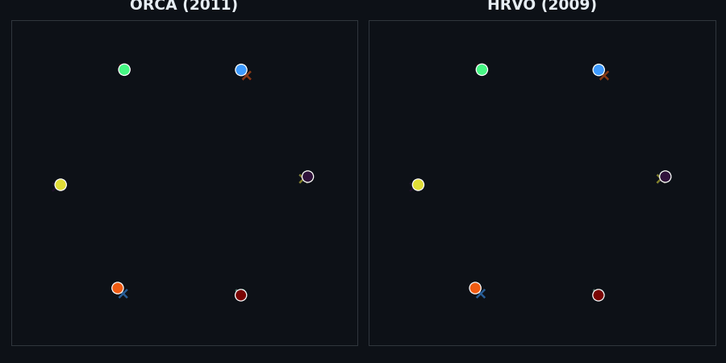<br><sub>**ORCA vs HRVO** at the hub — collide vs roundabout.</sub> |
| 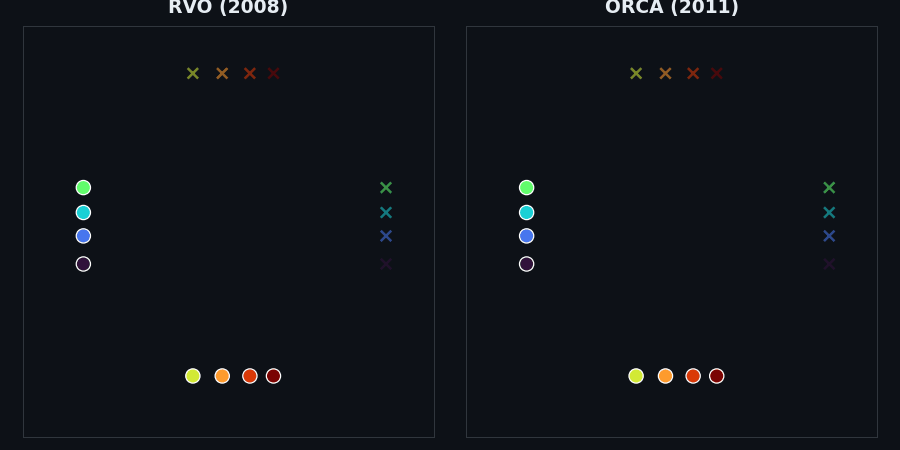<br><sub>**RVO dance vs ORCA glide** — RVO's tracks kink, ORCA's stay smooth.</sub> | <br><sub>**RRT vs RRT\*** — the "optimal" path drives into the obstacle.</sub> | <br><sub>**GPU-MPPI vs MPC in 3-D**, rollouts visualised.</sub> |

Every 2-D swarm clip above is one command — `scripts/render_swarm_gif.py` (no AirSim needed; `antipodal` / `crossing` / `doorway` scenarios, `--obstacles`, `--wind`, `--rollouts`, `+row` convention flags) — and the 3-D sphere/field is `scripts/render_swarm_3d_gif.py`. The photorealistic clips are real [AirSim](https://github.com/microsoft/AirSim) (Unreal Engine), recorded against a running Blocks server with `scripts/record_airsim_cinematic.py` (`--mode chase`/`orbit`), `scripts/record_airsim_topdown_live.py` (top-down), `scripts/record_airsim_lidar_live.py` (onboard LiDAR point cloud), `scripts/record_airsim_dashboard.py` (the Foxglove-style multi-panel dashboard), and `scripts/record_airsim_swarm_policy.py` (the learned teammate-token policy replayed on the fleet).

## Quick start

```bash
git clone https://github.com/rsasaki0109/uav-nav-lab
cd uav-nav-lab
pip install -e '.[dev,viz]'        # numpy + pyyaml + matplotlib + pytest
pytest -q

uav-nav run  examples/exp_basic.yaml
uav-nav eval results/basic_astar          # Wilson 95% CIs
uav-nav viz  results/basic_astar          # trajectory PNG / GIF
```

A 2-D heatmap sweep is one invocation:

```bash
uav-nav sweep examples/exp_predictive.yaml \
  --param planner.max_speed=10,15,20,25,30 \
  --param planner.replan_period=0.1,0.2,0.5,1.0,2.0 \
  --param num_episodes=20 -j 4
uav-nav viz <out>     # → 6-panel heatmap
```

## CLI

| command | what |
|---|---|
| `uav-nav run <yaml>` | run all episodes → per-episode JSONs + `summary.json` |
| `uav-nav eval <run>` | recompute metrics, print Wilson 95 % CIs + planner-dt budget |
| `uav-nav compare <a> <b> …` | side-by-side table with ± half-widths |
| `uav-nav sweep <yaml> --param k=spec` | Cartesian product over `--param`s |
| `uav-nav viz <run_or_sweep>` | trajectory PNG, or 6-panel sweep heatmap |
| `uav-nav anim / video <run>` | 2-D GIF replay / ffmpeg AirSim MP4 |
| `uav-nav list` | enumerate registered planners / sensors / sims / scenarios |

`--param` accepts `start:stop:step`, `a,b,c`, `[3,0]`, `true/false`, and dotted keys
like `planner.predictor.velocity_noise_std=0.0,0.5,1.0`.

## Architecture

Pluggable registry backends — add one by dropping a file with `@REGISTRY.register("name")`
and a `from_config(cfg)` classmethod; the CLI picks it up via `type: name`.

| kind | shipped |
|---|---|
| sim | `dummy_2d`, `dummy_3d`, `airsim`, `ros2` |
| scenario | `grid_world`, `voxel_world`, `multi_drone_{grid,voxel,aerobatic}` |
| planner | `astar`, `straight`, `mpc`, `mppi`, `cvar_mppi`, `gpu_mppi`, `rrt`, `rrt_star`, `chomp`, `mpc_chomp`, `warmup_select_mppi`, `orca`, `rvo`, `vo`, `hrvo`, `bvc`, `cbf`, `apf`, `roundabout`, `mgr` |
| sensor | `perfect`, `delayed`, `kalman_delayed`, `lidar`, `noisy_tracker`, `pointcloud_occupancy`, `depth_image_occupancy` |
| predictor | `constant_velocity`, `noisy_velocity`, `kalman_velocity`, `game_theoretic`, `constant_turn` |

Multi-drone runs step two-phase (plan all, then advance all); dynamic obstacles support
`linear` / `pursue` / `intercept` policies; the `noisy_tracker` sensor is the one that makes a
threat's *current* state uncertain — where a forecast can actually err.

## Status

Active research lab — APIs may shift between releases. The dynamic-obstacle race headlines were
re-grounded after a 2026-05 multi-runner fix; see [`docs/findings.md`](docs/findings.md) and
[`docs/dynamic_obstacle_oss_survey.md`](docs/dynamic_obstacle_oss_survey.md) for the audit trail.

## License

Apache-2.0 — see [LICENSE](LICENSE).
