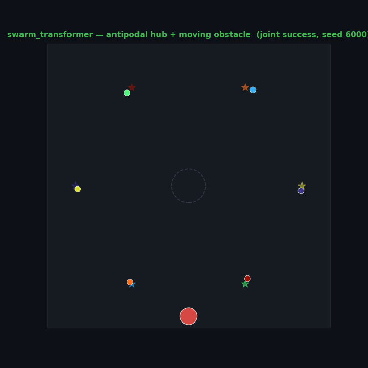
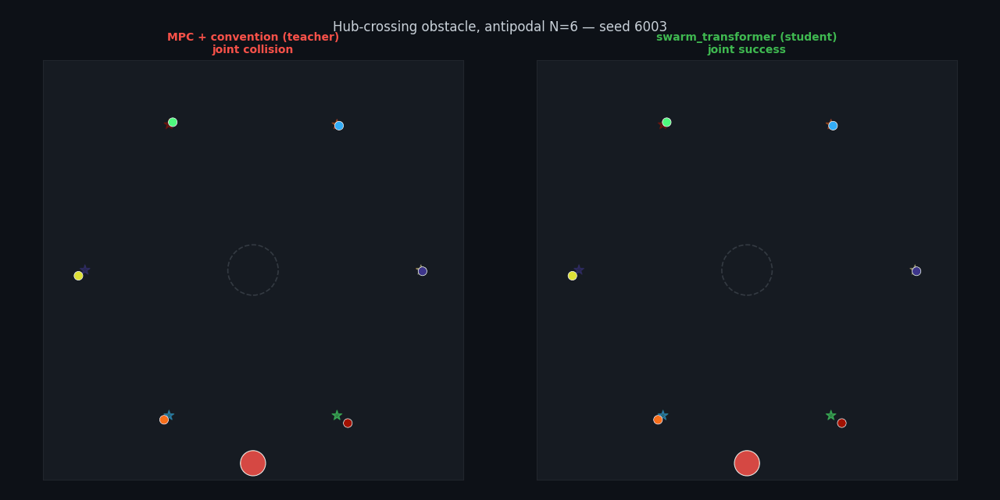
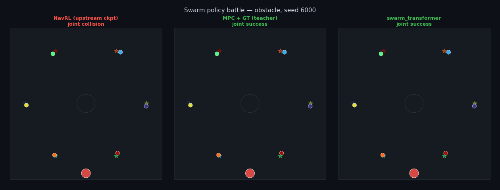
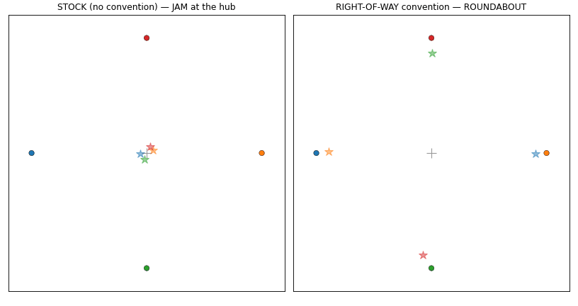
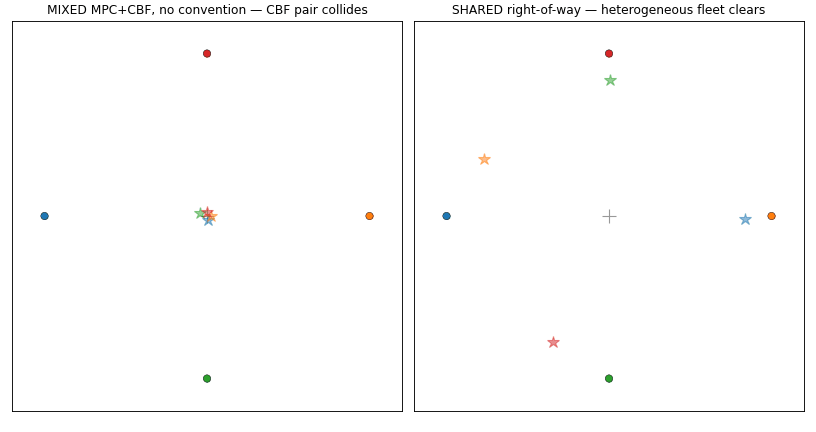
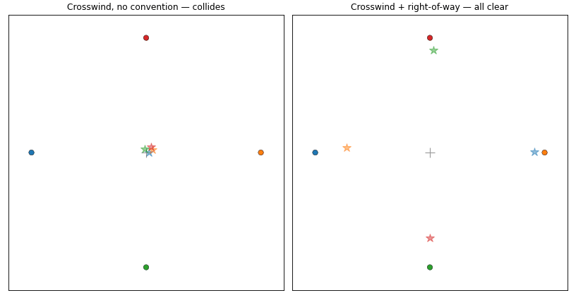
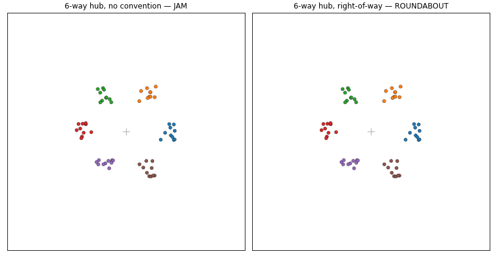
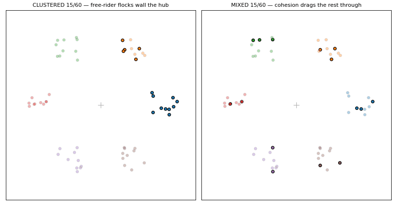
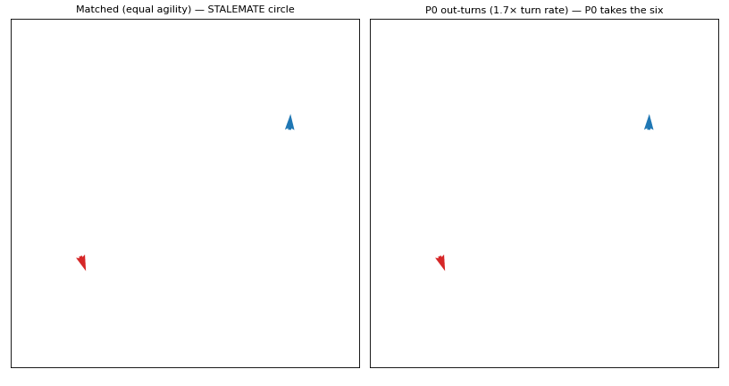

<div align="center">

# uav-nav-lab

**A Python lab for UAV motion planning that proves — or disproves — what actually works.**
Swap planners, sensors and swarm rules in YAML; settle every claim with seed-paired McNemar tests and Wilson 95 % CIs.

[](https://github.com/rsasaki0109/uav-nav-lab/actions/workflows/ci.yml)
[](https://github.com/rsasaki0109/uav-nav-lab/actions/workflows/ci.yml)
[](https://github.com/rsasaki0109/uav-nav-lab/releases)
[](LICENSE)
[](https://github.com/rsasaki0109/uav-nav-lab/stargazers)


<i><b>One rule turns a pile-up into a roundabout.</b> Twelve drones swap across a single hub. <b>Stock ORCA</b> (left) collides at the centre; add a decentralised <b>right-of-way</b> (right) and the same fleet spirals into a clean roundabout. One of ~40 seed-paired findings — <a href="docs/findings.md">see them all</a>.</i>

</div>

## Why this exists

Most planning repos *ship* a method. This one *interrogates* it: every headline is a paired, seed-controlled experiment with an exact p-value, and several overturn the textbook intuition. A taste:

- **The "optimal" planner is the dangerous one.** `rrt_star`'s shortest-path rewiring collides *more* than plain `rrt` in dynamic avoidance (21.7 % vs 76.7 %, ~30× the compute) — the shortest path hugs minimum clearance.
- **Smarter prediction backfires under symmetry — the fix is a convention, not a better forecast.** A goal-aware predictor wins head-on but *inverts* on the antipodal swap (a shared symmetric forecast makes every drone mirror-swerve into the same hub). A decentralised right-of-way turns the deadlock into a roundabout and reaches 100 %; once it is on, smart and dumb forecasts tie.
- **…and that convention survives real AirSim flight physics** (quadrotor dynamics, real collision): stock collides on 9/16 seeds, the convention clears every drone every seed (100 %, p=3.9e-3) — the whole arc is not a point-mass artefact. It is also a **common protocol for heterogeneous controllers** in AirSim: a mixed MPC + CBF fleet collides deterministically (0/12) without it and clears completely (12/12, p=5e-4) with the shared rule — no shared planner, just an agreed side. And it is **robust to a real crosswind** (100 % under a wind as strong as cruise speed), while the wind *alone* is not a reliable symmetry-breaker (stock stays ~50 %, ≈ no-wind) — robustness, not redundancy.
- **"Team-size-agnostic" carrying is geometric, not learned.** A fixed formation carrying a beam collapses to 0/60 for N≥3; one that *reorients* holds across N=2–8 — but an L-corner imposes a hard ladder-around-a-corner ceiling no team can beat.
- **A swarm transformer beats its MPC teacher on a hub-crossing obstacle.** TeamHOI-style teammate tokens + REINFORCE curriculum reach 20/20 joint where the game-theoretic MPC teacher gets 12/20; the upstream NavRL checkpoint gets 0/20 on the same geometry (domain gap, not adapter failure).
- **Free flocking fragments — and you can't cohesion-gain your way out.** A bigger potential makes it worse; a navigational *structure* reunites the swarm (0/40→40/40). The recurring theme: swarm pathologies dissolve under added **structure**, never added **magnitude**.
- **Faster-is-slower.** Raising every drone's desired speed makes a doorway (and the hub roundabout) an inverted-U — too slow gridlocks, too fast collides — and the safe roundabout speed grows only as √(a·r).
- **And in a *competitive* 1-v-1 dogfight, turn rate wins but speed backfires.** The adversarial counterpoint: two unicycles each chasing the other's six. At parity it's a stalemate (the circle of death); a turn-rate edge wins cleanly (≥2× → 40/40); but a *speed* edge wins **0/40 at every ratio** and at 8× / 4× actually *loses* 6/40 — a faster turn radius `v/ω` overshoots the six. Angles beat energy.

Full write-ups — methods, tables, p-values — in **[`docs/findings.md`](docs/findings.md)** (≈40 studies). Working paper draft: [`docs/paper_a/`](docs/paper_a/).

## Gallery

<div align="center">

<br><sub><b>Swarm transformer beats its MPC teacher on a hub obstacle</b> — cross-attention teammate tokens + REINFORCE curriculum reach <b>20/20 joint</b> where the MPC teacher gets 12/20 (<a href="docs/findings.md#swarm-transformer-policy-bc--reinforce-beats-mpc-on-antipodal-obstacle-crossing">the result</a>; <code>planner.type: swarm_transformer</code>).</sub>
</div>

<div align="center">

<br><sub><b>MPC teacher vs student, same seed</b> — the distilled transformer exceeds the game-theoretic MPC it was trained from (<code>scripts/render_swarm_transformer_obstacle_compare_gif.py</code>).</sub>
</div>

<div align="center">

<br><sub><b>OSS policy battle</b> — NavRL upstream checkpoint · MPC teacher · swarm_transformer on paired seeds (<a href="docs/swarm_policy_battle.md">roster</a>; <code>bash scripts/setup_navrl_adapter.sh</code> for NavRL).</sub>
</div>

<div align="center">

<br><sub><b>Live AirSim dashboard</b> — FPV camera, LiDAR top-down, the 4-drone scene, and min-separation telemetry from one flight.</sub>
</div>

<div align="center">

<br><sub><b>Cooperative carrying through a doorway</b> — a fixed beam slams the wall; reorienting it to align with travel threads the same gap (<a href="docs/findings.md#cooperative-carrying-scales-to-any-team-size-only-if-the-formation-can-reorient--testing-teamhois-size-agnostic-claim">TeamHOI probe</a>).</sub>
</div>

<div align="center">

<br><sub><b>…but a corner has a hard ceiling</b> — a 4-drone beam rounds the L-junction, a 6-drone beam jams: past <code>L_max = 2.83·width</code> no reshaping fits (<a href="docs/findings.md#reorientation-makes-a-straight-doorway-size-agnostic--an-l-corner-imposes-a-hard-ceiling-no-reshaping-beats">corner ceiling</a>).</sub>
</div>

<div align="center">

<br><sub><b>A learned policy inherits the convention, not the architecture</b> — the same deep set reimports the deadlock from a symmetric teacher, learns the roundabout from a convention teacher (<a href="docs/findings.md#a-teammate-token-policy-is-only-as-symmetry-breaking-as-its-teacher--distilling-the-convention-transfers-the-antipodal-cure-distilling-a-symmetric-avoider-reimports-and-amplifies-the-deadlock">TeamHOI probe</a>).</sub>
</div>

<div align="center">

<br><sub><b>The lab's first learned policy, in photoreal 3-D</b> — the convention-distilled deep set driving four quadrotors in <a href="https://github.com/microsoft/AirSim">AirSim</a> (<code>scripts/record_airsim_swarm_policy.py</code>).</sub>
</div>

<div align="center">

<br><sub><b>The convention, validated in real flight physics</b> — the N=4 hub in <a href="https://github.com/microsoft/AirSim">AirSim</a>: stock collides (44 %), the right-of-way clears all (100 %, p=3.9e-3) (<a href="docs/findings.md#the-right-of-way-convention-breaks-the-antipodal-deadlock-under-real-airsim-flight-physics-not-just-the-kinematic-sim">the result</a>).</sub>
</div>

<div align="center">

<br><sub><b>A shared convention lets heterogeneous controllers interoperate</b> — a mixed <b>MPC + CBF</b> fleet in <a href="https://github.com/microsoft/AirSim">AirSim</a>. No convention (left) the CBF pair collides every seed (0/12); the shared right-of-way (right) clears the mixed fleet completely (12/12, p=5e-4). A common protocol — no shared planner, just an agreed side (<a href="docs/findings.md#a-shared-convention-lets-heterogeneous-controllers-interoperate-in-real-airsim-physics-too">the result</a>).</sub>
</div>

<div align="center">

<br><sub><b>Robust to a real crosswind.</b> The same N=4 hub in <a href="https://github.com/microsoft/AirSim">AirSim</a> under a diagonal crosswind as strong as cruise speed. <b>No convention</b> (left) the wind is an unreliable symmetry-breaker — stock stays at 50 % (≈ no-wind); the <b>right-of-way</b> (right) bends but holds the roundabout to 100 % (p=3.1e-2). An environmental asymmetry is coincidental; the convention is deliberate — robustness, not redundancy (<a href="docs/findings.md#the-convention-is-robust-to-a-real-crosswind--but-the-wind-is-not-a-substitute-for-it">the result</a>).</sub>
</div>

<div align="center">

<br><sub><b>A roundabout negotiated from sensing alone</b> — plain CBF deadlocks; the <a href="https://arxiv.org/abs/2503.05848">Merry-Go-Round</a> agrees on a common ring from local sensing and clears (<a href="docs/findings.md#a-decentralized-merry-go-round-negotiates-its-ring-from-sensing-alone--agents-agree-on-the-symmetric-hub-but-the-same-local-agreement-is-what-fails-on-unstructured-traffic">a two-sided result</a>).</sub>
</div>

<div align="center">

<br><sub><b>…but orbiting the hub makes an <i>obstacle</i> worse</b> — the convention's current transits the hub; the Merry-Go-Round holds the fleet there and a crossing body mows it down (<a href="docs/findings.md#the-merry-go-round-amplifies-a-hub-crossing-obstacle--orbiting-the-contested-centre-is-worse-than-a-current-through-it">the bound</a>).</sub>
</div>

<div align="center">

<br><sub><b>Free flocking fragments; structure is the fix</b> — <a href="https://ieeexplore.ieee.org/document/1605401">Olfati-Saber</a> Alg. 1 splinters into 6 flocks, one navigational term reunites the same swarm into a migrating lattice (<a href="docs/findings.md#free-flocking-fragments--and-you-cannot-cohesion-gain-your-way-out-the-navigational-structure-is-the-fix-not-a-bigger-potential">the result</a>).</sub>
</div>

<div align="center">

<br><sub><b>…but an obstacle is a cut</b> — past a <b>critical radius ≈ r/2</b> the disk splits the flock into lobes the navigational term can't re-merge (<a href="docs/findings.md#an-obstacle-splits-a-migrating-flock-past-a-critical-radius--r2--and-the-navigational-structure-that-migrates-it-cannot-re-merge-the-halves">the bound</a>).</sub>
</div>

<div align="center">

<br><sub><b>…a cut can be healed by a global term, if it waits</b> — a gated centroid rendezvous re-merges the severed flock once each agent has cleared the disk (<a href="docs/findings.md#a-cut-flock-can-be-healed--but-only-by-a-global-term-and-only-if-it-waits-a-gated-rendezvous-re-merges-what-local-rules-cannot">the cure</a>).</sub>
</div>

<div align="center">

<br><sub><b>…but the cure trades cohesion for clearance</b> — adaptive reach heals the cut but hugs the obstacle, breaching the safety ring in a worst-case <i>tail</i> a mean metric would miss (<a href="docs/findings.md#the-local-reach-cure-is-not-free-it-buys-cohesion-with-obstacle-clearance--a-cost-that-only-the-worst-case-sees-and-only-magnitude-removes">the cost</a>).</sub>
</div>

<div align="center">

<br><sub><b>The antipodal deadlock reappears in flocking as a jam</b> — head-on flocks jam but never collide; the same <code>lateral_bias</code> clears it (0/40→40/40, p=1.8e-12) (<a href="docs/findings.md#two-cohesive-flocks-crossing-head-on-jam-but-never-collide--the-right-of-way-convention-clears-the-gridlock-within-an-operating-band">the bridge</a>).</sub>
</div>

<div align="center">

<br><sub><b>The jam is a head-on phenomenon</b> — 90° slips past with no convention, 180° jams; the right-of-way is a no-op where there's no jam and the full fix where there is (<a href="docs/findings.md#the-crossing-flock-jam-is-gated-by-encounter-angle-it-is-a-head-on-phenomenon-and-the-convention-earns-its-keep-only-where-the-jam-is">the angle gate</a>).</sub>
</div>

<div align="center">

<br><sub><b>A K-way flocking hub: jam vs roundabout</b> — the roundabout clears every fan-in (40/40) but shears cohesion first; collisions come only at the densest hubs (<a href="docs/findings.md#a-k-way-flocking-hub-jams-at-every-fan-in-the-roundabout-convention-clears-it--cohesion-is-the-first-casualty-collisions-only-the-last">the hub</a>).</sub>
</div>

<div align="center">

<br><sub><b>Placement beats head-count</b> — the same adoption budget spread thin across every flock clears the hub; clumped into whole flocks it jams (30 % per flock suffices) (<a href="docs/findings.md#who-must-follow-the-roundabout-rule-a-flocks-cohesion-makes-adoption-a-placement-problem-not-a-head-count">who must adopt</a>).</sub>
</div>

<div align="center">

<br><sub><b>The convention works on drones that can't strafe</b> — non-holonomic unicycles turn into each other without it, fly a clean roundabout with it (<a href="docs/findings.md#the-right-of-way-convention-survives-non-holonomic-drones--and-without-it-agility-is-a-non-monotone-liability">the stress-test</a>).</sub>
</div>

<div align="center">

<br><sub><b>A 1-v-1 dogfight: angles beat energy.</b> The competitive counterpoint to the convention work — two unicycles each chasing the other's six. <b>Matched</b> (left) they lock into the symmetric <b>circle of death</b> (stalemate); a <b>turn-rate edge</b> (right) out-turns onto the opponent's six and wins (≥2× → 40/40). A <i>speed</i> edge, by contrast, wins 0/40 and at 8×/4× even loses — a faster turn radius overshoots the six (<code>scripts/render_dogfight_gif.py</code>; <a href="docs/findings.md#a-1-v-1-uav-dogfight-is-won-by-turn-rate-not-speed--and-a-speed-edge-backfires">the duel</a>).</sub>
</div>

<div align="center">
<table>
<tr>
<td align="center"><br><sub><b>AirSim chase-cam</b> — an external camera trails the lead quadrotor as the fleet crosses.</sub></td>
<td align="center"><br><sub><b>AirSim orbit</b> — the camera circles the fleet centroid as all four converge.</sub></td>
<td align="center"><br><sub><b>AirSim top-down</b> — the 4-drone hub crossing from a fixed overhead cam.</sub></td>
<td align="center"><br><sub><b>AirSim onboard LiDAR</b> — the 16-beam sensor reconstructs the world as a 3-D point cloud.</sub></td>
</tr>
<tr>
<td align="center"><br><sub><b>Everything at once</b> — 16 drones, four sweeping bodies, a gusting crosswind.</sub></td>
<td align="center"><br><sub><b>3-D asteroid field</b> — 12 drones thread a drifting field of obstacles in full 3-D.</sub></td>
<td align="center"><br><sub><b>3-D sphere swap</b> — 14 drones cross one centre, camera orbiting.</sub></td>
</tr>
</table>
</div>

| | | |
|---|---|---|
| <br><sub>**18-drone roundabout** — an explicit shared ring clears the hub collision-free at any density.</sub> | <br><sub>**Doorway** — two opposing streams funnel through one gap.</sub> | <br><sub>**Sampling cloud** — each drone's fan of scored candidate velocities.</sub> |
| <br><sub>**Obstacle gauntlet** — a dozen drones weave through six sweeping bodies.</sub> | <br><sub>**Crosswind** — a gusting wind field bows every track.</sub> | <br><sub>**ORCA vs HRVO** at the hub — collide vs roundabout.</sub> |
| <br><sub>**RVO dance vs ORCA glide** — RVO's tracks kink, ORCA's stay smooth.</sub> | <br><sub>**RRT vs RRT\*** — the "optimal" path drives into the obstacle.</sub> | <br><sub>**GPU-MPPI vs MPC in 3-D**, rollouts visualised.</sub> |

2-D clips: `scripts/render_swarm_gif.py` (no AirSim needed) and `scripts/render_swarm_3d_gif.py`. The photoreal clips are real [AirSim](https://github.com/microsoft/AirSim), recorded with the `scripts/record_airsim_*.py` family.

## Quick start

```bash
git clone https://github.com/rsasaki0109/uav-nav-lab
cd uav-nav-lab
pip install -e '.[dev,viz]'        # numpy + pyyaml + matplotlib + pytest
pytest -q

uav-nav run  examples/exp_basic.yaml
uav-nav eval results/basic_astar          # Wilson 95% CIs
uav-nav viz  results/basic_astar          # trajectory PNG / GIF
```

A 2-D heatmap sweep is one invocation:

```bash
uav-nav sweep examples/exp_predictive.yaml \
  --param planner.max_speed=10,15,20,25,30 \
  --param planner.replan_period=0.1,0.2,0.5,1.0,2.0 \
  --param num_episodes=20 -j 4
uav-nav viz <out>     # → 6-panel heatmap
```

## CLI

| command | what |
|---|---|
| `uav-nav run <yaml>` | run all episodes → per-episode JSONs + `summary.json` |
| `uav-nav eval <run>` | recompute metrics, print Wilson 95 % CIs + planner-dt budget |
| `uav-nav compare <a> <b> …` | side-by-side table with ± half-widths |
| `uav-nav sweep <yaml> --param k=spec` | Cartesian product over `--param`s |
| `uav-nav viz <run_or_sweep>` | trajectory PNG, or 6-panel sweep heatmap |
| `uav-nav anim / video <run>` | 2-D GIF replay / ffmpeg AirSim MP4 |
| `uav-nav list` | enumerate registered planners / sensors / sims / scenarios |

`--param` accepts `start:stop:step`, `a,b,c`, `[3,0]`, `true/false`, and dotted keys
like `planner.predictor.velocity_noise_std=0.0,0.5,1.0`.

## Architecture

Pluggable registry backends — add one by dropping a file with `@REGISTRY.register("name")`
and a `from_config(cfg)` classmethod; the CLI picks it up via `type: name`.

| kind | shipped |
|---|---|
| sim | `dummy_2d`, `dummy_3d`, `airsim`, `ros2` |
| scenario | `grid_world`, `voxel_world`, `multi_drone_{grid,voxel,aerobatic}` |
| planner | `astar`, `straight`, `mpc`, `mppi`, `cvar_mppi`, `gpu_mppi`, `rrt`, `rrt_star`, `chomp`, `mpc_chomp`, `warmup_select_mppi`, `orca`, `rvo`, `vo`, `hrvo`, `bvc`, `cbf`, `apf`, `roundabout`, `mgr`, `swarm_transformer`, `navrl` |
| sensor | `perfect`, `delayed`, `kalman_delayed`, `lidar`, `noisy_tracker`, `pointcloud_occupancy`, `depth_image_occupancy` |
| predictor | `constant_velocity`, `noisy_velocity`, `kalman_velocity`, `game_theoretic`, `constant_turn` |

Multi-drone runs step two-phase (plan all, then advance all); dynamic obstacles support
`linear` / `pursue` / `intercept` policies; the `noisy_tracker` sensor is the one that makes a
threat's *current* state uncertain — where a forecast can actually err.

## Status

Active research lab — APIs may shift between releases. The dynamic-obstacle race headlines were
re-grounded after a 2026-05 multi-runner fix; see [`docs/findings.md`](docs/findings.md) and
[`docs/dynamic_obstacle_oss_survey.md`](docs/dynamic_obstacle_oss_survey.md) for the audit trail.

## License


Apache-2.0 — see [LICENSE](LICENSE).
