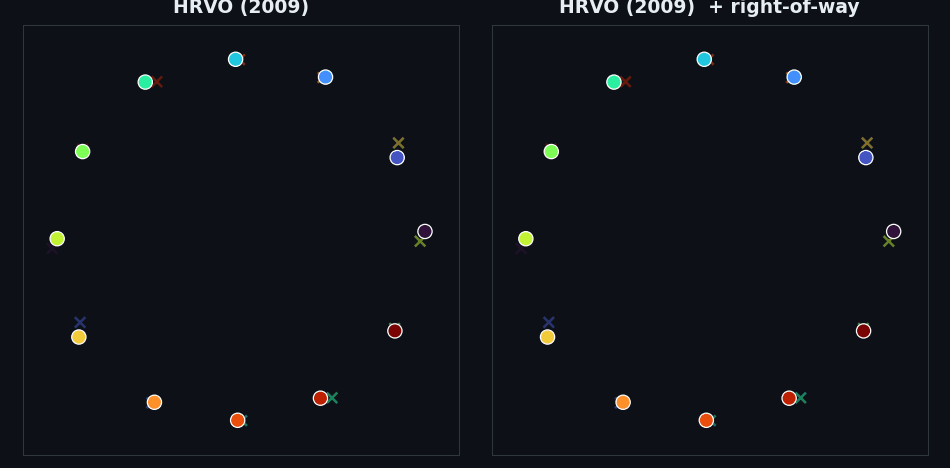

<div align="center">

# UAVSwarmBattle

**A Python lab for UAV swarm policy battles that prove — or disprove — what actually works.**
Swap planners in YAML, run paired-seed arenas, read Wilson 95 % CIs and McNemar p-values.

[](https://github.com/rsasaki0109/UAVSwarmBattle/actions/workflows/ci.yml)
[](https://github.com/rsasaki0109/UAVSwarmBattle/actions/workflows/ci.yml)
[](https://github.com/rsasaki0109/UAVSwarmBattle/releases)
[](LICENSE)
[](https://github.com/rsasaki0109/UAVSwarmBattle/stargazers)


<i><b>Head-to-head on paired seeds.</b> <b>Triple crossfire</b> through the hub (3 cruise missiles, 50×50 antipodal, n=20): <b>NavRL</b> 0/20 · <b>MPC + game-theoretic</b> teacher 0/20 · <b>swarm_transformer</b> 0/20 — the single-missile champion (20/20) collapses too; a full triple curriculum retrain (BC + staged RL) also stays 0/20. Contrast: <a href="docs/findings.md#triple-crossfire-collapses-the-single-missile-champion--multi-axis-hub-threat-is-not-a-harder-instance-of-the-same-problem">triple vs single</a> · <a href="docs/findings.md#swarm-transformer-policy-bc--reinforce-beats-mpc-on-antipodal-obstacle-crossing">champion write-up</a>. Reproduce: <a href="docs/swarm_policy_battle.md">docs/swarm_policy_battle.md</a>.</i>

</div>

## Why this exists

Most planning repos *ship* a method. This one *interrogates* it: every headline is a paired, seed-controlled experiment with an exact p-value, and several overturn the textbook intuition. A taste:

- **The "optimal" planner is the dangerous one.** `rrt_star`'s shortest-path rewiring collides *more* than plain `rrt` in dynamic avoidance (21.7 % vs 76.7 %, ~30× the compute) — the shortest path hugs minimum clearance.
- **Smarter prediction backfires under symmetry — the fix is a convention, not a better forecast.** A goal-aware predictor wins head-on but *inverts* on the antipodal swap (a shared symmetric forecast makes every drone mirror-swerve into the same hub). A decentralised right-of-way turns the deadlock into a roundabout and reaches 100 %; once it is on, smart and dumb forecasts tie.
- **…and that convention survives real AirSim flight physics** (quadrotor dynamics, real collision): stock collides on 9/16 seeds, the convention clears every drone every seed (100 %, p=3.9e-3) — the whole arc is not a point-mass artefact. It is also a **common protocol for heterogeneous controllers** in AirSim: a mixed MPC + CBF fleet collides deterministically (0/12) without it and clears completely (12/12, p=5e-4) with the shared rule — no shared planner, just an agreed side. And it is **robust to a real crosswind** (100 % under a wind as strong as cruise speed), while the wind *alone* is not a reliable symmetry-breaker (stock stays ~50 %, ≈ no-wind) — robustness, not redundancy.
- **"Team-size-agnostic" carrying is geometric, not learned.** A fixed formation carrying a beam collapses to 0/60 for N≥3; one that *reorients* holds across N=2–8 — but an L-corner imposes a hard ladder-around-a-corner ceiling no team can beat.
- **A swarm transformer beats its MPC teacher on a hub-crossing obstacle.** TeamHOI-style teammate tokens + REINFORCE curriculum reach 20/20 joint where the game-theoretic MPC teacher gets 12/20; the upstream NavRL checkpoint gets 0/20 on the same geometry (domain gap, not adapter failure).
- **Free flocking fragments — and you can't cohesion-gain your way out.** A bigger potential makes it worse; a navigational *structure* reunites the swarm (0/40→40/40). The recurring theme: swarm pathologies dissolve under added **structure**, never added **magnitude**.
- **Faster-is-slower.** Raising every drone's desired speed makes a doorway (and the hub roundabout) an inverted-U — too slow gridlocks, too fast collides — and the safe roundabout speed grows only as √(a·r).
- **And in a *competitive* 1-v-1 dogfight, turn rate wins but speed backfires.** The adversarial counterpoint: two unicycles each chasing the other's six. At parity it's a stalemate (the circle of death); a turn-rate edge wins cleanly (≥2× → 40/40); but a *speed* edge wins **0/40 at every ratio** and at 8× / 4× actually *loses* 6/40 — a faster turn radius `v/ω` overshoots the six. Angles beat energy.

Full write-ups — methods, tables, p-values — in **[`docs/findings.md`](docs/findings.md)** (≈40 studies). Working paper draft: [`docs/paper_a/`](docs/paper_a/).

## Policy battle gallery

<div align="center">

<br><sub><b>Champion arm</b> — TeamHOI-style <code>swarm_transformer</code>, BC + REINFORCE curriculum, <b>20/20</b> obstacle joint (<a href="docs/findings.md#swarm-transformer-policy-bc--reinforce-beats-mpc-on-antipodal-obstacle-crossing">write-up</a>).</sub>
</div>

<div align="center">

<br><sub><b>Teacher vs student</b> — game-theoretic MPC <b>12/20</b> vs distilled transformer <b>20/20</b>, seed 6003 (<code>scripts/render_swarm_transformer_obstacle_compare_gif.py</code>).</sub>
</div>

<div align="center">

<br><sub><b>OSS three-way · triple crossfire</b> — 3 hub-crossing missiles · NavRL · MPC teacher · swarm_transformer (<code>scripts/render_swarm_policy_battle_gif.py</code>).</sub>
</div>

<div align="center">

<br><sub><b>Convention battle</b> — stock ORCA piles up and collides; <code>lateral_bias</code> right-of-way spirals into a roundabout (peers cell baseline).</sub>
</div>

<div align="center">

<br><sub><b>ORCA vs HRVO</b> — reciprocal LP vs side-commitment VO at the symmetric hub (<a href="docs/findings.md#hrvos-side-commitment-partially-breaks-the-antipodal-deadlock--beating-orca-at-low-density-but-no-substitute-for-an-explicit-convention">HRVO antipodal</a>).</sub>
</div>

<div align="center">

<br><sub><b>HRVO + convention</b> — local side-commitment alone still jams; the global rule subsumes it (McNemar tie vs ORCA + convention).</sub>
</div>

<div align="center">

<br><sub><b>CBF vs MGR</b> — plain CBF freezes; triggered <a href="https://arxiv.org/abs/2503.05848">Merry-Go-Round</a> negotiates a ring from sensing alone.</sub>
</div>

<div align="center">

<br><sub><b>Convention vs MGR on obstacle</b> — the convention's current transits the hub; MGR orbits the contested centre and loses to the crossing body.</sub>
</div>

<div align="center">

<br><sub><b>Learned-policy battle</b> — same architecture, two teachers: symmetric avoider reimports the deadlock; convention teacher transfers the cure.</sub>
</div>

<div align="center">

<br><sub><b>1-v-1 duel</b> — competitive counterpoint: turn-rate edge wins, speed edge backfires (<a href="docs/findings.md#a-1-v-1-uav-dogfight-is-won-by-turn-rate-not-speed--and-a-speed-edge-backfires">dogfight</a>).</sub>
</div>

<div align="center">
<table>
<tr>
<td align="center"><br><sub><b>RVO vs ORCA</b> — reciprocal-dance jitter vs half-plane glide.</sub></td>
<td align="center"><br><sub><b>Obstacle gauntlet</b> — twelve drones, six sweeping bodies.</sub></td>
<td align="center"><br><sub><b>RRT vs RRT*</b> — the “optimal” path drives into the obstacle.</sub></td>
</tr>
<tr>
<td align="center"><br><sub><b>AirSim peers</b> — stock vs convention in real physics.</sub></td>
<td align="center"><br><sub><b>AirSim mixed fleet</b> — MPC + CBF with/without shared rule.</sub></td>
<td align="center"><br><sub><b>AirSim learned</b> — convention-distilled policy in Blocks.</sub></td>
</tr>
</table>
</div>

Run the arena: `python scripts/swarm_policy_battle_phase.py --episodes 20 --workers 4`. Roster and latest tables: [`docs/swarm_policy_battle.md`](docs/swarm_policy_battle.md). More findings (flocking, transport, race): [`docs/findings.md`](docs/findings.md).

## Quick start

```bash
git clone https://github.com/rsasaki0109/UAVSwarmBattle
cd UAVSwarmBattle
pip install -e '.[dev,viz]'        # numpy + pyyaml + matplotlib + pytest
pytest -q

uav-nav run  examples/exp_basic.yaml
uav-nav eval results/basic_astar          # Wilson 95% CIs
uav-nav viz  results/basic_astar          # trajectory PNG / GIF
```

A 2-D heatmap sweep is one invocation:

```bash
uav-nav sweep examples/exp_predictive.yaml \
  --param planner.max_speed=10,15,20,25,30 \
  --param planner.replan_period=0.1,0.2,0.5,1.0,2.0 \
  --param num_episodes=20 -j 4
uav-nav viz <out>     # → 6-panel heatmap
```

## CLI

| command | what |
|---|---|
| `uav-nav run <yaml>` | run all episodes → per-episode JSONs + `summary.json` |
| `uav-nav eval <run>` | recompute metrics, print Wilson 95 % CIs + planner-dt budget |
| `uav-nav compare <a> <b> …` | side-by-side table with ± half-widths |
| `uav-nav sweep <yaml> --param k=spec` | Cartesian product over `--param`s |
| `uav-nav viz <run_or_sweep>` | trajectory PNG, or 6-panel sweep heatmap |
| `uav-nav anim / video <run>` | 2-D GIF replay / ffmpeg AirSim MP4 |
| `uav-nav list` | enumerate registered planners / sensors / sims / scenarios |

`--param` accepts `start:stop:step`, `a,b,c`, `[3,0]`, `true/false`, and dotted keys
like `planner.predictor.velocity_noise_std=0.0,0.5,1.0`.

## Architecture

Pluggable registry backends — add one by dropping a file with `@REGISTRY.register("name")`
and a `from_config(cfg)` classmethod; the CLI picks it up via `type: name`.

| kind | shipped |
|---|---|
| sim | `dummy_2d`, `dummy_3d`, `airsim`, `ros2` |
| scenario | `grid_world`, `voxel_world`, `multi_drone_{grid,voxel,aerobatic}` |
| planner | `astar`, `straight`, `mpc`, `mppi`, `cvar_mppi`, `gpu_mppi`, `rrt`, `rrt_star`, `chomp`, `mpc_chomp`, `warmup_select_mppi`, `orca`, `rvo`, `vo`, `hrvo`, `bvc`, `cbf`, `apf`, `roundabout`, `mgr`, `swarm_transformer`, `navrl` |
| sensor | `perfect`, `delayed`, `kalman_delayed`, `lidar`, `noisy_tracker`, `pointcloud_occupancy`, `depth_image_occupancy` |
| predictor | `constant_velocity`, `noisy_velocity`, `kalman_velocity`, `game_theoretic`, `constant_turn` |

Multi-drone runs step two-phase (plan all, then advance all); dynamic obstacles support
`linear` / `pursue` / `intercept` policies; the `noisy_tracker` sensor is the one that makes a
threat's *current* state uncertain — where a forecast can actually err.

## Status

Active research lab — APIs may shift between releases. The dynamic-obstacle race headlines were
re-grounded after a 2026-05 multi-runner fix; see [`docs/findings.md`](docs/findings.md) and
[`docs/dynamic_obstacle_oss_survey.md`](docs/dynamic_obstacle_oss_survey.md) for the audit trail.

## License


Apache-2.0 — see [LICENSE](LICENSE).
