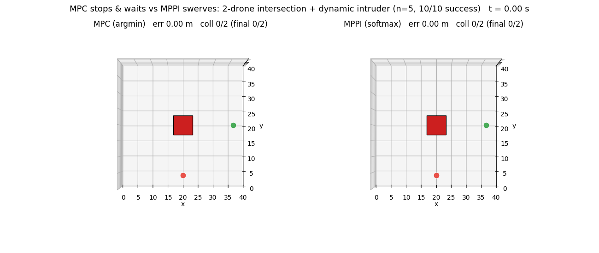
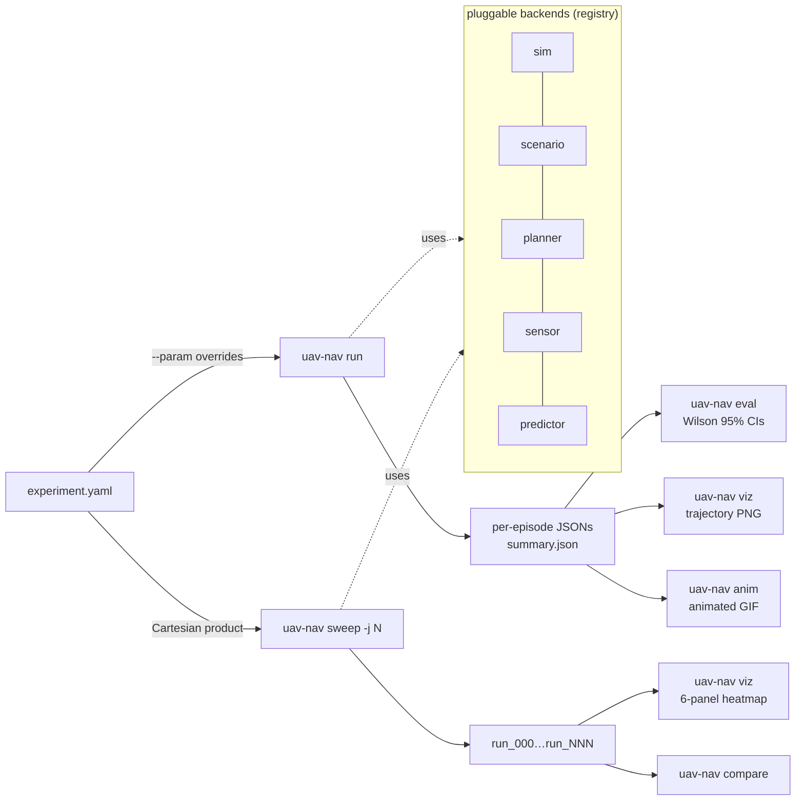
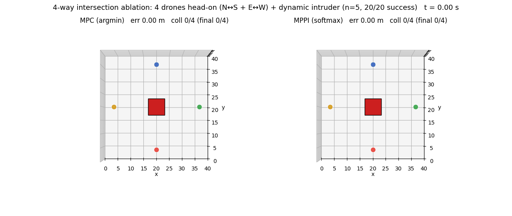

<div align="center">

# uav-nav-lab

**Python research framework for UAV motion planning.**
YAML-driven ablations with Wilson 95 % CIs by default.

> ⚠️ **Heads-up (2026-05-22)**: a critical multi-runner bug was found
> that froze dynamic obstacles in any episode following a total-wipeout
> episode (see commit `1646e11`). The old race / gates / dyn4 / chaos
> headline numbers ("MPC 51.7 % vs softmax 3.3 %") were artifacts of
> frozen obstacles. The hero GIF below shows the first re-tuned cell
> where MPC and CPU MPPI **visibly** avoid a dynamic intruder while also
> coordinating with each other — MPC stops & waits, MPPI swerves around
> (n=5 / 10 drone-episodes / 0 collisions for both planners). The old
> findings are being rewritten; see `docs/findings.md` for the current
> state of each result.

[](https://github.com/rsasaki0109/uav-nav-lab/actions/workflows/ci.yml)
[](https://github.com/rsasaki0109/uav-nav-lab/actions/workflows/ci.yml)
[](https://github.com/rsasaki0109/uav-nav-lab/releases)
[](LICENSE)
[](https://github.com/rsasaki0109/uav-nav-lab/stargazers)



<i>Two drones enter a 4-way intersection from N (red) and E (green); a
slow dynamic intruder (large red square, 0.5 m/s) sits at the centre
and drifts E-W. Same stack, same seed, only the rollout aggregator
changes — MPC argmin on the left, MPPI softmax on the right. Both
planners stay collision-free in all 10 drone-episodes (scales to
4 drones × 20/20 in the 4-way ablation below), but their
<b>behavioral fingerprints</b> separate cleanly: <b>MPC yields by
stopping the N drone</b>, <b>MPPI preserves progress by lateral
swerving</b>, and quantitatively MPC's command-jump (max |Δcmd|
~6 m/s) is <b>2.4× larger</b> than MPPI's (~2.5 m/s) at <b>4× lower
plan-time cost</b> (~9 vs ~38 ms). Binary success rate saturates,
the time-derivative of control does not. <code>uav-nav-lab</code>
records this as a behavioral fingerprint, not just a success rate.
Reproduce with <code>examples/exp_intersection_v1_{mpc,mppi}.yaml</code>;
metrics from <code>scripts/intersection_fingerprint.py</code>.
&nbsp;<a href="docs/findings.md">Findings</a>
&middot; <a href="docs/paper_a/section_3_headline.md">§3 4-mode framework</a></i>

</div>

<details>
<summary><b>🔬 Behind the hero</b> — 4-panel fingerprint figure + predictor-fidelity sweep (E1-E5)</summary>

<br>

<br>
<i><b>Behavioral fingerprint across 4 cells</b> (v1 / 4-way / chokepoint /
wave). (a, b) trajectories overlay MPC vs MPPI in the open and the
3-intruder wave cell; (c) drone-east speed and |Δcmd| over time at
v1 ep 0 — MPC's |Δcmd| (faded red) spikes near 6 m/s while MPPI's
stays under 2.5 m/s; (d) max |Δcmd| with 1.96·SEM bars across all 4
cells × 2 planners — MPC is 2-3× larger everywhere and saturates the
per-step jump bound at the chokepoint cell. Generated by
<code>scripts/intersection_paper_figure.py</code>.</i>

<br><br>

<br>
<i><b>Predictor-fidelity sweep (wave cell, n=20, seeded predictor)</b>:
replace the perfect constant-velocity predictor with
<code>noisy_velocity</code> at σ ∈ {0.2, 0.5, 1.0, 3.0, 10.0}. Both
planners saturate at σ ≤ 1 (≥ 90% joint success) and floor at σ = 10
(MPC 5%, MPPI 10%, both within noise). The fidelity knee is sharp:
at σ = 3 MPC reaches 45% while vanilla MPPI gives 35%. The earlier
n=5 sweep that put MPPI at 4/5 vs MPC at 1/5 was a luck-of-the-draw
artifact of an unseeded predictor — see <a href="docs/findings.md">findings.md</a>
"CORRECTION (2026-05-22)" for the audit trail.</i>

<br><br>

<br>
<i><b>G: aggregator U-shape across cells at σ = 3 (n = 20)</b>.
Vanilla MPPI (t = 1.0) is the <b>worst</b> aggregator in BOTH cells —
v1 (1 slow intruder) 60% and wave (3 medium-speed intruders) 35%.
Both extremes of the U recover. The <i>optimal</i> arm is
cell-dependent: v1 is solved by near-uniform MPPI (t = 10 → <b>100%</b>,
the planner essentially returns the prior straight-to-goal), wave is
solved by argmin MPPI (t = 0.1 → 70%, the planner commits to the
single rollout with the lowest real-geometry cost). The "vanilla
softmax averages similar-cost rollouts into a phantom-evasion direction
with just enough confidence to commit but not enough to argmin out of
it" mechanism is now universal across both tested geometries.</i>

<br><br>

<br>
<i><b>J: aggregator-temperature sweep (wave cell, n=20)</b>. The
underlying single-cell sweep that motivated G — including σ = 10
chaos where every aggregator collapses to near-floor.</i>

<br>

The refined §3 framing (see <a href="docs/findings.md">findings.md</a>
for the full E1-J-G chain):
<ul>
<li><b>Success-axis switch</b>: predictor on/off (universal, deterministic — both planners drop to 0/5 with no predictor).</li>
<li><b>Success-axis fidelity gradient</b>: σ ∈ {1, 3} is the knee band on wave; outside it, success either saturates (σ ≤ 0.5) or floors (σ ≥ 10).</li>
<li><b>Aggregator U-shape</b> (universal across v1 and wave): vanilla MPPI is the structural valley at σ = 3.</li>
<li><b>Optimal aggregator depends on geometry</b>: easy cells favor prior-trust (uniform MPPI); hard cells favor cost-trust (argmin MPPI).</li>
</ul>

</details>

## 🚀 Quick start

```bash
git clone https://github.com/rsasaki0109/uav-nav-lab
cd uav-nav-lab
pip install -e '.[dev,viz]'        # numpy + pyyaml + matplotlib + pytest
# Optional: pip install -e '.[gpu]' (PyTorch for gpu_mppi), '.[rl]' (SB3)
pytest -q

uav-nav run     examples/exp_basic.yaml
uav-nav eval    results/basic_astar
uav-nav viz     results/basic_astar
```

A 2D heatmap sweep is one CLI invocation:

```bash
uav-nav sweep examples/exp_predictive.yaml \
  --param planner.horizon=20 --param planner.n_samples=16 \
  --param planner.max_speed=10,15,20,25,30 \
  --param planner.replan_period=0.1,0.2,0.5,1.0,2.0 \
  --param num_episodes=20 -j 4
uav-nav viz <out>     # → 6-panel sweep_summary.png
```

## 🛠️ CLI

| command | what |
|---|---|
| `uav-nav run <yaml>` | run all episodes, write per-episode JSONs + `summary.json` |
| `uav-nav eval <run_dir>` | recompute metrics, print Wilson 95 % CIs + planner-dt budget |
| `uav-nav compare <a> <b> ...` | side-by-side table with ± half-widths |
| `uav-nav sweep <yaml> --param k=spec` | Cartesian-product over `--param`s |
| `uav-nav viz <run_or_sweep>` | trajectory PNG per episode, or 6-panel sweep heatmap |
| `uav-nav anim <run_dir>` | animated GIF replay (2D) |
| `uav-nav video <run_dir>` | ffmpeg AirSim camera frames into per-episode MP4 |
| `uav-nav list` | enumerate registered planners / sensors / sims / scenarios |

`--param` syntax: `start:stop:step`, `a,b,c`, `[3,0]`, `true` / `false`, and
dotted keys like `planner.predictor.velocity_noise_std=0.0,0.5,1.0`.

## 🏗️ Architecture



| kind | shipped |
|---|---|
| sim | `dummy_2d`, `dummy_3d`, `airsim`, `ros2` |
| scenario | `grid_world`, `voxel_world`, `multi_drone_{grid,voxel,aerobatic}` |
| planner | `astar`, `straight`, `mpc`, `mppi`, `gpu_mppi`, `rrt`, `rrt_star`, `chomp`, `mpc_chomp` |
| sensor | `perfect`, `delayed`, `kalman_delayed`, `lidar`, `pointcloud_occupancy`, `depth_image_occupancy` |
| predictor | `constant_velocity`, `noisy_velocity`, `kalman_velocity` |

Add a backend by dropping a file with `@REGISTRY.register("name")` and a
`from_config(cfg)` classmethod — the CLI picks it up via `type: name`.

## 📊 Research findings

Full long-form write-ups in [`docs/findings.md`](docs/findings.md);
the working paper draft is under [`docs/paper_a/`](docs/paper_a/). The
active findings are grouped this way:

- **Static multi-drone coordination** — MPC argmin and GPU MPPI softmax
  can tie on joint success while producing different failure clustering
  (`Δ` over the independent-drone baseline). The sign depends on the
  `(N, density)` cell, so the result is a mechanism claim, not a
  universal planner ranking.
- **AirSim transferability** — the same coordination mechanism appears
  under AirSim physics, but dense static-cube cells can reverse which
  planner clusters failures. Absolute winner claims are treated as
  environment-sensitive.
- **Planner / sim framework** — YAML-driven paired runs cover CPU MPC,
  GPU MPPI, sampling planners, CHOMP variants, AirSim, ROS 2, and
  AirSim-over-ROS-2 parity checks.
- **Dynamic-obstacle race studies** — currently under repair after the
  `1646e11` multi-runner fix. Old race / gates / dyn4 / chaos numbers
  should not be cited until the scenarios are re-tuned and re-run.
- **Methodology** — Wilson 95 % CIs by default, McNemar paired tests
  for matched-seed comparisons, and Pareto-cell re-validation before
  making ablation claims.

<details>
<summary><b>Companion hero GIFs</b> — 4-way intersection ablation, multi-drone Δ-flip, single-drone 3D MPPI</summary>

<br>
<i><b>Intersection 4-way ablation</b> — extend the 2-drone hero to a
4-drone 4-way crossing (two head-on pairs N↔S + E↔W) with the same
slow centre intruder. <b>Both planners 5/5 episodes / 20/20 drone-
episodes / 0 collisions.</b> MPC has the S→N drone stop & wait while
the other three detour around the intruder; MPPI has all four drones
swerve simultaneously, each head-on pair offsetting in opposite
directions to braid around the intruder without anyone stopping.
Confirms the softmax-vs-argmin avoidance signature scales with peer
count. Reproduce with <code>examples/exp_intersection_4way_{mpc,mppi}.yaml</code>.</i>

<br><br>

<br>
<i><b>§3 mode 1 multi-drone Δ-flip</b> (N=4 paired n=100, dummy_3d):
joint tied at 78 / 77 %, coordination Δ over indep⁴ separates by an
order of magnitude — MPC <b>+0.8 pp</b> vs GPU MPPI <b>+11.4 pp</b>.
GPU MPPI's softmax against a shared peer-prediction world model
clusters failures within seeds rather than spreading them.</i>

<br><br>

<br>
<i><b>3D MPC vs GPU MPPI</b> single-drone navigation: rollout cloud
visible on the GPU MPPI side (light-blue spaghetti), single committed
trajectory on the MPC side. Both succeed; the visual shows the
algorithmic signature of each aggregator.</i>

</details>

<details>
<summary>⚠️ <b>Dynamic-obstacle hero GIFs (under repair)</b></summary>

The original race / gates / dyn4 / chaos GIFs were rendered against
the frozen-obstacle bug (fixed in <code>1646e11</code>). Re-runs with
the fix show those scenarios as designed are <b>uniformly 100 %
collision for every planner</b> — the moving-gate gap closes faster
than the planner's 0.4 s lookahead can detour around, and likewise
for the path-intersecting intruders. The "MPC vs softmax" contrast
on those scenarios was an artifact of the bug, not a real
planner-level finding.

The current hero GIF (<code>compare_intersection_avoid.gif</code> at
the top of the README) is the first re-tuned cell where both planners
visibly avoid a dynamic intruder while also coordinating with another
drone — MPC stops & waits, MPPI swerves around (n=5 / 10 drone-
episodes / 0 collisions for both). An earlier re-tune attempt on the
oval-race scenario (<code>compare_race_avoid.gif</code>) succeeded
statistically but did not show visible avoidance — drones at
period=19.8 mostly slipped past the bouncing intruders without an
obvious detour. The original gates4 / chaos / dyn4 scenarios still
need further re-tuning (wider gaps, slower gates) before their GIFs
go back up.

</details>

<details>
<summary><b>More demos</b> — aerobatic loop, multi-drone Δ-flip, AirSim</summary>

<table>
<tr><td></td></tr>
<tr><td align="center"><i>§3 mode 4 — aerobatic loop, GPU MPPI delivers 84 % tighter phase sync.</i></td></tr>
<tr><td></td></tr>
<tr><td align="center"><i>§3 mode 1 — joint tied at 78 / 77 %, Δ over indep⁴ +0.8 vs <b>+11.4 pp</b>.</i></td></tr>
<tr><td></td></tr>
<tr><td align="center"><i>AirSim multi-drone FPV — MPC vs GPU MPPI through the same Blocks scenario.</i></td></tr>
</table>

</details>

## ✅ Status

v0.2.0 is tagged; CI runs on Python 3.10 / 3.11 / 3.12. The current
stack includes 4 sim backends, 6 sensors, 3 predictors, 9 planners, and
5 scenario families. Stable ablations are reproducible from the example
YAMLs and scripts; the re-tuned dynamic-obstacle hero is the
`compare_intersection_avoid.gif` 2-drone intersection (both planners
0/10 collisions, visibly different avoidance strategies). The older
race / gates4 / dyn4 / chaos scenarios remain marked under repair
after the `1646e11` bug fix.

**External backends:**

- **AirSim** (`uav_nav_lab/sim/airsim_bridge/`) — ENU ↔ NED bridge
  with deterministic stepping (`simPause` + `simContinueForTime`),
  multi-vehicle, LiDAR / cameras / depth, mock-injectable client for
  CI. See `examples/exp_airsim_*.yaml`.
- **ROS 2** (`uav_nav_lab/sim/ros2_bridge/`, requires `rclpy`) —
  Twist + Odometry round-trip, sim-time anchoring via `/clock`,
  AirSim-over-ROS-2 parity. See `examples/exp_ros2*.yaml`.

## 📄 License

Apache-2.0.
