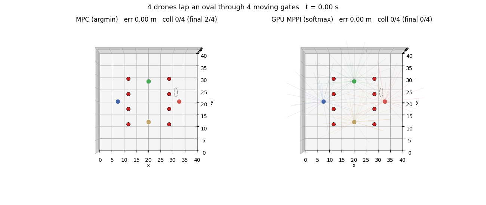
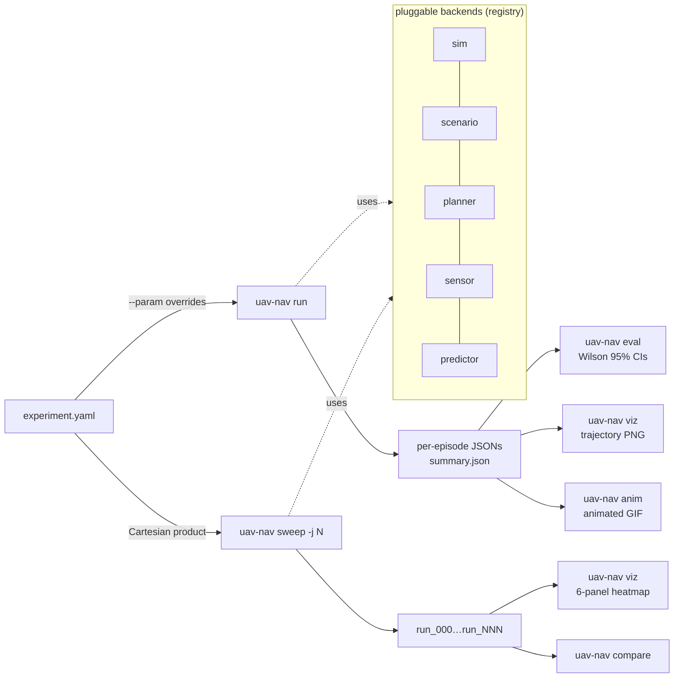
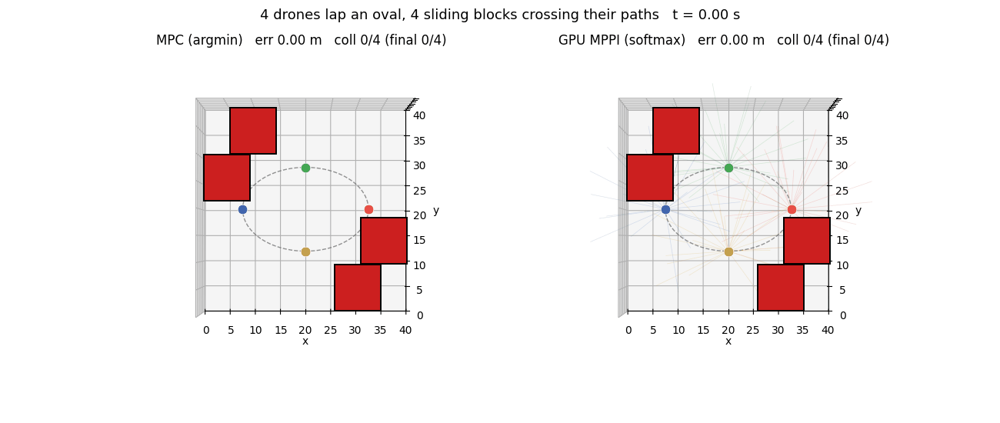
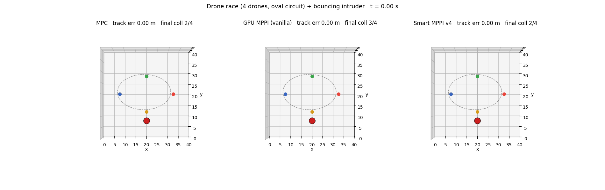
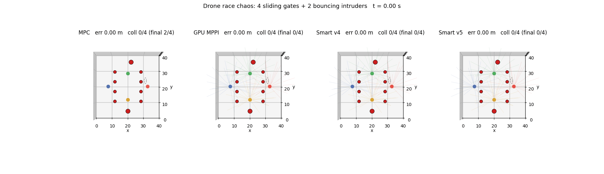

<div align="center">

# uav-nav-lab

**Python research framework for UAV motion planning.**
YAML-driven ablations with Wilson 95 % CIs by default.

[](https://github.com/rsasaki0109/uav-nav-lab/actions/workflows/ci.yml)
[](https://github.com/rsasaki0109/uav-nav-lab/actions/workflows/ci.yml)
[](https://github.com/rsasaki0109/uav-nav-lab/releases)
[](LICENSE)
[](https://github.com/rsasaki0109/uav-nav-lab/stargazers)



<i>4 drones lap an oval while 4 sliding gates close around them.
<b>MPC's argmin commit goes stale between replans — 51.7 % drone-eps
lost</b>; GPU MPPI's softmax clears at <b>3.3 %</b>. Same stack, same
seed, only the rollout aggregator changes.
&nbsp;<a href="docs/findings.md">More heroes (loop / dyn4 / chaos)</a>
&middot; <a href="docs/paper_a/section_3_headline.md">§3 4-mode framework</a></i>

</div>

## 🚀 Quick start

```bash
git clone https://github.com/rsasaki0109/uav-nav-lab
cd uav-nav-lab
pip install -e '.[dev,viz]'        # numpy + pyyaml + matplotlib + pytest
# Optional: pip install -e '.[gpu]' (PyTorch for gpu_mppi), '.[rl]' (SB3)
pytest -q

uav-nav run     examples/exp_basic.yaml
uav-nav eval    results/basic_astar
uav-nav viz     results/basic_astar
```

A 2D heatmap sweep is one CLI invocation:

```bash
uav-nav sweep examples/exp_predictive.yaml \
  --param planner.horizon=20 --param planner.n_samples=16 \
  --param planner.max_speed=10,15,20,25,30 \
  --param planner.replan_period=0.1,0.2,0.5,1.0,2.0 \
  --param num_episodes=20 -j 4
uav-nav viz <out>     # → 6-panel sweep_summary.png
```

## 🛠️ CLI

| command | what |
|---|---|
| `uav-nav run <yaml>` | run all episodes, write per-episode JSONs + `summary.json` |
| `uav-nav eval <run_dir>` | recompute metrics, print Wilson 95 % CIs + planner-dt budget |
| `uav-nav compare <a> <b> ...` | side-by-side table with ± half-widths |
| `uav-nav sweep <yaml> --param k=spec` | Cartesian-product over `--param`s |
| `uav-nav viz <run_or_sweep>` | trajectory PNG per episode, or 6-panel sweep heatmap |
| `uav-nav anim <run_dir>` | animated GIF replay (2D) |
| `uav-nav video <run_dir>` | ffmpeg AirSim camera frames into per-episode MP4 |
| `uav-nav list` | enumerate registered planners / sensors / sims / scenarios |

`--param` syntax: `start:stop:step`, `a,b,c`, `[3,0]`, `true` / `false`, and
dotted keys like `planner.predictor.velocity_noise_std=0.0,0.5,1.0`.

## 🏗️ Architecture



| kind | shipped |
|---|---|
| sim | `dummy_2d`, `dummy_3d`, `airsim`, `ros2` |
| scenario | `grid_world`, `voxel_world`, `multi_drone_{grid,voxel,aerobatic}` |
| planner | `astar`, `straight`, `mpc`, `mppi`, `gpu_mppi`, `rrt`, `rrt_star`, `chomp`, `mpc_chomp` |
| sensor | `perfect`, `delayed`, `kalman_delayed`, `lidar`, `pointcloud_occupancy`, `depth_image_occupancy` |
| predictor | `constant_velocity`, `noisy_velocity`, `kalman_velocity` |

Add a backend by dropping a file with `@REGISTRY.register("name")` and a
`from_config(cfg)` classmethod — the CLI picks it up via `type: name`.

## 📊 Research findings

Full long-form write-ups in [`docs/findings.md`](docs/findings.md);
the §3 4-mode framework is in
[`docs/paper_a/section_3_headline.md`](docs/paper_a/section_3_headline.md).
Headline themes:

- **GPU MPPI softmax vs CPU MPC argmin** — one operator, four
  regime-dependent expressions. Mode 1 (multi-drone clustering),
  mode 2 (dynamic-obstacle cancellation), mode 2-mirror (unimodal
  gate-thread), mode 4 (aerobatic precision). Mission metric selects
  the right planner, not a universal winner.
- **Smart MPPI v1-v5** — variants of the softmax aggregator that
  detect and repair specific failure modes; v5's lateral-cancellation
  gate dominates v4 across 4 of 5 paired dyn cells.
- **Planner head-to-head** (50 × 50 dynamic-obstacle, n=30) —
  straight 0 %, A* 20 %, RRT\* 23 % (CPU-saturated), CHOMP 53 %,
  RRT 73 %, CHOMP+RRT-init 90 %, Pareto-MPC 100 %.
- **AirSim transferability** — Δ-flip mechanism reproduces under
  AirSim physics, with a sign reversal at the dense corner (`base_ew06`).
- **Methodology** — Wilson 95 % CIs by default, McNemar paired tests
  for matched-seed comparisons, Pareto-cell re-validation as a guard
  against ablating off-Pareto.

<details>
<summary><b>Companion hero GIFs</b> — aerobatic loop / dyn4 / single intruder / chaos</summary>

<br>
<i><b>Aerobatic synchronized loop</b> (4 drones, 90° phase-offset
vertical loop, mode 4): GPU MPPI's softmax delivers <b>84 % tighter
phase sync</b> (1.67° vs 10.73° RMSE) and 21 % lower tracking error.
Choreography is the regime where averaging across rollouts beats
argmin commit.</i>

<br><br>

<br>
<i><b>dyn4 path-intersecting intruders</b> (controlled avoidance
harness, n=30). Open-ring overlay shows where each drone <i>would</i>
be on the oval; the colored trail bends off the dashed line to dodge.
All planners clear at 3.3 %.</i>

<br><br>

<br>
<i><b>Single bouncing intruder</b> (mode 2 cancellation): MPC 50 %,
vanilla GPU MPPI 75 %, Smart v4 50 %. Softmax averages bimodal L/R
escapes back toward zero motion; cluster softmax (v4) repairs it.</i>

<br><br>

<br>
<i><b>Chaos race</b> (gates + 2 intruders, n=30): MPC 51.7 %,
softmax variants 3.3 %. Gate topology dominates the cloud structure;
the bouncing intruders ride along inert.</i>

</details>

<details>
<summary><b>More demos</b> — aerobatic loop, multi-drone Δ-flip, AirSim</summary>

<table>
<tr><td></td></tr>
<tr><td align="center"><i>§3 mode 4 — aerobatic loop, GPU MPPI delivers 84 % tighter phase sync.</i></td></tr>
<tr><td></td></tr>
<tr><td align="center"><i>§3 mode 1 — joint tied at 78 / 77 %, Δ over indep⁴ +0.8 vs <b>+11.4 pp</b>.</i></td></tr>
<tr><td></td></tr>
<tr><td align="center"><i>AirSim multi-drone FPV — MPC vs GPU MPPI through the same Blocks scenario.</i></td></tr>
</table>

</details>

## ✅ Status

v0.1.0 released; CI on Python 3.10 / 3.11 / 3.12. 6 sensors,
3 predictors, 9 planners, 5 scenarios. All ablation results are
reproducible from the example YAMLs by copy-pasting one
`uav-nav sweep ...` line.

**External backends:**

- **AirSim** (`uav_nav_lab/sim/airsim_bridge.py`) — ENU ↔ NED bridge
  with deterministic stepping (`simPause` + `simContinueForTime`),
  multi-vehicle, LiDAR / cameras / depth, mock-injectable client for
  CI. See `examples/exp_airsim_*.yaml`.
- **ROS 2** (`uav_nav_lab/sim/ros2_bridge.py`, requires `rclpy`) —
  Twist + Odometry round-trip, sim-time anchoring via `/clock`,
  AirSim-over-ROS-2 parity. See `examples/exp_ros2*.yaml`.

## 📄 License

Apache-2.0.
