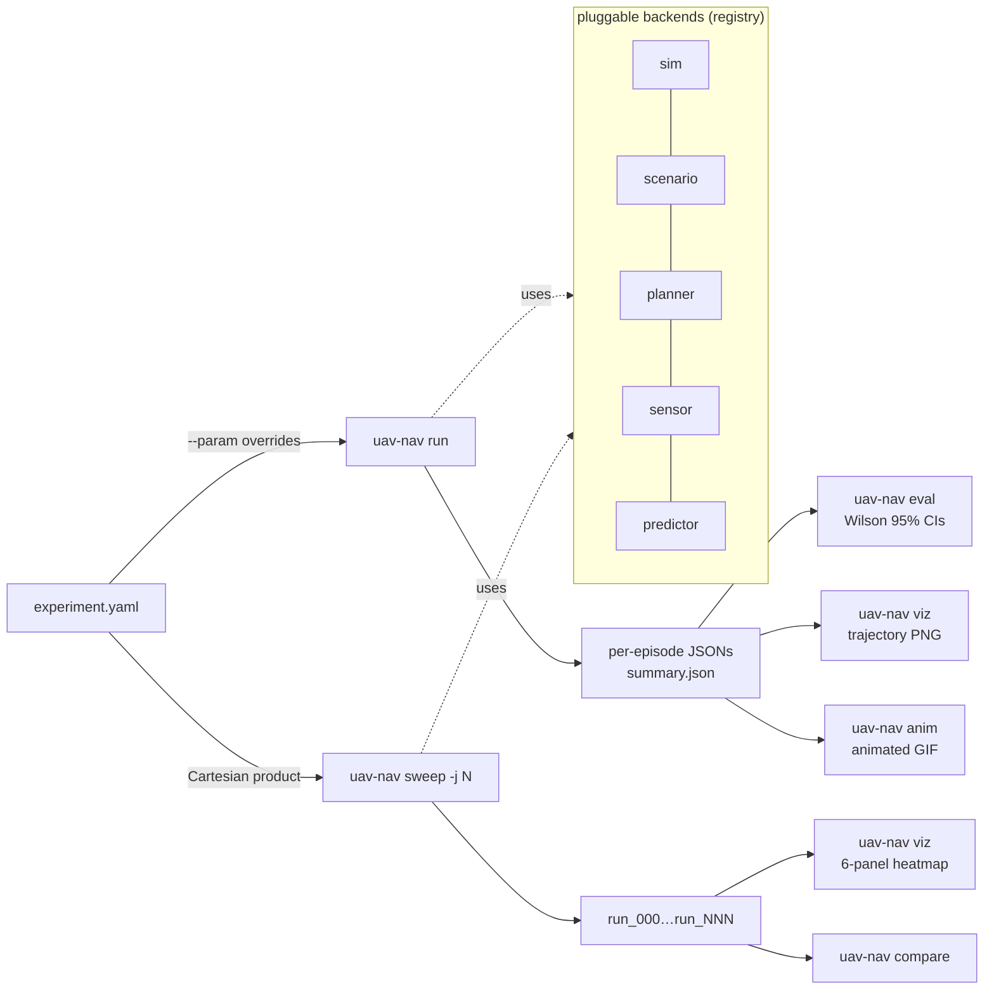

<div align="center">

# uav-nav-lab

**An OSS Python research framework for high-speed UAV navigation —
controlled ablations in minutes, statistical CIs on every metric, and
every example YAML carries its own validated finding.**

[](https://github.com/rsasaki0109/uav-nav-lab/actions/workflows/ci.yml)
[](https://github.com/rsasaki0109/uav-nav-lab/actions/workflows/ci.yml)
[](https://github.com/rsasaki0109/uav-nav-lab/releases)
[](LICENSE)
[](https://github.com/rsasaki0109/uav-nav-lab/stargazers)

<table>
<tr>
<td></td>
<td></td>
</tr>
<tr>
<td align="center"><i>2D — Pareto-MPC (n=16, h=20) through three bouncing obstacles.</i></td>
<td align="center"><i>3D — same planner family on a 40×40×12 voxel world.</i></td>
</tr>
<tr>
<td colspan="2"></td>
</tr>
<tr>
<td colspan="2" align="center"><i>GPU MPPI (3D, n=64) — translucent cyan: sampled rollouts, orange: softmax-best, red: bouncing obstacles. <code>uav-nav run examples/exp_gpu_mppi_demo.yaml && uav-nav anim results/gpu_mppi_demo</code>.</i></td>
</tr>
<tr>
<td colspan="2"></td>
</tr>
<tr>
<td colspan="2" align="center"><i><b>Headline (multi-drone, N=4, n=100 paired)</b> — same crossing, planner swap MPC → GPU MPPI. Joint success is tied (78.0 vs 77.0 %); coordination Δ over indep⁴ separates: MPC +0.8 pp vs GPU MPPI <b>+11.4 pp</b> (GPU MPPI's failures cluster on hard seeds). Same joint rate, different failure shape — <a href="docs/findings.md#multi-drone-gpu-mppis-rollout-cloud-flips-the-coordination-δ">findings.md</a>.</i></td>
</tr>
<tr>
<td colspan="2"></td>
</tr>
<tr>
<td colspan="2" align="center"><i><b>AirSim transferability</b> — same 4-drone Blocks cross, planner family swap. Virtual centerline obstacles in each planner's static map force visible detours (MPC max path 51 m, GPU MPPI smoother at 48 m). On the no-obstacle scenario, n=30 paired across three altitude-stagger cells (±2-4 m, ±1 m, 0 m) shows a bimodal response — non-zero z-spread keeps both at 100 % joint, uniform z=30 drops MPC to 46.7 % and GPU MPPI to <b>0/30</b> (McNemar p ≈ 0.00012). Trajectory-spread mechanism preserved across cells (GPU/MPC 4-27 ×) — <a href="docs/findings.md#airsim-multi-drone-n30-paired-planner-portable-scenario-ceiling-limited-timing-spread-signal-preserved">findings.md</a>.</i></td>
</tr>
</table>

<details>
<summary><b>More demos</b> — 2D/3D multi-drone, single-drone AirSim, GPU MPPI vs MPC single-drone</summary>

<table>
<tr>
<td></td>
<td></td>
</tr>
<tr>
<td align="center"><i>Multi-drone 2D — 4 drones cross-crossing via CV peer prediction.</i></td>
<td align="center"><i>Multi-drone 3D — same coordination, 40×40×12 voxel world.</i></td>
</tr>
<tr>
<td colspan="2"></td>
</tr>
<tr>
<td colspan="2" align="center"><i>Single-drone GPU MPPI vs CPU MPC head-to-head — same scenario/seed; left visualizes the 64-rollout sample cloud, right shows MPC's single trajectory.</i></td>
</tr>
<tr>
<td colspan="2"></td>
</tr>
<tr>
<td colspan="2" align="center"><i>AirSim single-drone — Pareto-MPC + <code>airsim_bridge</code> with a 16-channel LiDAR + <code>pointcloud_occupancy</code> sensor, weaving through Blocks cube clusters from an empty static map.</i></td>
</tr>
<tr>
<td colspan="2"></td>
</tr>
<tr>
<td colspan="2" align="center"><i>AirSim multi-drone — 4 quadrotors cross under <code>multi_drone_voxel</code> + MPC + CV peer prediction, 4 <code>airsim_bridge</code> instances bound to <code>Drone1..Drone4</code>.</i></td>
</tr>
<tr>
<td colspan="2"></td>
</tr>
<tr>
<td colspan="2" align="center"><i>AirSim multi-drone (no obstacles, straight-line crossing) — reference for the n=1 no-obstacle parity story. MPC finishes at 12.85 s lockstep, GPU MPPI at 17.65 s with 0.55 s arrival spread.</i></td>
</tr>
</table>

</details>

</div>

> **TL;DR.** On a 50 × 50 dynamic-obstacle scenario (n=30 episodes,
> Wilson 95 % CIs), this framework produces — from seven one-line
> `uav-nav run` invocations — straight-line **0 %**, A* **20 %**,
> RRT* **23 %** (CPU-saturated), CHOMP **53 %** (cheapest at 21 ms),
> RRT **73 %**, **CHOMP+RRT-init 90 %** (+17 pp over RRT at cheaper
> compute), Pareto-MPC **100 %**. Each example YAML carries the
> table, the heatmap, and the reproduce command in its header.

---

## ✨ What you get

- **Pluggable backends** for sim / scenario / planner / sensor / predictor —
  add one with a `@REGISTRY.register("name")` decorator and a
  `from_config(cfg)` classmethod.
- **YAML experiments** + Cartesian-product sweeps:
  `uav-nav sweep cfg.yaml --param k=a,b,c --param k2=start:stop:step`.
- **Statistical rigor by default**: Wilson 95% intervals on rates,
  mean ± 1.96·SEM on continuous metrics, per-call planner compute
  budget (mean / p95 / max ms).
- **Multi-drone** scenarios with joint-success aggregation and palette viz.
- **6-panel sweep heatmap** for compute-aware ablations, animated GIF replays.

## 🤔 Why

Most UAV planning research either (a) hard-codes a single MPC variant,
single sensor, single scenario, and reports a number, or (b) buries
ablations under stacks of glue code. Neither makes it easy to ask *"does
this idea actually beat what I already have, with the CI to back it?"*

`uav-nav-lab` is the framework I wanted *while* doing the research:
declare the experiment in YAML, sweep with `--param`, get heatmaps and
Wilson 95 % CIs out of the box, and have every config carry its own
validated finding — so the file is the artifact, not a Notion page.

## 🚀 Quick start

```bash
git clone https://github.com/rsasaki0109/uav-nav-lab
cd uav-nav-lab
pip install -e '.[dev,viz]'        # numpy + pyyaml + matplotlib + pytest
# Optional heavier stacks:
#   pip install -e '.[gpu]'         # PyTorch for planner.type=gpu_mppi
#   pip install -e '.[rl]'          # gymnasium + stable-baselines3
pytest -q                          # full suite runs in seconds

uav-nav run     examples/exp_basic.yaml
uav-nav eval    results/basic_astar
uav-nav viz     results/basic_astar
```

A 2D heatmap sweep is one CLI invocation:

```bash
uav-nav sweep examples/exp_predictive.yaml \
  --param planner.horizon=20 --param planner.n_samples=16 \
  --param planner.max_speed=10,15,20,25,30 \
  --param planner.replan_period=0.1,0.2,0.5,1.0,2.0 \
  --param num_episodes=20 -j 4
uav-nav viz <out>     # → 6-panel sweep_summary.png
```

## 🛠️ CLI

| command | what |
|---|---|
| `uav-nav run <yaml>` | run all episodes, write per-episode JSONs + `summary.json` |
| `uav-nav eval <run_dir>` | recompute metrics from logs, print Wilson 95 % rates + planner-dt budget |
| `uav-nav compare <a> <b> ...` | side-by-side table with ± half-widths |
| `uav-nav sweep <yaml> --param k=spec` | Cartesian-product over `--param`s; each cell gets its own dir |
| `uav-nav viz <run_or_sweep>` | trajectory PNG per episode, or 1D / 2D sweep heatmap |
| `uav-nav anim <run_dir>` | animated GIF replay (2D) |
| `uav-nav video <run_dir>` | ffmpeg per-step AirSim camera frames into per-episode MP4 |
| `uav-nav list` | enumerate registered planners / sensors / sims / scenarios |

`--param` syntax: `start:stop:step` for ranges, `a,b,c` for explicit lists,
`[3,0]` for vector values, `true` / `false` literals. Three-level dotted
keys work: `planner.predictor.velocity_noise_std=0.0,0.5,1.0`.

## 🏗️ Architecture

The CLI is one verb per pipeline stage; each verb composes the same
pluggable backends:



Source layout:

```
uav_nav_lab/
├── sim/         dummy_2d / dummy_3d (point-mass), airsim, ros2
├── scenario/    grid_world, voxel_world, multi_drone_grid
├── planner/     astar, straight, mpc, rrt, rrt_star, chomp, mpc_chomp  (registry: PLANNER_REGISTRY)
├── sensor/      perfect, delayed, kalman_delayed, lidar, pointcloud_occupancy
├── predictor/   constant_velocity, noisy_velocity, kalman_velocity
├── runner/      experiment, multi (multi-drone), sweep
├── eval/        metrics (Wilson + SEM CIs), compare
├── viz / anim / sweep_viz   2D + 3D + GIF + 6-panel heatmap
└── cli          run / eval / compare / sweep / viz / anim / list
```

Backends at a glance:

| kind | shipped | registry |
|---|---|---|
| sim | `dummy_2d`, `dummy_3d`, `airsim`, `ros2` | `SIM_REGISTRY` |
| scenario | `grid_world`, `voxel_world`, `multi_drone_grid` | `SCENARIO_REGISTRY` |
| planner | `astar`, `straight`, `mpc`, `rrt`, `rrt_star`, `chomp`, `mpc_chomp` | `PLANNER_REGISTRY` |
| sensor | `perfect`, `delayed`, `kalman_delayed`, `lidar`, `pointcloud_occupancy` | `SENSOR_REGISTRY` |
| predictor | `constant_velocity`, `noisy_velocity`, `kalman_velocity` | `PREDICTOR_REGISTRY` |

Adding a new backend is one new file with a `@REGISTRY.register("name")`
decorator and a `from_config(cfg)` classmethod — the CLI picks it up via
`type: name` in YAML, no central wiring needed.

## 📊 Selected research findings

Each finding lives in the comment header of the YAML that produces it,
along with a one-line `uav-nav sweep` invocation that reproduces it.
Wilson 95 % intervals on rates, mean ± 1.96·SEM on continuous metrics.

### 🏁 Planner head-to-head on dynamic obstacles

Same 50 × 50 world, same three bouncing obstacles, same perfect sensor —
only the planner changes. n=30 episodes per configuration:

<table>
<tr>
<td align="center"><b>straight</b><br>0.0 %</td>
<td align="center"><b>astar</b><br>20.0 %</td>
<td align="center"><b>rrt*</b><br>23.3 %</td>
<td align="center"><b>chomp</b><br>53.3 %</td>
<td align="center"><b>rrt</b><br>73.3 %</td>
<td align="center"><b>chomp+rrt</b><br>90.0 %</td>
<td align="center"><b>mpc (Pareto)</b><br>100.0 %</td>
</tr>
<tr>
<td></td>
<td></td>
<td></td>
<td></td>
<td></td>
<td></td>
<td></td>
</tr>
<tr>
<td align="center">plan_dt<br>0.04 / 0.05 ms</td>
<td align="center">plan_dt<br>4.75 / 8.97 ms</td>
<td align="center">plan_dt<br>464 / 521 ms ⚠️</td>
<td align="center">plan_dt<br>21.31 / 22.31 ms</td>
<td align="center">plan_dt<br>29.99 / 64.27 ms</td>
<td align="center">plan_dt<br>32.20 / 48.63 ms</td>
<td align="center">plan_dt<br>52.16 / 56.96 ms</td>
</tr>
</table>

A* sees only a snapshot at replan time and walks into where the bouncing
obstacles will be 0.2 s later — 20 %. **RRT (continuous-space sampling)
beats grid A* by +53 pp at similar compute** — the path is not constrained
to the 8-connected lattice, so straight-line edges across open space
move the drone past obstacles before they cross. MPC at the Pareto
config (`n_samples=16, horizon=20`) is the only planner with explicit
motion prediction and clears every episode.

**CHOMP slots in the middle (53.3 %) and is the cheapest non-trivial
planner of the lot — 21.3 ms ± 0.12, p95 22.3 ms — beating both RRT and
MPC on per-replan compute**. The smoothness term keeps trajectories
short and tight (47.6 ± 8.2 m vs RRT's typical zigzag) but local
optimisation cannot tunnel through obstacles the straight-line init
crosses, capping success below RRT's continuous-space sampling.

**Layering RRT init under the CHOMP smoother (`init: rrt`) jumps
success to 90.0 % [74.4, 96.5] at +50 % compute — second only to
MPC, beating plain RRT by +17 pp at *cheaper* per-replan cost (32 ms
vs 30 ms mean, but 49 ms vs 64 ms p95)**. RRT contributes
probabilistic completeness, CHOMP contributes smoothness, and
stacking them gets both — a strict layering win, with the same
Pareto-saturation lesson as the rest of the table: the layer wins
only because it stays inside the replan budget.

**Counter-intuitively, RRT\* loses to plain RRT here.** Asymptotic
optimality costs ~15× the per-replan compute (464 ms mean vs 30 ms),
which is 2.3× the 200 ms replan period — every replan arrives late, so
the drone follows stale plans into moving obstacles. Optimality cannot
beat freshness in a dynamic scenario unless the optimization fits the
replan budget. Same Pareto-saturation trap the 2D MPC re-validation
saga uncovered, just on the search side.

> Reproduce: `uav-nav run examples/exp_compare_{straight,astar,rrt,rrt_star,chomp,chomp_rrt,mpc}.yaml`,
> then `uav-nav compare results/cmp_straight results/cmp_astar results/cmp_rrt_star results/cmp_chomp results/cmp_rrt results/cmp_chomp_rrt results/cmp_mpc`.

### More studies — see [docs/findings.md](docs/findings.md)

Each finding lives in the comment header of the YAML that produces it,
plus a long-form write-up in [`docs/findings.md`](docs/findings.md).
Grouped by theme:

**Pareto cells & methodology**
- **MPC Pareto** (2D + 3D) — `n_samples × horizon` sweep; the 3D
  `plan_dt` blow-up was a missing cost-to-go cache, not a CPU cliff.
- **3D perception-latency cliff** — same corner shape as 2D, softened
  by escape volume; velocity_window optimum *inverts* (window=1, not 5).
- **Pareto config rewrites prior conclusions** — methodological
  lesson on always re-validating ablations at the planner's Pareto cell.

**GPU MPPI vs CPU MPC**
- **GPU MPPI Pareto** (2D + 3D, `gpu_mppi` on CUDA) — a goal-mask
  bug fix unlocked long horizons; the 3D Pareto cell (n=64-256,
  h=20 → 100 %) dominates the CPU MPC baseline (88 % / 70 ms) at
  3.5 ms steady-state.
- **Multi-drone Δ-flip** (n=100 paired, dummy_3d) — joint success
  tied (78.0 vs 77.0 %), coordination Δ over indep⁴ separates:
  MPC **+0.8 pp** vs GPU MPPI **+11.4 pp** (failures cluster
  within seeds). Same joint rate, very different failure shape.
- **Temperature ablation** (3D Pareto cell) — softmax T sweep;
  the CPU-MPPI temperature rules of thumb don't transfer to GPU.

**Multi-drone coordination**
- **Multi-drone N-scaling** — peer prediction correlates failures
  the right way (+14.7 pp Δ over indep at N=4); ablating prediction
  costs as much per-drone success as 8× obstacle density (49 pp).
- **AirSim multi-drone Δ-flip portability** (n=30 paired × 3 cells:
  `exp_airsim_multi_{n30,mid_n30,uniform_n30}*.yaml`) — bimodal
  response. ±2-4 m and ±1 m staggered: both planners 100 % joint.
  Uniform z=30: MPC holds **46.7 %** joint; GPU MPPI **collapses to
  0/30** (McNemar paired exact p ≈ 0.00012). Trajectory-spread
  signal preserved across all cells (GPU/MPC 4-27 × ratio) — the
  softmax mechanism is universal, but the failure-level Δ can't
  register on no-obstacle scenarios. **GPU MPPI is not a drop-in
  MPC replacement at tight-coupling geometries.**

**Sim transferability & ROS 2**
- **AirSim vs dummy_3d** — same plan, different physics: latency
  cliff transfers but is softened by SimpleFlight's velocity controller.
- **AirSim + GPU MPPI parity** (single-drone) — planner portable to
  Blocks, but dummy_3d's 20× plan-time edge collapses to <5 % on
  AirSim because sim-side overhead dominates.
- **ROS 2 bridge** — Twist + Odometry round-trip, sim-time anchoring,
  AirSim-over-ROS-2 parity harness via `compare_spatial_runs.py`.

**Other**
- **Planner head-to-head** (table above) — RRT beats grid A* by
  +53 pp at similar compute; CHOMP+RRT-init beats RRT by +17 pp at
  *cheaper* compute; RRT\* loses to plain RRT because it runs
  2.3× the replan budget.
- **Wind miscalibration** — +73 pp swing from awareness at one
  cell, no belief beats `sim_wind > max_speed` physics.
- **Perception-latency saga** — four steps including an honest
  negative result on Kalman ego.
- **Bridge fix: pause-after-reset** — the multi-drone reset path
  used to leave AirSim's collision flag set at t=0; fixed by
  pausing immediately after `client.reset()`. Uncovered during the
  n=30 paired study.

## ✅ Status

- **v0.1.0** released; GitHub Actions CI on Python 3.10 / 3.11 / 3.12
  + a CLI smoke job.
- **6 sensor backends** (`perfect`, `delayed`, `kalman_delayed`, `lidar`, `pointcloud_occupancy`, `depth_image_occupancy`),
  **3 predictor backends** (`constant_velocity`, `noisy_velocity`,
  `kalman_velocity`), **9 planners** (`astar`, `straight`, `mpc`, `mppi`,
  `gpu_mppi`, `rrt`, `rrt_star`, `chomp`, `mpc_chomp`), **4 scenarios**
  (`grid_world`, `voxel_world`, `multi_drone_grid`, `multi_drone_voxel`).
- All ablation results are reproducible from the example YAMLs by
  copy-pasting one `uav-nav sweep ...` line.

External backends:

**AirSim** (`uav_nav_lab/sim/airsim_bridge.py`, install via
`pip install airsim`) — end-to-end ENU ↔ NED bridge with
`simPause` + `simContinueForTime` for deterministic stepping. The
bridge is sensor-agnostic — sensors and perception sit in their
own backends and consume what the bridge surfaces:

- **LiDAR**: `lidars: [name, …]` → `getLidarData()` →
  `state.extra["lidar_points"][name]`. Pair with the
  `pointcloud_occupancy` sensor to rasterize into an occupancy grid.
- **Cameras**: `cameras: [{name, image_type}, …]` → `simGetImages()` →
  `state.extra["camera_images"][name]`. With
  `output.save_camera_frames: true`, `uav-nav video <run_dir>`
  ffmpegs them into per-camera MP4s.
- **Depth**: `depths: [{name, fov_deg, width, height}, …]` →
  same call with `pixels_as_float=True` →
  `state.extra["depth_images"][name]`. Pair with `depth_image_occupancy`.
- **Multi-drone**: `simulator.vehicles: [Drone1, …]` paired with
  `multi_drone_voxel`. One bridge per drone; only the master
  advances AirSim's shared clock, peers queue `moveByVelocityAsync`
  while paused. See `examples/exp_airsim_multi_demo.yaml`.
- A mock-injectable client makes the ENU/NED math CI-testable
  without an AirSim install.

**ROS 2** (`uav_nav_lab/sim/ros2_bridge.py`, requires `rclpy`) —
publishes `geometry_msgs/Twist` on `/cmd_vel`, subscribes to
`nav_msgs/Odometry` on `/odom` (and optional `std_msgs/Bool` on
`/collision`), spins once per `dt`. Frames default to ENU per
REP-103; set `frame: ned` for NED-speaking wrappers.

- **AirSim over ROS 2**: `cmd_msg_type: airsim_vel_cmd` publishes
  AirSim's ROS wrapper velocity message. `exp_airsim_ros2.yaml`
  exercises AirSim through ROS 2 against the direct bridge —
  spatial agreement checked via
  `scripts/compare_spatial_runs.py`.
- **LiDAR + cameras**: `sensor_msgs/PointCloud2` / `sensor_msgs/Image`
  subscriptions populate the same `state.extra` keys as the AirSim
  bridge, so the perception sensors (`pointcloud_occupancy` etc.)
  consume both backends with no code change.
- **Sim-time anchoring**: `use_sim_time: true` (+ optional
  `clock_topic` and `sim_time_wall_timeout`) anchors `state.t` on
  `/clock`, so PX4-SITL fast-forward and Gazebo `--lockstep` speed
  the experiment by the same factor as the sim. The wall-clock
  timeout protects the runner from a paused or crashed sim.
- Mock-injectable adapter is CI-testable without `rclpy`.

## 🗺️ Roadmap

- **AirSim Δ-flip discriminating cell** — the dummy_3d multi-drone
  Δ-flip (+11.4 pp) is bracketed but not directly measured on AirSim
  across three altitude-stagger cells: ±2-4 m / ±1 m at ceiling,
  uniform z=30 below the floor. Landing in the per-drone 60-90 %
  band needs added Blocks static obstacles — either a lower-altitude
  variant (z ≈ 8 where Blocks cubes are dense) or a perception path
  with `LidarFront` on all drones + `pointcloud_occupancy`.
- **AirSim multi-drone reset hang** — Blocks' RPC handler wedges
  after 1-2 sequential multi-drone `client.reset()` calls. Worked
  around with `scripts/run_airsim_multi_chunked.sh` (per-episode
  Blocks bounce); root cause appears to be inside AirSim itself,
  worth filing upstream.
- **AirSim cliff limit case** — push `exp_airsim_latency_limit.yaml`
  toward higher speed and obstacle density to find whether the
  dummy_3d latency cliff reappears beyond SimpleFlight's smoothing
  regime.
- **AirSim-over-ROS-2 wrapper reset/teleport** — add a wrapper-
  specific reset path so repeated ROS 2 episodes can start from the
  same pose without manual scene setup.

## 📄 License

Apache-2.0.
