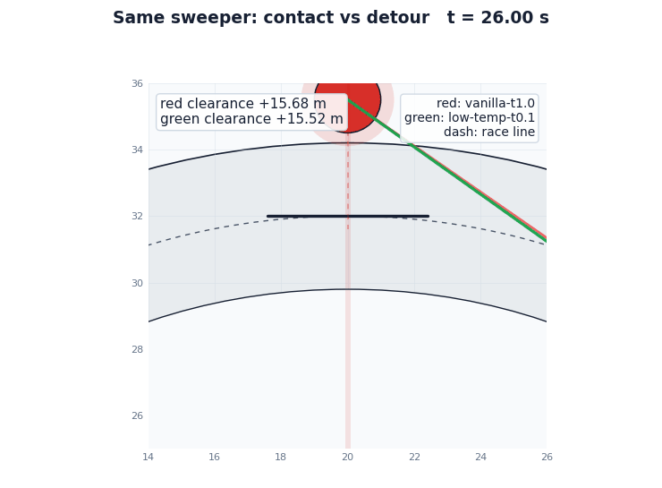
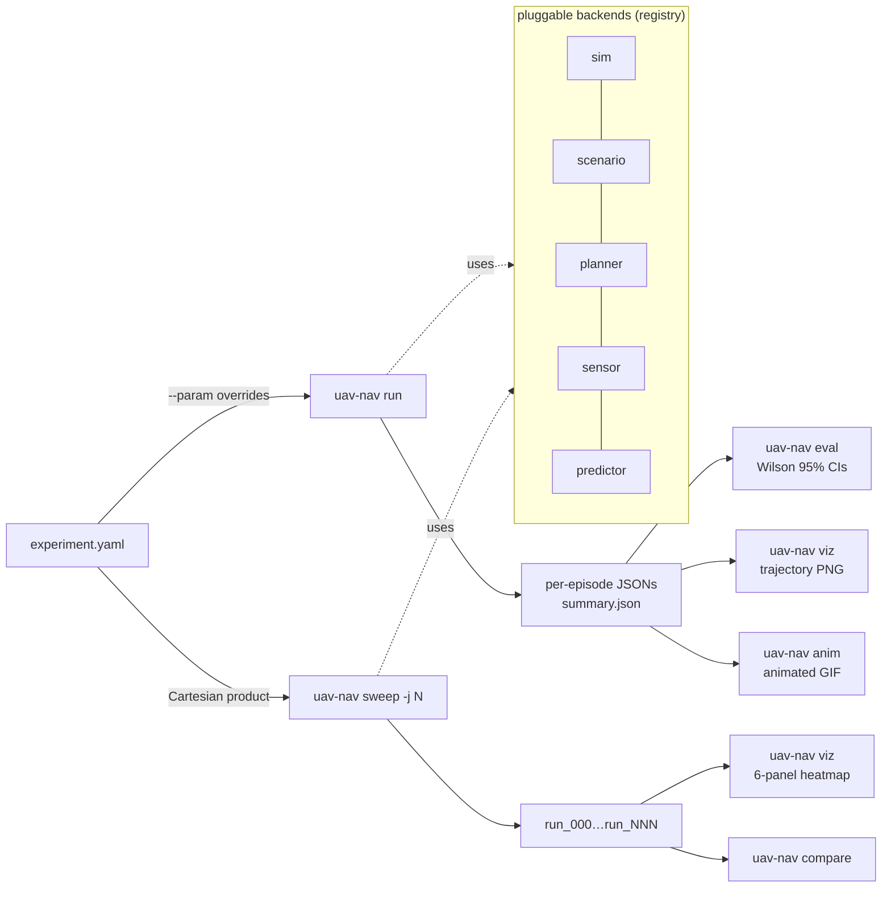

<div align="center">

# uav-nav-lab

**Python research framework for UAV motion planning.**
YAML-driven ablations with Wilson 95 % CIs by default.

> **Post-fix status (2026-05-25)**: the old race / gates / dyn4 / chaos
> dynamic-obstacle headlines were retracted after commit `1646e11` fixed
> a multi-runner bug that froze dynamic obstacles after total-wipeout
> episodes. The replacement evidence is now mechanism-first: the hero
> GIF below is a real post-fix drone race with two moving sweepers:
> vanilla GPU MPPI collides, while the same rollout/cost stack at lower
> softmax temperature completes cleanly. The race-simple split cell also
> logs the exact softmax command that turns a clean escape rollout into
> a collision. See `docs/findings.md` for the audit trail.

[](https://github.com/rsasaki0109/uav-nav-lab/actions/workflows/ci.yml)
[](https://github.com/rsasaki0109/uav-nav-lab/actions/workflows/ci.yml)
[](https://github.com/rsasaki0109/uav-nav-lab/releases)
[](LICENSE)
[](https://github.com/rsasaki0109/uav-nav-lab/stargazers)



<i><b>Post-fix drone race hero, zoomed at the obstacle encounter.</b>
Four drones run a horizontal oval while two red moving sweepers cross
the racing line; this first-frame visual zooms into drone 3 versus the
upper sweeper at <code>t≈29 s</code>. The translucent red disc is the
obstacle + drone safety radius, and the green/red segment is live
clearance. Same race cell, same seed, same GPU MPPI rollout/cost stack;
only the softmax temperature changes. The left pane is vanilla
<code>t=1.0</code> and contacts the sweeper at <code>29.25 s</code>
(aggregate baseline: <code>0/10</code> joint success,
<code>10</code> dynamic-obstacle contacts and <code>20</code>
follow-on peer contacts). The right pane lowers only the temperature to
<code>t=0.1</code> and stays outside the safety halo
(fresh counterfactual: <code>3/3</code> joint success,
<code>12/12</code> drone-episodes, no env or peer contacts). Rendered
from real episode logs with <code>scripts/render_race_hero_gif.py</code>.
&nbsp;<a href="docs/findings.md">Findings</a>
&middot; <a href="docs/paper_a/section_3_headline.md">§3 4-mode framework</a></i>

</div>

<details>
<summary><b>🔬 Mechanism figures</b> — 4-panel fingerprint figure + predictor-fidelity sweep (E1-E5)</summary>

<br>

<br>
<i><b>Behavioral fingerprint across 4 cells</b> (v1 / 4-way / chokepoint /
wave). (a, b) trajectories overlay MPC vs MPPI in the open and the
3-intruder wave cell; (c) drone-east speed and |Δcmd| over time at
v1 ep 0 — MPC's |Δcmd| (faded red) spikes near 6 m/s while MPPI's
stays under 2.5 m/s; (d) max |Δcmd| with 1.96·SEM bars across all 4
cells × 2 planners — MPC is 2-3× larger everywhere and saturates the
per-step jump bound at the chokepoint cell. Generated by
<code>scripts/intersection_paper_figure.py</code>.</i>

<br><br>

<br>
<i><b>Predictor-fidelity sweep (wave cell, n=20, seeded predictor)</b>:
replace the perfect constant-velocity predictor with
<code>noisy_velocity</code> at σ ∈ {0.2, 0.5, 1.0, 3.0, 10.0}. Both
planners saturate at σ ≤ 1 (≥ 90% joint success) and floor at σ = 10
(MPC 5%, MPPI 10%, both within noise). The fidelity knee is sharp:
at σ = 3 MPC reaches 45% while vanilla MPPI gives 35%. The earlier
n=5 sweep that put MPPI at 4/5 vs MPC at 1/5 was a luck-of-the-draw
artifact of an unseeded predictor — see <a href="docs/findings.md">findings.md</a>
"CORRECTION (2026-05-22)" for the audit trail.</i>

<br><br>

<br>
<i><b>G: aggregator U-shape across cells at σ = 3 (n = 20)</b>.
Vanilla MPPI (t = 1.0) is the <b>worst</b> aggregator in BOTH cells —
v1 (1 slow intruder) 60% and wave (3 medium-speed intruders) 35%.
Both extremes of the U recover. The <i>optimal</i> arm is
cell-dependent: v1 is solved by near-uniform MPPI (t = 10 → <b>100%</b>,
the planner essentially returns the prior straight-to-goal), wave is
solved by argmin MPPI (t = 0.1 → 70%, the planner commits to the
single rollout with the lowest real-geometry cost). The "vanilla
softmax averages similar-cost rollouts into a phantom-evasion direction
with just enough confidence to commit but not enough to argmin out of
it" mechanism is now universal across both tested geometries.</i>

<br><br>

<br>
<i><b>J: aggregator-temperature sweep (wave cell, n=20)</b>. The
underlying single-cell sweep that motivated G — including σ = 10
chaos where every aggregator collapses to near-floor.</i>

<br>

The refined §3 framing (see <a href="docs/findings.md">findings.md</a>
for the full E1-J-G chain):
<ul>
<li><b>Success-axis switch</b>: predictor on/off (universal, deterministic — both planners drop to 0/5 with no predictor).</li>
<li><b>Success-axis fidelity gradient</b>: σ ∈ {1, 3} is the knee band on wave; outside it, success either saturates (σ ≤ 0.5) or floors (σ ≥ 10).</li>
<li><b>Aggregator U-shape</b> (universal across v1 and wave): vanilla MPPI is the structural valley at σ = 3.</li>
<li><b>Optimal aggregator depends on geometry</b>: easy cells favor prior-trust (uniform MPPI); hard cells favor cost-trust (argmin MPPI).</li>
</ul>

</details>

## 🚀 Quick start

```bash
git clone https://github.com/rsasaki0109/uav-nav-lab
cd uav-nav-lab
pip install -e '.[dev,viz]'        # numpy + pyyaml + matplotlib + pytest
# Optional: pip install -e '.[gpu]' (PyTorch for gpu_mppi), '.[rl]' (SB3)
pytest -q

uav-nav run     examples/exp_basic.yaml
uav-nav eval    results/basic_astar
uav-nav viz     results/basic_astar
```

A 2D heatmap sweep is one CLI invocation:

```bash
uav-nav sweep examples/exp_predictive.yaml \
  --param planner.horizon=20 --param planner.n_samples=16 \
  --param planner.max_speed=10,15,20,25,30 \
  --param planner.replan_period=0.1,0.2,0.5,1.0,2.0 \
  --param num_episodes=20 -j 4
uav-nav viz <out>     # → 6-panel sweep_summary.png
```

## 🛠️ CLI

| command | what |
|---|---|
| `uav-nav run <yaml>` | run all episodes, write per-episode JSONs + `summary.json` |
| `uav-nav eval <run_dir>` | recompute metrics, print Wilson 95 % CIs + planner-dt budget |
| `uav-nav compare <a> <b> ...` | side-by-side table with ± half-widths |
| `uav-nav sweep <yaml> --param k=spec` | Cartesian-product over `--param`s |
| `uav-nav viz <run_or_sweep>` | trajectory PNG per episode, or 6-panel sweep heatmap |
| `uav-nav anim <run_dir>` | animated GIF replay (2D) |
| `uav-nav video <run_dir>` | ffmpeg AirSim camera frames into per-episode MP4 |
| `uav-nav list` | enumerate registered planners / sensors / sims / scenarios |

`--param` syntax: `start:stop:step`, `a,b,c`, `[3,0]`, `true` / `false`, and
dotted keys like `planner.predictor.velocity_noise_std=0.0,0.5,1.0`.

## 🏗️ Architecture



| kind | shipped |
|---|---|
| sim | `dummy_2d`, `dummy_3d`, `airsim`, `ros2` |
| scenario | `grid_world`, `voxel_world`, `multi_drone_{grid,voxel,aerobatic}` |
| planner | `astar`, `straight`, `mpc`, `mppi`, `gpu_mppi`, `rrt`, `rrt_star`, `chomp`, `mpc_chomp` |
| sensor | `perfect`, `delayed`, `kalman_delayed`, `lidar`, `pointcloud_occupancy`, `depth_image_occupancy` |
| predictor | `constant_velocity`, `noisy_velocity`, `kalman_velocity` |

Add a backend by dropping a file with `@REGISTRY.register("name")` and a
`from_config(cfg)` classmethod — the CLI picks it up via `type: name`.

## 📊 Research findings

Full long-form write-ups in [`docs/findings.md`](docs/findings.md);
the working paper draft is under [`docs/paper_a/`](docs/paper_a/). The
active findings are grouped this way:

- **Latest: GPU MPPI softmax provenance and temperature counterfactual in a
  moving-obstacle race** —
  after the `1646e11` dynamic-obstacle fix, a re-tuned race-simple
  split cell now has planner-internal provenance. GPU MPPI sees a
  clean escape rollout, but the vanilla softmax average emits the
  actual velocity command back toward the moving obstacle. Lowering
  the same GPU MPPI controller's temperature flips the closed-loop
  outcome from deterministic contact to clean completion.
- **Static multi-drone coordination** — MPC argmin and GPU MPPI softmax
  can tie on joint success while producing different failure clustering
  (`Δ` over the independent-drone baseline). The sign depends on the
  `(N, density)` cell, so the result is a mechanism claim, not a
  universal planner ranking.
- **AirSim transferability** — the same coordination mechanism appears
  under AirSim physics, but dense static-cube cells can reverse which
  planner clusters failures. Absolute winner claims are treated as
  environment-sensitive.
- **Planner / sim framework** — YAML-driven paired runs cover CPU MPC,
  GPU MPPI, sampling planners, CHOMP variants, AirSim, ROS 2, and
  AirSim-over-ROS-2 parity checks.
- **Dynamic-obstacle race studies** — old race / gates / dyn4 / chaos
  numbers remain retracted after the `1646e11` multi-runner fix. The
  new race-simple phase cell is a replacement mechanism study, not a
  revival of the old headline table.
- **Methodology** — Wilson 95 % CIs by default, McNemar paired tests
  for matched-seed comparisons, and Pareto-cell re-validation before
  making ablation claims.

<br>
<i><b>Race-simple phase mechanism (post-fix)</b> — in the split band
<code>p19.8, y=5.375/34.625</code> and
<code>p19.8, y=5.50/34.50</code>, paired MPC succeeds while GPU MPPI
collides. Action provenance at the pre-contact replan shows the
step command is exactly the vanilla softmax action
(<code>cmd_vs_chosen=0</code>, <code>chosen_vs_softmax=0</code>).
The highest-weight / argmin rollout escapes
(<code>y=+3.61 m/s</code>), but the softmax command points toward the
obstacle (<code>y=-1.51 m/s</code>) because 61.9 % of the weight mass
lies on negative-y actions. Reproduce with
<code>scripts/run_race_simple_phase_sweep.py --gpu-log-action-provenance</code>
and <code>scripts/analyze_race_simple_action_provenance.py</code>.</i>

<br>
<i><b>Race-simple temperature counterfactual</b> — same split cell,
same GPU MPPI rollout/cost stack, only the softmax temperature changes.
The existing vanilla baseline is <code>t=1.0</code>, 0/10 joint
success, 10 dynamic-obstacle env contacts, and 20 follow-on peer
contacts. Fresh low-temperature reruns at <code>t=0.3</code>,
<code>t=0.1</code>, and <code>t=0.001</code> are each 3/3 joint
success and 12/12 drone-episodes, with no env or peer collisions.
This is a targeted counterfactual, not yet an n=30 paper-grade rate
claim; reproduce with
<code>scripts/race_simple_temperature_counterfactual.py</code>.</i>

<details>
<summary><b>Companion hero GIFs</b> — multi-drone Δ-flip and single-drone 3D MPPI</summary>

<br>
<i><b>§3 mode 1 multi-drone Δ-flip</b> (N=4 paired n=100, dummy_3d):
joint tied at 78 / 77 %, coordination Δ over indep⁴ separates by an
order of magnitude — MPC <b>+0.8 pp</b> vs GPU MPPI <b>+11.4 pp</b>.
GPU MPPI's softmax against a shared peer-prediction world model
clusters failures within seeds rather than spreading them.</i>

<br><br>

<br>
<i><b>3D MPC vs GPU MPPI</b> single-drone navigation: rollout cloud
visible on the GPU MPPI side (light-blue spaghetti), single committed
trajectory on the MPC side. Both succeed; the visual shows the
algorithmic signature of each aggregator.</i>

</details>

<details>
<summary>⚠️ <b>Retracted dynamic-obstacle GIFs and the replacement race-simple cell</b></summary>

The original race / gates / dyn4 / chaos GIFs were rendered against
the frozen-obstacle bug (fixed in <code>1646e11</code>). Re-runs with
the fix show those scenarios as designed are <b>uniformly 100 %
collision for every planner</b> — the moving-gate gap closes faster
than the planner's 0.4 s lookahead can detour around, and likewise
for the path-intersecting intruders. The "MPC vs softmax" contrast
on those scenarios was an artifact of the bug, not a real
planner-level finding.

The current hero GIF (<code>compare_race_temperature_avoid.gif</code>
at the top of the README) is not one of the invalidated old race GIFs.
It is rendered from the post-fix race-simple temperature
counterfactual: the track, moving sweepers, vanilla collision, and
low-temperature avoidance all come from real episode logs. The earlier
4-way intersection speed-cut (<code>compare_intersection_4way_speed.gif</code>)
is retained as a companion coordination visual, but it is no longer
the README hero because it is not a race. The original gates4 / chaos /
dyn4 scenarios still need further re-tuning (wider gaps, slower gates)
before their GIFs go back up.

The replacement race-simple phase cell is now a mechanism result rather
than a headline win/loss table: GPU MPPI's selected visible rollout is
clean, but its actual command is the softmax weighted action and points
back toward the obstacle. That provenance is logged under
<code>replans[].planner_meta.action_provenance</code> when
<code>planner.log_action_provenance</code> is enabled.

</details>

<details>
<summary><b>More demos</b> — aerobatic loop, multi-drone Δ-flip, AirSim</summary>

<table>
<tr><td></td></tr>
<tr><td align="center"><i>§3 mode 4 — aerobatic loop, GPU MPPI delivers 84 % tighter phase sync.</i></td></tr>
<tr><td></td></tr>
<tr><td align="center"><i>§3 mode 1 — joint tied at 78 / 77 %, Δ over indep⁴ +0.8 vs <b>+11.4 pp</b>.</i></td></tr>
<tr><td></td></tr>
<tr><td align="center"><i>AirSim multi-drone FPV — MPC vs GPU MPPI through the same Blocks scenario.</i></td></tr>
</table>

</details>

## ✅ Status

v0.2.0 is tagged; CI runs on Python 3.10 / 3.11 / 3.12. The current
stack includes 4 sim backends, 6 sensors, 3 predictors, 9 planners, and
5 scenario families. Stable ablations are reproducible from the example
YAMLs and scripts; the current dynamic-obstacle hero is
`compare_race_temperature_avoid.gif`, rendered from the post-fix
race-simple temperature counterfactual. The latest post-fix
race-simple split cell adds planner-internal provenance for a GPU MPPI
softmax failure and a temperature-only avoidance counterfactual. The
older race / gates4 / dyn4 / chaos
scenarios remain retracted after the `1646e11` bug fix.

**External backends:**

- **AirSim** (`uav_nav_lab/sim/airsim_bridge/`) — ENU ↔ NED bridge
  with deterministic stepping (`simPause` + `simContinueForTime`),
  multi-vehicle, LiDAR / cameras / depth, mock-injectable client for
  CI. See `examples/exp_airsim_*.yaml`.
- **ROS 2** (`uav_nav_lab/sim/ros2_bridge/`, requires `rclpy`) —
  Twist + Odometry round-trip, sim-time anchoring via `/clock`,
  AirSim-over-ROS-2 parity. See `examples/exp_ros2*.yaml`.

## 📄 License

Apache-2.0.
