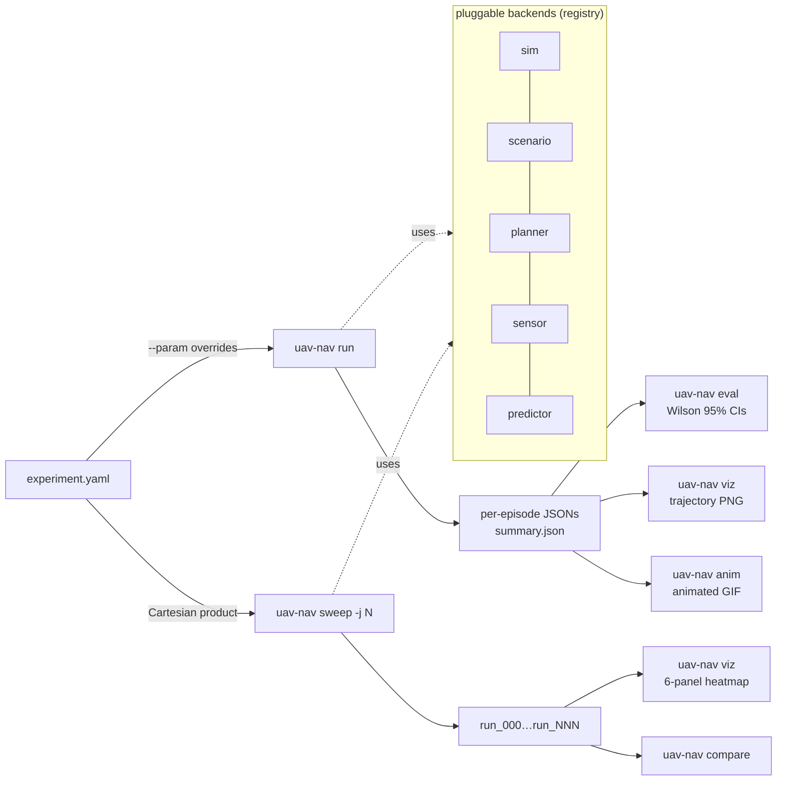

<div align="center">

# uav-nav-lab

**Python research framework for UAV motion planning.**
YAML-driven ablations with Wilson 95 % CIs by default.

> **Post-fix status (2026-05-27)**: the old race / gates / dyn4 / chaos
> dynamic-obstacle headlines were retracted after commit `1646e11` fixed
> a multi-runner bug that froze dynamic obstacles after total-wipeout
> episodes. The replacement race-simple mechanism is backed by a
> control-first n=10 check: post-goal collision scoring finishes `10/10`
> seeds, while branch sampling without post-goal scoring fails `0/10`.
> The hero below is a dynamic-gate stress/control visual: the matched
> no-sweeper ghost penetrates four moving safety halos
> (`-1.77 / -1.32 / -0.63 / -1.00 m`), while progress-weighted GPU MPPI
> dives under the closing gate, finishes `10/10` seeds (`40/40` drones),
> clears the closest halo by `+0.77 m`, and has a `6.28 m` max path
> delta in the rendered seed. The previous three-blocker stress cell is
> also confirmed at `10/10` seeds (`40/40` drones). A follow-up slot-wall
> audit found the remaining wall-boundary failures were dominated by
> static occupancy/swept-radius mismatch, not direct moving-obstacle
> contact: `inflate=1` flips three gate-wall boundary cells from `0/3`
> to `3/3`.
> This is a mechanism/stress result, not a broad benchmark claim. See
> `docs/dynamic_obstacle_oss_survey.md` and `docs/findings.md` for the
> audit trail.

[](https://github.com/rsasaki0109/uav-nav-lab/actions/workflows/ci.yml)
[](https://github.com/rsasaki0109/uav-nav-lab/actions/workflows/ci.yml)
[](https://github.com/rsasaki0109/uav-nav-lab/releases)
[](LICENSE)
[](https://github.com/rsasaki0109/uav-nav-lab/stargazers)


<i><b>Post-fix drone race dynamic-gate stress visual, zoomed at the obstacle encounter.</b>
Four drones run a horizontal oval while four red moving blockers create
a closing gate across the racing line. Red is the matched no-sweeper ghost; green is GPU MPPI
with post-goal collision scoring plus clean-reach progress weighting
(<code>w_reach_time=1000</code>, <code>w_clean_ctg=100</code>); the
dashed line is the race line. In this
<code>p19.8, y=3.5/13, v=1.5, r=1.75</code> cell with an extra
moving gate pair at <code>x=24.5</code>, the ghost enters four safety halos
by <code>-1.77 / -1.32 / -0.63 / -1.00 m</code>. The moving-obstacle run finishes
the <code>n=10</code> check with <code>10/10</code> joint success
(<code>40/40</code> drones), <code>+0.77 m</code> rendered-seed minimum
all-obstacle clearance, and a <code>6.28 m</code> max path delta. This remains a
small stress/control visual; the previous three-blocker stress cell is
confirmed at <code>10/10</code> joint success.
Rendered from real episode logs with
<code>scripts/render_race_avoidance_overlay_gif.py</code>; the stress report is
<code>docs/data/race_hero_dynamic_gate_postgoal_progress_allobs_n10.json</code>.
The other supporting n=10 reports are
<code>docs/data/race_hero_third_blocker_r3_postgoal_progress_wrt1000_wclean100_allobs_n10.json</code>,
<code>docs/data/race_hero_control_sweep_postgoal_dynbranch_n10.json</code>,
<code>docs/data/race_hero_control_variants_postgoal_dynbranch_n10.json</code>,
<code>docs/data/race_hero_control_sweep_postgoal_only_n10.json</code>, and
<code>docs/data/race_hero_control_sweep_dynbranch_n10.json</code>.
&nbsp;<a href="docs/findings.md">Findings</a>
&middot; <a href="docs/paper_a/section_3_headline.md">§3 4-mode framework</a></i>

</div>

<details>
<summary><b>🔬 Mechanism figures</b> — 4-panel fingerprint figure + predictor-fidelity sweep (E1-E5)</summary>

<br>

<br>
<i><b>Behavioral fingerprint across 4 cells</b> (v1 / 4-way / chokepoint /
wave). (a, b) trajectories overlay MPC vs MPPI in the open and the
3-intruder wave cell; (c) drone-east speed and |Δcmd| over time at
v1 ep 0 — MPC's |Δcmd| (faded red) spikes near 6 m/s while MPPI's
stays under 2.5 m/s; (d) max |Δcmd| with 1.96·SEM bars across all 4
cells × 2 planners — MPC is 2-3× larger everywhere and saturates the
per-step jump bound at the chokepoint cell. Generated by
<code>scripts/intersection_paper_figure.py</code>.</i>

<br><br>

<br>
<i><b>Predictor-fidelity sweep (wave cell, n=20, seeded predictor)</b>:
replace the perfect constant-velocity predictor with
<code>noisy_velocity</code> at σ ∈ {0.2, 0.5, 1.0, 3.0, 10.0}. Both
planners saturate at σ ≤ 1 (≥ 90% joint success) and floor at σ = 10
(MPC 5%, MPPI 10%, both within noise). The fidelity knee is sharp:
at σ = 3 MPC reaches 45% while vanilla MPPI gives 35%. The earlier
n=5 sweep that put MPPI at 4/5 vs MPC at 1/5 was a luck-of-the-draw
artifact of an unseeded predictor — see <a href="docs/findings.md">findings.md</a>
"CORRECTION (2026-05-22)" for the audit trail.</i>

<br><br>

<br>
<i><b>G: aggregator U-shape across cells at σ = 3 (n = 20)</b>.
Vanilla MPPI (t = 1.0) is the <b>worst</b> aggregator in BOTH cells —
v1 (1 slow intruder) 60% and wave (3 medium-speed intruders) 35%.
Both extremes of the U recover. The <i>optimal</i> arm is
cell-dependent: v1 is solved by near-uniform MPPI (t = 10 → <b>100%</b>,
the planner essentially returns the prior straight-to-goal), wave is
solved by argmin MPPI (t = 0.1 → 70%, the planner commits to the
single rollout with the lowest real-geometry cost). The "vanilla
softmax averages similar-cost rollouts into a phantom-evasion direction
with just enough confidence to commit but not enough to argmin out of
it" mechanism is now universal across both tested geometries.</i>

<br><br>

<br>
<i><b>J: aggregator-temperature sweep (wave cell, n=20)</b>. The
underlying single-cell sweep that motivated G — including σ = 10
chaos where every aggregator collapses to near-floor.</i>

<br>

The refined §3 framing (see <a href="docs/findings.md">findings.md</a>
for the full E1-J-G chain):
<ul>
<li><b>Success-axis switch</b>: predictor on/off (universal, deterministic — both planners drop to 0/5 with no predictor).</li>
<li><b>Success-axis fidelity gradient</b>: σ ∈ {1, 3} is the knee band on wave; outside it, success either saturates (σ ≤ 0.5) or floors (σ ≥ 10).</li>
<li><b>Aggregator U-shape</b> (universal across v1 and wave): vanilla MPPI is the structural valley at σ = 3.</li>
<li><b>Optimal aggregator depends on geometry</b>: easy cells favor prior-trust (uniform MPPI); hard cells favor cost-trust (argmin MPPI).</li>
</ul>

</details>

## 🚀 Quick start

```bash
git clone https://github.com/rsasaki0109/uav-nav-lab
cd uav-nav-lab
pip install -e '.[dev,viz]'        # numpy + pyyaml + matplotlib + pytest
# Optional: pip install -e '.[gpu]' (PyTorch for gpu_mppi), '.[rl]' (SB3)
pytest -q

uav-nav run     examples/exp_basic.yaml
uav-nav eval    results/basic_astar
uav-nav viz     results/basic_astar
```

A 2D heatmap sweep is one CLI invocation:

```bash
uav-nav sweep examples/exp_predictive.yaml \
  --param planner.horizon=20 --param planner.n_samples=16 \
  --param planner.max_speed=10,15,20,25,30 \
  --param planner.replan_period=0.1,0.2,0.5,1.0,2.0 \
  --param num_episodes=20 -j 4
uav-nav viz <out>     # → 6-panel sweep_summary.png
```

## 🛠️ CLI

| command | what |
|---|---|
| `uav-nav run <yaml>` | run all episodes, write per-episode JSONs + `summary.json` |
| `uav-nav eval <run_dir>` | recompute metrics, print Wilson 95 % CIs + planner-dt budget |
| `uav-nav compare <a> <b> ...` | side-by-side table with ± half-widths |
| `uav-nav sweep <yaml> --param k=spec` | Cartesian-product over `--param`s |
| `uav-nav viz <run_or_sweep>` | trajectory PNG per episode, or 6-panel sweep heatmap |
| `uav-nav anim <run_dir>` | animated GIF replay (2D) |
| `uav-nav video <run_dir>` | ffmpeg AirSim camera frames into per-episode MP4 |
| `uav-nav list` | enumerate registered planners / sensors / sims / scenarios |

`--param` syntax: `start:stop:step`, `a,b,c`, `[3,0]`, `true` / `false`, and
dotted keys like `planner.predictor.velocity_noise_std=0.0,0.5,1.0`.

## 🏗️ Architecture



| kind | shipped |
|---|---|
| sim | `dummy_2d`, `dummy_3d`, `airsim`, `ros2` |
| scenario | `grid_world`, `voxel_world`, `multi_drone_{grid,voxel,aerobatic}` |
| planner | `astar`, `straight`, `mpc`, `mppi`, `cvar_mppi`, `gpu_mppi`, `rrt`, `rrt_star`, `chomp`, `mpc_chomp`, `warmup_select_mppi` |
| sensor | `perfect`, `delayed`, `kalman_delayed`, `lidar`, `noisy_tracker`, `pointcloud_occupancy`, `depth_image_occupancy` |
| predictor | `constant_velocity`, `noisy_velocity`, `kalman_velocity`, `game_theoretic`, `constant_turn` |

Dynamic obstacles support `policy: linear` (constant velocity, the default),
`pursue` (steers toward the nearest drone), and `intercept` (proportional-
navigation lead) — see `examples/exp_pursuit_evasion_mppi.yaml`, and
`scripts/pursuit_prediction_speed_phase.py` for the honest study of when
anticipating the hunter actually helps (it is gated by escapability). Per-episode
`start_jitter`/`vel_jitter` diversify an obstacle's spawn (keyed on the seed, so
replays reproduce), and `obstacles.rects: [[x0,y0,x1,y1], …]` declares filled
wall blocks without enumerating cells. Paired baseline-vs-proposed sweeps can be
ranked into a GIF-worthy "hero cell" by `scripts/find_hero_cells.py`
(McNemar-gated drama score).

The `noisy_tracker` sensor reports each dynamic obstacle's position with a fixed
delay plus Gaussian position/velocity noise — the first sensor that makes a
moving threat's *current* state uncertain (the others report obstacles at ground
truth). This is the regime where a forecast actually errs, so it is where a
risk-aware planner can matter. Honest finding: in the
`exp_corridor_tracker_{mppi,cvar_mppi}.yaml` pinch-corridor pair (n=200, paired
by seed), CVaR-MPPI cuts collisions ~30% (15.0%→10.5%) and nudges success
76.0%→79.0%, but the success gain is **not** statistically significant
(McNemar c=15/b=9, p≈0.31) and trades a little throughput for timeouts — risk
aversion buys fewer crashes at a small, non-significant cost, not a headline win.
A 3-arm noise sweep (`scripts/corridor_cvar_noise_phase.py`, n=80/cell) then
decomposes *where* and *why* the edge exists: it is largest when the sensor is
good and **erodes to nothing** as actual noise outgrows the planner's assumed
spread; and a risk-*neutral* ensemble (`risk_alpha=1.0`, just averaging the 12
sampled futures) captures essentially the whole collision reduction — the
worst-10% CVaR tail adds nothing significant (all p≥0.25). The lever is
Monte-Carlo forecast ensembling, not the risk tail. See
[`docs/findings.md`](docs/findings.md#cvar-mppi-decomposition-the-win-is-forecast-ensembling-not-the-risk-averse-tail).

Add a backend by dropping a file with `@REGISTRY.register("name")` and a
`from_config(cfg)` classmethod — the CLI picks it up via `type: name`.

## 📊 Research findings

Full long-form write-ups in [`docs/findings.md`](docs/findings.md);
the working paper draft is under [`docs/paper_a/`](docs/paper_a/). The
active findings are grouped this way:

- **Latest: a sensor's field of view costs more than its range, and the gap is
  structural** — a buried YAML number claimed a forward 90° depth camera reaches
  the goal 30 pp less often than an omni 8 m LiDAR at the same compute. Proven,
  decomposed, and swept over obstacle density (n=100/cell, paired McNemar): the
  **FOV cost (omni→depth) is huge and significant at every density** (−15 to −60
  goal-reaches/100, p<1e-4 throughout, present even at sparse clutter), while the
  **range cost (perfect→omni) is negligible until clutter is dense** (non-sig
  below count 50, growing to −30 pp by count 100). With `memory` occupancy the
  forward camera never maps what stays outside its cone, so A* routes through
  "unknown=free" cells and collides — no planner smarts recover what the sensor
  never surfaced. Angular coverage ≫ range for cluttered navigation. See
  `scripts/sensor_fov_density_phase.py`.
- **A three-way predictor shootout, and an offline "crossover" that
  refuses to cross** — under noisy velocity `constant_turn` (model the curve)
  decays, so the natural counter is `kalman_velocity` (ignore the velocity
  field, filter motion from clean positions — structurally noise-immune).
  Offline forecast error promises a clean crossover (kalman overtakes
  constant_turn past velocity_noise ≈0.2). The closed-loop sweep at the cliff
  (hunter 2.85, n=60) says otherwise: clean, `constant_turn` strictly dominates
  (63% vs kalman 22%, p=2e-5; kalman ties the straight-line baseline — discarding
  velocity discards the turn signal). Noisy, the curve-modeller's edge goes
  non-significant while kalman holds a flat ~22% and keeps a *baseline* edge —
  but the direct `constant_turn` vs `kalman_velocity` head-to-head is a **tie at
  every noisy level** (p=0.33–0.70). The promised crossover never materializes.
  Third sighting of the lesson: a steady-ω offline metric can manufacture a
  between-method crossover the planner never realizes. See
  `scripts/predictor_noise_shootout.py`.
- **The constant-turn win survives only mild sensor noise, and its
  `smoothing` knob does not rescue it** — re-running the cliff cell under
  `noisy_tracker` (corrupting only the velocity channel `constant_turn` reads its
  turn rate from), the evasion win holds at velocity_noise_std 0.1 (5%→27%,
  p=1e-3, a 5× lift) then decays to the floor by ≥0.2. An offline forecast-error
  check on a *steady* turn said lowering `smoothing` should help under noise; the
  closed loop against the *maneuvering* hunter says the opposite — the responsive
  default leads at every noise level (head-to-head p≥0.16). Sharper lesson:
  offline accuracy measured on a stationary surrogate can recommend the wrong
  knob outright, because the variance/lag tradeoff inverts on a maneuvering
  target. The prior section's `smoothing`-under-noise advice is retracted.
- **A constant-turn predictor wins exactly where forecast accuracy
  binds** — the new `constant_turn` predictor estimates a curving obstacle's turn
  rate from its velocity rotation and rolls it along an arc (it cuts the
  intercept hunter's 1 s forecast error ~60–90% vs constant velocity). A paired
  hunter-speed sweep (both arms predicting; only the model differs) shows it is a
  *wash* in the easy band (both ~97%, the safety margin absorbs the sub-metre CV
  error) and null where escape is impossible — but a large, significant win right
  at the escapability cliff (hunter speed 2.85: 18%→63%, McNemar c=29/b=2,
  p<1e-4), where the ~0.5 m CV forecast error is the difference between dodging
  and being caught. Better forecasts only matter when accuracy is the binding
  constraint.
- **Pursuit-evasion — prediction's value is gated by escapability** —
  a paired hunter-speed sweep shows that anticipating an `intercept` hunter
  (`use_prediction`) is a large, significant evasion win *only while the hunter
  is slower than the drone*: at hunter speed 2.7 it lifts escape 50%→97% (strict
  Pareto, McNemar c=28/b=0, p<1e-4), but once the hunter reaches the drone's own
  max_speed the chase is unwinnable and the edge is null (p≥0.5). The shipped
  example was non-discriminating for the *opposite* reason to the crossing — a
  deterministic 0→100% blowout with zero seed variance — fixed by injecting
  obstacle `start_jitter` so each seed is a different chase.
- **Game-theoretic peer predictor is a real, significant crossing win** —
  a paired max_accel sweep on a 2-drone crossing shows `game_theoretic` reaches
  100% joint success at every accel level and never loses a paired seed (strict
  Pareto), while `constant_velocity` drops to ~88% in the mid-accel band where
  the gap is significant (McNemar c=7/b=0, p=0.0156). Required first fixing the
  shipped example, which was non-discriminating (symmetry + seed-invariance made
  both predictors collide 100%); a new `start_jitter` knob breaks the mirror.
- **CVaR-MPPI decomposition — the safety win is forecast ensembling,
  not the risk tail** — a 3-arm, 5-noise-level paired sweep on the noisy-tracker
  pinch corridor shows the collision reduction over risk-neutral MPPI is largest
  when perception is good and vanishes as noise outgrows the assumed spread; and
  a risk-*neutral* ensemble (averaging the sampled futures) captures the whole
  effect — the worst-10% CVaR tail is a non-significant refinement (all p≥0.25).
- **GPU MPPI softmax provenance and temperature counterfactual in a
  moving-obstacle race** —
  after the `1646e11` dynamic-obstacle fix, a re-tuned race-simple
  split cell now has planner-internal provenance. GPU MPPI sees a
  clean escape rollout, but the vanilla softmax average emits the
  actual velocity command back toward the moving obstacle. Lowering
  the same GPU MPPI controller's temperature flips the closed-loop
  outcome from deterministic contact to clean completion.
- **Static multi-drone coordination** — MPC argmin and GPU MPPI softmax
  can tie on joint success while producing different failure clustering
  (`Δ` over the independent-drone baseline). The sign depends on the
  `(N, density)` cell, so the result is a mechanism claim, not a
  universal planner ranking.
- **AirSim transferability** — the same coordination mechanism appears
  under AirSim physics, but dense static-cube cells can reverse which
  planner clusters failures. Absolute winner claims are treated as
  environment-sensitive.
- **Planner / sim framework** — YAML-driven paired runs cover CPU MPC,
  GPU MPPI, sampling planners, CHOMP variants, AirSim, ROS 2, and
  AirSim-over-ROS-2 parity checks.
- **Dynamic-obstacle race studies** — old race / gates / dyn4 / chaos
  numbers remain retracted after the `1646e11` multi-runner fix. The
  new race-simple phase cell is a replacement mechanism study, not a
  revival of the old headline table.
- **Methodology** — Wilson 95 % CIs by default, McNemar paired tests
  for matched-seed comparisons, and Pareto-cell re-validation before
  making ablation claims.

<br>
<i><b>Race-simple phase mechanism (post-fix)</b> — in the split band
<code>p19.8, y=5.375/34.625</code> and
<code>p19.8, y=5.50/34.50</code>, paired MPC succeeds while GPU MPPI
collides. Action provenance at the pre-contact replan shows the
step command is exactly the vanilla softmax action
(<code>cmd_vs_chosen=0</code>, <code>chosen_vs_softmax=0</code>).
The highest-weight / argmin rollout escapes
(<code>y=+3.61 m/s</code>), but the softmax command points toward the
obstacle (<code>y=-1.51 m/s</code>) because 61.9 % of the weight mass
lies on negative-y actions. Reproduce with
<code>scripts/run_race_simple_phase_sweep.py --gpu-log-action-provenance</code>
and <code>scripts/analyze_race_simple_action_provenance.py</code>.</i>

<br>
<i><b>Race-simple temperature counterfactual</b> — same split cell,
same GPU MPPI rollout/cost stack, only the softmax temperature changes.
The existing vanilla baseline is <code>t=1.0</code>, 0/10 joint
success, 10 dynamic-obstacle env contacts, and 20 follow-on peer
contacts. Fresh low-temperature reruns at <code>t=0.3</code>,
<code>t=0.1</code>, and <code>t=0.001</code> are each 3/3 joint
success and 12/12 drone-episodes, with no env or peer collisions.
This is a targeted counterfactual, not yet an n=30 paper-grade rate
claim; reproduce with
<code>scripts/race_simple_temperature_counterfactual.py</code>.</i>

<details>
<summary><b>Companion hero GIFs</b> — multi-drone Δ-flip and single-drone 3D MPPI</summary>

<br>
<i><b>§3 mode 1 multi-drone Δ-flip</b> (N=4 paired n=100, dummy_3d):
joint tied at 78 / 77 %, coordination Δ over indep⁴ separates by an
order of magnitude — MPC <b>+0.8 pp</b> vs GPU MPPI <b>+11.4 pp</b>.
GPU MPPI's softmax against a shared peer-prediction world model
clusters failures within seeds rather than spreading them.</i>

<br><br>

<br>
<i><b>3D MPC vs GPU MPPI</b> single-drone navigation: rollout cloud
visible on the GPU MPPI side (light-blue spaghetti), single committed
trajectory on the MPC side. Both succeed; the visual shows the
algorithmic signature of each aggregator.</i>

</details>

<details>
<summary>⚠️ <b>Retracted dynamic-obstacle GIFs and the replacement race-simple cell</b></summary>

The original race / gates / dyn4 / chaos GIFs were rendered against
the frozen-obstacle bug (fixed in <code>1646e11</code>). Re-runs with
the fix show those scenarios as designed are <b>uniformly 100 %
collision for every planner</b> — the moving-gate gap closes faster
than the planner's 0.4 s lookahead can detour around, and likewise
for the path-intersecting intruders. The "MPC vs softmax" contrast
on those scenarios was an artifact of the bug, not a real
planner-level finding.

The current hero GIF (<code>race_hero_dynamic_gate_progress_allobs.gif</code>
at the top of the README) is not one of the invalidated old race GIFs.
It is rendered from the post-fix race-simple control sweep: the track,
four moving blockers, no-sweeper ghost, and progress-weighted GPU MPPI
run all come from real episode logs. The decisive scoring change remains
post-goal collision scoring: race lookahead goals no longer mask
collisions later in the MPPI horizon. The newer hero also adds
clean-reach progress weighting so the avoiding trajectory stays closer
to the race line, then adds a moving gate pair so the obstacle avoidance
reads directly in the GIF. The slot-wall follow-up is intentionally kept as a mechanism figure in
<code>docs/findings.md</code>, not as the README hero: it showed that
inflating static occupancy by one grid cell resolves three narrow
gate-wall boundary cells that were previously <code>0/3</code>.
The earlier
4-way intersection speed-cut (<code>compare_intersection_4way_speed.gif</code>)
is retained as a companion coordination visual, but it is no longer
the README hero because it is not a race. The original gates4 / chaos /
dyn4 scenarios still need further re-tuning (wider gaps, slower gates)
before their GIFs go back up.

The replacement race-simple phase cell is now a mechanism result rather
than a headline win/loss table. The latest hero stress cell has the
matched no-sweeper ghost enter four safety halos by
<code>-1.77 / -1.32 / -0.63 / -1.00 m</code>, while the moving-obstacle run succeeds
jointly with <code>+0.77 m</code> minimum all-obstacle clearance. Branch
samples and action provenance are logged under
<code>replans[].planner_meta</code> when
<code>planner.log_action_provenance</code> is enabled.

</details>

<details>
<summary><b>More demos</b> — aerobatic loop, multi-drone Δ-flip, AirSim</summary>

<table>
<tr><td></td></tr>
<tr><td align="center"><i>§3 mode 4 — aerobatic loop, GPU MPPI delivers 84 % tighter phase sync.</i></td></tr>
<tr><td></td></tr>
<tr><td align="center"><i>§3 mode 1 — joint tied at 78 / 77 %, Δ over indep⁴ +0.8 vs <b>+11.4 pp</b>.</i></td></tr>
<tr><td></td></tr>
<tr><td align="center"><i>AirSim multi-drone FPV — MPC vs GPU MPPI through the same Blocks scenario.</i></td></tr>
</table>

</details>

## ✅ Status

v0.2.0 is tagged; CI runs on Python 3.10 / 3.11 / 3.12. The current
stack includes 4 sim backends, 7 sensors, 4 predictors, 11 planners, and
5 scenario families. Stable ablations are reproducible from the example
YAMLs and scripts; the current dynamic-obstacle hero is
`race_hero_dynamic_gate_progress_allobs.gif`, rendered from the
post-fix race-simple control sweep. The latest post-fix race-simple work
adds post-goal collision scoring for short race lookahead goals,
clean-reach progress weighting, planner-internal provenance, an n=10
control-first check, scoring-vs-branch ablations, and a slot-wall
swept-radius audit where `inflate=1` turns three gate-wall boundary cells
from `0/3` to `3/3`. The older race / gates4 / dyn4 / chaos
scenarios remain retracted after the `1646e11` bug fix.

**External backends:**

- **AirSim** (`uav_nav_lab/sim/airsim_bridge/`) — ENU ↔ NED bridge
  with deterministic stepping (`simPause` + `simContinueForTime`),
  multi-vehicle, LiDAR / cameras / depth, mock-injectable client for
  CI. See `examples/exp_airsim_*.yaml`.
- **ROS 2** (`uav_nav_lab/sim/ros2_bridge/`, requires `rclpy`) —
  Twist + Odometry round-trip, sim-time anchoring via `/clock`,
  AirSim-over-ROS-2 parity. See `examples/exp_ros2*.yaml`.

## 📄 License

Apache-2.0.
