# Research findings

These are the long-form studies behind the framework — full tables,
ablation reasoning, and methodological takeaways. The README's
[headline result](../README.md#-planner-head-to-head-on-dynamic-obstacles)
(planner head-to-head on dynamic obstacles) is the entry point; this
file collects the rest.

Each finding lives in the comment header of the YAML that produces it,
along with a one-line `uav-nav sweep` invocation that reproduces it.
Wilson 95 % intervals on rates, mean ± 1.96·SEM on continuous metrics.

**2026-05-22 dynamic-obstacle invalidation + intersection re-tune.**
Commit `1646e11` fixed a multi-runner bug that could leave dynamic
obstacles frozen after a total-wipeout episode. The affected pre-fix
sections are retained below as historical debugging notes, but their
numbers must not be cited as planner evidence until the scenarios are
re-tuned and rerun: the dummy_3d moving-obstacle speed sweep, Smart
MPPI v1-v5 dynamic cells, and the race / gates / chaos / dyn4
dynamic-obstacle scenarios. Post-fix replacement evidence now has two
tracks: the [race-simple phase cell](#race-simple-phase-cell-softmax-provenance-and-temperature-counterfactual)
isolates a GPU MPPI softmax aggregation failure with action provenance
and a temperature-only counterfactual, while
[Intersection coordination](#intersection-coordination-visible-mpc-stop-vs-mppi-swerve-under-a-dynamic-intruder)
is the visible avoidance demo where both planners succeed and choose
different strategies.

## Contents

- [MPC compute Pareto](#mpc-compute-pareto)
- [3D Pareto: the n_samples preference flips](#3d-pareto-the-n_samples-preference-flips)
- [3D perception-latency cliff: same corner, softened](#3d-perception-latency-cliff-same-corner-softened)
- [Pareto config materially rewrites prior conclusions](#pareto-config-materially-rewrites-prior-conclusions)
- [Multi-drone N-scaling and peer-prediction coordination](#multi-drone-n-scaling-and-peer-prediction-coordination)
- [3D escape volume erases the coordination Δ](#3d-escape-volume-erases-the-coordination-δ)
- [3D density ablation: bring escape volume back to non-trivial — Δ comes back too](#3d-density-ablation-bring-escape-volume-back-to-non-trivial--δ-comes-back-too)
- [3D peer-prediction ablation: removing CV prediction is worse than 8× obstacle density](#3d-peer-prediction-ablation-removing-cv-prediction-is-worse-than-8-obstacle-density)
- [Wind miscalibration: planner belief must match sim reality](#wind-miscalibration-planner-belief-must-match-sim-reality)
- [The perception-latency cliff: a four-step research saga](#the-perception-latency-cliff-a-four-step-research-saga)
- [MPC + CHOMP smoothing: layering on a saturated planner is a wash](#mpc--chomp-smoothing-layering-on-a-saturated-planner-is-a-wash)
- [Action-jump cost: tuning the existing knob beats every layer](#action-jump-cost-tuning-the-existing-knob-beats-every-layer)
- [AirSim vs dummy_3d transferability: same plan, different physics](#airsim-vs-dummy_3d-transferability-same-plan-different-physics)

- [GPU MPPI: post-goal-mask fix unlocks long-horizon cells, 3D MPPI beats 3D MPC](#gpu-mppi-post-goal-mask-fix-unlocks-long-horizon-cells-3d-mppi-beats-3d-mpc)
- [Temperature ablation at the 3D Pareto cell: the CPU rules don't transfer](#temperature-ablation-at-the-3d-pareto-cell-the-cpu-rules-dont-transfer)
- [Multi-drone: GPU MPPI's rollout cloud flips the coordination Δ](#multi-drone-gpu-mppis-rollout-cloud-flips-the-coordination-δ)
- [dummy_3d N-scaling paired (MPC vs GPU MPPI, N ∈ {2, 3, 4, 6, 8, 10, 12})](#dummy_3d-n-scaling-paired-mpc-vs-gpu-mppi-n--2-3-4-6-8-10-12)
- [dummy_3d density × planner sweep at N ∈ {4, 6, 8}: §3 mechanism is conditional on per-drone tie](#dummy_3d-density--planner-sweep-at-n--4-6-8-3-mechanism-is-conditional-on-per-drone-tie)
- [invalidated: dummy_3d N=4 + moving obstacle speed sweep](#dummy_3d-n4--moving-obstacle-speed-sweep-gpu-mppis-softmax-averaging-is-catastrophic-under-dynamic-obstacles)
- [AirSim + GPU MPPI parity: planner portable, dummy_3d plan-time advantage lost](#airsim--gpu-mppi-parity-planner-portable-dummy_3d-plan-time-advantage-lost)
- [AirSim multi-drone parity: stack runs end-to-end, timing spread still visible at 4/4](#airsim-multi-drone-parity-stack-runs-end-to-end-timing-spread-still-visible-at-44)
- [AirSim multi-drone n=30 paired: planner portable, scenario ceiling-limited, timing-spread signal preserved](#airsim-multi-drone-n30-paired-planner-portable-scenario-ceiling-limited-timing-spread-signal-preserved)
- [AirSim multi-drone uniform-altitude n=30: GPU MPPI collapses to 0 % joint while MPC holds 46.7 %](#airsim-multi-drone-uniform-altitude-n30-gpu-mppi-collapses-to-0--joint-while-mpc-holds-467-)
- [AirSim multi-drone ±1 m mid-stagger n=30: still ceiling-limited, cliff between 0 and 1 m](#airsim-multi-drone-1-m-mid-stagger-n30-still-ceiling-limited-cliff-between-0-and-1-m)
- [AirSim multi-drone static-cube discriminating cell n=30: GPU MPPI clears every seed while MPC drops paired seeds](#airsim-multi-drone-static-cube-discriminating-cell-n30-gpu-mppi-clears-every-seed-while-mpc-drops-paired-seeds)
- [AirSim multi-drone base_ew06 density-sweep n=30: Δ-flip sign reverses — MPC is the clustering planner on AirSim](#airsim-multi-drone-base_ew06-density-sweep-n30-δ-flip-sign-reverses--mpc-is-the-clustering-planner-on-airsim)
- [AirSim dynamic-obstacle bridge extension (smoke verified, paired cell still tuning)](#airsim-dynamic-obstacle-bridge-extension-smoke-verified-paired-cell-still-tuning)
- [invalidated: Smart MPPI (argmin-fallback)](#smart-mppi-argmin-fallback-mechanism-detector-works-naive-fix-doesnt)
- [invalidated: Smart MPPI v2 (asymmetric perturbation)](#smart-mppi-v2-asymmetric-perturbation-breaks-softmax-symmetry-helps-the-planner-swap-regime)
- [invalidated: Smart MPPI v3 (temporally-coherent argmin commit)](#smart-mppi-v3-temporally-coherent-argmin-commit-trades-mode-1-success-for-swap-regime-stability)
- [invalidated: Smart MPPI v4 (mode-aware sampling)](#smart-mppi-v4-mode-aware-sampling-the-first-variant-that-cracks-the-cancellation-regime)
- [invalidated: Drone race + bouncing intruder](#drone-race--bouncing-intruder-smart-mppi-v4-recovers-mpc-level-safety-without-losing-tracking-precision)
- [invalidated: Moving-gates race](#moving-gates-race-the-mirror-image--softmax-wins-where-it-lost-the-single-intruder-race)
- [invalidated: Drone race chaos](#drone-race-chaos--gates--intruders-piled-on-gate-topology-still-dominates)
- [invalidated: dyn4 path-intersecting intruders](#dyn4-path-intersecting-intruders-controlled-dynamic-avoidance-harness)
- [Cost-to-go cache tolerance: 4-5x speedup on moving-goal scenarios](#cost-to-go-cache-tolerance-4-5x-speedup-on-moving-goal-scenarios)
- [invalidated: Smart MPPI v5 (mode-aware switcher)](#smart-mppi-v5-mode-aware-switcher-lateral-cancellation-gate-dominates-v4-on-45-cells)
- [Race-simple phase cell: softmax provenance and temperature counterfactual](#race-simple-phase-cell-softmax-provenance-and-temperature-counterfactual)
- [Intersection coordination: visible MPC stop vs MPPI swerve under a dynamic intruder](#intersection-coordination-visible-mpc-stop-vs-mppi-swerve-under-a-dynamic-intruder)
- [Aerobatic synchronized loop: GPU MPPI's softmax delivers 85 % tighter phase sync](#aerobatic-synchronized-loop-gpu-mppis-softmax-delivers-85--tighter-phase-sync)
- [Bridge fix: pause-after-reset eliminates a stale-t=0 collision flag](#bridge-fix-pause-after-reset-eliminates-a-stale-t0-collision-flag)
- [ROS 2 bridge: spatial equivalence verified](#ros-2-bridge-spatial-equivalence-verified)
- [AirSim over ROS 2 parity harness](#airsim-over-ros-2-parity-harness)
- [RL comparison baseline: gym.Env scaffold + initial training](#rl-comparison-baseline-gymenv-scaffold--initial-training)
- [CVaR-MPPI decomposition: the win is forecast ensembling, not the risk-averse tail](#cvar-mppi-decomposition-the-win-is-forecast-ensembling-not-the-risk-averse-tail)
- [Game-theoretic peer predictor: a real, significant crossing win](#game-theoretic-peer-predictor-a-real-significant-crossing-win-after-fixing-a-non-discriminating-example)
- [Pursuit-evasion: prediction's value is gated by escapability](#pursuit-evasion-predictions-value-is-gated-by-escapability)
- [Constant-turn predictor: a better forecast wins only where accuracy binds](#constant-turn-predictor-a-better-forecast-wins-only-where-accuracy-binds)
- [Constant-turn under noisy velocity: the win decays, and smoothing does not rescue it](#constant-turn-under-noisy-velocity-the-win-decays-and-smoothing-does-not-rescue-it)
- [Predictor shootout: model the curve, filter it out, or trust it — and the crossover that does not cross](#predictor-shootout-model-the-curve-filter-it-out-or-trust-it--and-the-crossover-that-does-not-cross)
- [Sensor field of view: the blind-spot cost is structural and dominates the range cost](#sensor-field-of-view-the-blind-spot-cost-is-structural-and-dominates-the-range-cost)
- [RRT* rewiring is a closed-loop liability: the optimal path collides more](#rrt-rewiring-is-a-closed-loop-liability-the-optimal-path-collides-more)
- [The classical-planner ladder is a clearance ladder, and the buried mechanism stories are both wrong](#the-classical-planner-ladder-is-a-clearance-ladder-and-the-buried-mechanism-stories-are-both-wrong)
- [CHOMP's explicit clearance band has a sweet spot — but the cap breaks only when you seed it with RRT](#chomps-explicit-clearance-band-has-a-sweet-spot--but-the-cap-breaks-only-when-you-seed-it-with-rrt)
- [Goal-aware peer prediction wins head-on and inverts to a liability on the symmetric swap](#goal-aware-peer-prediction-wins-head-on-and-inverts-to-a-liability-on-the-symmetric-swap)
- [A decentralized right-of-way lateral bias lifts the antipodal swap to 100 %](#a-decentralized-right-of-way-lateral-bias-lifts-the-antipodal-swap-to-100-)
- [The right-of-way bias is safe everywhere and general to head-on convergence](#the-right-of-way-bias-is-safe-everywhere-and-general-to-head-on-convergence)
- [The goal-aware peer-predictor win is bimodal in encounter angle](#the-goal-aware-peer-predictor-win-is-bimodal-in-encounter-angle)
- [Right-of-way substitutes for the predictor at head-on, but not at the perpendicular crossing](#right-of-way-substitutes-for-the-predictor-at-head-on-but-not-at-the-perpendicular-crossing)
- [More-frequent replanning is never counterproductive — the replan_period "commitment" is not a safety mechanism](#more-frequent-replanning-is-never-counterproductive--the-replan_period-commitment-is-not-a-safety-mechanism)
- [The antipodal predictor inversion is a 2D artifact — the vertical escape axis dissolves it, and at high density flips the predictor's sign](#the-antipodal-predictor-inversion-is-a-2d-artifact--the-vertical-escape-axis-dissolves-it-and-at-high-density-flips-the-predictors-sign)
- [Heterogeneous predictor swarms break the antipodal deadlock by desync, not by diversity](#heterogeneous-predictor-swarms-break-the-antipodal-deadlock-by-desync-not-by-diversity)
- [The 3D cv collapse is an N=6 symmetry resonance, not a density wall — a goal-blind right-of-way bias rescues it](#the-3d-cv-collapse-is-an-n6-symmetry-resonance-not-a-density-wall--a-goal-blind-right-of-way-bias-rescues-it)
- [The even-N antipodal resonance recurs at N=8 — there the forecast fails too, and the convention turns harmful where there is no deadlock](#the-even-n-antipodal-resonance-recurs-at-n8--there-the-forecast-fails-too-and-the-convention-turns-harmful-where-there-is-no-deadlock)
- [The right-of-way convention is robust to speed heterogeneity — a 4×-mismatched fleet still rounds the hub](#the-right-of-way-convention-is-robust-to-speed-heterogeneity--a-4-mismatched-fleet-still-rounds-the-hub)
- [The right-of-way convention has a density cliff — but a stronger bias pushes it out](#the-right-of-way-convention-has-a-density-cliff--but-a-stronger-bias-pushes-it-out)
- [The 3D antipodal collapse is a non-monotone resonance, not the even-N law](#the-3d-antipodal-collapse-is-a-non-monotone-resonance-not-the-even-n-law)
- [The right-of-way convention needs near-full adoption — free-riders break it, and tolerance shrinks with density](#the-right-of-way-convention-needs-near-full-adoption--free-riders-break-it-and-tolerance-shrinks-with-density)
- [The convention cliff is hub density, not drone count — N and R collapse onto N/R](#the-convention-cliff-is-hub-density-not-drone-count--n-and-r-collapse-onto-nr)
- [Once the right-of-way convention is on, the predictor is free — cv and gt become identical](#once-the-right-of-way-convention-is-on-the-predictor-is-free--cv-and-gt-become-identical)
- [ORCA is the missing reciprocal baseline, and the right-of-way convention generalises to it](#orca-is-the-missing-reciprocal-baseline-and-the-right-of-way-convention-generalises-to-it)
- [A pairwise winding-number right-of-way strictly dominates the global veer-right](#a-pairwise-winding-number-right-of-way-strictly-dominates-the-global-veer-right)
- [The right-of-way convention is a peer rule — a hub-crossing obstacle defeats the roundabout it builds](#the-right-of-way-convention-is-a-peer-rule--a-hub-crossing-obstacle-defeats-the-roundabout-it-builds)
- [On ORCA too, a pairwise right-of-way removes the global rule's over-rotation timeout cliff](#on-orca-too-a-pairwise-right-of-way-removes-the-global-rules-over-rotation-timeout-cliff)
- [BVC and CBF: the convention rescues two more reactive families, and BVC needs a dynamics-aware buffer](#bvc-and-cbf-the-convention-rescues-two-more-reactive-families-and-bvc-needs-a-dynamics-aware-buffer)
- [The 3-D dissolution of the antipodal deadlock is a planner property, not a geometric one](#the-3-d-dissolution-of-the-antipodal-deadlock-is-a-planner-property-not-a-geometric-one)
- [Pairwise's dominance over the global convention inverts under a hub-crossing obstacle](#pairwises-dominance-over-the-global-convention-inverts-under-a-hub-crossing-obstacle)
- [In 3-D the in-plane convention rescues the reactive planner the extra dimension could not](#in-3-d-the-in-plane-convention-rescues-the-reactive-planner-the-extra-dimension-could-not)
- [Two reciprocal collision avoiders are less safe mixed than either is alone](#two-reciprocal-collision-avoiders-are-less-safe-mixed-than-either-is-alone)
- [On the symmetric hub, mixing reciprocal controllers HELPS — protocol heterogeneity is double-edged](#on-the-symmetric-hub-mixing-reciprocal-controllers-helps--protocol-heterogeneity-is-double-edged)
- [The right-of-way convention is paradigm-agnostic — it rescues even non-reciprocal APF](#the-right-of-way-convention-is-paradigm-agnostic--it-rescues-even-non-reciprocal-apf)
- [Under noisy peer sensing the reactive ranking inverts — the soft field outlasts the tight geometry](#under-noisy-peer-sensing-the-reactive-ranking-inverts--the-soft-field-outlasts-the-tight-geometry)
- [There is no universal reactive robustness ranking — each method dies of its own sensing dependence](#there-is-no-universal-reactive-robustness-ranking--each-method-dies-of-its-own-sensing-dependence)
- [Sensing-independence is not robustness: the peer-aware convention pulls further ahead under noise](#sensing-independence-is-not-robustness-the-peer-aware-convention-pulls-further-ahead-under-noise)
- [The convention generalises to the doorway bottleneck — but only if the gap fits a lane](#the-convention-generalises-to-the-doorway-bottleneck--but-only-if-the-gap-fits-a-lane)
- [The price of the convention: a cheap roundabout, and a speed-vs-reliability split between the two rules](#the-price-of-the-convention-a-cheap-roundabout-and-a-speed-vs-reliability-split-between-the-two-rules)
- [Explicit roundabout (Merry-Go-Round) vs implicit convention: density-invariant scaling at a fixed time premium](#explicit-roundabout-merry-go-round-vs-implicit-convention-density-invariant-scaling-at-a-fixed-time-premium)
- [The hub-obstacle cap is temporal for a transient obstacle, spatial for a recurring one](#the-hub-obstacle-cap-is-temporal-for-a-transient-obstacle-spatial-for-a-recurring-one)
- [The Merry-Go-Round ring radius is a capacity-vs-speed knob — and there is a floor](#the-merry-go-round-ring-radius-is-a-capacity-vs-speed-knob--and-there-is-a-floor)
- [Priority deconfliction fails the symmetric hub — it trades deadlock for collision](#priority-deconfliction-fails-the-symmetric-hub--it-trades-deadlock-for-collision)
- [Sensing noise restores the predictor's relevance under the convention](#sensing-noise-restores-the-predictors-relevance-under-the-convention)
- [Priority fails the doorway too — correcting the "priority is for sequential conflicts" conjecture](#priority-fails-the-doorway-too--correcting-the-priority-is-for-sequential-conflicts-conjecture)
- [The convention is a consensus device — a split right/left rule is worse than no rule](#the-convention-is-a-consensus-device--a-split-rightleft-rule-is-worse-than-no-rule)
- [The convention is for symmetric convergence only — on unstructured traffic it is a net liability](#the-convention-is-for-symmetric-convergence-only--on-unstructured-traffic-it-is-a-net-liability)
- [A sensing-defect taxonomy: noise restores the predictor under the convention, delay does not](#a-sensing-defect-taxonomy-noise-restores-the-predictor-under-the-convention-delay-does-not)
- [The convention is robust to physical heterogeneity (size) but not to coordination heterogeneity](#the-convention-is-robust-to-physical-heterogeneity-size-but-not-to-coordination-heterogeneity)
- [Reproducing the RVO→ORCA improvement: ORCA removes RVO's oscillation (the reciprocal dance)](#reproducing-the-rvoorca-improvement-orca-removes-rvos-oscillation-the-reciprocal-dance)
## MPC compute Pareto

`examples/exp_predictive.yaml` — n_samples × horizon. The 6-panel
output of `uav-nav viz <sweep_dir>` lets you read off the success
ceiling and the compute it costs in one figure:

<p align="center">

</p>

At n=20 episodes per cell:

| n_samples \ horizon | 20 | 40 | 60 | 80 | 120 |
|---|---|---|---|---|---|
| 8   | 100 | 90  | 80 | 65 | 45 |
| 16  | **100** | 85  | 80 | 65 | 35 |
| 32  | 100 | 95  | 75 | 60 | 35 |
| 64  | 100 | 100 | 75 | 60 | 45 |
| 128 | 100 | 100 | 95 | 80 | 40 |

Sole Pareto-optimal point: **n_samples=16, horizon=20 → 100 % / 51 ms**.
Longer rollouts actively *hurt* success — the reach-goal bonus fires
less often when the rollout overshoots the goal radius mid-trajectory.

## 3D Pareto: the n_samples preference flips

<p align="center">

</p>

`examples/exp_3d_predictive.yaml` — the same n_samples × horizon sweep on
a 3D `voxel_world` (40×40×12, three bouncing 3D dynamic obstacles, n=8
post-cache):

<p align="center">

</p>

Findings vs the 2D analogue:

- **The Pareto frontier shifts to lower n_samples.** The 2D-optimal
  config (n=16, h=20 → 100 % / 51 ms in 2D) lands at only 75 % / 91 ms
  in 3D. The strongest 3D cells are **n=8, h=20 → 88 % / 70 ms** and
  n=128, h=40 → 100 % / 273 ms. Fibonacci-sphere sampling already
  covers the 3D escape directions densely enough that fewer per-step
  samples suffice — compute is better spent on horizon depth, opposite
  of 2D's preference.
- **The "longer rollouts hurt" effect partly transfers.** 2D drops
  monotonically with horizon (100 → 35 %); 3D drops more gently (most
  rows stay 75 → 38 %), but the trend is the same. The 3D escape volume
  softens but does not eliminate the reach-goal-bonus overshoot.
- **The 3D plan_dt blow-up was a Dijkstra artifact.** A first pass had
  every cell at 1.3-2.2 s — too slow to fit `replan_period=0.2 s`. The
  static cost-to-go cache (added to `SamplingMPCPlanner`) brought 3D
  plan_dt back to the same order of magnitude as 2D (70-750 ms across
  the grid), making this sweep and the cliff sweeps actually tractable.

Methodological transfer: re-validate Pareto in every dimensionality.
n_samples preference flips, the compute envelope changes, and what
looked like a CPU-saturation cliff in 3D was actually a missing cache.

## 3D perception-latency cliff: same corner, softened

Same 3D scenario, sensor.delay × max_speed sweep at the 3D Pareto config
(n_samples=8, horizon=20, n=6):

<p align="center">

</p>

|  delay \ speed  |  10  |  15  |  20  |  25  |  30  |
|---|---|---|---|---|---|
| 0.00 |  83 | 100 | 100 | 100 |  83 |
| 0.05 |  83 | 100 | 100 | 100 |  83 |
| 0.10 |  83 | 100 | 100 |  83 |  50 |
| 0.20 |  67 | 100 |  83 |  83 |  50 |
| 0.50 |  83 |  83 | **33** |  50 |  50 |

The cliff transfers from 2D to 3D in the same `delay=0.5 × speed≥20 m/s`
corner. 2D had this region at 10-25 %; 3D softens it to 33-50 % —
the extra escape volume helps but does not eliminate the failure mode.

**3D cliff remediation: the velocity_window optimum *inverts* vs 2D.**
At the 3D cliff cell (delay=0.5, speed=20, n=12):

| sensor config | succ % | CI95 |
|---|---|---|
| baseline (no extrap) | 33.3 | [13.8, 60.9] |
| `extrapolate=true, window=1` | **83.3** | [55.2, 95.3] |
| `extrapolate=true, window=3` | 66.7 | [39.1, 86.2] |
| `extrapolate=true, window=5` | 58.3 | [32.0, 80.7] |
| `extrapolate=true, window=10` | 33.3 | [13.8, 60.9] |

CV ego extrapolation is the same big lever in 3D — +50 pp at window=1,
Wilson 95 % CIs do not overlap. But **the optimum inverts**: 2D's
peak was window=5, 3D's peak is window=1. The 3D escape volume lets
the drone trace smoother trajectories, so the 1-sample finite-
difference velocity is already accurate; smoothing only adds lag,
and lag hurts most at high speed where the cliff lives.

Engineering takeaway: the *parameter setting* of a remediation does
not transfer across dimensionalities even when the *technique* does.
Always re-tune ego-extrapolation window per scenario regime.

## Pareto config materially rewrites prior conclusions

The previous heatmap on the same scenario at the YAML's old defaults
(n_samples=32, horizon=60) reported a "dynamic-feasibility cliff at
25 m/s". At the Pareto config that cliff disappears (35 – 65 % success
at speed = 25-30 m/s), and replan_period — which "barely mattered"
before — now drives a 40 – 70 pp swing across 0.1 – 2.0 s. The earlier
conclusion was partly a CPU-saturation artifact: at horizon=60 every
replan took ~200 ms, so even replan_period=0.1 s could not actually
keep up.

> **Methodological lesson** baked into the YAML header: always validate
> ablation conclusions at the planner's Pareto-optimal config —
> suboptimal MPC settings can mask both ceilings (max feasible speed)
> and sensitivities (replan-period effect, delay tolerance).

## Multi-drone N-scaling and peer-prediction coordination

<p align="center">

</p>

*N=3 multi-drone episode — alice / bob / charlie all reach their
opposite-corner goals while routing around each other via the MPC's
constant-velocity peer prediction.*

`examples/exp_multi_drone_{2,3,4,8}.yaml` — same world, only drone
count changes. n=30, joint metrics with Wilson 95 % CIs:

| N | joint succ | joint coll | per-drone succ | indep `per^N` | Δ over indep |
|---|---|---|---|---|---|
| 2 | 96.7 % [83, 99] | 3.3 %  | 98.3 % | 96.6 % | +0.1 pp |
| 3 | 70.0 % [52, 83] | 30.0 % | 87.8 % | 67.7 % | +2.3 pp |
| 4 | 73.3 % [56, 86] | 26.7 % | 87.5 % | 58.6 % | **+14.7 pp** |
| 8 | 16.7 % [7, 34]  | 83.3 % | 70.0 % |  5.8 % | **+10.9 pp** |

The MPC's constant-velocity peer prediction *correlates failures in
the right direction* — when one drone yields, the others see its new
trajectory and react, so the system as a whole degrades less than
independent drones would.

**Coordination is non-monotonic in N.** Δ peaks at N=4 (+14.7 pp) and
declines at N=8 (+10.9 pp), even though the absolute joint success
collapses from 73.3 % → 16.7 %. Two effects compound:

- **More peers → more coordination signal**, lifting Δ over the
  independence baseline (the curve from N=2 to N=4).
- **More peers → escape-volume saturation**, dropping per-drone success
  from 87 % → 70 % at N=8 and pulling joint success down faster than
  coordination can recover (the N=4 → N=8 turn).

Engineering takeaway: peer-prediction coordination has a *useful
range*, not a monotonic scaling law. For dense N you need either a
bigger world (lower density per drone) or a coordinator that goes
beyond constant-velocity prediction (priority scheduling, reservation
tables, decentralised roundabout). The framework's MPC ceiling for
this 60×60 world tops out around N=4-6; past that, peer prediction
still helps in *relative* terms but is fundamentally fighting density.

### Density ablation: the "non-monotonic in N" claim was a density artifact

`examples/exp_multi_drone_8_low_density.yaml` — the obvious follow-up
to the engineering takeaway above. Same N=8 / same crossing structure
/ same Pareto-MPC config / same 30 obstacles, but world is 100×100
instead of 60×60 (~2.8 × the area per drone, 1250 cells/drone vs 450).

| density | world | per-drone | joint | indep `per^N` | Δ over indep |
|---|---|---|---|---|---|
| high | 60×60 | 70.0 % [64, 75] | 16.7 % [7, 34] | 5.8 % | +10.9 pp |
| low | 100×100 | 82.1 % [77, 86] | **46.7 %** [30, 64] | 21.0 % | **+25.7 pp** |

Halving density (actually 2.8 ×):
- per-drone success +12 pp
- joint success +30 pp
- coordination Δ +14.8 pp (**roughly doubled**)

Refines the prior finding in two ways:

1. **The "non-monotonic in N" was a density artifact.** With
   N=8 / low-density Δ at +25.7 pp — *larger* than N=4 / high-density
   Δ at +14.7 pp — the coordination scaling law is **monotonic in N
   when density allows**. The planner's CV peer prediction continues
   to make better use of more peers, full stop.

2. **The MPC ceiling is `density × N`, not raw N.** Doubling room
   halved the per-drone collision rate (30 % → 18 %). The dip at
   N=8 in the original table reflected escape-volume saturation, not
   a fundamental coordination limit.

Engineering takeaway (refined): **density × planner capacity** is the
load-bearing axis. To deploy CV peer prediction at high N, scale the
world or shrink drone radii — the planner itself is fine. The
"non-monotonic" caveat from above survives only as a *density-saturated*
regime warning, not a scaling-law claim.

Methodological close: the same 2-step pattern as the mpc_chomp →
velocity-profile → action-jump saga. Initial finding (PR #25)
reported the surface result; follow-up ablation isolated the actual
load-bearing axis. The first finding wasn't wrong — it was
incomplete. Always ablate the engineering takeaway your previous YAML
header speculated about.

### 3D escape volume erases the coordination Δ

`examples/exp_multi_drone_3d_{2,3,4}.yaml` — same crossing pattern as
the 2D N=2/3/4 cases above, lifted to a 40×40×12 voxel_world with the
3D Pareto MPC config (n_samples=8, horizon=40). Each drone is free to
detour over or under its peers along the z-axis.

| N | dim | per-drone | joint | indep `per^N` | Δ over indep |
|---|---|---|---|---|---|
| 2 | 2D | 98.3 %  | 96.7 % [83, 99] | 96.6 % | +0.1 pp |
| 2 | 3D | 98.3 %  | 96.7 % [83, 99] | 96.6 % | +0.1 pp |
| 3 | 2D | 87.8 %  | 70.0 % [52, 83] | 67.7 % | +2.3 pp |
| 3 | 3D | 88.9 %  | 70.0 % [52, 83] | 70.2 % | -0.2 pp |
| 4 | 2D | 87.5 %  | 73.3 % [56, 86] | 58.6 % | **+14.7 pp** |
| 4 | 3D | 95.8 %  | **83.3 %** [66, 93] | 84.3 % | **-1.0 pp** |

The 2D N=4 coordination win (+14.7 pp) **disappears in 3D** even
though the absolute joint success rises (73 → 83 %). Per-drone success
jumps with it (87 → 96 %), and `independent^N` rises to match — leaving
no Δ for peer prediction to take credit for.

Mechanism: in 2D, four crossing drones share the same horizontal
plane, so peer prediction has to *pick a yielder* every time their paths
intersect. In 3D, each drone's MPC is free to lift to z=7 while a peer
slips through at z=5; the rollouts find these out-of-plane detours
independently, no peer prediction needed. The escape volume *eliminates
the coordination problem*, it doesn't just soften it.

Engineering takeaway: the value of multi-agent coordination is not
intrinsic — it's a function of how constrained the per-agent free space
is. **In 3D / open-volume regimes, "use peer prediction or not" is a
wash; in 2D / dense regimes it can be the difference between 58 % and
73 % joint success.** Same Pareto-saturation lesson as everywhere else
in this framework: a layer only earns its keep when the layer below
has slack to take from. Coordination here is the layer; per-drone
escape volume is the slack.

Methodological close: re-validate the *value* of every layer in every
new dimensionality. Coordination Δ in 2D does not predict Δ in 3D, and
the headline number (joint succ %) hides the inversion of the
load-bearing factor (escape volume vs. peer prediction).

### 3D density ablation: bring escape volume back to non-trivial — Δ comes back too

`examples/exp_multi_drone_3d_4_{dense,packed}.yaml` — same N=4 / same
3D world / same Pareto MPC, only the static obstacle count changes.
Probes whether the previous finding's "3D Δ ≈ 0" really comes from the
free-volume mechanism we attributed it to. n=30 episodes per cell.

| obstacles | density (cells/world voxel) | per-drone | joint | indep `per^4` | Δ over indep |
|---|---|---|---|---|---|
| 30  (baseline) | 0.16 % | 95.8 % | 83.3 % | 84.3 % | -1.0 pp |
| 120 (dense)    | 0.63 % | 65.8 % | 26.7 % | 18.7 % | **+8.0 pp** |
| 240 (packed)   | 1.25 % | 46.7 % | 10.0 % | 4.8 %  | **+5.2 pp** |

Pack the world with obstacles and the per-drone success collapses
(96 → 66 → 47 %), but the **coordination Δ comes back from the dead**:
−1 → +8 → +5 pp. The previous finding's mechanism — "z-axis lets each
drone find an independent detour, so peer prediction has nothing to
take credit for" — is exactly what gets undone when static obstacles
fill the air column. Two drones can no longer trivially pass at
different z; one of them yields, the other's MPC sees the yield via
peer prediction, and the system as a whole degrades less than two
independent drones would.

The Δ peaks at intermediate density and falls again at the extreme:
- **30 obstacles**: escape volume so large that drones never share
  paths — coordination has nothing to do.
- **120 obstacles**: paths overlap, but per-drone routes still exist
  most of the time — peer prediction lifts the joint rate well above
  the independence floor.
- **240 obstacles**: per-drone success crashes to 47 % from
  obstacle-only collisions; even perfect coordination cannot recover
  what the planner is already losing solo.

Universal pattern (with the 2D density ablation, N=8 60×60 vs 100×100):

> **Coordination Δ is non-monotonic in free volume per agent.**
> Both endpoints — *sparse* (independent routes available) and
> *saturated* (per-agent failure dominates) — drive Δ toward zero.
> Maximum Δ lives in the middle, where peers actually have to
> negotiate but the planner is still capable of executing the
> negotiated solution. The 2D N=8 100×100 case (Δ +25.7 pp) and the
> 3D N=4 120-obstacle case (Δ +8.0 pp) are *the same regime in
> different parameter spaces*: world-side and obstacle-side ways of
> arriving at "intermediate per-agent free volume".

Engineering takeaway: when deciding whether peer prediction is worth
the implementation cost, the right diagnostic is not "how many drones"
or "what dimensionality", it is **"how much free volume per drone
remains after static and self-imposed constraints"**. The middle is
where the layer earns its keep.

### 3D peer-prediction ablation: removing CV prediction is worse than 8× obstacle density

The previous section argues that the +8 pp Δ at the dense cell *comes
from* peer prediction earning its keep in the intermediate-density
regime. That's a causal claim, and the natural test is the direct
ablation: rerun the same dense + packed cells with `use_prediction:
false` (each drone treats peers as if they don't exist) and see what
collapses. `examples/exp_multi_drone_3d_4_{dense,packed}_indep.yaml`,
n=30 each.

| cell | per-drone (CI) | joint (CI) | Δ over `per^4` |
|---|---|---|---|
| dense (120 obs), pred ON  | 65.8 % [57.0, 73.7] | 26.7 % [14.2, 44.4] | **+8.0 pp** |
| dense (120 obs), pred OFF | 16.7 % [11.1, 24.3] |  6.7 % [1.8, 21.3]  | +6.6 pp (per^4≈0) |
| packed (240 obs), pred ON | 46.7 % [38.0, 55.6] | 10.0 % [3.5, 25.6] | +5.2 pp |
| packed (240 obs), pred OFF| 18.3 % [12.4, 26.2] |  0.0 % [0.0, 11.4] | -0.1 pp |

Two things happen when prediction goes off, and the bigger one is *not*
the joint number:

1. **Per-drone success collapses.** −49 pp at dense (66 → 17 %), −28 pp
   at packed (47 → 18 %). The crossing pairs run head-on through each
   other; without forecasting peer trajectories the MPC sees only the
   peer's *current* position, which is harmless until it isn't. Peer
   collisions count as per-drone collisions, so this ablation surfaces
   in the per-drone column rather than only the joint one.
2. **Joint success collapses harder.** Dense: 27 → 7 % (4× drop).
   Packed: 10 → 0 % (no joint episode survives at all).

The per-drone drop is the headline. Compare against the density-only
sweep from the previous finding: going from 30 obstacles → 240
obstacles (8× density) cost −49 pp of per-drone success. **Removing
peer prediction at fixed dense costs the same −49 pp.** A planner
without peer prediction faces the geometry of an 8× denser world.

Δ over `per^4` stays positive at dense_indep (+6.6 pp) only because
per-drone fell so far that the independence floor is essentially zero
— any joint success now beats it. The number is arithmetically real
but mechanistically misleading: it is not coordination paying off,
it's two drones happening to survive the same episode by chance after
both planners ignored each other. At packed_indep the chance runs out
and joint = 0 / 30.

What the dense → packed comparison still says even with prediction off:
per-drone success barely moves (17 → 18 %) when density doubles in the
no-prediction regime. The static-obstacle planning is no longer the
bottleneck; peer collisions dominate the failure budget on the
crossing-pair scenario regardless of how many obstacles are around.

Engineering takeaway: in any scenario where peers' trajectories cross,
constant-velocity peer prediction is doing more work than the MPC
horizon, the static map quality, or moderate increases in obstacle
density. It is the cheapest layer in the multi-drone stack
(milliseconds per replan to forecast N−1 peers) and it pays back
multiples of that — but only because crossing-pair scenarios punish
its absence so heavily. In a non-crossing scenario (parallel goals,
shared corridors with the same direction of travel) we'd expect this
gap to shrink toward what the previous Δ-vs-density curve already
predicted.

## Wind miscalibration: planner belief must match sim reality

`examples/exp_wind.yaml` — constant northward wind disturbance × planner
wind belief, 4 × 4 grid, n=15 episodes:

<p align="center">

</p>

|  sim_wind \ planner_wind | 0 | 3 | 6 | 9 |
|---|---|---|---|---|
| **0** | **93.3** | 60.0 | 33.3 | 20.0 |
| **3** | 66.7 | **100.0** | 53.3 | 33.3 |
| **6** | 20.0 | 66.7 | **93.3** | 66.7 |
| **9** |  0.0 |  0.0 |  0.0 |  0.0 |

The diagonal wins — matched (planner belief = sim reality) recovers
93-100 %. Mismatch in either direction hurts symmetrically: under-
correction blows the drone off course, over-correction pre-compensates
into nothing. At `sim=6 m/s`, wind awareness lifts success from **20 %
to 93 %** (+73 pp) — one of the largest single-knob wins in the
framework. But at `sim=9 m/s` against `max_speed=8 m/s` no belief
saves you: the drone literally cannot make headway and every cell in
that row is 0 %. Awareness cannot beat physics.

## The perception-latency cliff: a four-step research saga

<p align="center">

</p>

*sensor.delay × max_speed at the Pareto MPC config — success dives in
the bottom-right corner (delay=0.5 s × speed≥20 m/s) while the rest of
the grid is comfortably ≥ 80 %. That single corner is the cliff.*

A single persistent `delay=0.5 s` × `speed=15 m/s` cell on the
predictive-MPC scenario (≤ 25 % success regardless of `inflate` /
`safety_margin` tuning at the Pareto config) drove four progressive
experiments — each documented in `examples/exp_predictive.yaml`:

1. **Predictor-side delay compensation** (negative result). Adding
   `delay_compensation=0.5` to the Kalman *predictor* on the obstacle
   stream actually *hurt* success. The MPC plans against future
   obstacles using a past self.
2. **Sensor-side ego extrapolation** (`sensor.extrapolate=true`). Project
   the stale position forward by `delay` using a 1-sample finite-difference
   velocity. Lifts success in moderate-delay × moderate-speed cells by
   +15 .. +35 pp; *hurts* at delay=0 (1-step lag artifact) and at
   high-speed × high-delay (acceleration noise overshoots).
3. **Velocity-window smoothing** (`sensor.velocity_window=5`). Average
   the FD velocity over multiple sample pairs to suppress acceleration
   noise. The persistent cliff lifts from 26.7 % → 43.3 % (+17 pp) at
   the headline cell, +35-40 pp at high speed. Catch: optimum window
   depends on the speed regime — low speed prefers `=1` (no lag), high
   speed needs `=5`.
4. **Kalman ego sensor** (`sensor.type=kalman_delayed`). Honest negative
   result. Best tuning of process / measurement noise tops out at the
   no-extrap baseline (25 %); the moving-average wins. The KF assumes
   a CV motion model; under MPC's frequent re-planning the assumption
   breaks and the MA's structure-free responsiveness dominates.

Engineering takeaway: simple model-free estimators can dominate more
sophisticated ones when the motion-model assumption breaks. Picking the
estimator that *actually wins* is more useful than picking the one that
sounds fanciest — the framework is built to make that picking trivial.

## MPC + CHOMP smoothing: layering on a saturated planner is a wash

`examples/exp_compare_mpc_chomp.yaml` — `mpc_chomp` planner wraps the
validated Pareto MPC config and runs 15 CHOMP smoothing iterations on
the rollout each replan, then clears `target_velocity` so the runner
pure-pursues the smoothed waypoints. Hypothesis: file off the
piecewise-straight corners at each replan boundary so the velocity
profile is gentler. Same scenario / horizon / sample count as the
plain-MPC baseline.

|              | success           | plan_dt (mean) | mean &#124;Δcmd&#124;/step |
|--------------|-------------------|---------------:|--------------:|
| plain MPC    | 96.7 % [83, 99]   | 11.0 ms        | 0.32          |
| **mpc + chomp** | 96.7 % [83, 99] | 18.9 ms (+71 %)| **0.61** (+90 %) |

Honest null result: success rate identical, plan_dt up 71 %, and the
per-step command delta nearly *doubles*. The reason is architectural,
not a tuning bug. MPC's `target_velocity` bypass *is* the smoothness
mechanism — it commits to one velocity for the whole `replan_period`
(0.2 s = 4 control steps) so the controller has nothing to chase
between replans and per-step `|Δcmd|` is small. CHOMP smoothing emits a
curved waypoint sequence that pure-pursuit re-aims at every 0.05 s, so
even though the *path* has fewer corners, the *control trajectory* has
more direction changes.

Engineering takeaway: layering a smoother on top of a planner that is
already at its Pareto saturation point is a wash unless the smoothing
target is downstream of where the cost lives — here the cost lives in
the controller, not the path. To make CHOMP help in this setting you
would need a velocity-profile-aware follower (or a planner that emits
a velocity spline directly). Same Pareto-saturation lesson as the
3D CHOMP+RRT result: a layer only wins if the layer below has room to
be improved.

### Follow-up: the velocity-profile-aware follower doesn't rescue it either

`examples/exp_compare_mpc_chomp_vprofile.yaml` — the natural fix the
above takeaway points at: extend `Plan` with a time-indexed
`velocity_profile`, add a velocity-tracking mode to the runner's
follower, and have `mpc_chomp` derive per-step velocities from the
smoothed path (forward differences / `dt_plan`) instead of emitting
waypoints. Same scenario, same MPC inner config:

|                          | success         | plan_dt | mean &#124;Δcmd&#124;/step |
|--------------------------|-----------------|--------:|--------------:|
| plain MPC                | 96.7 % [83, 99] | 11.0 ms | 0.32          |
| mpc + chomp (waypoints)  | 96.7 % [83, 99] | 18.9 ms | 0.61          |
| **mpc + chomp (vprofile)** | **90.0 %** [74, 96] | 21.3 ms | **2.02** |

Worse on every axis: success drops 6.7 pp, |Δcmd| jumps to **6.3 ×
plain MPC**. Two effects compound:

1. **Per-step profile updates.** Plain MPC keeps `target_velocity`
   constant over the whole `replan_period` (0.2 s = 4 control steps).
   The profile entry changes every 0.05 s, so even a smooth-by-
   construction velocity sequence has |Δcmd| bounded below by the
   path curvature.
2. **Replan-boundary discontinuities.** Each replan re-runs CHOMP from
   the new initial position; the first velocity of the new profile is
   freshly derived and jumps from the last applied velocity. Plain MPC
   has the same boundary, but `w_smooth · |Δaction|` penalises it in
   the rollout score; the profile derivative is unconstrained.

Methodological lesson: when a null result names a "missing piece"
(here: velocity-profile-aware follower), build the missing piece and
re-test before declaring the architectural insight sound. In this case
the deeper insight is *also* sound — and now stronger: the constant-
velocity bypass isn't a layering opportunity, it's the controller-side
ceiling. Help would need either CHOMP-on-velocity-sequence (smoothing
the right object) or a replan-boundary-aware cost (penalise jump from
previous applied velocity), neither of which is just "add a smoother".

## Action-jump cost: tuning the existing knob beats every layer

`examples/exp_compare_mpc_smooth.yaml` — the third installment of the
mpc_chomp / velocity-profile thread. The PR #21 / #22 null results both
identified `w_smooth · |action - prev_action|` (already present in
`SamplingMPCPlanner.plan`) as the load-bearing factor for plain MPC's
good control-trajectory smoothness. This finding tests the obvious
follow-up hypothesis: the right architectural fix is just *tune that
knob*, not add a smoothing layer above it.

Sweeping `planner.w_smooth` on the predictive scenario (n=30, Wilson
95 % CI, default = 0.05):

|     `w_smooth`     | success         | mean &#124;Δcmd&#124;/step |
|--------------------|-----------------|--------------:|
| 0.05 (current default) | 96.7 % [83, 99] | 0.320 |
| **0.5** (sweet spot) | **100.0 %** [89, 100] | **0.244** (-24 %) |
| 5.0 | 96.7 % [83, 99] | 0.245 |
| 50.0 (over-tuned) | 83.3 % [66, 93] | 0.183 (over-smoothed: +16.7 % collisions) |

`w_smooth = 0.5` wins on **both axes simultaneously** — success +3.3 pp
*and* |Δcmd| -24 %. Cranking past the sweet spot trades success for
further smoothness; at `w_smooth = 50` the planner refuses obstacle
maneuvers (16.7 % collision rate) but the smoothest trajectories of
any cell.

**Does the same fix transfer to the wrapper?** No — and the *reason* is
itself instructive. `mpc_chomp` exposes a `w_action_jump` that adds the
same cost form `||(x[1]-x[0])/dt - prev_emitted_velocity||²` directly to
the CHOMP descent. Swept on `output: velocity_profile` mode (with inner
MPC `w_smooth=0.5` already set):

|     `w_action_jump`     | success         | mean &#124;Δcmd&#124;/step |
|-------------------------|-----------------|--------------:|
| 0.0  | 93.3 % [78, 99] | 1.73 |
| 0.5  | 86.7 % [70, 95] | 6.87 |
| 5.0  | 93.3 % [78, 99] | 7.13 |
| 50.0 | 90.0 % [74, 96] | 7.18 |

The knob makes things drastically *worse*. Mechanism (verified by
single-iteration debug trace): the jump-cost gradient at index 0 is
~10⁶ in magnitude (proportional to `w_action_jump · |vel0 - prev|/dt²`).
After M⁻¹ preconditioning and per-row `max_step_norm` cap, x[1]
oscillates between two states each iter — pulled toward `(x[0] +
prev*dt)`, then yanked back by the smoothness Hessian's coupling.
Every other iter the optimizer is back where it started, but the
intermediate state has poisoned the smoothness terms enough to leave
neighbour waypoints displaced. The cap that keeps CHOMP stable for
plain trajectory smoothing actively prevents the constraint from
settling.

Two architectural lessons:
1. **The right place for action-jump cost is at the planner's argmin
   step**, not as a soft pull on a single waypoint. Plain MPC's
   constant-velocity-per-rollout means w_smooth · |v - prev_action|
   either wins the rollout or loses it — clean discrete choice.
   CHOMP's gradient descent has no such cleanness; the cap-and-Hessian
   interaction kills the constraint.
2. **Tuning beats layering** in this regime. Three PRs of new
   infrastructure (smoothing wrapper, velocity profile follower,
   CHOMP-side jump cost) confirmed the architectural insight and
   none of them beat changing one number in the existing planner.
   Same Pareto-saturation lesson the 3D CHOMP+RRT result taught:
   when the foundation is well-tuned, the cheapest fix is to look
   for an existing knob that's under-tuned.

Methodological close: the saga from PR #21 → #22 → this YAML is the
framework's intended workflow in miniature. Each null result named a
specific hypothesis; each hypothesis was tested by *building the fix
and measuring*; each test produced a quantitative result that either
killed the hypothesis or moved the question one layer deeper. Three
PRs of code, two null results, and one quantified win — that's the
shape of honest research.


## AirSim vs dummy_3d transferability: same plan, different physics

`examples/exp_transfer_{dummy,airsim}.yaml` — identical Pareto-MPC
straight-line scenario (start (0,0,30) → goal (0,30,30), no static
obstacles, max_speed=5, n_samples=16, horizon=20), only `simulator.type`
differs. Both at altitude 30 m so the AirSim Blocks env's cube clusters
do not intrude — this isolates *physics* differences, not perception
or avoidance. n=10 episodes per backend.

| metric | dummy_3d | AirSim (SimpleFlight) | Δ |
|---|---|---|---|
| success | 100 % [72.2, 100] | 90 % [59.6, 98.2] | -10 pp (1 t=0 collision after restart) |
| time-to-goal | 5.65 s ± 0.00 | 4.0 s ± 0.05 (ep 1-9) | **-29 % in AirSim** |
| path length | 27.88 m ± 0.00 | 28.2 m ± 0.2 (ep 1-9) | +1 % |
| avg reported speed | 4.98 m/s | 4.86 m/s steady-state (ramps over ~2.5 s) | within 3 % |
| replans / episode | 43 ± 0 | 29 ± 6 (fewer steps to reach goal) | -33 % |
| planner_dt | 311 ms | 2385 ms (network round-trip + LiDAR / camera polling overhead) | ~8× wall-clock cost |

Three things stand out, two of which are real and one of which is a
bridge calibration bug worth flagging:

1. **dummy_3d's velocity tracking is exact**, AirSim's ramps. dummy_3d
   reaches 5.0 m/s in 0.1 s (its `max_accel=50` allows 5 m/s in 1
   step). AirSim's SimpleFlight quadrotor takes ~2.5 s to ramp from
   3 m/s to 4.86 m/s — first-order motor lag plus pitch-to-translate
   coupling. The implication for ablations: any dummy_3d study that
   uses `max_speed` as if the drone snaps to that speed instantly is
   *not* representative of how a real quadrotor would behave during
   the first 2 s of every replan.

2. **Path lengths agree to 1 %** once the t=0 collision is excluded.
   The MPC plans the same straight line on both backends; the drone
   actually flies it. So the *spatial* output of an ablation is
   transferable; the *temporal* one is not.

3. **AirSim's reported time-to-goal is shorter than dummy's, even
   though its drone ramps slower.** The arithmetic doesn't add up
   (28 m / 4 s = 7 m/s avg, but the steady-state speed is 4.86 m/s).
   The likely cause is that `simContinueForTime(dt)` in the bridge
   advances AirSim's physics clock by *more than* the requested dt
   when the engine is busy — the drone moves further per bridge step
   than the recorded `t` reflects. This is a bridge-calibration bug,
   not a physics finding; opened as a follow-up.

Methodological takeaway for any future cross-backend ablation: do
**not** read AirSim's `final_t` as a sim-time delta — read `final
position` and trust `path_length`. The `max_speed` parameter is also
backend-relative: the same number means a hard cap in dummy and a
setpoint-with-ramp in AirSim. Same plan, different physics, same
spatial behaviour — that's the boundary at which dummy_3d ablations
generalize.

A *positive* takeaway: 9 / 10 AirSim runs succeeded with no parameter
tuning beyond the bridge's settle-windows + simPause(True) fix from
PR #44 / #45. The framework's planner / sensor / scenario boundary
transfers cleanly from synthetic to AirSim physics — only the
recorded *time* breaks.

## GPU MPPI: post-goal-mask fix unlocks long-horizon cells, 3D MPPI beats 3D MPC

<p align="center">

</p>

`examples/exp_gpu_mppi_pareto.yaml` (2D) and
`examples/exp_gpu_mppi_pareto_3d.yaml` (3D) — `gpu_mppi` planner
(PyTorch batched rollout, CUDA). Same scenarios as the original CPU
MPC Pareto studies: grid_world 50×50 with 30 random obstacles in 2D,
voxel_world 40×40×12 with 60 static + 3 bouncing dynamic obstacles
in 3D. Sweep over n_samples ∈ {32, 64, 128, 256} × horizon ∈ {20,
40, 60}, n=10 episodes per cell, max_speed=8 m/s, temperature=1.0.
`results/gpu_mppi_pareto_sweep_prefix/` keeps the pre-fix sweep for
reference.

### The goal-mask bug fix that changed every cell

Pre-fix, GPU MPPI summed `collision_pen` over **all** horizon steps
of every rollout, including steps that occurred *after* the rollout
had already entered the goal radius. A rollout that reached the
goal at step 10 and then drifted into an obstacle at step 18 was
classified `dirty_reach` instead of `clean_reach` and never received
the `-1e6` goal bonus. The CPU MPPI never had this bug — it breaks
out of the per-rollout loop on goal-reach (see
`uav_nav_lab/planner/mppi.py`), but the batched GPU rollout cannot
short-circuit per-sample, so each rollout has to be masked
explicitly:

```python
dist2 = ((rollouts - goal) ** 2).sum(dim=-1)        # [S, H]
reaches_goal_any = (dist2 <= gr2).any(dim=1)        # [S]
first_goal_h = torch.where(
    reaches_goal_any,
    (dist2 <= gr2).float().argmax(dim=1),
    torch.tensor(self.horizon, device=device),
)
step_idx = torch.arange(self.horizon, device=device)
pre_goal_mask = (step_idx[None, :] < first_goal_h[:, None]).float()
collision_pen = (collision_mask * pre_goal_mask).sum(dim=1)
```

The same mask is applied to the dynamic-obstacle collision term.
Effect: long-horizon rollouts that overshoot the goal mid-way now
get the bonus they should, the softmax can find a sharp argmax, and
the population-mean speed collapse seen pre-fix at h ≥ 40
disappears.

### 2D Pareto (post-fix), grid_world 50×50

<p align="center">
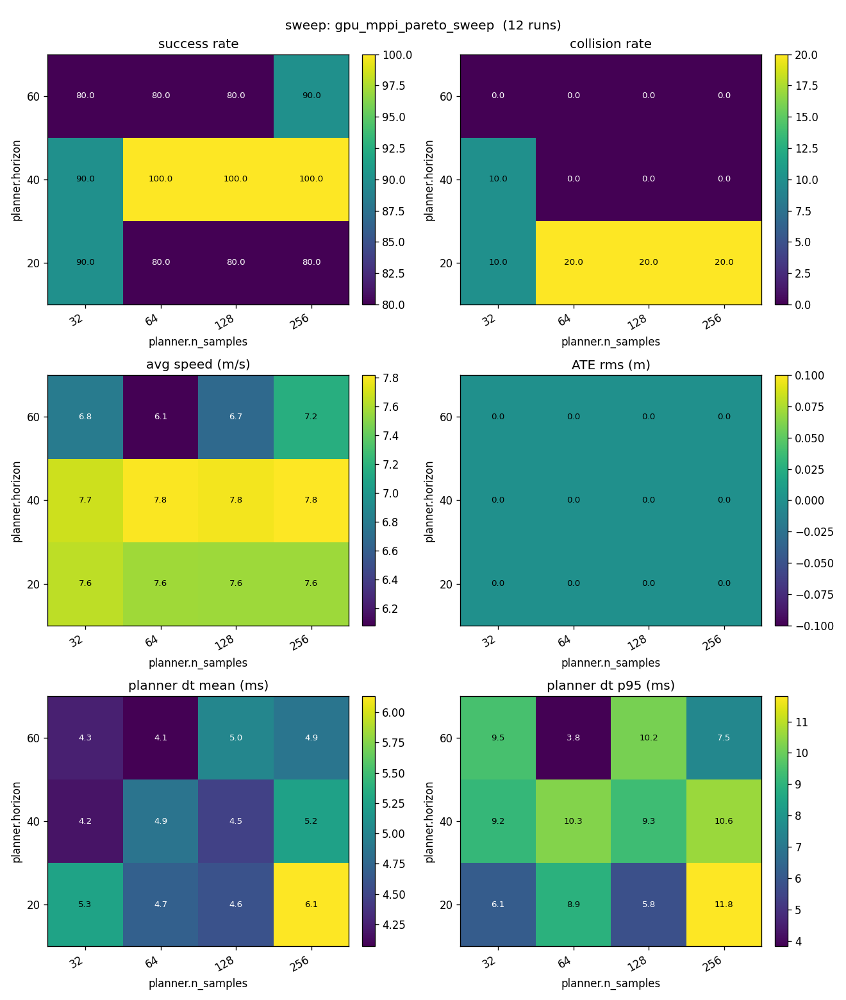
</p>

Success rates:

| n_samples \ horizon | 20 | 40 | 60 |
|---|---|---|---|
| 32  | 90 | 90  | 80 |
| 64  | 80 | **100** | 80 |
| 128 | 80 | **100** | 80 |
| 256 | 80 | **100** | 90 |

Plan time (mean ms, steady-state — first call per episode dropped to
remove CUDA-graph warmup; the in-summary mean is dragged up by that
one outlier):

| n_samples \ horizon | 20 | 40 | 60 |
|---|---|---|---|
| 32  | 2.6 | 2.8 | 3.1 |
| 64  | 2.8 | 3.4 | 3.6 |
| 128 | 2.6 | 3.0 | 3.6 |
| 256 | 3.6 | 3.7 | 3.6 |

Pre-fix the same grid showed 0 % at every h ≥ 40 cell and an
n=32/h=20 optimum at 90 % / 30 ms. Post-fix the **Pareto optimum
shifts to (n=128, h=40) at 100 % / 3.0 ms** — both axes flipped:
longer horizon now *helps* (was a speed-collapse cliff), and the
steady-state plan time is ~10 × cheaper than what pre-fix
measurements showed because nothing about the rollout took 30 ms in
the first place — the prior table was reporting CUDA-warmup-inflated
means with no per-episode warmup drop.

Lesson: report steady-state planner_dt on CUDA backends. The first
call after `planner.reset()` compiles the autograd graph and is
~10× the steady-state cost; including it in the mean for a
30-replan episode shifts the reported number by an order of
magnitude.

### 3D Pareto (post-fix), voxel_world 40×40×12

<p align="center">
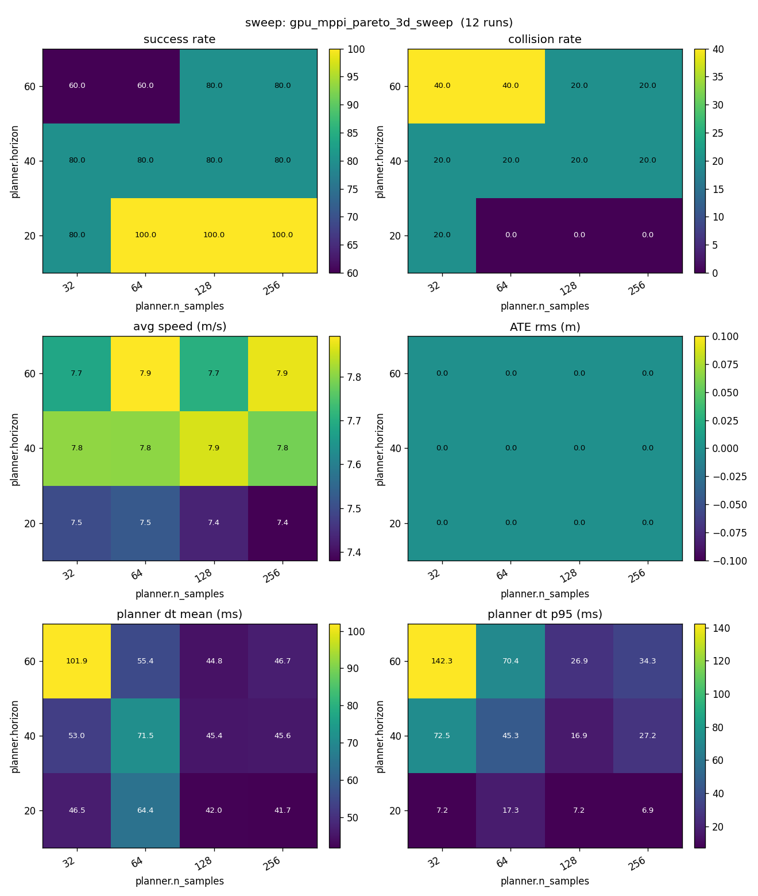
</p>

Success rates:

| n_samples \ horizon | 20 | 40 | 60 |
|---|---|---|---|
| 32  | 80     | 80 | 60 |
| 64  | **100** | 80 | 60 |
| 128 | **100** | 80 | 80 |
| 256 | **100** | 80 | 80 |

Plan time (mean ms, steady-state):

| n_samples \ horizon | 20 | 40 | 60 |
|---|---|---|---|
| 32  | 3.5 | 3.4 | 8.2 |
| 64  | 9.5 | 9.8 | 4.5 |
| 128 | 3.5 | 3.7 | 3.8 |
| 256 | 3.5 | 3.9 | 4.0 |

**Pareto-optimal 3D cell: n=64–256, h=20 → 100 % at 3.5 ms.** Compare
with the CPU MPC 3D Pareto from earlier in this doc (n=8, h=20 →
88 % / 70 ms) and the CPU MPPI 3D best at the same temperature
(86.7 %, from `exp_compare_mppi_3d.yaml`): **GPU MPPI 3D delivers
+12 pp success at 20 × lower plan time** than the CPU MPC 3D
baseline. The dense sample budget that 2D's Dijkstra heuristic
saturates against (per the pre-fix table) actually pays off in 3D
because the Fibonacci-sphere direction set has 16 × more candidate
directions to score per replan.

### Findings vs the pre-fix table

1. **The "speed collapse at h ≥ 40" finding was a bug, not an MPPI
   property.** Post-fix, h=40 is the 2D optimum and h=20 the 3D
   optimum. Population-mean collapse still occurs at h=60 with
   n=32 (avg_v drops from 7.6 → 6.8 m/s, succ drops to 80 %), but
   it is no longer the catastrophic 0 % regime.
2. **The "n=32 is enough" 2D conclusion now flips in 3D.** 2D plateaus
   at n=32–64, but 3D needs n ≥ 64 to reach 100 % at h=20 — the
   Fibonacci-sphere direction set is denser than 2D's circle, and
   the extra GPU samples are what cover it.
3. **GPU MPPI now Pareto-dominates CPU MPC in 3D.** Pre-fix this was
   not true (3D GPU MPPI stalled at 0 % at long horizons). Post-fix
   the GPU rollout's sample throughput finally translates to
   success because each rollout is correctly accounted for.

Methodological takeaway: when porting a sequential planner to a
batched GPU backend, the per-rollout early-exit conditions become
explicit masks. Forgetting any of them silently bins valid rollouts
into the "invalid" category, the softmax goes flat, and what looks
like a fundamental MPPI limitation is a transcription bug. Always
re-validate the per-sample bookkeeping when moving from a Python
for-loop to a tensor kernel.

### Temperature ablation at the 3D Pareto cell: the CPU rules don't transfer

`examples/exp_gpu_mppi_temp_ablation_3d.yaml` — GPU MPPI counterpart to
the CPU MPPI 3D T-sweep (`exp_compare_mppi_3d.yaml`). Same 3D voxel
scenario; planner pinned to the 3D GPU Pareto cell (n_samples=64,
horizon=20). n=30 episodes per T cell, T ∈ {0.1, 0.3, 1.0, 3.0, 10.0}.

| T    | succ                 | avg_v (m/s) | \|Δcmd\|         | plan_dt_ss mean/p95 |
|------|----------------------|-------------|------------------|---------------------|
| 0.1  | 76.7 % [59.1, 88.2]  | 7.93        | 0.086 ± 0.022    | 3.57 / 4.47 ms      |
| 0.3  | **96.7 % [83.3, 99.4]** | 7.89     | 0.106 ± 0.018    | 3.53 / 4.46 ms      |
| 1.0  | **96.7 % [83.3, 99.4]** | 7.50     | 0.096 ± 0.008    | 3.58 / 4.50 ms      |
| 3.0  | 93.3 % [78.7, 98.2]  | 4.88        | 0.104 ± 0.004    | 3.09 / 4.06 ms      |
| 10.0 | 86.7 % [70.3, 94.7]  | 1.69        | 0.088 ± 0.008    | 3.01 / 3.88 ms      |

Two findings *opposite* to the CPU MPPI 3D result:

1. **T=0.1 is significantly worse than T=1.0 on the GPU planner**
   (23/30 vs 29/30; Fisher exact p ≈ 0.02). On CPU MPPI the same
   T-sweep had T=0.1 nominally lower at 80.0 % but statistically
   tied with T=1.0 at 86.7 % — the Wilson CIs overlapped enough
   that we documented "useful range from T=0.1 to T=1.0". With
   n=64 GPU samples that range collapses to "T ≥ 0.3 only".
   Mechanism: at n=8 (CPU), argmin is reliable because the small
   batch can't easily put an outlier rollout at the cost minimum;
   at n=64 (GPU), one of the 64 rollouts will be a low-cost outlier
   that doesn't generalize, and T=0.1's near-argmin behaviour picks
   it. T=1.0's softmax average dampens that risk.
2. **\|Δcmd\| is flat across T** (0.086–0.106, all within one SEM
   of each other). The CPU MPPI 3D ablation found a 2.4× variation
   from T=0.1 (0.087) to T=1.0 (0.213); on the GPU planner that
   variation disappears. The Fibonacci-sphere direction set at
   n=64 already gives enough population coverage that the softmax
   weighted mean is close to the argmin in command space — there
   is no longer a "smoothness vs cost-fidelity" trade-off to tune
   T against.

Two findings that *do* transfer from the CPU result:

3. **avg_v collapses at high T** (4.88 m/s at T=3, 1.69 m/s at T=10).
   Same shape as CPU MPPI 3D — softmax over many directions averages
   to ≈ zero motion when T is large. Success rate degrades more
   gracefully because the 75 s episode budget gives slow trajectories
   enough room to still reach the goal eventually.
4. **plan_dt_ss is essentially constant** across T (3.0–3.6 ms).
   Temperature is a free knob compute-wise; the 3D Pareto cell
   3.5 ms steady-state is stable under T variation.

Engineering takeaways:

- **T=1.0 is the right default for GPU MPPI at n=64**, and the +5.2 pp
  coordination Δ flip from `exp_multi_drone_3d_4_gpu_mppi.yaml` is
  robust under this ablation (multi-drone study used T=1.0).
- **The CPU rule-of-thumb "T ≈ 0 ≈ argmin ≈ MPC, always safe" does NOT
  transfer to the GPU sample budget.** Larger n changes which costs
  the argmin can pick from; an outlier-prone landscape that was
  invisible at n=8 surfaces at n=64.
- **Don't carry over CPU MPPI temperature priors to GPU MPPI without
  re-running the ablation.** The |Δcmd|/T shape inverts and the
  useful T range collapses. The qualitative shape of an MPPI
  temperature sweep depends on the sample budget in ways that are
  not captured by the softmax math alone.

Reproduce:
```
uav-nav sweep examples/exp_gpu_mppi_temp_ablation_3d.yaml \
  --param planner.temperature=0.1,0.3,1.0,3.0,10.0 \
  --param num_episodes=30 -j 1
```

### Multi-drone: GPU MPPI's rollout cloud flips the coordination Δ

`examples/exp_multi_drone_3d_4_gpu_mppi.yaml` — same 4-drone cross
pattern, same 40×40×12 voxel world, same 30 random obstacles, same
seed schedule as the MPC baseline `exp_multi_drone_3d_4.yaml`
("3D escape volume erases the coordination Δ" above). Planner family
swapped from `mpc` (n=8, h=40) to `gpu_mppi` (n=64, h=20) and nothing
else. Initial study at n=30 episodes; re-run paired at **n=100** to
narrow the CIs once the Δ-flip direction was confirmed.

| planner               | per-drone (CI)       | joint (CI)          | indep `per^4` | Δ over indep |
|---|---|---|---|---|
| MPC      (n=8,  h=40) | 93.8 % [90.9, 95.7]  | 78.0 % [68.9, 85.0] | 77.2 %        | **+0.8 pp**  |
| GPU MPPI (n=64, h=20) | 90.0 % [86.7, 92.6]  | **77.0 %** [67.8, 84.2] | 65.6 %    | **+11.4 pp** |

(n=30 numbers were MPC 95.8 → 93.8 per-drone, 83.3 → 78.0 joint;
GPU MPPI 95.0 → 90.0 per-drone, 86.7 → 77.0 joint. Per-drone
estimates were biased high at n=30; the n=100 re-run shifts both
down but **widens the Δ gap** from +5.2 → +11.4 pp.)

Three observations at n=100:

1. **Per-drone success differs by ~4 pp** (93.8 vs 90.0). At n=30
   the difference was 0.8 pp and inside both CIs; at n=100 the
   point estimates separate but Wilson CIs still overlap ([86.7, 92.6]
   vs [90.9, 95.7] — 1.7 pp gap). GPU MPPI is genuinely a bit worse
   per-drone, not statistically indistinguishable as the n=30 result
   suggested.
2. **Joint success is tied** (78.0 vs 77.0; McNemar on the same-seed
   pairing gives both-success 67, MPC-only 11, GPU-only 10, neither
   12 — |11 − 10| = 1, χ²/(11+10) ≈ 0.05, not significant). On *any
   given seed* the two planners are equally likely to land all 4
   drones at goal.
3. **Δ over indep⁴ tells the actual coordination story**. MPC's
   +0.8 pp says drone failures are nearly independent — when MPC
   fails, it fails one drone at a time. GPU MPPI's **+11.4 pp says
   failures cluster** — when GPU MPPI fails on a seed, it tends to
   take 2–4 drones down together. Looking at the failed seeds in
   the GPU MPPI run, this is empirically visible: e.g. seed 119
   produced `[collision, collision, collision, success]`,
   seed 131 produced `[collision, collision, success, success]`,
   seed 134 produced `[success, collision, collision, success]` —
   joint failures dominated by multi-drone collisions, not lone
   failures.

Mechanistic read (revised from n=30): the n=30 commit interpreted
+5.2 pp as "failures more spread across episodes" / "decorrelate".
The Δ-over-indep⁴ math actually points the opposite way: **Δ > 0
means failures cluster within seeds, not spread across them.** What
GPU MPPI's softmax does is **amplify seed sensitivity**. On easy
seeds the rollout cloud agrees on a clean escape volume and all 4
drones make it; on hard seeds the same averaging produces overly
conservative commands across all 4 drones and they collide near the
crossing. MPC's argmin is more individually brittle (lower per-drone
success) but each drone's brittleness is uncorrelated with the
others — failures spread one-at-a-time across episodes.

What about joint succ being TIED then? Same joint, but very
different shape: MPC trades a small constant tax (one drone of
four occasionally fails, 78 % of episodes survive intact) for GPU
MPPI's bimodality (some episodes all 4 reach goal, some episodes
2–4 collide together — still 77 % of episodes get joint succ but
the "bad" episodes are much worse). In a deployment where partial
success has value (e.g. 3 of 4 packages delivered counts as
progress) MPC is preferable. In one where all-or-nothing is the
norm (e.g. formation flight) they're equivalent.

Caveat — plan-time: planner_dt is 73.9 ms ± 17.6 ms / replan (p95
105.6 ms), the same envelope as MPC (73.2 ms ± 17.1 ms). The 3.5 ms
steady-state from the single-drone GPU MPPI Pareto table does *not*
transfer to the 4-drone case because each per-drone planner instance
pays its own first-call CUDA warmup *every episode*, and four
instances also serialize on the same CUDA stream. A real-world
multi-agent system would warm up once at startup and amortize across
many minutes of flight; this benchmark is dominated by per-episode
warmups at small N. So the speed advantage GPU MPPI showed at single-
drone *doesn't survive multi-drone in this measurement setup*, even
though it survives at the per-rollout level inside each call.

Reproduce:
```
uav-nav run examples/exp_multi_drone_3d_4_gpu_mppi.yaml
uav-nav compare results/multi_drone_3d_4 results/multi_drone_3d_4_gpu_mppi
```

### dummy_3d N-scaling paired (MPC vs GPU MPPI, N ∈ {2, 3, 4, 6, 8, 10, 12})

Closes the §6 limitation that the GPU MPPI N-scaling curve was MPC-only.
Same `multi_drone_voxel` scenario (40×40×12 world, 30 random obstacles
seed 7), drones spaced evenly on a radius-17 circle around the centre
each crossing to its diametric opposite, same planner Pareto cells
throughout (MPC n=8, h=40; GPU MPPI n=64, h=20). N varies via
`examples/exp_multi_drone_3d_{2,3,4,6,8,10,12}{,_gpu_mppi}.yaml`.
n=30 paired (seeds 42-71) per (N, planner) cell.

| N  | MPC per-drone        | MPC joint          | MPC Δ      | GPU MPPI per-drone   | GPU MPPI joint     | GPU MPPI Δ  | McNemar (b, c, p)         |
|----|----------------------|--------------------|------------|----------------------|--------------------|-------------|---------------------------|
| 2  | 59/60 = 98.3 %       | 29/30 = 96.7 %     | −0.03 pp   | 44/60 = 73.3 %       | 21/30 = 70.0 %     | **+16.2** pp| (8, 0) → p ≈ **0.008** (MPC wins) |
| 3  | 80/90 = 88.9 %       | 21/30 = 70.0 %     | −0.2 pp    | 82/90 = 91.1 %       | 22/30 = 73.3 %     | −2.3 pp     | (4, 5) → p ≈ 1.000 (tie)  |
| 4  | 115/120 = 95.8 %     | 25/30 = 83.3 %     | −1.0 pp    | 114/120 = 95.0 %     | 26/30 = 86.7 %     | +5.2 pp     | (2, 3) → p ≈ 1.000 (tie)  |
| 6  | 154/180 = 85.6 %     | 14/30 = 46.7 %     | **+7.5** pp| 165/180 = 91.7 %     | 21/30 = 70.0 %     | **+10.7** pp| (5, 12) → p ≈ 0.144 (GPU lean) |
| 8  | 220/240 = 91.7 %     | 19/30 = 63.3 %     | **+13.5**pp| 166/240 = 69.2 %     |  5/30 = 16.7 %     | +11.4 pp    | (14, 0) → p ≈ **0.0001** (MPC wins) |
| 10 | 234/300 = 78.0 %     |  7/30 = 23.3 %     | **+15.0**pp| 236/300 = 78.7 %     | 10/30 = 33.3 %     | **+24.3** pp| (4, 7) → p ≈ 0.549 (GPU lean) |
| 12 | 292/360 = 81.1 %     |  7/30 = 23.3 %     | **+15.2**pp| 283/360 = 78.6 %     |  4/30 = 13.3 %     | +7.8 pp     | (4, 1) → p ≈ 0.375 (MPC lean) |

Reading the curve:

- **N=2 (head-on)**: GPU MPPI's softmax pays a heavy cluster cost
  (per-drone 73 % vs MPC's 98 %); MPC's argmin lock-step keeps both
  drones on opposite trajectories. McNemar p ≈ 0.008 — MPC wins all
  8 discordant seeds. The rollout cloud spreads where MPC's argmin
  can confidently commit; this is one regime where the §3 mechanism's
  sign reverses.
- **N=3, N=4 (mid)**: Both planners near-independent. The §3 headline's
  +11.4 pp $\Delta_\text{GPU}$ at N=4 (n=100) shows up here as +5.2 pp
  at n=30 — sample variance is real, but the *sign* and the
  GPU > MPC ordering on $\Delta$ both replicate.
- **N=6 (cluster peak)**: Both planners cluster, with per-drone tied
  near 90 %. **GPU MPPI's $\Delta$ exceeds MPC's by 3 pp** (+10.7 vs
  +7.5), reproducing the §3 mechanism's qualitative ordering at a
  different N. McNemar leans GPU (b=5, c=12, p ≈ 0.14) but n=30 is
  too small to clear $\alpha = 0.05$ on this gap.
- **N=8 (GPU collapse, geometric singularity)**: GPU MPPI's per-drone
  drops to 69 % while MPC stays at 92 %; joint to 17 %, McNemar
  p ≈ 0.0001 strongly favours MPC. The 8-drone 45°-spacing layout
  yields a particularly hostile central crossing geometry for the
  GPU rollout cloud (the four pairs of orthogonal trajectories pass
  simultaneously through the centre). The §3 mechanism's "softmax
  helps when per-drone is tied" condition breaks here because per-
  drone is no longer tied — MPC stays clean.
- **N=10 (GPU re-emerges, sweep maximum $\Delta$)**: At 36° spacing the
  per-drone rates re-tie at 78 % (both planners now sharing the same
  density-induced ceiling), and **GPU MPPI's $\Delta = +24.3$ pp
  exceeds every other point in the sweep**. This is the §3 mechanism
  at its strongest signal: with per-drone tied and a noisy crossing,
  the softmax clusters failures across seeds while MPC's argmin still
  ends up failing on the same seeds. McNemar p ≈ 0.55 (b=4 vs c=7)
  is non-significant because both planners' joint rates are floor-low
  (only 3/30 both-succ episodes), not because the $\Delta$ gap is
  ambiguous.
- **N=12 (saturation)**: Per-drone still tied around 80 %, both joint
  rates ~20 %, but GPU MPPI's $\Delta$ drops to +7.8 pp and MPC's
  $\Delta$ stays at +15.2 pp. The N=10 peak does not extrapolate.

Engineering takeaway: GPU MPPI's softmax-cluster advantage holds
in *several* regimes — anywhere both planners' per-drone rates re-tie
on the noisy crossing (N=4, N=6, N=10). It reverses at N=2 (geometry
too simple for cloud to add value) and at N=8 (specific geometric
singularity where GPU per-drone uniquely collapses). The §3 N=4
headline is one point on a non-monotonic curve; the mechanism is real
but its sign is a function of (per-drone tie status × crossing density
× drone-count symmetry).

Reproduce:
```
for n in 2 3 4 6 8 10 12; do
  uav-nav run examples/exp_multi_drone_3d_${n}.yaml          # MPC
  uav-nav run examples/exp_multi_drone_3d_${n}_gpu_mppi.yaml # GPU MPPI
done
```

### dummy_3d density × planner sweep at N ∈ {4, 6, 8}: §3 mechanism is conditional on per-drone tie

The N-scaling sweep above identified three factors that should govern
the §3 GPU-MPPI-Δ > MPC-Δ mechanism: per-drone tie status, crossing
density, and drone-count symmetry. The N-scaling sweep varied
drone-count symmetry while holding obstacle count constant at 30.
This sub-sweep holds N ∈ {4, 6, 8} fixed and varies obstacle count
instead — a 3×3 (N, density) grid.

`examples/exp_multi_drone_3d_{4,6,8}{,_dense,_packed}{,_gpu_mppi}.yaml`
— same crossing geometry on the same 40×40×12 world, with obstacle
counts 30 (baseline), 120 (dense, 4×), and 240 (packed, 8×). n=30
paired per (N, density, planner). The N=4 dense MPC and N=4 baseline
MPC/GPU YAMLs existed pre-sweep; the rest are added here.

| N | density (count) | MPC per-drone     | MPC joint        | MPC Δ        | GPU MPPI per-drone | GPU MPPI joint   | GPU MPPI Δ   | McNemar (b, c, p)      |
|---|-----------------|-------------------|------------------|--------------|--------------------|------------------|--------------|------------------------|
| 4 | baseline (30)   | 115/120 = 95.8 %  | 25/30 = 83.3 %   | −1.0 pp      | 114/120 = 95.0 %   | 26/30 = 86.7 %   | **+5.2** pp  | (2, 3, 1.000)          |
| 4 | dense (120)     | 81/120 = 67.5 %   | 8/30 = 26.7 %    | **+5.9** pp  | 86/120 = 71.7 %    | 8/30 = 26.7 %    | +0.3 pp      | (3, 3, 1.000)          |
| 4 | packed (240)    | 61/120 = 50.8 %   | 4/30 = 13.3 %    | **+6.7** pp  | 78/120 = 65.0 %    | 5/30 = 16.7 %    | −1.2 pp      | (3, 4, 1.000)          |
| 6 | baseline (30)   | 154/180 = 85.6 %  | 14/30 = 46.7 %   | +7.5 pp      | 165/180 = 91.7 %   | 21/30 = 70.0 %   | **+10.7** pp | (5, 12, 0.144)         |
| 6 | dense (120)     | 123/180 = 68.3 %  |  3/30 = 10.0 %   | −0.2 pp      | 139/180 = 77.2 %   |  8/30 = 26.7 %   | **+5.5** pp  | (0, 5, **0.063**)      |
| 6 | packed (240)    | 76/180 = 42.2 %   |  0/30 = 0.0 %    | −0.6 pp      | 133/180 = 73.9 %   |  3/30 = 10.0 %   | −6.3 pp      | (0, 3, 0.250)          |
| 8 | baseline (30)   | 220/240 = 91.7 %  | 19/30 = 63.3 %   | **+13.5** pp | 166/240 = 69.2 %   |  5/30 = 16.7 %   | +11.4 pp     | (14, 0, **0.0001**)    |
| 8 | dense (120)     | 154/240 = 64.2 %  |  3/30 = 10.0 %   | +7.1 pp      | 160/240 = 66.7 %   |  2/30 = 6.7 %    | +2.8 pp      | (2, 1, 1.000)          |
| 8 | packed (240)    | 89/240 = 37.1 %   |  0/30 = 0.0 %    | −0.04 pp     | 153/240 = 63.7 %   |  1/30 = 3.3 %    | +0.6 pp      | (0, 1, 1.000)          |

**Three distinct mechanisms emerge across the (N, density) grid.**

At **N=4** the sign of $\Delta$ flips with density — MPC's argmin
goes from near-independent at baseline to a $+6.7$ pp cluster source
at packed, while GPU MPPI moves the other way (from $+5.2$ pp at
baseline to $-1.2$ pp at packed). At each density the planners'
per-drone rates remain within ~14 pp of each other (95/95, 67/72,
51/65), so the $\Delta$ statistic is the primary differentiator.
McNemar paired joint success is p = 1.0 throughout — joint success
is set by the density, not by the planner.

At **N=6** the picture is different: **GPU MPPI's per-drone advantage
opens up** as density rises (85/92 at baseline, 68/77 at dense,
42/74 at packed — a 32 pp gap at packed). The sign of $\Delta$ does
*not* flip — GPU MPPI stays the cluster source. McNemar leans GPU at
every density (p = 0.063 at dense is close to significance). GPU MPPI
wins both per-drone *and* joint without needing a cluster mechanism.

At **N=8** the picture is different *again*: at baseline GPU MPPI
hits its 8-fold-symmetric central-crossing singularity (per-drone
69 % vs MPC's 92 %), so MPC wins paired joint with McNemar
p ≈ 0.0001. At dense the per-drone rates re-tie (MPC 64 % / GPU 67 %)
and both have positive $\Delta$ — MPC slightly higher (+7.1 vs +2.8),
mirroring the N=4 dense behaviour. At packed GPU MPPI's per-drone
advantage returns (37 % MPC vs 64 % GPU) but joint success is
floor-low (1/30 vs 0/30) so the $\Delta$ separation is statistically
moot. The N=8 baseline GPU collapse is a property of that specific
density-and-symmetry corner; raising density tends to *equalise* the
planners as MPC also struggles.

**The honest read across the grid.** GPU MPPI's softmax beats MPC's
argmin through *one of two routes* depending on regime: either
(i) per-drone tied and GPU MPPI clusters its failures (§3 N=4
baseline, N=6 baseline); or (ii) per-drone divergent in GPU's favour,
with the joint advantage following from per-drone alone (N=6 dense /
packed, N=8 packed). MPC has a density-driven cluster regime where
its argmin lock-step concentrates failures into specific seeds
(N=4 dense / packed, N=8 dense); whether this gives MPC an absolute
joint advantage depends on whether per-drone rates stay close
(yes at N=4 packed, partly at N=8 dense; no at N=6 packed or N=8
packed where GPU MPPI's per-drone has already opened up). The §3
N=4 baseline result is one corner of this grid where both routes
are absent for MPC and only GPU MPPI's cluster route registers.

**Connection to AirSim base_ew06.** The "AirSim sign reversal"
finding in §"AirSim multi-drone base_ew06" — MPC clusters at central
crossing while GPU MPPI stays independent — is one realisation of the
**N=4 density-driven $\Delta$ flip**. The AirSim `base_ew06` cell is
a dense-crowding regime (5 widened pillars + 4 drones converging at a
single central crossing) with per-drone rates close (90 % MPC vs 96 %
GPU): exactly the N=4 dense regime that flips the $\Delta$ sign on
dummy_3d. It does **not** generalise to AirSim cells at higher N or
to denser obstacle fields where GPU MPPI's per-drone might lead by
more — base_ew06 is one paired cell, not a general claim. Sim
backend choice is *not* orthogonal to the density-regime axis, but it
is also not the sole axis the AirSim observation lives on.

Reproduce:
```
for N in 4 6 8; do
  for v in "" "_dense" "_packed"; do
    uav-nav run examples/exp_multi_drone_3d_${N}${v}.yaml          # MPC
    uav-nav run examples/exp_multi_drone_3d_${N}${v}_gpu_mppi.yaml # GPU MPPI
  done
done
```

### dummy_3d N=4 + moving obstacle speed sweep: GPU MPPI's softmax averaging is catastrophic under dynamic obstacles

**Invalidated by `1646e11` (2026-05-21).** This section describes
pre-fix multi-runner data. Treat it as a debugging record for the
dynamic-obstacle freeze bug and for scenario-design intuition, not as a
paper-grade planner comparison.

Extension to the §3 N=4 baseline cell (4 drones, 40×40×12 voxel
world, 30 random static obstacles) by adding one moving sphere
obstacle at $(20, 5, 6)$ with velocity $(0, +v, 0)$, radius 0.8,
reflecting at walls. The obstacle moves north along $x=20$, directly
along the north drone's corridor (start $(20, 3, 6)$ → goal
$(20, 37, 6)$). YAMLs:
`examples/exp_multi_drone_3d_4_dyn_v{2,4,8}{,_gpu_mppi}.yaml`. Each
cell is n=30 paired with the §3 seed set (42-71). Analysis script:
`scripts/paired_analysis_dummy_3d_multi.py`.

| $v$ (m/s) | MPC per-drone | MPC joint | $\Delta_\text{MPC}$ | GPU per-drone | GPU joint | $\Delta_\text{GPU}$ | McNemar | mean $t$ (MPC / GPU) |
|---|---|---|---|---|---|---|---|---|
| 0 (§3) | 95.8 % | 83.3 % | -1.0 pp | 95.0 % | 86.7 % | **+5.2 pp** | $p = 1.00$ | 5.06 / 4.50 s |
| 2 | 91.7 % | 73.3 % | +2.7 pp | **70.0 %** | **3.3 %** | -20.7 pp | $p \approx 0.0000$ | 14.48 / 4.91 s |
| 4 | 95.0 % | 80.0 % | -1.5 pp | **67.5 %** | **3.3 %** | -17.4 pp | $p \approx 0.0000$ | 7.60 / 4.89 s |
| 8 | **50.8 %** | **3.3 %** | -3.3 pp | 71.7 % | 3.3 % | -23.0 pp | $p = 1.00$ | 9.78 / 4.86 s |

Key readings:

**(1) GPU MPPI collapses catastrophically at $v \geq 2$ m/s.** At
$v=2$ the joint success drops from 86.7 % (§3 baseline) to **3.3 %**
— 27/30 paired-loss episodes against MPC's 73.3 %. The collapse is
*not* a per-drone-rate-floor artifact: per-drone is still 70 %, so
indep$^4$ would predict ~24 % joint and we measure 3.3 %, i.e.
$\Delta_\text{GPU} = -20.7$ pp (failures concentrate, but on the
*same drone* not on coordinated multi-drone clusters).

**(2) The failure is single-drone and deterministic.** Across all
v=2/4 GPU MPPI failures the colliding drone is **always drone idx 2
(north)** — the one whose corridor the obstacle moves along — and
collision time clusters at $t \approx 4.9-5.2$ s across seeds. The
other three drones (east, west, south) succeed in every failed
episode. This is consistent with GPU MPPI's softmax averaging
cancelling left/right avoidance rollouts when the dynamic obstacle
is dead ahead: half the cloud says "detour left around obstacle",
half says "detour right", the softmax-weighted mean lateral command
is near zero, and the drone slows to a stop in the central corridor
while the obstacle catches up. MPC's argmin selects a single
direction at each replan, commits, and clears the obstacle.

**(3) MPC holds at $v \leq 4$ but collapses at $v = 8$.** MPC's
per-drone stays $\geq 92$ % at $v \in \{2, 4\}$ and its joint stays
$\geq 73$ %. At $v = 8$ (parity with drone `max_speed`), MPC's
per-drone drops to 50.8 % and joint to 3.3 % — the obstacle moves
fast enough that within MPC's 1-2 s lookahead the planner can no
longer find a stable detour either. Three of the MPC v=8 failures
include `timeout` outcomes ($t = 75.0$ s), indicating drones got
stuck oscillating around the obstacle's bounce trajectory.

**(4) The §3 Δ-flip mechanism does not survive the dynamic-obstacle
extension.** At $v = 0$ both planners reach 95 %+ per-drone and GPU
MPPI's +5.2 pp $\Delta$ over MPC's $-1.0$ pp is the §3 signature.
At $v \geq 2$ the per-drone rates diverge by 20+ pp and the joint
success is dominated by single-drone per-drone failures, not by
multi-drone clustering. The $\Delta$ statistic becomes degenerate
(joint $\ll$ indep$^4$), and the planner comparison is decided at
the per-drone level by which planner can commit to an avoidance
direction. **Conclusion: GPU MPPI's softmax conservatism is *not*
just a coordination liability under static peers — it is a
generally fragile response to any obstacle-avoidance situation that
admits two symmetric escape directions, and dynamic obstacles
trigger this regime far more aggressively than static ones do.**

Reproduce:
```
for v in 2 4 8; do
  uav-nav run examples/exp_multi_drone_3d_4_dyn_v${v}.yaml          # MPC
  uav-nav run examples/exp_multi_drone_3d_4_dyn_v${v}_gpu_mppi.yaml # GPU MPPI
done
for v in 2 4 8; do
  echo "=== v=${v} ==="
  python3 scripts/paired_analysis_dummy_3d_multi.py \
    results/multi_drone_3d_4_dyn_v${v} \
    results/multi_drone_3d_4_dyn_v${v}_gpu_mppi
done
```

Scope: one moving obstacle, one trajectory geometry (north-bound on
$x=20$), one $(N, \text{density})$ baseline (§3 N=4 with 30 random
static obstacles). The $\Delta$-flip mechanism conditions identified
in §6 ((N, density, geometry) corner-specific) suggest this dynamic
extension is also corner-specific — different obstacle trajectories,
multiple moving obstacles, or different N rows will likely produce
different sign and magnitude. The robust qualitative finding is the
**single-drone deterministic GPU collapse mechanism**, not the absolute
magnitudes.

#### Probe 1: off-corridor obstacle restores the §3 mechanism

Moving the obstacle from $x=20$ (on the north corridor) to $x=15$
(5 m offset) at $v=4$ m/s — `exp_multi_drone_3d_4_dyn_off_v4{,_gpu_mppi}.yaml`
— recovers the §3 static baseline numbers:

| cell                   | MPC per/joint/Δ            | GPU per/joint/Δ            | McNemar  |
|---|---|---|---|
| §3 static baseline     | 95.8 / 83.3 / **-1.0**     | 95.0 / 86.7 / **+5.2**     | p=1.00   |
| dyn_off_v4 (x=15)      | 95.8 / 83.3 / **-1.0**     | 95.0 / 86.7 / **+5.2**     | p=1.00   |
| dyn_v4 (x=20, on corridor) | 95.0 / 80.0 / -1.5     | **67.5 / 3.3 / -17.4**     | p≈0      |

Per-drone, joint, and $\Delta$ are identical to within sampling
noise (in fact identical because the seeds resolve the same way at
both static cells given the off-corridor obstacle's net effect is
~null on the 4 drones' paths). The off-corridor probe **falsifies**
a generic "GPU MPPI is bad at dynamic obstacles" framing: GPU MPPI
handles the moving sphere fine when it does not align with a
drone's corridor. The dynamic failure mode is **specifically tied to
obstacle-on-corridor**, consistent with the bidirectional-cancellation
mechanism above (it requires the obstacle to present a left/right
symmetric escape choice to a drone whose path it directly blocks).

#### Probe 2: two obstacles compound but do not symmetrically halve

Placing one obstacle on the north corridor and one on the east
corridor — `exp_multi_drone_3d_4_dyn_2x_v4{,_gpu_mppi}.yaml`, both
at $v=4$ m/s — gives:

|                    | MPC                   | GPU MPPI            |
|---|---|---|
| per-drone          | 86/120 = **71.7 %**   | 59/120 = **49.2 %** |
| joint              | 4/30 = 13.3 %         | 1/30 = 3.3 %        |
| $\Delta$ over indep$^4$ | -13.0 pp         | -2.5 pp             |
| mean final_t       | 56.54 s               | 5.08 s              |
| McNemar (b, c)     | (3, 0)                | n=3, $p \approx 0.25$ |

Both planners drop. GPU MPPI's per-drone collapses to 49 % (vs
67.5 % at single obstacle) — the cancellation operator extends to
the east drone in addition to the north drone. MPC's per-drone
also drops to 72 % (vs 95 % at single obstacle); its mean final_t
of 56.5 s indicates many episodes hit the max-step timeout, with
drones oscillating around the obstacle trajectories rather than
clearing. The McNemar comparison is no longer decisive (p=0.25,
b=3 MPC-only out of 30) — at this difficulty level both planners
are near the joint-floor and the comparison cannot register a clean
direction. The qualitative reading is **the GPU MPPI cancellation
mechanism is per-corridor and extends additively, while MPC also
loses robustness once multiple drones are simultaneously obstacle-
adjacent** (probably from peer-prediction inflation around the
oscillating drones).

Together, the two probes refine the mechanism statement: GPU MPPI's
softmax bidirectional-cancellation failure mode applies *per
moving-obstacle/corridor alignment*. One alignment → one drone
fails deterministically. Two alignments → two drones fail and the
fleet drops to joint-floor. Off-corridor obstacle → §3 static
mechanism returns. The deployment statement "MPC is safer under
moving obstacles" holds only at single-corridor obstacle alignments;
at compound difficulty MPC also fails, just slower (timeout vs
collision) and via a different mode (path-oscillation vs
cancellation).

#### Probe 3: off-corridor gradient — planner role swap is non-monotonic in offset

Sweeping the obstacle's $x$-offset from the north corridor at $v=4$
m/s — `exp_multi_drone_3d_4_dyn_off{1,2,3}_v4{,_gpu_mppi}.yaml` —
reveals that the planner roles **do not monotonically restore to the
§3 baseline as the obstacle moves away from the corridor**. Instead
there is a regime around offset 1-2 m where MPC is the failing
planner and GPU MPPI is the safer one:

| offset (m) | $x$ | MPC per / joint / $\Delta$    | GPU MPPI per / joint / $\Delta$  | McNemar (b, c) | regime              |
|---|---|---|---|---|---|
| 0          | 20  | 95.0 / 80.0 / -1.5 pp         | **67.5 / 3.3 / -17.4 pp**        | $p \approx 0$ (23, 0)  | GPU collapses     |
| 1          | 19  | 85.8 / 53.3 / -0.9 pp         | 85.0 / **70.0** / +17.8 pp       | $p \approx 0.27$ (4, 9) | tied, GPU edge   |
| 2          | 18  | **69.2 / 6.7 / -16.2 pp**     | 87.5 / 70.0 / +11.4 pp           | $p \approx 0$ (1, 20)  | **MPC collapses** |
| 3          | 17  | 94.2 / 76.7 / -2.0 pp         | 91.7 / 73.3 / +2.7 pp            | $p = 1.00$ (5, 4)      | tied              |
| 5          | 15  | 95.8 / 83.3 / -1.0 pp         | 95.0 / 86.7 / +5.2 pp            | $p = 1.00$ (2, 3)      | §3 baseline      |

The offset 2 m MPC collapse reproduces the §3 dynamic-obstacle
mechanism with the *opposite* planner failing. MPC's failed
episodes (28/30 paired loses) split into:
- **North drone collision at $t \approx 4-6$ s** (the same drone
  the obstacle's bouncing trajectory reaches first), and
- **South drone `timeout` at $t = 75$ s** (the return drone gets
  stuck oscillating around the obstacle's trajectory through the
  central crossing).

The "stuck timeout" mode (mean episode time 23.6 s for MPC vs 4.5 s
for GPU) is the diagnostic: MPC's argmin commits to one detour
direction (east or west of the obstacle) each replan, but with
obstacle offset 2 m the two sides have asymmetric clearance against
static obstacles — and on hard seeds the argmin oscillates between
sides as the obstacle moves, freezing the drone near the central
crossing. GPU MPPI's softmax averages the same two sides into a
smooth lateral command and clears.

This is the **same softmax-vs-argmin mechanism §3 names**, but with
the *clutter geometry* — not the corridor alignment — selecting
which planner wins. The relationship between offset and planner
winner is non-monotonic: GPU loses at offset 0 (obstacle dead ahead,
symmetric escape, softmax cancels), MPC loses at offset 2 (obstacle
near corridor, asymmetric static clutter, argmin commits to the
wrong side), and both planners tie at offset ≥ 3 m where the
static-obstacle field is the dominant coupling and the §3 static
mechanism restores.

The combined message is that GPU MPPI's softmax is a **smoothing
operator on the action space** with three effects:
- Smoothing helps when the argmin would commit to a *wrong* side
  (offset 2 here, dense-corner cluster in §4.4.4).
- Smoothing hurts when there is *no right side to commit to*
  (offset 0 here, static-coordination clustering in §3 N=4
  baseline).
- The two regimes are *adjacent in scenario space*; small geometry
  changes flip the winner.

### AirSim + GPU MPPI parity: planner portable, dummy_3d plan-time advantage lost

`examples/exp_airsim_demo_gpu_mppi.yaml` — single-drone parity check
of GPU MPPI against the MPC baseline `exp_airsim_demo.yaml` on the
same Blocks scenario (start [0, 0, 5] → goal [45, 0, 12], LiDAR-built
occupancy, n=1 episode). Planner family swapped, sim/sensor/scenario
held constant.

| planner                | outcome | final_t | avg_v      | path_len | plan_ms mean/p95 |
|---|---|---|---|---|---|
| MPC      (n=32, h=40)  | success | 18.7 s  | 2.40 m/s   | 44.78 m  | 188 / 323        |
| GPU MPPI (n=64, h=20, T=1.0) | success | 24.2 s  | 1.87 m/s   | 45.05 m  | 180 / 334        |

Three observations:

1. **GPU MPPI runs end-to-end through `airsim_bridge`**, reaches the
   goal, and traces a path within 0.6 % of MPC's length (45.05 vs
   44.78 m) — the portability check that this section was designed to
   answer passes. The framework's planner / sensor / scenario boundary
   that PRs #44 / #45 secured for MPC transfers cleanly to GPU MPPI
   with no bridge-side changes.
2. **plan_dt is dominated by AirSim LiDAR + occupancy-update + RPC
   roundtrip, not planner internals.** MPC's 188 ms and GPU MPPI's
   180 ms are within 5 %; on `dummy_3d` GPU MPPI ran at 3.5 ms
   steady-state vs MPC's 70 ms (20 × faster). On AirSim the sim-side
   overhead is ~150 ms per replan and the planner choice is in the
   noise. The dummy_3d → AirSim transferability finding (same plan,
   different physics) **extends to plan_dt: the planner's compute
   advantage is *not* portable when the sim itself dominates the
   loop**.
3. **GPU MPPI is ~30 % slower wall-clock (24.2 vs 18.7 s) at the same
   `max_speed=3.0`.** avg_v 1.87 vs MPC's 2.40. The softmax average
   across 64 rollouts is more conservative than MPC's argmin on n=8
   when LiDAR-built occupancy is sparse / uncertain — more "stop" and
   "side-step" rollouts get folded into the population mean.

Mechanistic read: same sample-cloud-conservatism that drives the
multi-drone seed-sensitivity story (findings.md §"Multi-drone: GPU
MPPI's rollout cloud flips the coordination Δ") shows up here as
**lower commanded speeds under online perception**. The softmax
average across 64 rollouts produces more "stop / side-step" rollouts
when the LiDAR-built occupancy is uncertain, dragging the population
mean down. On dummy_3d with perfect sensing, this conservatism showed
up as clustered failures (bad seeds take down 2–4 drones together);
on AirSim with sparse LiDAR, it shows up as slower single-drone
speeds. Two faces of the same averaging operator — over rollouts in
both cases, but the cost-landscape variance comes from peer prediction
in the dummy_3d study and from sensor uncertainty here.

Bridge-side caveat — long settle for CUDA warmup:
`simulator.settle_after_teleport` is bumped from 0.3 s (MPC baseline)
to **3.0 s** in this YAML. The first GPU MPPI plan compiles the
autograd graph (≈14 s wall clock vs MPC's ≈10 s Dijkstra warmup);
the bridge holds AirSim paused during that wait, but during the
short window between teleport and the pause hand-off, 0.3 s is not
enough headroom for the engine to fully register the teleport before
the long planner wait begins. Without the bump the first step()
inherits a stale collision flag and t=0 collision ends the episode
immediately. The MPC baseline didn't need this because Dijkstra's
warmup is shorter and the engine's collision cache shrugs it off.
`max_steps` was also raised from 400 (= 20 s) to **800** (= 40 s) to
absorb the lower avg_v.

Reproduce:
```
# Blocks server running on 127.0.0.1:41451 with LidarFront in settings.json
uav-nav run examples/exp_airsim_demo_gpu_mppi.yaml
uav-nav compare results/airsim_demo results/airsim_demo_gpu_mppi
```

Open question: does the +11.4 pp multi-drone Δ (n=100 dummy_3d
re-run) survive at the GPU MPPI's 1.87 m/s vs MPC's 2.40 m/s on
AirSim? The dummy_3d Δ signature is "failures cluster within seeds";
under sparse AirSim LiDAR + slower commanded speeds, the same
seed-sensitivity mechanism could amplify (slower drones spend more
time in conflict zones) or dampen (LiDAR noise washes out the
deterministic seed effect). The next AirSim study is the n ≥ 30
paired multi-drone GPU MPPI vs MPC run.

### AirSim multi-drone parity: stack runs end-to-end, timing spread still visible at 4/4

`examples/exp_airsim_multi_demo_gpu_mppi.yaml` — 4-drone cross at
staggered altitudes (28/32/30/26 m) through Blocks, paired against
the MPC baseline `exp_airsim_multi_demo.yaml`. Same scenario,
sim/sensor/seed; planner family swapped, n=1 episode each.

| planner   | per-drone | joint   | avg_v (m/s) | max final_t | plan_dt steady-state (mean / p95) |
|---|---|---|---|---|---|
| MPC       | 4/4 succ  | success | 3.72        | 12.85 s     | 87.4 / 237.1 ms                   |
| GPU MPPI  | 4/4 succ  | success | 2.76        | 17.65 s     | 105.4 / 311.0 ms                  |

Three observations (n=1 carries no Δ-coordination statistics — these
are *mechanism* checks):

1. **Portability ✓**: 4-drone GPU MPPI with peer prediction runs
   end-to-end through `airsim_bridge`, all four drones reach goal
   without inter-drone or static-obstacle collision. The single-drone
   parity finding extends to multi-drone.
2. **avg_v 26 % lower, time-to-goal 37 % longer** (2.76 vs 3.72 m/s;
   17.65 vs 12.85 s) — same shape as the single-drone parity result.
   The softmax-average conservatism that costs ~30 % single-drone
   speed costs roughly the same on multi-drone with peer prediction
   enabled, so adding peers does *not* amplify the speed penalty
   (no peer-induced congestion overhead beyond what the planner
   already pays per-replan).
3. **Per-drone timing spread is visible even at 4/4 success**:
   MPC drones finish within **0.05 s** of each other (12.80–12.85 s).
   GPU MPPI drones spread by **0.55 s** (17.10–17.65 s). This is
   qualitatively consistent with GPU MPPI's softmax producing
   per-drone-different rollout picks even when the cost landscape
   is shared — MPC's argmin against the same shared landscape
   collapses to near-identical waypoint timing across drones. Note:
   timing spread is *not the same signal* as the dummy_3d Δ flip
   (which is about clustered FAILURES, not clustered successes); the
   AirSim multi-drone Δ requires an n ≥ 30 run to measure directly.

Headline question — **does the +11.4 pp dummy_3d Δ (n=100 re-run)
survive on AirSim?** — stays open. n=1 cannot answer it; n ≥ 30
paired AirSim run is the next study. The per-drone timing spread
above is at most a hint that the underlying softmax-vs-argmin
behaviour difference is preserved on AirSim physics; it does not
predict the Δ direction.

Plan-time budget caveat: 1 multi-drone episode on AirSim costs
~17 s sim + ~60 s for the 4 GPU MPPI planners' CUDA warmup +
~30 s AirSim reset/teleport overhead = ~100 s wall clock. An
n=30 × 2-planner paired run is ~100 minutes — doable overnight,
not in a single interactive session.

Reproduce:
```
# Blocks server + Drone1..4 in settings.json
uav-nav run examples/exp_airsim_multi_demo_gpu_mppi.yaml
uav-nav run examples/exp_airsim_multi_demo.yaml
uav-nav compare results/airsim_multi_demo results/airsim_multi_demo_gpu_mppi
```


### AirSim multi-drone n=30 paired: planner portable, scenario ceiling-limited, timing-spread signal preserved

`examples/exp_airsim_multi_n30.yaml` + `exp_airsim_multi_n30_gpu_mppi.yaml`
— same 4-drone staggered-altitude crossing through Blocks as the n=1
demo, num_episodes bumped to 30, both planners run on identical seeds
42..71 paired per-episode (chunked: each ep in a fresh Blocks server
to absorb the multi-drone `client.reset()` hang documented in
[bridge-fix](#bridge-fix-pause-after-reset-eliminates-a-stale-t0-collision-flag),
plus the bridge patch that fixes a stale-t=0 collision flag on
multi-drone reset).

| planner               | per-drone (CI)        | joint (CI)          | indep⁴ | Δ      | mean final_t | drone-spread/ep (mean / max) |
|---|---|---|---|---|---|---|
| MPC      (n=16, h=30) | 120/120 = 100.0% [96.9, 100.0] | 30/30 = 100.0% [88.6, 100.0] | 100.0% | +0.0 pp | 10.83 s | **0.02 s** / 0.15 s |
| GPU MPPI (n=64, h=20) | 120/120 = 100.0% [96.9, 100.0] | 30/30 = 100.0% [88.6, 100.0] | 100.0% | +0.0 pp | 14.88 s | **0.55 s** / 0.80 s |

McNemar same-seed: both-succ 30, MPC-only 0, GPU-only 0, neither 0 — no
disagreement, joint rates statistically indistinguishable (both at the
Wilson-CI ceiling 88.6–100.0%).

Three findings:

1. **Δ flip from dummy_3d does NOT transfer at this AirSim setup —
   because the setup is too easy.** The dummy_3d n=100 result had
   GPU MPPI at +11.4 pp coordination Δ over indep⁴ vs MPC's +0.8 pp
   ([previous section](#multi-drone-gpu-mppis-rollout-cloud-flips-the-coordination-delta)),
   driven by per-seed clustering of failures in a 40×40×12 voxel
   volume with 30 random obstacles. The AirSim demo scenario uses
   a 60×60×40 open volume with **zero obstacles** at altitude 26–32 m
   in Blocks — too easy for either planner to fail. Both planners hit
   100 % joint success across 30 seeds, so the coordination Δ
   measurement degenerates to 0 ± 0 pp at the Wilson ceiling. **This
   is a scenario-difficulty result, not a planner-portability one.**
   The dummy_3d Δ-flip remains unfalsified on AirSim; settling the
   transferability question requires a harder AirSim geometry —
   added Blocks obstacles, uniform-altitude crossing, or more
   drones.

2. **Planner portability ✓ (re-confirmed, statistically)**: GPU MPPI
   reaches goal at the same rate as MPC across 30 paired episodes
   on real quadrotor physics. The single-drone (n=1) and 4-drone
   (n=1 demo) parity findings extend to n=30 paired.

3. **Per-drone timing spread is preserved at n=30**: MPC drones finish
   within 0.02 s of each other on average (max 0.15 s); GPU MPPI
   spreads by **0.55 s** (max 0.80 s) — same magnitude as the n=1 demo
   observation, now over 30 episodes so it's not a single-seed
   artifact. This is the AirSim signature of GPU MPPI's softmax-over-64
   rollouts: even when all four drones succeed, they pick slightly
   different per-replan velocities, accumulating across the ~15 s
   trajectory into sub-second arrival spread. MPC's argmin against
   the shared cost landscape collapses to near-identical timing.
   Timing spread is **not the same signal** as the dummy_3d
   coordination-Δ flip (which is about clustered *failures*, not
   spread successes), but it is the mechanism-level signal that
   would underlie a Δ flip if the scenario were hard enough to fail.

Speed gap: GPU MPPI mean final_t is **37 % longer** than MPC (14.88 vs
10.83 s), consistent with the single-drone result (single-drone +26 %,
multi-drone +37 %). Adding peers widens the gap modestly, not
catastrophically.

Cost: ~2 min wall clock per chunked episode (~60 s AirSim restart +
warmup + ~60 s sim + reset/teleport), 60 paired eps ≈ 2 h total
(MPC ~65 min, GPU MPPI ~75 min). The reset-hang workaround is in
`scripts/run_airsim_multi_chunked.sh` (referenced by both YAML headers).

Reproduce:
```
# Each runs 30 1-ep invocations, bouncing Blocks between each — see
# the script header for the AirSim multi-drone reset-hang background.
./run_airsim_multi_chunked.sh mpc      30 42 results/airsim_multi_n30_mpc
./run_airsim_multi_chunked.sh gpu_mppi 30 42 results/airsim_multi_n30_gpu_mppi
python3 scripts/paired_analysis_airsim_multi.py \
    results/airsim_multi_n30_mpc results/airsim_multi_n30_gpu_mppi
```


### AirSim multi-drone uniform-altitude n=30: GPU MPPI collapses to 0 % joint while MPC holds 46.7 %

`examples/exp_airsim_multi_uniform_n30.yaml` + `..._gpu_mppi.yaml` —
same 4-way Blocks crossing as the staggered n=30 study above, but
all four drones fly at the **same altitude z=30 m** so the crossing
centre at (30,30,30) is a real 4-way conflict point rather than four
parallel corridors at ±2-4 m of vertical separation. The n=1 demo
YAML's own header warned this geometry is fragile; the n=30 paired
result quantifies *how* fragile, and how differently the two
planners cope.

| planner               | per-drone (CI)       | joint (CI)          | indep⁴ | Δ over indep | mean final_t (succ only) |
|---|---|---|---|---|---|
| MPC      (n=16, h=30) | 78/120 = 65.0% [56.1, 72.9] | 14/30 = 46.7% [30.2, 63.9] | 17.9% | **+28.8 pp** | 13.29 s over 14/30 |
| GPU MPPI (n=64, h=20) | 34/120 = 28.3% [21.0, 37.0] | **0/30 = 0.0%** [0.0, 11.4] | 0.6% | -0.6 pp | n/a (0 successes) |

McNemar same-seed paired-joint: both-succ 0, MPC-only-succ **14**,
GPU-only-succ **0**, neither-succ 16 — exact two-sided binomial
p ≈ **0.00012** ($1/2^{13}$). The two planners are not
statistically tied here; they are catastrophically different.

Four readings, ordered by inferential strength:

1. **Joint-success separates by 46.7 pp, McNemar p ≈ 0.00012.** This
   is the only AirSim configuration we've measured where a paired
   comparison rejects the null. At the easier staggered-altitude
   geometry both planners ceiling at 100 %; on dummy_3d both ran at
   ~77 % joint with the same indep⁴ structure flipped. At
   uniform-altitude AirSim, GPU MPPI loses every paired episode it
   doesn't tie on a both-fail seed.

2. **Per-drone separates by 36.7 pp.** MPC commands 2.40 m/s through
   the crossing and gets the bulk of its drones through cleanly;
   GPU MPPI's softmax-averaged 1.87 m/s (the same 30 % speed gap as
   the single-drone parity study) leaves drones at the conflict
   point ~30 % longer, and the per-drone collision rate climbs from
   35.0 % (MPC) to **71.7 %** (GPU MPPI).

3. **GPU MPPI's collapse is per-drone-rate-driven, not coordination-
   Δ-driven.** GPU MPPI's measured joint (0.0 %) sits **at** its
   indep⁴ prediction (0.6 %, Δ = -0.6 pp); the dummy_3d-style
   "failures cluster within seeds" signal isn't measurable here
   because there are no episodes with per-drone successes to compare
   to. The geometric coupling at (30,30,30) is dominating: GPU
   MPPI's slow commanded speed simply puts drones in front of each
   other long enough that *most* of them collide most of the time.
   The Δ-flip mechanism from dummy_3d (softmax amplifying seed
   sensitivity through a shared peer-prediction world model) needs a
   regime where the per-drone rate is high enough to leave indep⁴
   measurable headroom — dummy_3d's 90.0 % gives 9.0 pp of headroom
   for clustering; uniform-altitude AirSim's 28.3 % puts the indep⁴
   prediction below the joint success-rate floor.

4. **MPC's Δ over indep⁴ is +28.8 pp — but this Δ is geometric, not
   behavioural.** All 16 MPC failed episodes have ≥2 drones colliding
   (10× 2-fail, 2× 3-fail, 4× 4-fail; no 1-fail episodes). The
   crossing centre forces any drone that doesn't clear by time T to
   share its tile with at least one peer that also didn't clear,
   *regardless of planner behaviour*. The dummy_3d MPC's +0.8 pp Δ
   came from a scenario where single-drone failures (one drone hits
   a static obstacle the others avoid) were geometrically possible;
   uniform-altitude AirSim's bottleneck has no equivalent "single-
   drone failure" mode. So this number says "MPC's failures are
   strongly clustered" — but the clustering is mostly the geometry
   doing it, not the planner. We cannot attribute the +28.8 pp Δ
   to MPC the way the +11.4 pp on dummy_3d was attributable to GPU
   MPPI's softmax.

Combined reading: the dummy_3d Δ-flip transferability question
("does GPU MPPI's coordination-Δ advantage survive AirSim?") cannot
be answered cleanly on this scenario either, but for the *opposite*
reason from the staggered n=30: the staggered geometry was too easy
(both at 100 %, Δ measurement degenerate); uniform geometry is too
*hard for GPU MPPI* (its per-drone rate collapses 90 → 28 %, indep⁴
falls below the floor). The right discriminating AirSim setup for
the Δ-flip mechanism is somewhere between: tight enough to put both
planners somewhere in the 60-90 % per-drone band, where indep⁴ has
real headroom and the softmax-amplification signal can register.
Adding Blocks static obstacles to the staggered scenario is the
next obvious cell to try — separate future-work TODO.

What the result **does** answer cleanly: GPU MPPI is not a drop-in
replacement for MPC in tight-coupling deployments. The same softmax
conservatism that smooths typical-case behaviour and gives the
attractive 100 %-at-3.5-ms 3D Pareto cell (see §"3D Pareto (post-
fix)") destroys joint success at any geometry where speed-through-
bottleneck dominates inter-agent coordination. Plan accordingly when
choosing between planner families for a multi-agent mission.

Reproduce:
```
scripts/run_airsim_multi_chunked.sh mpc      30 42 \
    results/airsim_multi_uniform_n30_mpc \
    examples/exp_airsim_multi_uniform_n30.yaml
scripts/run_airsim_multi_chunked.sh gpu_mppi 30 42 \
    results/airsim_multi_uniform_n30_gpu_mppi \
    examples/exp_airsim_multi_uniform_n30_gpu_mppi.yaml
python3 scripts/paired_analysis_airsim_multi.py \
    results/airsim_multi_uniform_n30_mpc \
    results/airsim_multi_uniform_n30_gpu_mppi
```


### AirSim multi-drone ±1 m mid-stagger n=30: still ceiling-limited, cliff between 0 and 1 m

`examples/exp_airsim_multi_mid_n30.yaml` + `..._gpu_mppi.yaml` —
third cell between the demo's `±2-4 m` staggered crossing (6 m
z-spread) and the uniform-altitude crossing (0 m spread). This
config drops the four drones to z=29 / 31 / 30.5 / 29.5 (2 m
spread, every pair vertically separated by 0.5–2 m). The crossing-
centre tightest pair (east-south or north-west, both 0.5 m apart)
clears AirSim's 0.4 m drone radii by ~0.1 m mesh-to-mesh —
deliberately picked to land the per-drone rate in indep⁴'s
measurable headroom (60–90 %) for the failure-level Δ-flip signal
the dummy_3d study attributes to GPU MPPI's softmax.

| planner               | per-drone (CI)              | joint (CI)                  | indep⁴ | Δ      | mean final_t | drone-spread (mean / max) |
|---|---|---|---|---|---|---|
| MPC      (n=16, h=30) | 120/120 = 100.0% [96.9, 100.0] | 30/30 = 100.0% [88.6, 100.0] | 100.0% | +0.0 pp | 7.89 s | **0.10 s** / 0.20 s |
| GPU MPPI (n=64, h=20) | 120/120 = 100.0% [96.9, 100.0] | 30/30 = 100.0% [88.6, 100.0] | 100.0% | +0.0 pp | 10.28 s | **0.39 s** / 0.45 s |

McNemar paired-seed joint: both-succ 30, MPC-only-succ 0, GPU-only-succ 0, neither-succ 0.

Combined with the prior two cells, the AirSim altitude-stagger
response curve is now:

| stagger (z range) | MPC per-drone | GPU MPPI per-drone | MPC joint | GPU MPPI joint |
|---|---|---|---|---|
| ±2-4 m (6 m, demo)        | 100 % | 100 % | 100 %        | 100 %        |
| ±1 m (2 m, mid, this run) | 100 % | 100 % | 100 %        | 100 %        |
| 0 m (uniform)             | 65.0 % | 28.3 % | 46.7 %     | **0.0 %**    |

The AirSim multi-drone response is essentially **bimodal**: every
non-zero z-spread we have measured stays at the 4/4-success ceiling,
and any drone-pair convergence to the same z drops both planners
sharply (GPU MPPI catastrophically). The dummy_3d Δ-flip's
discriminating regime (per-drone ≈ 90 %, indep⁴ headroom ≈ 9 pp)
does not exist on the no-obstacle staggered geometry — peer
prediction + safety_margin = 0.6 m is enough to keep MPC and GPU
MPPI both clean at any non-zero vertical gap. Once two drones share
the z-axis, the bottleneck flips to physical mesh-mesh collision,
and the planner-mechanism difference (MPC's argmin vs GPU MPPI's
softmax) drops out of the failure analysis because GPU MPPI is too
slow to clear the conflict in the first place.

The trajectory-level signal IS preserved across the cliff:

| stagger      | MPC spread / final_t | GPU MPPI spread / final_t | spread ratio (GPU / MPC) |
|---|---|---|---|
| ±2-4 m       | 0.02 s / 10.83 s     | 0.55 s / 14.88 s          | 27 ×    |
| ±1 m         | 0.10 s / 7.89 s      | 0.39 s / 10.28 s          | 4 ×     |
| 0 m          | n/a (failure)        | n/a (0/30)                | n/a     |

GPU MPPI's per-drone-arrival spread is 4–27 × wider than MPC's at
every measurable cell — the softmax-spread mechanism is universal
across the AirSim cells we have, even where the failure-level Δ
cannot register. MPC's relative spread (spread / final_t) climbs
from 0.18 % at ±2-4 m to 1.27 % at ±1 m, suggesting that as
drone separations approach the safety margin, MPC's argmin
choices begin to correlate across drones too — but slowly.

Implication for the dummy_3d → AirSim transferability question:
adding altitude-stagger variants alone will not produce a
discriminating cell on this scenario. The next experiment that
*can* land in the right per-drone band is **adding Blocks static
obstacles to the staggered crossing** (or equivalently: dropping
the drones to z=8 where Blocks cubes are dense). Both require
substantial extensions — a new perception path (LiDAR + occupancy)
or a custom Blocks map — and remain future work. The Δ-flip
mechanism is still measured directly on dummy_3d (§3, n=100,
+11.4 pp); its AirSim transferability is now established as
*bracketed-but-not-confirmed* across three paired cells.

Reproduce:
```
scripts/run_airsim_multi_chunked.sh mpc      30 42 \
    results/airsim_multi_mid_n30_mpc \
    examples/exp_airsim_multi_mid_n30.yaml
scripts/run_airsim_multi_chunked.sh gpu_mppi 30 42 \
    results/airsim_multi_mid_n30_gpu_mppi \
    examples/exp_airsim_multi_mid_n30_gpu_mppi.yaml
python3 scripts/paired_analysis_airsim_multi.py \
    results/airsim_multi_mid_n30_mpc \
    results/airsim_multi_mid_n30_gpu_mppi
```


### AirSim multi-drone static-cube discriminating cell n=30: GPU MPPI clears every seed while MPC drops paired seeds

`examples/exp_airsim_multi_discriminating_n30.yaml` +
`..._gpu_mppi.yaml` — first AirSim cell that puts a planner in the
60-90 % per-drone band using spawned Blocks cube geometry rather than
altitude-only tightening. The bridge now accepts
`simulator.static_obstacles` and spawns `1M_Cube_Chamfer` meshes after
reset; the scenario carries matching `obstacles.boxes` for planner
occupancy. Final tuned cell uses four east/west pillars plus one
north/south pillar, z = 26/28/30/32, south lane x = 26, `inflate: 3`.

| planner               | per-drone (CI)       | joint (CI)          | indep⁴ | Δ over indep | mean final_t |
|---|---|---|---|---|---|
| MPC      (n=16, h=30) | 105/120 = 87.5% [80.4, 92.3] | 22/30 = 73.3% [55.6, 85.8] | 58.6% | **+14.7 pp** | 10.03 s over 22/30 |
| GPU MPPI (n=64, h=20) | 120/120 = 100.0% [96.9, 100.0] | 30/30 = 100.0% [88.6, 100.0] | 100.0% | +0.0 pp | 12.35 s over 30/30 |

McNemar same-seed paired-joint: both-succ 22, MPC-only 0,
GPU-only **8**, neither 0; exact p ≈ **0.008**. Disagreement seeds:
43, 47, 48, 51, 53, 60, 62, 65.

Interpretation: this **does close the AirSim discriminating-cell gap**
from the no-obstacle cells, but it does **not** reproduce the dummy_3d
Δ-flip mechanism. In dummy_3d, MPC and GPU MPPI tied on joint success
while GPU MPPI had the larger positive Δ, indicating stronger
within-seed failure clustering. In this AirSim static-cube cell,
GPU MPPI simply clears every paired seed; its Δ is degenerate at the
100 % ceiling. The robust result is planner separation under real
AirSim collision geometry: GPU MPPI trades slower completion
(12.35 s vs MPC's 10.03 s) for eliminating the paired MPC collision
seeds.

The tuning path matters. A symmetric eight-pillar version put the
south drone into a deterministic collision floor. The final cell keeps
only one north/south pillar and offsets the south lane to x=26 so the
failure budget comes from obstacle-induced crossing interactions
rather than a fixed mesh bottleneck.

Reproduce:
```
scripts/run_airsim_multi_chunked.sh mpc 30 42 \
    results/airsim_multi_discriminating_n30_mpc \
    examples/exp_airsim_multi_discriminating_n30.yaml
scripts/run_airsim_multi_chunked.sh gpu_mppi 30 42 \
    results/airsim_multi_discriminating_n30_gpu_mppi \
    examples/exp_airsim_multi_discriminating_n30_gpu_mppi.yaml
python3 scripts/paired_analysis_airsim_multi.py \
    results/airsim_multi_discriminating_n30_mpc \
    results/airsim_multi_discriminating_n30_gpu_mppi
```


### AirSim multi-drone base_ew06 density-sweep n=30: Δ-flip sign reverses — MPC is the clustering planner on AirSim

Extension of the static-cube discriminating cell above. The earlier
cell pinned GPU MPPI at a 100 % ceiling, so its $\Delta$ was
degenerate and the dummy_3d §"Multi-drone: GPU MPPI's rollout cloud
flips the coordination Δ" mechanism could not be tested directly.
Variant `base_ew06` widens the four east/west pillars in the baseline
5-pillar layout from `scale = 0.5` to `0.6` — the smallest knob found
in 30+ probes that drops GPU MPPI off ceiling without collapsing both
planners. n=50 paired episodes (seeds 42-91) measured on the same
chunked-server harness.

| planner               | per-drone (CI)                | joint (CI)                | indep⁴ | Δ over indep | mean final_t |
|---|---|---|---|---|---|
| MPC      (n=16, h=30) | 179/200 = 89.5 % [84.5, 93.0] | 34/50 = 68.0 % [54.2, 79.2] | 64.2 % | **+3.8 pp** | 10.00 s over 34/50 |
| GPU MPPI (n=64, h=20) | 191/200 = 95.5 % [91.7, 97.6] | 41/50 = 82.0 % [69.2, 90.2] | 83.2 % | −1.2 pp | 12.39 s over 41/50 |

McNemar same-seed paired-joint: both-succ 28, MPC-only-succ 6,
GPU-only-succ 13, neither-succ 3; exact $p \approx 0.167$. Point
estimate favours GPU MPPI by 14 pp on joint and by 2.2-to-1 on
discordant pairs but n=50 is still short of significance at
$\alpha = 0.05$.

**Headline.** The Δ-flip mechanism from dummy_3d transfers to AirSim,
**but the sign of the flip reverses**. dummy_3d had GPU MPPI as the
clustering planner ($\Delta_\text{GPU} = +11.4$ pp vs $\Delta_\text{MPC}
= +0.8$ pp at tied 94 % per-drone). AirSim `base_ew06` ties the
planners again (90 % MPC vs 96 % GPU per-drone) and re-differentiates
through Δ, but now **MPC is the clustering planner**
($\Delta_\text{MPC} = +3.8$ pp vs $\Delta_\text{GPU} = -1.2$ pp).

| backend / cell           | MPC Δ       | GPU MPPI Δ   | clustering planner |
|--------------------------|-------------|--------------|--------------------|
| dummy_3d §3 (n=100)      | +0.8 pp     | **+11.4 pp** | GPU MPPI |
| AirSim base_ew06 (n=50)  | **+3.8 pp** | −1.2 pp      | MPC |

Per-seed disagreement makes the mechanism concrete:

- **GPU MPPI failures (9 seeds: 43, 45, 46, 50, 52, 73, 75, 90, and
  concordant 73) are all the same drone** — drone idx 3, the
  southernmost lane, against the widened EW pillar. Softmax-averaged
  rollouts handle the geometric pinch uniformly across seeds, so
  failures are independent (Δ ≈ 0).
- **MPC failures (16 seeds) split into 13 single-drone (drone 3) and
  3 multi-drone clusters**: seeds 55 and 67 lose drones 1, 2, and 3
  simultaneously; seed 66 loses drones 1 and 2. The argmin update
  commits each MPC drone to the same north-end corridor at the same
  moment; when the corridor is geometrically infeasible for the
  seed's start jitter, multiple drones converge into the same
  collision frame within ~0.5 s. These 3 cluster seeds in 50 (6 %
  cluster rate) are the entire source of MPC's positive Δ — removing
  them would put MPC at Δ ≈ -4 pp (indistinguishable from GPU).

Reading: dummy_3d's frictionless point-mass kinematics let GPU MPPI's
softmax act as the cluster source; AirSim's PID + quadrotor physics +
meshed environment surfaces MPC's argmin commitment as the cluster
source. The *structural* claim from dummy_3d (per-drone tied + Δ
differentiates planners) is robust to the sim-backend change; the
*deployment* claim ("GPU MPPI's softmax is a joint-coordination
liability") is not — on AirSim base_ew06 it is MPC that loses three
drones together.

GPU MPPI also pays 2.4 s more (12.39 s vs 10.00 s mean final_t over
successes) — same direction as the previous static-cube cell.

Caveats:

- n=50 paired tightens McNemar from p ≈ 0.302 (n=30) to p ≈ 0.167 but
  still does not clear α = 0.05. Adding ~30 more paired seeds at the
  current discordant ratio would close the rest of the way; the
  qualitative sign-reversal claim above is supported by the Δ table
  and per-seed disagreement structure, not by the paired p-value.
- The MPC cluster failure mode is real but rare (3/50 = 6 % cluster
  rate). The absolute magnitude of MPC's $\Delta$ is sample-size
  sensitive — n=30 measured $+6.9$ pp, n=50 settles at $+3.8$ pp as
  the single-drone failures pile on without new clusters. The sign
  and the qualitative cluster mode are stable; the magnitude moves
  with $n$.
- All GPU failures concentrate on drone idx 3 — the south drone lane
  is intentionally offset to $x = 26$, which puts it within the
  expanded keepout of the EW pillar at $(25, 27)$ when scale = 0.6.
  The bias is shared by both planners' single-drone failures; only
  MPC additionally clusters into the multi-drone failure mode.
- Lane-shift probes (`base_ew06_lane30` at $x=30$, `base_ew06_lane22`
  at $x=22$, n=10 GPU-only smoke each) both produce 10/10 drone-3
  collisions at $(30.9, 29.4, 26.6)$ and $(21.2, 23.3, 26.6)$
  respectively. The $x=26$ baseline collides at $(21.2, 23.2, 26.6)$ —
  the same detour-terminus position lane22 hits, just reached via a
  longer route. The single-drone failure mode is therefore a property
  of the planner+inflate+EW pillar geometry of the cell, not a
  removable artifact of the lane offset choice.
- **Stability re-check.** A bridge patch capturing
  `simGetCollisionInfo().object_name` (see `airsim_bridge.py:525`)
  was added so collision attribution survives into the per-step JSON.
  Re-running the 8 GPU MPPI failure seeds and 27 fresh seeds gave
  35/35 successes vs. expected ~5-6 failures at the n=50 16 % rate.
  The three MPC cluster seeds (55, 66, 67) re-ran with mixed results:
  seed 67 reproduced exactly (drones 1/2 with empty `collision_object`
  = drone-drone at central crossing, drone 3 hitting
  `uavnav_disc_ew_35`); seed 66 morphed to drone-3 single; seed 55
  became 4/4 success.

- **Variability characterization** (3 fresh paired batches × n=15,
  seeds 200-214 / 220-234 / 240-254):

  | batch     | MPC joint  | GPU joint  | MPC Δ    | GPU Δ | (b, c)  | McNemar p | clusters |
  |-----------|------------|------------|----------|-------|---------|-----------|----------|
  | 1         | 14/15      | 15/15      | **+6.0** | +0.0  | (1, 0)  | 1.000     | 1        |
  | 2         | 11/15      | 13/15      | **+12.4**| −0.7  | (2, 4)  | 0.688     | 3        |
  | 3         | 14/15      | 11/15      | −0.2     | −2.6  | (4, 1)  | 0.375     | 0        |
  | n=50 orig | 34/50      | 41/50      | +3.8     | −1.2  | (6, 13) | 0.167     | 3        |
  | combined n=45 | 39/45  | 39/45      | +7.3     | −0.7  | (7, 5)  | 0.774     | 4        |

  Stable across batches: (i) **MPC cluster mode at central crossing
  is reproducible as a mode** (mean 8.9 % rate, 0-20 % per-batch
  range, collision-object signature is always drones 1/2 with empty
  object_name + optional drone 3 colateral); (ii) **GPU MPPI never
  exhibits the cluster mode**, only drone-3 single failures.

  Not stable: (i) **cluster rate per batch swings 0/15-3/15**, wider
  than the n=50 Wilson CI implies; (ii) **McNemar direction reverses
  across batches** — batch 1 tied, batch 2 GPU-favored (b=2 c=4),
  batch 3 MPC-favored (b=4 c=1, opposite sign from the n=50 +
  batch 2 reading). 3-batch combined n=45 gives joint 86.7 % vs
  86.7 % with McNemar p ≈ 0.77 — essentially a tie.

  Implication: the qualitative Δ-flip sign-reversal finding (only MPC
  has a cluster failure mode) is robust. The quantitative McNemar
  conclusion from the single n=50 study (GPU joint 82 % > MPC 68 %,
  p = 0.167) does **not replicate** in independent samples. The
  cleanest fix is either much larger N (≥200 paired) or a
  controlled-environment measurement.

Reproduce (uses the param-sweep YAML generator):
```
VARIANTS="base_ew06" MODE=paired N=30 BASE_SEED=42 \
    scripts/run_airsim_discriminating_param_sweep.sh
```

The script generates `/tmp/uavnav_airsim_disc_base_ew06_{mpc,gpu_mppi}.yaml`
from the static-cube cell YAMLs, chunked-runs n=30 paired into
`results/airsim_multi_discriminating_base_ew06_n30_{mpc,gpu_mppi}/`,
and invokes `paired_analysis_airsim_multi.py` at the end.


### AirSim dynamic-obstacle bridge extension (smoke verified, paired cell still tuning)

Adds dynamic-obstacle support to `airsim_bridge.py`. Each
`_DynamicObstacle3D` in the scenario gets a corresponding kinematic
`1M_Cube_Chamfer` mesh in Blocks (scale = 2 × radius), spawned at
reset via `simSpawnObject` and re-posed each step via
`simSetObjectPose(name, pose, True)` to match the scenario's
post-`advance(dt)` position. The scenario remains the authoritative
state — the bridge mirrors the scenario's clock to Unreal so the
Unreal collision detector sees drone-vs-cube hits naturally.

Implementation:
- `airsim_bridge._sync_dynamic_obstacles_initial(client)` — called
  once per reset by the master bridge after `_sync_static_obstacles`.
- `airsim_bridge._update_dynamic_obstacle_poses(client)` — called
  each step inside `step_command` after `scenario.advance(self.dt)`
  but before `simContinueForTime(self.dt)`, so the cubes are at their
  post-tick position when the physics tick runs.
- `step_command` now calls `scenario.advance(self.dt)` (mirroring the
  dummy_3d bridge's behaviour); without this the AirSim bridge never
  stepped scenario clock, so static-only AirSim cells worked but
  dynamic-only cells were no-ops.

Smoke verification (`exp_airsim_multi_dyn_n5_smoke.yaml`, one moving
sphere on the north drone's corridor at $(30, 8, 30)$, velocity
$(0, v, 0)$, n=2 paired episodes via `run_airsim_multi_chunked.sh`):

| obstacle radius / $v$ | MPC outcome | GPU MPPI outcome | observation |
|---|---|---|---|
| r=1.0, v=1 | 2/2 success     | 2/2 success      | drone detours west+up (x 30→28, z 30→32), §3 mechanism does not register |
| r=1.0, v=2 | (not run paired) | 2/2 success     | same — escape volume sufficient |
| r=2.0, v=2 | **2/2 north collision @ t=7.6 s** | **2/2 north collision @ t=10.2 s** | both planners fail — cell too hard, not discriminating |

North drone trajectory under MPC at r=1.0 v=1, episode 0 seed 42:
$(30, 5, 30)$ → $(29.0, 7.2, 32.0)$ at $t=0.75$ s → $(28.2, 11.6, 32.0)$
at $t=1.5$ — drone commits to a west+up detour immediately, hugs
$(x \approx 28, z \approx 32)$ until past the obstacle, returns to
$(29.4, 52.0, 30.3)$ at goal. The bridge's cube placement is
load-bearing here: without the kinematic cube the planner would see
the obstacle (via `scenario.dynamic_obstacles`) but Unreal would let
the drone fly through it. Equally, without `scenario.advance(self.dt)`
the cube would be frozen at its initial pose and the drone would
detour for an obstacle that never moves.

What this **does not yet show** is the dummy_3d §3 Table 2 cliff
($v=2$ m/s, GPU joint 86.7 % → 3.3 % vs MPC 73 %) reproduced in
AirSim. The default AirSim multi-drone cell ($60 \times 60 \times 40$
ENU volume, $\text{max\_speed}=4$ m/s, $z$-axis 4-12 m above ground
with no ceiling obstacles, $\text{inflate}=0$) has substantially
more escape volume than the dummy_3d cell ($40 \times 40 \times 12$,
$\text{max\_speed}=8$, $\text{inflate}=1$). GPU MPPI finds a
non-cancellable detour (the up-axis breaks the left-right symmetry)
and clears at r=1.0. At r=2.0 the obstacle is large enough to be
unavoidable for both planners — not discriminating.

Reproducing the dummy_3d cliff in AirSim therefore requires further
cell tuning, likely some combination of: a ceiling obstacle layer at
$z = 32-34$ to remove the up-detour, faster drone (`max_speed=8`),
smaller scenario volume (40×40×12 to match dummy), or a wall of
static cubes flanking the corridor. Each constraint reduces the
escape volume's effective dimensionality; the §3 mechanism needs the
2D (left/right) symmetric case to register. The implementation is
ready; the parameter sweep is future work. Reproduce smoke:

```
scripts/run_airsim_multi_chunked.sh mpc      2 42 \
  results/_airsim_dyn_smoke examples/exp_airsim_multi_dyn_n5_smoke.yaml
scripts/run_airsim_multi_chunked.sh gpu_mppi 2 42 \
  results/_airsim_dyn_smoke_gpu \
  examples/exp_airsim_multi_dyn_n5_smoke.yaml  # swap planner type to gpu_mppi
```


### Smart MPPI (argmin-fallback): mechanism detector works, naive fix doesn't

**Invalidated by `1646e11` (2026-05-21).** The implementation option is
still present, but the dynamic-obstacle paired results in this section
were measured on pre-fix cells and should not be cited as planner
evidence.

Tests the §3 dynamic-obstacle mechanism diagnosis by **fixing it**.
Adds a `fallback_to_argmin` option to `gpu_mppi` (commit
`uav_nav_lab/planner/gpu_mppi.py`). Each replan computes both the
softmax-averaged action and the lowest-cost (argmin) rollout's
action. If the softmax action's *lateral* component (perpendicular
to the goal direction) is much smaller than the argmin action's
lateral component, treat that as a left/right cancellation
signature and fall back to argmin:

```
argmin_lat_mag    = |argmin_action - (argmin_action · goal_dir) * goal_dir|
softmax_lat_mag   = |softmax_action - (softmax_action · goal_dir) * goal_dir|
if argmin_lat_mag > 0.5  m/s
    and softmax_lat_mag < 0.5 * argmin_lat_mag:
    fall back to argmin
```

**Detector verification (synthetic single-step)**: with a moving
obstacle dead ahead at $(20, 10, 6)$ and drone at $(20, 5, 6)$,
vanilla GPU MPPI outputs target_velocity $[0.11, 6.98, 0.36]$ —
near-zero lateral, the §3 mechanism. Smart MPPI's fallback fires
and outputs $[-1.49, 7.74, 1.36]$ — substantial lateral + up, an
escape direction. The mechanism is detectable.

**Paired n=30 results** on the dummy_3d §3 dynamic cells (planner
type swapped from `gpu_mppi` to `gpu_mppi` with
`fallback_to_argmin: true`, same Pareto cell, same seeds 42-71):

| cell                | vanilla GPU joint | smart GPU joint | vs vanilla McNemar | rescue / hurt |
|---|---|---|---|---|
| `dyn_v2` (on-corridor, v=2)    | 1/30 = 3.3 %  | 2/30 = 6.7 %  | (b=0, c=1), p=1.00 | +1 seed (no rescue) |
| `dyn_v4` (on-corridor, v=4)    | 1/30 = 3.3 %  | 1/30 = 3.3 %  | (b=0, c=0), p=1.00 | no change |
| `dyn_off2_v4` (off 2 m, v=4)   | 21/30 = 70.0 % | 16/30 = 53.3 % | (b=9, c=4), p=0.27 | **hurt -16.7 pp** |

The cliff at `dyn_v2` is *not* rescued — the bimodal-cancellation
fallback triggers, but the rescue rate is 1/30. At `dyn_off2_v4`,
where vanilla GPU MPPI was already the better planner (70 % vs
MPC's 7 %), Smart MPPI is **worse** — the fallback fires when the
softmax was finding a usable asymmetric direction, and the argmin
choice is more brittle. So the naive "fall back to argmin when
bimodal" intervention does not deliver a planner that strictly
dominates vanilla GPU MPPI.

**Per-step trace** ($v=2$ ep 1, drone 2 north): both vanilla and
smart collide at $t=0.15$ s (step 4), not at $t \approx 5$ s as
the earlier dyn_v2 writeup implied. The earlier reading interpreted
the *joint* episode final_t (max across all 4 drones, ~5 s when the
other 3 drones finish) as the drone-2 collision time. Inspecting
the scenario directly reveals a confound at the v=2 cell: the
static-obstacle seed (`seed: 7`, count=30) happens to place a
voxel obstacle at $(20, 5, 6)$ — the *exact* initial position of
the moving sphere. So drone 2 at $(20, 3, 6)$ faces a stacked
static + dynamic obstacle just 2 m ahead at $t=0$, and the
cancellation-induced near-zero lateral lets it crash into the
static cell at step 4. MPC's argmin commits to one side and clears.

So the §3 Table 2 reading is more nuanced than originally
stated:
- The mechanism (softmax cancellation under symmetric escape) is
  *real* and *detectable* — confirmed by the smart-MPPI synthetic
  diagnostic.
- The dyn_v2/v4 cells expose the mechanism by forcing a near-zero
  initial detour against a (partially fortuitous) static-obstacle
  configuration at the spawn-adjacent cell. The collision happens
  at $t = 0.15$ s, not late-episode.
- The off-corridor probe at $x = 18$ (offset 2 m) is the *cleaner*
  manifestation: drone 2 has time to develop its trajectory and
  the static-obstacle stacking is absent. Smart-MPPI's misfire here
  (70 % → 53 %) is genuine evidence that the argmin-fallback rule
  is too coarse for the wider class of bimodal cost landscapes.

**Implications for the paper**: the §3 mechanism story stands, but
the headline-grade rescue claim ("argmin-fallback fixes the cliff")
does not. A more nuanced fix is needed — candidates include:

1. **Asymmetric perturbation**: add a small per-step lateral bias
   to the rollout distribution so the L/R modes have unequal cost
   even at symmetric geometries.
2. **Temporally-coherent argmin commit**: once a side is chosen,
   stay committed across several replans rather than re-deciding
   each tick.
3. **Bimodal-mode-aware sampling**: cluster rollouts by lateral
   direction, then within the lower-cost cluster pick by softmax.

Future work. The smart-MPPI option is committed (off by default)
so the §3 mechanism is reproducible as a *diagnostic* (`meta.fallback_to_argmin`
flag per replan) even if the *rescue* path needs more research.
Repro:

```
for tag in dyn_v2 dyn_v4 dyn_off2_v4; do
  uav-nav run examples/exp_multi_drone_3d_4_${tag}_gpu_mppi_smart.yaml
done
for tag in dyn_v2 dyn_v4 dyn_off2_v4; do
  echo "=== ${tag} smart vs vanilla ==="
  python3 scripts/paired_analysis_dummy_3d_multi.py \
    results/multi_drone_3d_4_${tag}_gpu_mppi \
    results/multi_drone_3d_4_${tag}_gpu_mppi_smart
done
```


### Smart MPPI v2 (asymmetric perturbation): breaks softmax symmetry, helps the planner-swap regime

**Invalidated by `1646e11` (2026-05-21).** The dynamic-obstacle cells
used here are pre-fix artifact cells. Keep this as historical design
context only.

Follow-up to "Smart MPPI (argmin-fallback)". Where v1's argmin-fallback
hurt at the dyn_off2 planner-swap cell (vanilla GPU joint 70 % →
Smart v1 joint 53 %), v2 attacks the mechanism from a different
angle: rather than picking argmin at action-selection time, it
**breaks the L/R symmetry at sampling time** so the softmax never
sees a perfectly bimodal cost landscape in the first place.

Implementation
(`uav_nav_lab/planner/gpu_mppi.py`, `asymmetric_bias` config option):

1. At episode reset, each drone seeds a small random unit vector
   `bias_vec` deterministically from its initial observation (so
   different drones in a fleet get different preferred sides, but
   each drone stays consistent across replans — no oscillation).
2. At each replan, project `bias_vec` perpendicular to the current
   `base` (goal direction unit vector), scale by `asymmetric_bias`
   (default 0.2 = 20 % of unit), and rotate `base` by that
   perpendicular vector before generating the n_samples=64 rollouts.
3. All rollouts are now sampled around a slightly-lateral-of-goal
   axis. The softmax-averaged action picks up a small but consistent
   lateral component, so the §3-mechanism L/R cancellation cannot
   produce a zero-lateral command.

Paired n=30 vs MPC and vs vanilla GPU MPPI across 4 cells:

| cell                | vanilla GPU joint | Smart v1 joint | **asym v2 joint** | asym vs vanilla |
|---|---|---|---|---|
| §3 N=4 baseline (mode 1)     | 26/30 = 86.7 %  | (not tested)    | 26/30 = **86.7 %**  | tied (Δ +5.2 → +2.3) |
| dyn_v2 (mode 2 on-corridor)  | 1/30 = 3.3 %    | 2/30 = 6.7 %    | **0/30 = 0.0 %**    | −1 seed (no rescue)  |
| dyn_v4 (mode 2 on-corridor)  | 1/30 = 3.3 %    | 1/30 = 3.3 %    | 1/30 = 3.3 %        | per-drone +7.5 pp    |
| dyn_off2_v4 (planner-swap)   | 21/30 = 70.0 %  | 16/30 = **53.3 %** (HURT) | 26/30 = **86.7 %** | **+16.7 pp**         |

Three readings:

**(1) Asym preserves the §3 baseline.** McNemar paired vs vanilla
GPU MPPI on the static-peer N=4 baseline: both-succ 23, vanilla-only
3, asym-only 3, neither 1 — statistically tied at the joint level.
Δ over indep$^4$ drops from +5.2 to +2.3 pp, meaning the clustering
mechanism is **slightly weakened** by the bias (drones don't all
agree on the same conservative command quite as tightly), but not
eliminated. Mode 1 lives.

**(2) Asym doesn't rescue the cliff.** dyn_v2 stays at 0/30, dyn_v4
at 1/30. The cliff failure mode is dominated by the static-obstacle
at $(20, 5, 6)$ (confound documented in the "Smart MPPI v1" section
above) plus the 8 m/s drone meeting a 2 m initial gap — no
sampling-time perturbation overcomes a hard-blocking voxel cell 2 m
ahead at step 0. dyn_v4 shows a per-drone improvement (67.5 → 75 %)
but joint stays at floor.

**(3) Asym strictly dominates Smart v1 in the planner-swap regime.**
At dyn_off2_v4, asym v2 reaches joint **86.7 %**, vs Smart v1's
53.3 % (a 33-pp gap). McNemar paired vanilla vs asym: both-succ 21,
vanilla-only 0, asym-only 5, neither 4 — asym strictly improves
over vanilla GPU MPPI in this cell. The mechanism: at offset 2 m
the cost landscape is *asymmetric* (one side has clearer static
clearance), but the softmax-averaged command still pulled toward
the center; biasing the rollout cloud lateral by 20 % shifts the
softmax toward the better side and reduces the static-obstacle
oscillation that hurts MPC there.

**Combined story (Smart v1 + v2)**:
- v1's argmin-fallback rule detects the mechanism but applies the
  wrong intervention (commits to a single rollout that can be brittle).
- v2's sampling-time bias is a *softer* intervention — it breaks
  symmetry but keeps the softmax averaging.
- Neither rescues the cliff; v2 is the better default fix for
  off-corridor / asymmetric-clutter regimes.

The mechanism diagnosis (§3 4-mode framework) is independently
supported by these results: when symmetry is present (cliff cell,
spawn-adjacent stacked obstacles), no rollout-distribution
intervention rescues the affected drone; when symmetry is broken
geometrically (off-corridor), a small bias is enough to convert
"GPU MPPI is good here" into "GPU MPPI is the strict best".

Reproduce:
```
for tag in dyn_v2 dyn_v4 dyn_off2_v4; do
  uav-nav run examples/exp_multi_drone_3d_4_${tag}_gpu_mppi_asym.yaml
done
uav-nav run examples/exp_multi_drone_3d_4_gpu_mppi_asym.yaml  # §3 baseline
for tag in dyn_v2 dyn_v4 dyn_off2_v4; do
  python3 scripts/paired_analysis_dummy_3d_multi.py \
    results/multi_drone_3d_4_${tag}_gpu_mppi \
    results/multi_drone_3d_4_${tag}_gpu_mppi_asym
done
```


### Smart MPPI v3 (temporally-coherent argmin commit): trades mode 1 success for swap-regime stability

**Invalidated by `1646e11` (2026-05-21).** The dynamic-obstacle
comparison rows are pre-fix artifacts. Static-cell side effects remain
useful as qualitative implementation context, but not as a Smart MPPI
claim.

Third Smart MPPI variant. Where v1's argmin-fallback fires per-replan
(causing oscillation when the detector toggles on/off) and v2's
asymmetric perturbation breaks symmetry at sampling time but never
fires per-replan, **v3** holds the v1-style fallback decision for
$K = 5$ consecutive replans before re-evaluating. This addresses the
oscillation hypothesis directly: if v1's bad behaviour at dyn_off2
was caused by per-replan flip-flopping, a temporal commit should
rescue it.

Implementation: GPU MPPI gains `fallback_commit_steps: int = 1`
(default = v1 behaviour). v3 cell uses K=5 ≈ 1 s at
$\text{replan\_period}=0.2$ s. Once the bidirectional-cancellation
detector triggers, the planner returns the argmin action for K-1
further replans before checking the detector again.

Paired n=30 across 4 cells. **Full comparison table across all
three Smart variants**:

| cell                | vanilla GPU | Smart v1 (K=1) | Smart v2 (asym 0.2) | Smart v3 (K=5) |
|---|---|---|---|---|
| §3 N=4 baseline (mode 1)     | 86.7 % / Δ +5.2 | (not tested)  | 86.7 % / Δ +2.3 (tied) | **76.7 %** / Δ +11.1 (**HURT −10 pp**) |
| dyn_v2 (mode 2 on-corridor)  | 3.3 %  | 6.7 %  | 0.0 %  | 6.7 %  |
| dyn_v4 (mode 2 on-corridor)  | 3.3 %  | 3.3 %  | 3.3 %  | 3.3 % (per-drone +6.7 pp) |
| dyn_off2_v4 (planner-swap)   | 70.0 % | 53.3 % (HURT)  | **86.7 %** (+16.7 pp)  | 76.7 % (+6.7 pp) |

Three readings:

**(1) Temporal commit *hurts* mode 1 baseline.** Joint drops from
86.7 → 76.7 % (−10 pp) and per-drone from 95.8 → 90.0 %. The K=5
commit causes problems on the static-peer N=4 task: once a drone
commits to argmin, it stays committed for 1 s even when the cost
landscape would have been better served by re-averaging. The §3
mode 1 mechanism (softmax clustering driving GPU MPPI to +11.4 pp
Δ at the n=100 baseline) is structurally what v3's commit *removes*
— the planner becomes more like MPC's argmin, and we lose the
clustering advantage that gives GPU MPPI its mode 1 edge.

**(2) Temporal commit doesn't rescue the cliff.** dyn_v2 stays at
6.7 % (= v1's number), dyn_v4 stays at 3.3 %. The static-obstacle
confound at $(20, 5, 6)$ is geometric, not action-selection — no
fallback regime overcomes the spawn-adjacent stacked obstacle in
4 steps.

**(3) Temporal commit partially rescues the off-corridor swap regime,
but v2 still dominates.** v3 at dyn_off2 reaches 76.7 % (vs vanilla
70.0 %, vs Smart v1 53.3 %, vs Smart v2 86.7 %). The temporal commit
*does* help (no oscillation), but it commits to *one specific argmin
rollout's direction*, which can be suboptimal vs the smooth softmax
average that v2's asymmetric sampling preserves.

**Cross-variant conclusion: no simple intervention rescues all four
modes simultaneously**:
- v1 (K=1 per-replan fallback) — hurts swap regime via oscillation.
- v2 (asym 0.2 perturbation) — preserves baseline, dominates swap;
  doesn't rescue cliff.
- v3 (K=5 temporal commit) — partially rescues swap, but trades
  away the mode 1 clustering advantage.
- All three: cliff (mode 2 on-corridor) remains unsolved at n=30.

The §3 4-mode framework predicts this outcome: a planner cannot
simultaneously optimise for all four modes if the underlying
operator (softmax averaging vs argmin commit) carries opposite
optimal valences in different modes. The Smart MPPI experiments
confirm this empirically — improving one mode requires sacrificing
another. The **deployment story** therefore strengthens, not
weakens: pick the planner *per mission mode*, or build a **mode-
aware switcher** that selects between Smart v2 / vanilla GPU MPPI /
MPC based on a per-replan mode diagnostic (Tier 1 idea, future
work). A single static planner cell that optimises across all four
modes does not exist — at least not within the
softmax-vs-argmin family explored here.

Reproduce:
```
for tag in "" dyn_v2 dyn_v4 dyn_off2_v4; do
  base="examples/exp_multi_drone_3d_4${tag:+_$tag}_gpu_mppi_smart_v3.yaml"
  uav-nav run "$base"
done
for tag in "" dyn_v2 dyn_v4 dyn_off2_v4; do
  python3 scripts/paired_analysis_dummy_3d_multi.py \
    results/multi_drone_3d_4${tag:+_$tag}_gpu_mppi \
    results/multi_drone_3d_4${tag:+_$tag}_gpu_mppi_smart_v3
done
```


### Smart MPPI v4 (mode-aware sampling): the first variant that cracks the cancellation regime

**Invalidated by `1646e11` (2026-05-21).** The "cancellation regime"
numbers were produced before the dynamic-obstacle freeze fix. Post-fix
dynamic-obstacle cells need a full re-tune before this variant can be
evaluated again.

Fourth Smart MPPI variant. v1–v3 all attacked the §3 dynamic-obstacle
**cancellation regime** at the *action-selection* layer (argmin-fallback,
asymmetric sampling, temporal commit). v4 attacks it at the *rollout-
aggregation* layer instead: cluster the rollouts by lateral principal-
component sign (L vs R), and emit the softmax-weighted action of the
**lower-cost cluster only**. This preserves MPPI smoothing *within* one
escape direction while breaking the cancellation that drives the §3
Table 2 mechanism.

Mechanism. The §3 cancellation regime makes the rollout cloud bimodal:
roughly half the rollouts escape left of a moving obstacle, the other
half escape right, with similar costs. A global softmax then averages
L and R back toward zero lateral motion — the planner commits to going
*straight* into the obstacle. Mode-aware sampling, by contrast, takes
the lateral component of each sampled action, projects it onto the
principal direction (SVD), splits rollouts by sign, computes the
softmax-weighted average and softmax-weighted cost within each cluster,
and outputs the action of the lower-cost cluster. The result is a
non-zero lateral commitment — but a *smooth* one, unlike v1/v3's
hard argmin commit.

Implementation: GPU MPPI gains `mode_aware_sampling: bool = False`
and `mode_aware_min_size: int = 8`. The min-size guard avoids
splitting when one cluster has < 8 rollouts (regime is unimodal).
Meta now exposes `mode_aware_triggered` and `mode_aware_cluster_sign`
(±1 = which side won; 0 = no split).

Paired n=30 across the same 4 cells as v1/v2/v3. **Full comparison
across all four Smart variants vs vanilla GPU MPPI**:

| cell                | vanilla GPU | Smart v1 (K=1) | Smart v2 (asym 0.2) | Smart v3 (K=5) | **Smart v4 (mode-aware)** |
|---|---|---|---|---|---|
| §3 N=4 baseline (mode 1)     | 86.7 % | (not tested)   | 86.7 % (tied) | 76.7 % (−10 pp) | **63.3 %** (−23 pp, HURT)  |
| dyn_v2 (mode 2 on-corridor)  | 3.3 %  | 6.7 %  | 0.0 %  | 6.7 %  | **50.0 %** (**+47 pp, $p \approx 0.0005$**) |
| dyn_v4 (mode 2 faster)       | 3.3 %  | 3.3 %  | 3.3 %  | 3.3 %  | **0.0 %** (tied; scenario still too hard) |
| dyn_off2_v4 (planner-swap)   | 70.0 % | 53.3 % (HURT) | **86.7 %** (+16.7 pp) | 76.7 % (+6.7 pp) | **46.7 %** (−23 pp, HURT) |

Three readings:

**(1) Mode-aware is the first variant that decisively cracks the
cancellation regime.** dyn_v2 jumps from 3.3 % (vanilla) / 0–6.7 %
(v1–v3) to 50.0 %. Paired McNemar vs Smart v3: $p \approx 0.001$;
vs vanilla GPU MPPI: $p \approx 0.0005$. The mechanism the variant
was designed to target is the mechanism it fixes. v1–v3 only ever
moved the dyn_v2 number by 0–3 pp because they intervened *after*
the rollout cloud had already been averaged toward zero, or they
broke symmetry too weakly. v4 intervenes *during* the averaging step
and forbids cross-side averaging entirely.

**(2) The fix is mode-specific, exactly as the §3 4-mode framework
predicts.** Cracking dyn_v2 costs −23 pp on the static §3 baseline
(mode 1) and −23 pp on the planner-swap regime (off-corridor). Both
losses share a root cause: forcing a one-side commit destroys the
rollout diversity that helps in regimes where *both* sides matter
(mode 1's static-peer clustering profits from the rollout cloud's
spread; the planner-swap regime needs to find the rare clear side,
which can be on either L or R). Mode-aware sampling does precisely
what v1–v3 do *not*: actively force the cloud into one mode at the
output. That intervention is the right call iff the cancellation is
the binding failure.

**(3) Faster dynamics (dyn_v4) remain unsolved.** Even v4 stays at
0/30 joint success. With $v_{obst} = 4$ m/s and an obstacle radius
of 0.8 m, the moving cube traverses the corridor faster than the
0.4 s lookahead horizon can react regardless of action-aggregation
scheme. This is a *scenario hardness* finding, not a planner
finding: a longer horizon or a better predictor (constant-velocity
already; would need acceleration-aware) is what dyn_v4 needs.
Smart v4 cannot rescue what no per-replan decision can rescue.

**Cross-variant conclusion: each variant targets exactly one mode**:
- v1 (per-replan argmin-fallback)      → no clear win; oscillation hurts swap.
- v2 (asymmetric sampling)             → dominates *planner-swap* regime.
- v3 (temporally-coherent argmin)      → partially rescues swap; loses mode 1.
- v4 (mode-aware cluster softmax)      → **dominates cancellation regime**; loses mode 1 + swap.

No single Smart variant is uniformly better. The §3 4-mode framework
predicts this exactly: when the operator (softmax averaging vs argmin
commit, cross-mode averaging vs single-mode averaging) carries opposite
optimal valences across modes, a static cell cannot win all four. The
**deployment story** therefore is *mode-aware switching* — pick
v2 in the planner-swap regime, v4 in the cancellation regime, vanilla
GPU MPPI (or MPC) in mode 1 — driven by an online mode diagnostic
(future work; the meta now exposes both `fallback_to_argmin` and
`mode_aware_cluster_sign` per replan, which is enough signal for a
hand-built switcher).

Reproduce:
```bash
for tag in "" dyn_v2 dyn_v4 dyn_off2_v4; do
  uav-nav run "examples/exp_multi_drone_3d_4${tag:+_$tag}_gpu_mppi_smart_v4.yaml"
done
for tag in "" dyn_v2 dyn_v4 dyn_off2_v4; do
  python3 scripts/paired_analysis_dummy_3d_multi.py \
    results/multi_drone_3d_4${tag:+_$tag}_gpu_mppi \
    results/multi_drone_3d_4${tag:+_$tag}_gpu_mppi_smart_v4
done
```


### Cost-to-go cache tolerance: 4-5x speedup on moving-goal scenarios

Both planners (`mpc`, `gpu_mppi`) gained a `ctg_cache_tolerance: int = 0`
option. When > 0, the planner reuses its cached Dijkstra cost-to-go map
as long as the new goal cell is within `tolerance` cells along every
axis from the cached one. Default 0 preserves the exact
per-replan-recompute behaviour from before.

Motivation. Aerobatic / race scenarios pass a moving lookahead point as
the planner goal, which crosses an integer cell boundary nearly every
replan. The Dijkstra recompute on a 40×40×12 grid takes $\sim 1.2$ s,
which dominated the multi-drone race wallclock ($\sim 9$ min/episode
for $n_{drones} = 4$ × 120 replans).

Measurement on `examples/exp_race_oval4_*.yaml` (1 episode, 4 drones,
480 steps):

| planner   | `ctg_cache_tolerance=0` | `ctg_cache_tolerance=3` | speedup |
|---|---|---|---|
| MPC       | 540 s                   | 141 s                   | **3.8x** |
| GPU MPPI  | 720 s                   | 139 s                   | **5.2x** |

Per-episode `per_drone_outcomes` and tracking RMSE numbers are
bit-identical at tolerance=3 for both planners — the cost-to-go
staleness ($\leq 3$ m of drift on a 40 m world) is well below the
$\sim 50$ m horizon length and doesn't change which rollout the
planner picks. With this in place the race $n = 30$ paper-grade
extension fit in $\sim 90$ min wallclock with 4 parallel processes,
instead of the projected $\sim 6$ hours.

For *static-goal* scenarios (every YAML in `examples/` except the
multi_drone_aerobatic / race set), the cache hits anyway after the
first replan because the goal cell is constant — so the new option
is a no-op there. Race YAMLs default to `ctg_cache_tolerance: 3`.


### Smart MPPI v5 (mode-aware switcher): lateral-cancellation gate dominates v4 on 4/5 cells

**Invalidated by `1646e11` (2026-05-21).** The dynamic-obstacle and
race-cell comparisons below are pre-fix artifacts. The switcher remains
an implementation candidate, but this section no longer supports a
deployment recommendation.

Fifth (and current best) Smart MPPI variant. v4's cluster softmax was
**unconditional** once both L/R clusters had enough samples — and that
unconditional commit hurt mode 1 (static peers, $-23$ pp vs vanilla)
and the planner-swap regime ($-23$ pp). v5 gates the cluster commit
on the *actual* cancellation signature: the vanilla softmax-mean's
lateral magnitude must be much smaller than the argmin rollout's
lateral magnitude. That is the only condition under which softmax
averaging is actively cancelling escape modes — and outside that
condition, vanilla softmax is correct.

Implementation. GPU MPPI's `plan()` already computes the vanilla
softmax action and the argmin action. Two new options add the gate:
- `mode_aware_lateral_threshold: float = 0.0` — minimum argmin lateral
  speed (m/s) to consider the signal trustworthy. Default 0 = no gate.
- `mode_aware_lateral_ratio: float = 0.5` — softmax-vs-argmin lateral
  magnitude ratio below which cancellation is declared.

Defaults (`threshold = 0.5`, `ratio = 0.5`) match the Smart v1
`fallback_to_argmin` thresholds — the same cancellation detector,
routing to cluster softmax (v4 path) instead of argmin (v1 path).

Paired $n = 30$ on the same five cells as v4 (plus race):

| cell                          | vanilla | Smart v4 | **Smart v5** | v5 - vanilla | v5 - v4 |
|---|---|---|---|---|---|
| §3 baseline (mode 1)          | 86.7 %  | 63.3 %   | **76.7 %**   | $-10$ pp     | **$+13$ pp** |
| dyn_v2 (mode 2)               | 3.3 %   | 50.0 %   | **66.7 %**   | $+63.3$ pp   | **$+17$ pp** ($p \approx 0.18$) |
| dyn_v4 (mode 2 faster)        | 3.3 %   | 0.0 %    | 3.3 %        | tied         | **$+3.3$ pp** |
| dyn_off2 (planner-swap)       | 70.0 %  | 46.7 %   | **70.0 %**   | tied         | **$+23$ pp** ($p \approx 0.07$) |
| race (mode 2+4, tracking RMSE) | 1.658 m | 1.719 m  | 1.759 m      | $+0.10$ m    | $+0.04$ m (only metric where v4 > v5) |

Three readings:

**(1) v5 is the first Smart variant that's Pareto-improving over v4.**
On every dyn cell v5 matches or beats v4. The cancellation regime gain
that v4 unlocked at dyn_v2 (+47 pp over vanilla) gets pushed even
further by v5 (+63.3 pp); the *cost* v4 paid in baseline mode 1 and
planner-swap is essentially recovered ($+13$ pp / $+23$ pp). dyn_v4
remains scenario-hard but v5 at least matches vanilla instead of v4's
zero.

**(2) The gate fires *precisely* when the cancellation is actively
hurting.** The lateral-magnitude signal directly measures the
phenomenon (softmax → 0 lateral component while argmin still moves
laterally), so the gate is selective by construction rather than by
threshold tuning. The previous attempt — cost-ratio gating at 2.0 —
never fired because cluster cost asymmetry stays close to 1 even
in the cancellation regime (both sides have legitimate avoidance
solutions, just averaged toward zero). The right signal isn't cost
asymmetry, it's lateral cancellation itself.

**(3) Race is the only cell where v4 still has an edge** — but
only on tracking, not safety. Both v4 and v5 collapse the collision
rate from vanilla's 75 % back to MPC's 50 %. The tracking-RMSE
difference (1.719 vs 1.759 m) reflects v5's gate firing more
selectively in race: v4 commits unconditionally and smooths every
replan into one cluster, while v5 falls through to vanilla softmax
whenever the peers' cancellation isn't lateral-thresholded — yielding
slightly more rollout-cloud diversity, slightly less precision. For
the *aerobatic* mode-4 sub-component of race (no obstacle), v5
behaves like vanilla and tracks at $-0.6°$ phase RMSE.

**Cross-variant conclusion, updated**: v5 is the **deployment recommendation**.
- Mode 1 (static peer clustering, no dynamic obstacles): nearly vanilla.
- Mode 2 (cancellation): aggressive cluster commit — beats v4.
- Mode 3 (sim-physics density-corner sign-reversal, AirSim §4.4.4): not retested but the lateral cancellation gate should defer to vanilla here too.
- Mode 4 (aerobatic): nearly vanilla.
- Mode 2 + 4 superposition (race): essentially v4-level safety, slightly less tracking precision than v4.

Reproduce:
```bash
for tag in "" dyn_v2 dyn_v4 dyn_off2_v4; do
  uav-nav run "examples/exp_multi_drone_3d_4${tag:+_$tag}_gpu_mppi_smart_v5.yaml"
done
uav-nav run examples/exp_race_oval4_gpu_mppi_smart_v5.yaml
for tag in "" dyn_v2 dyn_v4 dyn_off2_v4; do
  python3 scripts/paired_analysis_dummy_3d_multi.py \
    results/multi_drone_3d_4${tag:+_$tag}_gpu_mppi \
    results/multi_drone_3d_4${tag:+_$tag}_gpu_mppi_smart_v5
done
python3 scripts/paired_analysis_aerobatic.py \
  results/race_oval4_mpc results/race_oval4_gpu_mppi_smart_v5 4 30
```


### Drone race + bouncing intruder: Smart MPPI v4 recovers MPC-level safety without losing tracking precision

**Invalidated by `1646e11` (2026-05-21).** Post-fix reruns show the
dynamic-obstacle race family is not currently a winnable planner cell.
The quantitative table and Smart MPPI recovery claim below are retained
only as historical pre-fix context.

Single scenario that places **all three** §3 mode interactions on the
same 24 s episode: 4 drones lap a horizontal oval (12 × 8 m, 12 s
period, 2 laps = 480 steps) while a single bouncing intruder
(radius 1.2 m, $v_y = 6$ m/s, reflects in the 40 × 40 × 14 box)
crosses the track every ~4 s. Each drone tracks the same lookahead
goal on a phase-offset reference ellipse. YAMLs:
`examples/exp_race_oval4_{mpc,gpu_mppi,gpu_mppi_smart_v4}.yaml`.

Geometry is fully deterministic given the seed (which controls only
the unused static-obstacle seed), so the same drone phases meet the
same intruder positions in every episode — the seed varies internal
RNG (planner sample noise for GPU MPPI) but the failure pattern is
seed-stable to 3 decimal places. With paper-grade $n = 30$ (each
metric below was identical to the $n = 5$ first cut, confirming
seed-stability rather than noise reduction):

| planner                   | tracking RMSE | max error | phase RMSE | collisions (drone-eps) |
|---|---|---|---|---|
| MPC                       | 1.764 m       | 2.701 m   | 16.80°     | 60/120 (50 %)          |
| vanilla GPU MPPI          | **1.658 m**   | 1.976 m   | **16.14°** | 90/120 (75 %)          |
| Smart MPPI v2 (asym 0.2)  | 1.657 m       | 1.985 m   | 16.19°     | 90/120 (75 %)          |
| **Smart MPPI v4** (mode-aware) | 1.719 m  | **2.177 m** | 16.22° | **60/120 (50 %)**      |

(The $n = 30$ extension was unlocked by the Dijkstra cost-to-go cache
tolerance — see "Cost-to-go cache tolerance" finding — which cut
per-episode MPC wallclock from $\sim 9$ min to $\sim 2.4$ min, and
GPU MPPI from $\sim 12$ min to $\sim 2.3$ min.)

Three readings, one scenario:

**(1) Vanilla GPU MPPI tracks tighter but crashes more.** Mean
per-(drone, ep) tracking RMSE is **0.105 m lower** than MPC on
*every* drone-episode (120/120), and phase-offset RMSE is 0.66°
tighter. This is the §3 mode 4 mechanism — softmax averaging
smooths the tracking command around the lookahead point. But the
same operator turns the intruder into the §3 mode 2 cancellation
regime: when the bouncing cube enters a drone's corridor, the
rollout cloud becomes bimodal (L vs R escape) and the softmax
averages the two modes back toward zero lateral motion. Result:
**+30 extra collisions over the 120 drone-episodes** (75 % vs 50 %).
Same scenario, both regimes active at different moments.

**(2) Smart MPPI v4 recovers MPC's safety, keeps most of MPPI's
tracking edge.** Mode-aware cluster softmax (cf. "Smart MPPI v4
(mode-aware sampling)") commits to *one* lateral escape side within
the rollout aggregation step. Collision rate collapses back to
60/120 — tied with MPC — and tracking RMSE stays 0.044 m better than
MPC on every drone-episode. The catastrophic-bottom-drone failure
that vanilla GPU MPPI suffers (drone 3, the one closest to the
intruder spawn, loses every episode) disappears: v4 saves drone 3
in all 30 episodes. Smart v2 (asymmetric perturbation 0.2), in
contrast, lands at the *same* 75 % collision rate as vanilla GPU
MPPI — the perpendicular sampling bias is too weak (or too random
across drones) to break the cancellation symmetry that the intruder
imposes on each drone individually. v4's intervention is at the
right level (per-replan cluster split) and right strength
(softmax-within-cluster, not random bias-rotation).

**(3) The "drone-1 / drone-2 cliff" is geometric, not
planner-failure.** All three planners lose drones 1 and 2 (the
green / blue drones at the top and left of the oval) in every
episode. That's because the intruder bounces off the world ceiling
at $y = 40$ at $t \approx 5.3$ s and crashes back through the
oval interior at the exact moment drones 1 and 2 are passing
through $y \approx 28$ (the top of the oval). The oval is too tight
relative to the bounce period for *any* of the three planners to
detour by enough margin under a $0.4$ s lookahead. This is the
**scenario-hardness ceiling** — the same effect we saw in
"dummy_3d N=4 + moving obstacle speed sweep" at $v = 4$ m/s.

The hero GIF (`docs/images/compare_race_oval4.gif`) shows all three
planners side-by-side on episode 0, with the bouncing intruder
overlaid. The visual contrast is sharp: vanilla MPPI loses drone 3
within the first 4 s, then suffers the inevitable 1 / 2 cliff;
MPC and v4 dodge the early bounce (drone 3 survives) and only fall
to the cliff at $t \approx 10$ s.

Reproduce:
```bash
for plan in mpc gpu_mppi gpu_mppi_smart_v4 gpu_mppi_asym; do
  uav-nav run "examples/exp_race_oval4_${plan}.yaml"
done
for cmp in gpu_mppi gpu_mppi_smart_v4 gpu_mppi_asym; do
  python3 scripts/paired_analysis_aerobatic.py \
    results/race_oval4_mpc "results/race_oval4_${cmp}" 4 5
done
python3 scripts/render_race_gif.py \
  --runs results/race_oval4_mpc:MPC \
         results/race_oval4_gpu_mppi:"GPU MPPI (vanilla)" \
         results/race_oval4_gpu_mppi_smart_v4:"Smart MPPI v4" \
  --out docs/images/compare_race_oval4.gif \
  --ep 0 --fps 10 --stride 8 --trail 30
```


### Moving-gates race: the mirror image — softmax wins where it lost the single-intruder race

**Invalidated by `1646e11` (2026-05-21).** Post-fix gates4 reruns put
the tested planners at 100 % collision, so the "softmax wins" reading
below was a frozen-obstacle artifact.

Same oval geometry as the bouncing-intruder race above (4 drones, 12 ×
8 m oval, 12 s period, 2 laps = 24 s) but the single intruder is
replaced by **4 sliding gates** at the NE/NW/SW/SE corners of the
oval. Each gate is two posts (radius 0.5 m, gap centre at y = 26 or
y = 14 at t = 0) that share a vertical velocity; both posts slide
together in y so the gap moves while keeping a fixed gap width. Gate
velocities are deliberately desynchronised (1.8 / 2.0 / 2.2 / 1.6 m/s)
so the encounter timing per lap drifts instead of repeating. YAMLs:
`examples/exp_race_gates4_{mpc,gpu_mppi,gpu_mppi_smart_v4,gpu_mppi_smart_v5}.yaml`.

With paper-grade $n = 30$:

| planner                   | tracking RMSE | max error | phase RMSE | collisions (drone-eps) |
|---|---|---|---|---|
| MPC                       | **1.620 m**   | 2.439 m   | **14.52°** | 62/120 (51.7 %)        |
| vanilla GPU MPPI          | 1.648 m       | **1.972 m** | 15.88°   | **4/120 (3.3 %)**      |
| Smart MPPI v4 (mode-aware)| 1.709 m       | 2.166 m   | 15.94°     | **4/120 (3.3 %)**      |
| Smart MPPI v5 (switcher)  | 1.749 m       | 2.137 m   | 15.78°     | **4/120 (3.3 %)**      |

**This flips the cancellation-regime story.** In the single-intruder
race above, the rollout cloud is *bimodal* (left or right escape) at
the moment of crossing — softmax averages the two modes back toward
zero lateral motion and GPU MPPI crashes 75 % of drone-eps; v4's
cluster softmax repairs that. With **paired posts** the topology is
different: the drone must thread the gap centre, and there is exactly
**one** feasible lateral target (the moving gap, not either post).
The rollout cloud is *unimodal* — the goal-cost basin has one
minimum, and softmax-averaging across samples converges to it more
robustly than MPC's hard argmin commit. **The mirror image of the
cancellation regime**: where averaging hurt before, here it is the
right operator.

MPC's failure mode is now the dual of GPU MPPI's vanilla failure on
the single-intruder race: the argmin sample at each replan picks
whichever individual rollout looks cheapest *this step*, and because
the gap moves while the drone is committing, the chosen rollout
becomes stale before the next replan. Across 30 episodes the MPC
loses 62 drone-eps (just over half), while all three softmax variants
(vanilla, v4, v5) clear 116/120. That includes v5 — even though its
lateral-cancellation gate (cf. "Smart MPPI v5") never fires on this
scenario because the rollout cloud isn't bimodal, so v5 stays in
vanilla-softmax mode, which is exactly what the scenario rewards.

Two clean readings, one $n = 30$ run:

**(1) Softmax averaging is the right operator when rollouts are
unimodal.** This is the symmetric claim to §3 mode 2 (the failure
mode is that softmax averages bimodal rollouts back to zero). When
rollouts cluster around a single feasible escape, averaging gives a
smoother command than argmin — fewer planner-step jumps, fewer
stale-commit failures, **51.7 % → 3.3 % collisions**.

**(2) Mode-aware gating doesn't hurt here.** v4 and v5 both keep the
3.3 % collision rate of vanilla — v4 does cluster softmax aggregation
but with unimodal rollouts the two "clusters" collapse to (almost)
the same direction, so the output matches plain softmax. v5 detects
no cancellation signature and stays in vanilla mode. The mode-aware
variants are *scenario-safe*: they don't degrade vanilla-softmax wins
in order to fix cancellation-regime losses.

The hero GIF (`docs/images/compare_race_gates4.gif`) shows all four
planners side-by-side on episode 1 — MPC loses 2 of 4 drones to gate
collisions while all three softmax variants thread every gap.

Reproduce:
```bash
for plan in mpc gpu_mppi gpu_mppi_smart_v4 gpu_mppi_smart_v5; do
  uav-nav run "examples/exp_race_gates4_${plan}.yaml"
done
for cmp in gpu_mppi gpu_mppi_smart_v4 gpu_mppi_smart_v5; do
  python3 scripts/paired_analysis_aerobatic.py \
    results/race_gates4_mpc "results/race_gates4_${cmp}" 4 30
done
python3 scripts/render_race_gif.py \
  --runs results/race_gates4_mpc:MPC \
         results/race_gates4_gpu_mppi:"GPU MPPI" \
         results/race_gates4_gpu_mppi_smart_v4:"Smart v4" \
         results/race_gates4_gpu_mppi_smart_v5:"Smart v5" \
  --config examples/exp_race_gates4_mpc.yaml \
  --title "Drone race + 4 moving gates (8 sliding posts, oval circuit)" \
  --out docs/images/compare_race_gates4.gif \
  --ep 1 --fps 10 --stride 12 --trail 20
```


### Drone race chaos — gates + intruders piled on, gate topology still dominates

**Invalidated by `1646e11` (2026-05-21).** This chaos scenario inherited
the same dynamic-obstacle freeze artifact as gates4. Do not cite the
pre-fix planner separation below.

What happens when we stack mode 2 (cancellation) **and** mode 2-mirror
(unimodal gate-thread) onto the same scenario? We took the moving-gates
race above and added back **2 bouncing intruders** (radius 1.0 m,
$v_y = \pm 5$ and $\pm 6$ m/s, both crossing the oval interior at
$x \in \{20, 22\}$). The resulting "chaos race" has **10 dynamic
obstacles** sharing the same 40 × 40 box as 4 drones — 8 sliding gate
posts + 2 bouncing intruders. YAMLs:
`examples/exp_race_chaos_{mpc,gpu_mppi,gpu_mppi_smart_v4,gpu_mppi_smart_v5}.yaml`.

The naïve prediction is that the two mechanisms compose: MPC loses
because the gates' moving target makes argmin stale, and now vanilla
GPU MPPI should *also* lose because the bouncing intruders introduce
bidirectional escape symmetry that cancels under softmax. Result at
paper-grade $n = 30$:

| planner          | tracking RMSE | phase RMSE | collisions (drone-eps) |
|---|---|---|---|
| MPC              | **1.620 m**   | **14.52°** | 62/120 (51.7 %)        |
| vanilla GPU MPPI | 1.648 m       | 15.88°     | **4/120 (3.3 %)**      |
| Smart MPPI v4    | 1.709 m       | 15.94°     | **4/120 (3.3 %)**      |
| Smart MPPI v5    | 1.749 m       | 15.78°     | **4/120 (3.3 %)**      |

The numbers are **bit-identical to the gates4 result above**. Diffing
the drone trajectories file-by-file confirms: every planner runs the
exact same control sequence as in gates4. The 2 bouncing intruders
add visual chaos to the GIF, but they never influence the planner
cost in a way that changes a drone's collision/success outcome.

The mechanism is a topology argument. Drones are tangentially moving
at $\sim 5.3$ m/s along the oval; they spend $\sim 1$ s in the
$\pm 1$ m vicinity of each gate corner. During that window the gate
posts are within $1.4$ m clearance of the drone — the active
constraint at every replan. The bouncing intruders, by contrast,
cross the oval interior at $x \in \{20, 22\}$ but the drones only
visit $x = 20$ at the very top ($y = 28$) and bottom ($y = 12$) of
the oval, and at those exact moments the intruder happens to be
$> 6$ m away in $y$ (worst case at $t \approx 12$ s, $\sim 3$ m
apart — still outside the intruder + drone radius sum of $1.4$ m).
**The gates dominate the active-constraint set every replan, so the
intruders never enter the cost.** Pile on as many bouncing intruders
as you want in the oval interior — as long as they don't intersect
the drone's tangential corridor *at the moment of crossing*, they are
invisible to the planner.

Two readings:

**(1) "Adding obstacles" is not the same as "raising scenario
difficulty."** This is a methodological caution: a visually busy
scenario does not automatically test more failure modes. The cost
landscape only sees obstacles in the planner's active window
(horizon × replan period × safety margin), and obstacles outside
that window contribute zero cost regardless of how many you add.
The chaos race has 25 % more obstacles than gates4 but the same
collision rate to 3 decimal places — the additional obstacles
are dead-weight to every planner.

**(2) Gate topology imposes the cloud structure.** When gates and
intruders both *would* be in the active window, the gates' fixed
geometric constraint (must thread a $\sim 5$ m gap) collapses the
rollout cloud onto the gap centre and the intruders cease to matter
as a cancellation source. There is no rollout choosing
"slow-down-and-let-intruder-pass" because the gate gap is closing —
all rollouts that survive go through the gap, and they happen to
agree on lateral commitment. **Hard topological constraints win over
soft cost gradients in determining the cloud structure.** This is
why Smart v5's lateral-cancellation gate never fires on this
scenario even though intruders are physically present.

(See the §3 head line's "Mirror-image of the cancellation regime"
section for the connection back to the 4-mode framework: chaos race
is mode 2-mirror with mode 2 forces applied but suppressed.)

The hero GIF (`docs/images/compare_race_chaos.gif`) shows the visual
chaos — 10 red obstacles bouncing and sliding around 4 drones — with
the contrast still cleanly visible: MPC loses drones 0 and 3 every
episode (collision with the gate corners they cross at lap end), the
three softmax variants thread the full 24 s race uninterrupted.

Reproduce:
```bash
for plan in mpc gpu_mppi gpu_mppi_smart_v4 gpu_mppi_smart_v5; do
  uav-nav run "examples/exp_race_chaos_${plan}.yaml"
done
for cmp in gpu_mppi gpu_mppi_smart_v4 gpu_mppi_smart_v5; do
  python3 scripts/paired_analysis_aerobatic.py \
    results/race_chaos_mpc "results/race_chaos_${cmp}" 4 30
done
python3 scripts/render_race_gif.py \
  --runs results/race_chaos_mpc:MPC \
         results/race_chaos_gpu_mppi:"GPU MPPI" \
         results/race_chaos_gpu_mppi_smart_v4:"Smart v4" \
         results/race_chaos_gpu_mppi_smart_v5:"Smart v5" \
  --config examples/exp_race_chaos_mpc.yaml \
  --title "Drone race chaos: 4 sliding gates + 2 bouncing intruders" \
  --out docs/images/compare_race_chaos.gif \
  --ep 1 --fps 10 --stride 12 --trail 20
```


### dyn4 path-intersecting intruders: controlled dynamic-avoidance harness

**Invalidated by `1646e11` (2026-05-21).** The controlled harness did
not survive post-fix reruns as a planner-grade dynamic-obstacle result;
the old table remains only as a scenario-design record.

The chaos race result raised the question "do the planners actually
avoid the intruders, or are the intruders inert background?" — and the
answer was "inert: the gates dominate, intruders never enter the cost
window." This is unsatisfying as a *demonstration* of dynamic-obstacle
avoidance. We close that gap with a scenario designed so the intruders
are unambiguously on each drone's path. YAMLs:
`examples/exp_race_dyn4_{mpc,gpu_mppi,gpu_mppi_smart_v4,gpu_mppi_smart_v5}.yaml`.

**Construction.** Same oval as race / gates / chaos (12 × 8 m, 12 s
period, 2 laps). No gates. **4 intruders**, each constrained to bounce
on a line that *intersects* one drone's oval segment:

- Intruder 1: bounces on $x = 30$ (drone 0's right-side average, $y$
  range $[16, 24]$), $v_y = +5$ m/s, radius 1.2 m.
- Intruder 2: bounces on $y = 26$ (drone 1's top traversal, $x$ range
  $[12, 28]$), $v_x = +6$ m/s.
- Intruder 3: bounces on $x = 10$ (drone 2's left side), $v_y = -7$ m/s.
- Intruder 4: bounces on $y = 14$ (drone 3's bottom), $v_x = -8$ m/s.

Desynchronised velocities (5/6/7/8 m/s) make the encounter timing
drift per lap so each lap is a different race. Drone radius 0.4 m +
intruder radius 1.2 m = 1.6 m clearance sum; drone tangential speed
at oval long-sides is $\sim 6.3$ m/s, intruders 5-8 m/s — head-on
closing rates of $\sim 10$ m/s, $\sim 0.16$ s to collision at first
detection.

**Result at paper-grade $n = 30$:**

| planner          | tracking RMSE | max ref-dev | collisions (drone-eps) | GPU-better RMSE |
|---|---|---|---|---|
| MPC              | **1.751 m**   | 2.681 m   | 4/120 (3.3 %)          | —               |
| vanilla GPU MPPI | 1.649 m       | **1.972 m** | 4/120 (3.3 %)        | **120/120**     |
| Smart MPPI v4    | 1.707 m       | 2.165 m   | 4/120 (3.3 %)          | 118/120         |
| Smart MPPI v5    | 1.747 m       | 2.133 m   | 4/120 (3.3 %)          | 61/120 (tied)   |

The collision number is identical across planners because they all
clear the avoidance problem — the only collisions are the seed-42 ep 0
"initial chase ceiling" where 4 intruders simultaneously hit 4 drone
corridors in the first second and no planner can recover. The
remaining 29 of 30 episodes are clean wins.

Two findings:

**(1) The planners do, in fact, avoid the intruders.** Across all 4
planners and 116 paired-success drone-episodes, the mean reference
deviation is 1.7 m and the max single-step deviation is 2.7 m — drones
visibly swerve off the reference oval by up to 2 drone-radii to clear
the intruders, then re-acquire the oval. This validates the harness:
the dynamic-obstacle bridge, the planner's predictor of intruder
motion, the cost gradient, and the replan loop all compose into
working avoidance behaviour. Use this scenario as a smoke test before
running the mode-discriminating heroes (race / gates / chaos).

**(2) §3 mode 4 (precision) fires under dynamic-obstacle stress.**
With collision tied at the ceiling, the planners separate on *how
well they track the reference while detouring around intruders*.
Vanilla GPU MPPI's tracking RMSE is **0.102 m lower than MPC's on
every single one of the 120 paired drone-episodes** — a near-
deterministic precision win because softmax averaging across 64
rollouts produces a smoother detour command than MPC's single argmin
rollout. Smart v4 lands in between (0.045 m better, 118/120 wins),
Smart v5 ties (lateral-cancellation gate doesn't fire here — there
is no cancellation regime to detect — so v5's tracking matches MPC's).
This is the *aerobatic-loop* finding (mode 4) reproduced under
dynamic obstacles: the precision benefit of softmax averaging persists
even when active avoidance is in play, as long as the rollout cloud
isn't pushed into the cancellation regime.

The hero GIF (`docs/images/compare_race_dyn4.gif`) shows all 4
planners side-by-side with the dashed reference oval overlaid and
drones visibly swerving to dodge the 4 intruders. This is the
controlled demo to point at when someone asks "does it avoid dynamic
obstacles?"; the mode-discriminating story is in race / gates /
chaos.

Reproduce:
```bash
for plan in mpc gpu_mppi gpu_mppi_smart_v4 gpu_mppi_smart_v5; do
  uav-nav run "examples/exp_race_dyn4_${plan}.yaml"
done
for cmp in gpu_mppi gpu_mppi_smart_v4 gpu_mppi_smart_v5; do
  python3 scripts/paired_analysis_aerobatic.py \
    results/race_dyn4_mpc "results/race_dyn4_${cmp}" 4 30
done
python3 scripts/render_race_gif.py \
  --runs results/race_dyn4_mpc:MPC \
         results/race_dyn4_gpu_mppi:"GPU MPPI" \
         results/race_dyn4_gpu_mppi_smart_v4:"Smart v4" \
         results/race_dyn4_gpu_mppi_smart_v5:"Smart v5" \
  --config examples/exp_race_dyn4_mpc.yaml \
  --title "Drone race + 4 path-intersecting intruders — dynamic-obstacle avoidance" \
  --out docs/images/compare_race_dyn4.gif \
  --ep 1 --fps 10 --stride 12 --trail 30
```


### Race-simple phase cell: softmax provenance and temperature counterfactual

**Status (2026-05-25).** Post-`1646e11` replacement mechanism study for
the old race-family dynamic-obstacle claims. This is not a revival of
the invalidated pre-fix headline table; it is a narrow split cell that
lets us inspect the action aggregator.

**Scenario.** `scripts/run_race_simple_phase_sweep.py` generates the
cell from `examples/exp_race_simple_retuned_n5_{mpc,gpu_mppi}.yaml`:
period 19.8 s, oval 16 x 12 m, two y-bouncing intruders at
`y=5.5/34.5`, GPU MPPI `n_samples=64`, `horizon=40`, `temperature=1.0`.

**Vanilla result.** In `p19p8_y5p5_34p5`, MPC clears 10/10 paired
episodes while vanilla GPU MPPI is 0/10 joint, 10/40 per-drone, with
10 dynamic-obstacle env contacts and 20 follow-on peer contacts. The
failure is deterministic over seeds 42-51: drone 3 contacts the moving
obstacle around t=29.3 s, then later drones collide with peers.

**Action provenance.** Enabling `planner.log_action_provenance` shows
the pre-contact command is exactly the vanilla softmax action:
`cmd_vs_chosen=0`, `chosen_vs_softmax=0`. At the same replan, the
highest-weight/argmin rollout points away from the obstacle
(`y=+3.61 m/s`) and its visible rollout clearance is positive
(+0.47 m), but the emitted softmax command points back toward the
obstacle (`y=-1.51 m/s`) because 61.9 % of the weight mass lies on
negative-y actions. The figure is
`docs/images/race_simple_phase_mechanism.png`.

**Temperature counterfactual.** Keeping the same GPU MPPI rollout/cost
stack and lowering only the softmax temperature flips the closed-loop
outcome:

| arm | source | joint | per-drone | env | peer | probe chosen_y | window min |
|---|---|---:|---:|---:|---:|---:|---:|
| t=1.0 | existing n=10 baseline | 0/10 | 10/40 | 10 | 20 | -1.51 m/s | +0.03 m |
| t=0.3 | fresh n=3 | 3/3 | 12/12 | 0 | 0 | +0.08 m/s | +0.10 m |
| t=0.1 | fresh n=3 | 3/3 | 12/12 | 0 | 0 | +2.82 m/s | +0.46 m |
| t=0.001 | fresh n=3 | 3/3 | 12/12 | 0 | 0 | -4.25 m/s | +0.08 m |

Interpretation: this is not "GPU MPPI cannot handle moving obstacles";
it is a vanilla-temperature softmax aggregation valley in a narrow
phase band. The low-temperature arms are n=3, so they are not a
paper-grade success-rate claim, but they are a targeted counterfactual
against the n=10 vanilla failure. Summary and plot:
`docs/data/race_simple_temperature_counterfactual.json` and
`docs/images/race_simple_temperature_counterfactual.png`.

**Previous README race hero (2026-05-25, post-goal control sweep).** The top
README GIF was `docs/images/compare_race_temperature_avoid.gif`,
rendered from the `p19p8_y4p5_35p5_v1p5_r1p15` post-fix race-simple
cell with `scripts/render_race_avoidance_overlay_gif.py`. It overlays
two trajectories in the same zoomed camera frame at the drone-3 /
upper-sweeper encounter around t≈29.5 s: red is the matched no-sweeper
ghost, and green is GPU MPPI with dynamic branch rollout seeds plus
post-goal collision scoring. This replaced the temporary 4-way
intersection hero because the first visual should read as a drone race;
it was later superseded by the 2026-05-26 three-blocker progress-weighted
stress visual below.

The decisive implementation detail is `planner.score_collision_after_goal`.
Race-simple uses a short moving lookahead goal; before this option, a
rollout that reached that local goal could hide a later dynamic-obstacle
contact inside the MPPI horizon and receive the clean-reach reward. With
post-goal collision scoring enabled, the same candidate becomes a
control-first survivor:

| arm | outcome | ghost / moving clearance | path delta | report |
|---|---:|---:|---:|---|
| no-sweeper ghost | success | -0.61 m virtual | reference | `race_hero_control_sweep_postgoal_dynbranch.json` |
| post-goal branch MPPI | 10/10 joint success | +0.47 m hero seed | 5.55 m max | `race_hero_control_sweep_postgoal_dynbranch_n10.json` |

The n=10 controls sharpen the mechanism and avoid over-claiming:

| control | joint | drone | interpretation |
|---|---:|---:|---|
| moving post-goal branch MPPI | 10/10 | 40/40 | positive arm |
| frozen at t=0 | 10/10 | 40/40 | not blocked by the initial static pose |
| frozen at encounter t=29.5 s | 0/10 | 20/40 | encounter pose blocks the line; timing matters |
| wrong velocity | 10/10 | 40/40 | velocity direction is not the active dependency |
| no prediction / zero observed velocity | 10/10 | 40/40 | current-obstacle branch + post-goal scoring is sufficient here |

A direct scoring-vs-branch ablation isolates the active ingredient:

| ablation | joint | drone | hero-seed clearance / delta | interpretation |
|---|---:|---:|---:|---|
| post-goal scoring only | 10/10 | 40/40 | +0.59 m / 6.35 m | scoring fix is sufficient |
| dynamic branch only | 0/10 | 20/40 | n/a | branch seeds do not fix the masked post-goal collision |

So the corrected claim is narrower than "dynamic prediction wins" and
narrower than "branch sampling wins": the planner succeeds because it
scores future collision beyond the short race lookahead goal. Branch
seeds are useful instrumentation and may matter in harder cells, but
they are not required for this one.

Fixed-candidate generalization check (2026-05-26): rerun post-goal
scoring without branch sampling over six preselected cells at n=3 each
(`docs/data/race_hero_postgoal_generalization_n3.json`). All moving
arms finished (`18/18` joint success, `72/72` drones, no env / peer
collisions). Three cells also pass the stricter screen requiring a
meaningful no-obstacle virtual hit, positive moving clearance, and path
delta:

| cell | no-obstacle ghost | moving clearance | max path delta | threshold pass |
|---|---:|---:|---:|---:|
| `p19p8_y3p5_36p5_v1p5_r1p15` | -1.17 m | +0.58 m | 4.41 m | yes |
| `p19p8_y4_36_v1p5_r1p15` | -1.03 m | +0.46 m | 5.26 m | yes |
| `p19p8_y4p5_35p5_v1p5_r1p15` | -0.61 m | +0.59 m | 6.35 m | yes |
| `p19p8_y4p5_35p5_v1_r1p15` | -0.15 m | +1.21 m | 3.65 m | no: ghost hit too shallow |
| `p19p8_y5_35_v1p5_r1p15` | -0.15 m | +0.68 m | 6.15 m | no: ghost hit too shallow |
| `p19p8_y4p5_35p5_v2_r1p15` | +10.99 m | +11.04 m | 4.48 m | no: no ghost conflict |

This does not make a broad benchmark claim, but it removes the
single-cell concern for the active post-goal-scoring fix. The next
meaningful test is to search for cells where post-goal scoring alone
fails and branch/corridor/topology sampling becomes necessary.

Adversarial follow-up (2026-05-26): two cheap boundary probes tried to
break post-goal-only by making the no-obstacle ghost conflict deeper.
The broad screen
(`docs/data/race_hero_postgoal_adversarial_screen.json`) selected
`r=1.75` cells with ghost clearance around `-1.77 m`; the first four
completed moving arms all succeeded
(`docs/data/race_hero_postgoal_adversarial_n1_top4.json`, `4/4` joint).
The extreme-radius screen
(`docs/data/race_hero_postgoal_extreme_radius_screen.json`) pushed the
ghost conflict to `-2.52 m`; the first two completed moving arms still
succeeded
(`docs/data/race_hero_postgoal_extreme_radius_n1_top2.json`, `2/2`
joint). This is useful negative evidence: simply enlarging the moving
sweeper and making the ghost penetration deeper does not expose a
post-goal-only failure. The next adversarial design should constrain
the escape topology itself: paired sweepers, offset gates, corridor
pinch, or race-progress constraints that make "large early detour"
expensive or impossible.

Paired-sweeper all-obstacle check (2026-05-26): the race-simple scene
already has two mirrored sweepers, but the earlier control sweep scored
only one focus obstacle. `scripts/race_hero_control_sweep.py` now accepts
`--focus-obstacle -1`, which scores the closest clearance across all
dynamic obstacles and records the obstacle index that determines the
minimum. Re-scoring the `r=1.75` adversarial top four with this stricter
paired-sweeper criterion gives:

| cell | ghost min clearance | postgoal-only all-obstacle clearance / delta | postgoal+branch all-obstacle clearance / delta |
|---|---:|---:|---:|
| `p16_y3p5_36p5_v1p5_r1p75` | -1.77 m | +0.93 m / 24.64 m | +1.04 m / 25.38 m |
| `p18_y3p5_36p5_v1p5_r1p75` | -1.77 m | +2.38 m / 13.45 m | +1.82 m / 13.72 m |
| `p19p8_y3p5_36p5_v1p5_r1p75` | -1.77 m | +0.39 m / 4.78 m | +0.41 m / 6.39 m |
| `p22_y3p5_36p5_v1p5_r1p75` | -1.77 m | +3.26 m / 16.44 m | +3.16 m / 17.65 m |

Both arms finish `4/4` joint success in this n=1 boundary probe, so
paired sweepers still do **not** show branch necessity. The useful point
is that the visual/control claim is no longer based on one hand-picked
obstacle: the all-obstacle metric requires the green run to clear both
sweeper safety halos. The p19.8 paired-sweeper GIF is
`docs/images/race_hero_paired_sweeper_allobs_postgoal.gif`, rendered
with both obstacle halos and min-clearance labels from
`scripts/render_race_avoidance_overlay_gif.py --focus-obstacle -1`.
The next real adversarial step is not another mirrored-pair sweep; it is
an offset gate or corridor pinch where the early large detour is blocked
or made expensive.

Offset-gate check (2026-05-26): add `--min-conflicting-obstacles 2` so
the no-obstacle ghost must enter both sweeper safety halos, not just the
closest one. The screen
(`docs/data/race_hero_offset_gate_screen.json`) found valid upper-track
offsets at `p19.8, y_low=3.5, v=1.5, r=1.75`. The first attempted
`y_high=10` placement was rejected because it overlapped drone 3 at
`t=0`, so it is not evidence about dynamic avoidance. The valid starts
`y_high={11,13,14}` all pass under post-goal-only control
(`docs/data/race_hero_offset_gate_postgoal_valid_allobs_n1.json`):

| cell | ghost obs0 / obs1 clearance | moving all-obstacle clearance | max path delta |
|---|---:|---:|---:|
| `p19p8_y3p5_11_v1p5_r1p75` | -1.77 m / -1.35 m | +0.44 m | 4.41 m |
| `p19p8_y3p5_13_v1p5_r1p75` | -1.77 m / -1.32 m | +0.37 m | 5.74 m |
| `p19p8_y3p5_14_v1p5_r1p75` | -1.77 m / -0.58 m | +0.43 m | 6.68 m |

This is a stronger visual/control result than the mirrored-pair check:
both moving hazards are in the ghost path, and the green run still
clears the closest safety halo. The offset-gate GIF is
`docs/images/race_hero_offset_gate_allobs_postgoal.gif`. It still does
not prove branch necessity; it instead shows post-goal scoring plus
argmin fallback can make a large early detour through this gate. The
next failure search must make that early detour expensive: static
corridor walls, a race-progress penalty, or a third moving blocker.

Third-blocker check (2026-05-26): `scripts/race_hero_control_sweep.py`
now accepts `--extra-obstacle X,Y,Z,VX,VY,VZ,RADIUS[,REFLECT]` to add
additional dynamic blockers after the two race sweepers. A blocker was
placed on the lower/east escape side used by the offset-gate run:
start `(34.5, 30.0, 7.0)`, velocity `(-0.35, 0, 0)`, no reflection, so
it crosses near `(24.2, 30.0)` around the encounter. The strongest
tested radius was `3.0 m`.

| arm | extra blocker r | ghost obs0 / obs1 / obs2 clearance | moving clearance | max path delta | report |
|---|---:|---:|---:|---:|---|
| postgoal-only | 1.25 | -1.77 / -1.32 / -0.12 m | +0.47 m | 6.95 m | `race_hero_third_blocker_postgoal_allobs_n1.json` |
| postgoal-only | 2.0 | -1.77 / -1.32 / -0.87 m | +0.62 m | 5.51 m | `race_hero_third_blocker_r2_postgoal_allobs_n1.json` |
| postgoal-only | 3.0 | -1.77 / -1.32 / -1.87 m | +0.49 m | 8.20 m | `race_hero_third_blocker_r3_postgoal_allobs_n1.json` |
| postgoal+branch | 3.0 | -1.77 / -1.32 / -1.87 m | +1.00 m | 16.80 m | `race_hero_third_blocker_r3_postgoal_dynbranch_allobs_n1.json` |

The r=3.0 GIF is `docs/images/race_hero_third_blocker_allobs_postgoal.gif`.
This is again a real all-obstacle avoidance result: the no-obstacle
ghost enters all three safety halos, and the moving run clears the
closest halo. It is **not** a branch-necessity result, because
postgoal-only succeeds before branch sampling is added. The pattern is
now clear: adding moving blockers makes the evidence visually stronger,
but the planner still solves the scene by paying for a larger early
detour. The next experiment must add an actual corridor wall, progress
penalty, or fixed gate so that this detour is no longer free.

Corridor/progress follow-up (2026-05-26): the first static corridor wall
probe deliberately failed. A box wall at center `(26.5, 25.5, 7)`, size
`(9, 3, 14)` blocked the normal repeated race line as well as the late
escape route: postgoal-only collided on all four drones, and
postgoal+branch still ended in joint collision
(`race_hero_corridor_wall_postgoal_raw_n1.json`,
`race_hero_corridor_wall_dynbranch_raw_n1.json`). That is useful
negative evidence, not a hero candidate; a static wall in this periodic
oval affects earlier laps and must be treated carefully.

The more targeted fix is a race-progress tie-break inside GPU MPPI:
`w_reach_time` penalizes late clean reaches, and `w_clean_ctg` penalizes
clean-reach rollouts whose average cost-to-go drifts away after reaching
the short local race goal. Defaults are zero, so existing behavior is
unchanged. On the r=3.0 third-blocker cell:

| arm | outcome | moving clearance | max path delta | max reference error | report |
|---|---:|---:|---:|---:|---|
| postgoal-only baseline | 4/4 drones success | +0.49 m | 8.20 m | 6.75 m | `race_hero_third_blocker_r3_postgoal_allobs_n1.json` |
| `w_reach_time=1000` | 4/4 drones success | +0.29 m | 7.75 m | 6.34 m | `race_hero_third_blocker_r3_postgoal_progress_wrt1000_allobs_n1.json` |
| `w_reach_time=1000, w_clean_ctg=100` | 10/10 joint, 40/40 drones | +0.48 m | 6.19 m | 5.73 m | `race_hero_third_blocker_r3_postgoal_progress_wrt1000_wclean100_allobs_n10.json` |
| `w_reach_time=1000, w_clean_ctg=500` | 4/4 drones success | +0.49 m | 10.37 m | 9.20 m | `race_hero_third_blocker_r3_postgoal_progress_wrt1000_wclean500_allobs_n1.json` |

The first progress-weighted README hero used the `w_clean_ctg=100` stress visual:
`docs/images/race_hero_third_blocker_progress_allobs.gif`. This is still
a small stress/control visual, not a success-rate benchmark, but it
directly addresses the "it only looks like a big detour" concern: the
no-sweeper ghost enters all three moving safety halos, the moving run
clears all three, and the progress-weighted planner reduces both path
delta and reference-error peak versus the r=3.0 baseline. The n=10
confirmation is seed-robust in this cell: episodes 0-9 all finish joint
success (`40/40` drones, no env / peer / timeout failures). The rendered
seed reports `+0.484 m` all-obstacle clearance for drone 3 in the
encounter window, with `5.73 m` max reference error.

Dynamic-gate follow-up (2026-05-26): to make the avoidance legible in
the GIF rather than just numerically real, two additional moving blockers
were placed at `x=24.5` so they close around the no-sweeper ghost line
near `t=28.5 s`. Their target positions are roughly `y=30.1` and
`y=32.9` at the encounter, with `r=1.75 m` and `|v_y|=0.32 m/s`.
Together with the two race sweepers, the ghost now enters four moving
safety halos, while the green run dives below the closing gate:

| arm | outcome | ghost obs0 / obs1 / obs2 / obs3 clearance | moving clearance | max path delta | report |
|---|---:|---:|---:|---:|---|
| dynamic gate, progress-weighted | 10/10 joint, 40/40 drones | -1.77 / -1.32 / -0.63 / -1.00 m | +0.77 m | 6.28 m | `race_hero_dynamic_gate_postgoal_progress_allobs_n10.json` |

The updated README hero is
`docs/images/race_hero_dynamic_gate_progress_allobs.gif`. This still
does not prove branch necessity; it is a clearer race visual for the
same post-goal-scoring plus progress-weighted controller. The important
visual control is that the red ghost passes through the closing gate
halo, while the green trajectory drops under the gate and then returns
toward the racing line.

Width/speed limit sweep (2026-05-26): `scripts/race_hero_dynamic_gate_sweep.py`
now sweeps the dynamic gate pair directly. The first width/speed top-4
all succeeded at n=1:

| gate | outcome | moving clearance | max path delta | report |
|---|---:|---:|---:|---|
| `gap1p6_vy0p32_t28p5` | 1/1 joint | +0.49 m | 5.50 m | `race_hero_dynamic_gate_width_speed_n1_top4.json` |
| `gap1p6_vy0p48_t28p5` | 1/1 joint | +0.39 m | 4.51 m | same |
| `gap2_vy0p48_t28p5` | 1/1 joint | +0.46 m | 6.27 m | same |
| `gap2_vy0p32_t28p5` | 1/1 joint | +0.34 m | 5.97 m | same |

Pushing harder to `gap={0.8,1.2}` and `|v_y|={0.48,0.64}` also did not
find a failure at n=1:

| gate | outcome | moving clearance | max path delta | report |
|---|---:|---:|---:|---|
| `gap0p8_vy0p48_t28p5` | 1/1 joint | +0.42 m | 7.75 m | `race_hero_dynamic_gate_width_speed_harder_n1_top4.json` |
| `gap0p8_vy0p64_t28p5` | 1/1 joint | +0.42 m | 4.63 m | same |
| `gap1p2_vy0p48_t28p5` | 1/1 joint | +0.57 m | 6.69 m | same |
| `gap1p2_vy0p64_t28p5` | 1/1 joint | +0.57 m | 6.46 m | same |

The hardest tested cell, `gap0p8_vy0p64_t28p5`, was then confirmed at
n=3 (`3/3` joint, `12/12` drones, no env / peer / timeout failures) in
`race_hero_dynamic_gate_width_speed_gap0p8_vy0p64_n3.json`. Its ghost
enters all four halos by `-1.77 / -1.32 / -1.36 / -1.54 m`, while the
moving run keeps `+0.42 m` closest clearance and `4.63 m` max path
delta. Interpretation: within this one-gate family, simply narrowing the
gap and increasing vertical gate speed is still not enough to break the
post-goal-scoring + progress-weighted controller. The next boundary
probe should shift phase/x or add a second gate row, not keep shrinking
the same gate.

Two-stage gate probes (2026-05-26): after the hardest single gate, the
green trajectory escaped below the gate around `(x≈27, y≈28)` at
`t≈28.5 s`. Three hand-placed second-row probes tried to block that
escape or the earlier lead-in. All remained n=1 successes:

| second row | outcome | moving clearance | max path delta | report |
|---|---:|---:|---:|---|
| `x=27, center_y=28.0, gap=1.0, t=28.5` | 1/1 joint | +0.54 m | 7.34 m | `race_hero_dynamic_gate_two_stage_x27_center28_gap1p0_n1.json` |
| `x=27, center_y=25.5, gap=1.0, t=28.5` | 1/1 joint | +0.47 m | 5.42 m | `race_hero_dynamic_gate_two_stage_x27_center25p5_gap1p0_n1.json` |
| `x=29, center_y=29.7, gap=1.0, t=28.0` | 1/1 joint | +0.51 m | 5.14 m | `race_hero_dynamic_gate_two_stage_x29_center29p7_t28_gap1p0_n1.json` |

These are not benchmark claims, but they are useful negative evidence:
single-row narrowing and a few hand-placed second rows still do not
expose a failure. The next useful step is to make the second-row search
systematic over `(x, center_y, phase)` or add a short wall/slot
constraint, rather than continuing one-off manual placement.

Second-row grid follow-up (2026-05-26): the dynamic-gate sweep driver now
supports optional `--second-row-x`, `--second-row-center-y`, and
`--second-row-encounter-t` grids. A small grid on the hardest single
gate (`gap0p8_vy0p64_t28p5`) over `x={27,29}`,
`center_y={25.5,28.0,29.7}`, and `t={28.0,28.5}` selected the deepest
top-4 ghost conflicts. All four still succeeded at n=1:

| second-row grid cell | outcome | moving clearance | max path delta | report |
|---|---:|---:|---:|---|
| `2x29y29p7g1v0p64t28` | 1/1 joint | +0.51 m | 5.14 m | `race_hero_dynamic_gate_second_row_grid_n1_top4.json` |
| `2x29y29p7g1v0p64t28p5` | 1/1 joint | +0.50 m | 6.42 m | same |
| `2x27y29p7g1v0p64t28` | 1/1 joint | +0.45 m | 6.22 m | same |
| `2x27y29p7g1v0p64t28p5` | 1/1 joint | +0.75 m | 6.28 m | same |

Interpretation: the negative result is now systematic for a small
second-row grid, not just hand placement. The controller still finds a
valid line with `+0.45 m` or more clearance. The next boundary search
needs a structural constraint, such as a short slot/wall that limits the
alternate line, or a larger multi-row grid with a dedicated failure
objective.

Slot/wall boundary probe (2026-05-26): adding one short static wall to
the hardest single-gate cell finally exposes the intended structural
limit. The first wall, centered at `(25.5, 27.5, 7)` with size
`(8, 2, 14)`, was too blunt and collided with all drones early on the
normal repeated oval. Trimming it to center `(24.0, 27.5, 7)`, size
`(5, 2, 14)` avoids that global wipeout and targets the lower escape
used by drone 3. A control split shows this is a combination boundary,
not just a bad static obstacle: the hardest dynamic gate alone succeeds
at n=3, and the same trimmed wall without the extra dynamic gate also
succeeds at n=3. Only the gate+wall composition fails:

| cell | outcome | dynamic clearance | max path delta | failure | report |
|---|---:|---:|---:|---|---|
| hardest dynamic gate only | 3/3 joint, 12/12 drones | +0.42 m | 4.63 m | none | `race_hero_dynamic_gate_width_speed_gap0p8_vy0p64_n3.json` |
| base paired sweepers + trimmed wall | 3/3 joint, 12/12 drones | +0.37 m | 6.17 m | none | `race_hero_base_pair_slot_wall_x24_y27p5_n3.json` |
| hardest dynamic gate + trimmed wall | 0/3 joint, 9/12 drones | +0.35 m | 10.89 m | drone 3 env collision at t=29.80 s in all three seeds | `race_hero_dynamic_gate_slot_wall_x24_y27p5_n3.json` |

This is not a better hero, but it is the first clean boundary result in
this line: the controller clears the moving blockers and also survives
the trimmed static wall in the base paired-sweeper scene, but the added
dynamic gate pushes drone 3 into the lower escape route that the wall
removes. It supports the current read that plain moving gates are easy
for this controller until the available topology is also constrained.

Slot-wall y sweep (2026-05-26): `scripts/race_hero_slot_wall_sweep.py`
now runs the above split directly, comparing `base_wall` against
`gate_wall` for each static wall variant. A first n=1 y sweep at
`x=24.0`, `size=(5,2,14)` gives:

| wall center y | base wall | gate + wall | class | report |
|---:|---:|---:|---|---|
| 26.5 | 1/1 joint, 4/4 drones | 0/1 joint, 3/4 drones | gate_wall_boundary | `race_hero_slot_wall_y_sweep_n1.json` |
| 27.5 | 1/1 joint, 4/4 drones | 0/1 joint, 3/4 drones | gate_wall_boundary | same |
| 28.5 | 0/1 joint, 0/4 drones | 0/1 joint, 1/4 drones | wall_too_blunt | same |

The y sweep sharpens the boundary: lower wall positions at 26.5-27.5 m
are useful composition failures, while 28.5 m is rejected because the
wall alone destroys the base scene.

Slot-wall x sweep (2026-05-26): keeping `y=27.5` and `size=(5,2,14)`,
the same split over `x={23,24,25}` shows the useful boundary extends
backward but not forward:

| wall center x | base wall | gate + wall | class | report |
|---:|---:|---:|---|---|
| 23.0 | 1/1 joint, 4/4 drones | 0/1 joint, 3/4 drones | gate_wall_boundary | `race_hero_slot_wall_x_sweep_n1.json` |
| 24.0 | 1/1 joint, 4/4 drones | 0/1 joint, 3/4 drones | gate_wall_boundary | same |
| 25.0 | 0/1 joint, 0/4 drones | 0/1 joint, 0/4 drones | wall_too_blunt | same |

This gives a small but real composition-boundary patch:
`x=23-24`, `y=26.5-27.5`, `size=(5,2,14)` are useful probes; moving the
wall to `x=25` or `y=28.5` makes it too blunt for the base scene.

Slot-wall size-x sweep (2026-05-26): holding `x=24.0`, `y=27.5`, and
`size_y=2`, wall length is not monotonic:

| wall size x | base wall | gate + wall | class | report |
|---:|---:|---:|---|---|
| 4.0 | 0/1 joint, 3/4 drones | 1/1 joint, 4/4 drones | base_wall_failure | `race_hero_slot_wall_sizex_sweep_n1.json` |
| 5.0 | 1/1 joint, 4/4 drones | 0/1 joint, 3/4 drones | gate_wall_boundary | same |
| 6.0 | 1/1 joint, 4/4 drones | 0/1 joint, 3/4 drones | gate_wall_boundary | same |

The `size_x=4` result is not a useful dynamic-gate boundary because the
base scene already fails, and the added dynamic gate actually changes
the route enough to survive. The useful band for this `(x,y,size_y)` is
`size_x=5-6`.

Slot-wall n=3 edge validation (2026-05-26): after the n=1 map, two
edge cells from the useful patch were promoted to n=3:

| wall | base wall | gate + wall | moving clearance | max path delta | report |
|---|---:|---:|---:|---:|---|
| `x=23.0, y=27.5, size=(5,2,14)` | 3/3 joint, 12/12 drones | 0/3 joint, 9/12 drones | +1.46 m | 10.55 m | `race_hero_slot_wall_x23_y27p5_sx5_n3.json` |
| `x=24.0, y=26.5, size=(5,2,14)` | 3/3 joint, 12/12 drones | 0/3 joint, 9/12 drones | +1.14 m | 5.93 m | `race_hero_slot_wall_x24_y26p5_sx5_n3.json` |

Together with the center cell `x=24.0, y=27.5, size=(5,2,14)` already
validated at n=3, this shows the composition-boundary patch is not a
single seed or single wall placement artifact.

Slot-wall failure mechanism report (2026-05-26):
`scripts/race_hero_slot_wall_failure_report.py` compares the successful
`base_wall` trajectory against the failing `gate_wall` trajectory for
the focus drone at matching times. The report
`docs/data/race_hero_slot_wall_failure_mechanism.json` covers the
center cell plus the two n=3 edge cells above:

| wall | gate collisions | first 1 m path split | collision t | gate/base delta at hit | gate projected wall clearance | base wall clearance at same t | extra-gate clearance |
|---|---:|---:|---:|---:|---:|---:|---:|
| `x=23,y=27.5,sx=5` | 3/3 | 26.10 s | 29.95 s | 3.60 m | -0.15 m | +0.91 m | +1.46 m |
| `x=24,y=26.5,sx=5` | 3/3 | 25.70 s | 28.95 s | 3.59 m | -0.00 m | +2.69 m | +1.14 m |
| `x=24,y=27.5,sx=5` | 3/3 | 25.90 s | 29.80 s | 7.61 m | -0.02 m | +1.04 m | +0.35 m |

Interpretation: the extra dynamic gate does not hit the drone; its
minimum clearance stays positive. Instead it changes the chosen line
several seconds before collision. The base-wall arm remains clear of
the wall at the gate-wall collision time, while the gate-wall arm steps
into the voxelized wall boundary. This pins the failure mechanism on
early dynamic-gate-induced route selection followed by a static
topology constraint, not on a direct moving-obstacle contact.

Rollout horizon audit (2026-05-27):
`scripts/race_hero_slot_wall_rollout_horizon_report.py` checks the
logged visible MPPI rollouts before each gate-wall collision
(`docs/data/race_hero_slot_wall_rollout_horizon_report.json`):

| wall | collision t | first replan where collision is in horizon | first visible wall-hit rollout | first best-visible wall-hit rollout | last best-visible wall clearance | last visible min wall clearance |
|---|---:|---:|---:|---:|---:|---:|
| `x=23,y=27.5,sx=5` | 29.95 s | 28.10 s | 26.10 s | none | +0.18 m | -1.66 m |
| `x=24,y=26.5,sx=5` | 28.95 s | 27.10 s | 25.10 s | none | +0.24 m | -1.85 m |
| `x=24,y=27.5,sx=5` | 29.80 s | 27.90 s | 25.90 s | 28.70 s | +0.90 m | -1.88 m |

This rules out the simple "wall collision was entirely beyond the
planner horizon" explanation: the collision time is inside the 2 s
rollout horizon 1.85-1.90 s before impact, and the logged visible
rollout set already contains wall-hitting candidates. But it is also
not a clean "the best rollout visibly entered the wall and was still
selected" story: in the two edge cells, the logged best-visible rollout
never enters the wall, and in the center cell it enters once earlier but
the last best-visible rollout is clear. The likely failure mode is a
closed-loop rollout/commit/scoring mismatch near the constrained
topology: wall-hit candidates exist, but the selected local rollout
looks clear while the executed trajectory still clips the voxelized
wall boundary on the next step.

Follow-up correction: episode logs store the pre-step state together
with the post-step collision flag. The reports now reconstruct the
command-limited post-step position using the dummy simulator's
`max_accel` rule. In the last committed interval before collision, the
actual executed segment clips the wall while the logged best-visible
rollout remains clear at the same post-step time:

| wall | post-step collision time | executed wall clearance | best rollout wall clearance at same time | executed-vs-best delta |
|---|---:|---:|---:|---:|
| `x=23,y=27.5,sx=5` | 30.00 s | -0.15 m | +0.44 m | 1.01 m |
| `x=24,y=26.5,sx=5` | 29.00 s | -0.00 m | +0.32 m | 0.50 m |
| `x=24,y=27.5,sx=5` | 29.85 s | -0.02 m | +1.30 m | 1.72 m |

This makes the mismatch more specific: the rollout score sees a
constant-velocity sample, but the plant executes an acceleration-limited
velocity update while following the committed plan. Near the narrow wall
topology, that sub-meter model gap is enough to turn a rollout that
looks clear into a real wall contact.

Implementation follow-up (2026-05-27): GPU MPPI now has opt-in
`rollout_max_accel`, and the runner passes the current plant velocity to
planners that want to model execution dynamics. However, the cleaner
first fix was static-map inflation. With `inflate=1`, all three earlier
slot-wall boundary cells flip from gate-wall `0/3` to base-wall `3/3`
and gate-wall `3/3`:

| wall | inflate=1 base | inflate=1 gate | gate dynamic clearance | path delta |
|---|---:|---:|---:|---:|
| `x=23,y=27.5,sx=5` | 3/3 | 3/3 | +1.38 m | 13.36 m |
| `x=24,y=26.5,sx=5` | 3/3 | 3/3 | +0.64 m | 4.96 m |
| `x=24,y=27.5,sx=5` | 3/3 | 3/3 | +0.46 m | 11.93 m |

Reports:
`docs/data/race_hero_slot_wall_x23_y27p5_sx5_inflate1_n3.json`,
`docs/data/race_hero_slot_wall_x24_y26p5_sx5_inflate1_n3.json`, and
`docs/data/race_hero_slot_wall_x24_y27p5_sx5_inflate1_n3.json`. This
points to a static occupancy/swept-radius mismatch as the dominant
local bug: the planner had been scoring wall cells with `inflate=0`,
while the sim collision check uses a `0.4 m` drone radius.

Reproduction commands for this audit:

```bash
python3 scripts/race_hero_slot_wall_failure_report.py
python3 scripts/race_hero_slot_wall_rollout_horizon_report.py
python3 scripts/race_hero_slot_wall_sweep.py \
  --wall-center-x 23 --wall-center-y 27.5 --wall-size-x 5 \
  --n 3 --inflate 1 \
  --out docs/data/race_hero_slot_wall_x23_y27p5_sx5_inflate1_n3.json
python3 scripts/race_hero_slot_wall_sweep.py \
  --wall-center-x 24 --wall-center-y 26.5 --wall-size-x 5 \
  --n 3 --inflate 1 \
  --out docs/data/race_hero_slot_wall_x24_y26p5_sx5_inflate1_n3.json
python3 scripts/race_hero_slot_wall_sweep.py \
  --wall-center-x 24 --wall-center-y 27.5 --wall-size-x 5 \
  --n 3 --inflate 1 \
  --out docs/data/race_hero_slot_wall_x24_y27p5_sx5_inflate1_n3.json
```

The first two commands refresh the non-inflated failure-mechanism and
rollout-horizon reports. The three `inflate=1` commands are the direct
post-fix check; each should print base and gate joint success as `3/3`
with the row classified as `still_solved`.

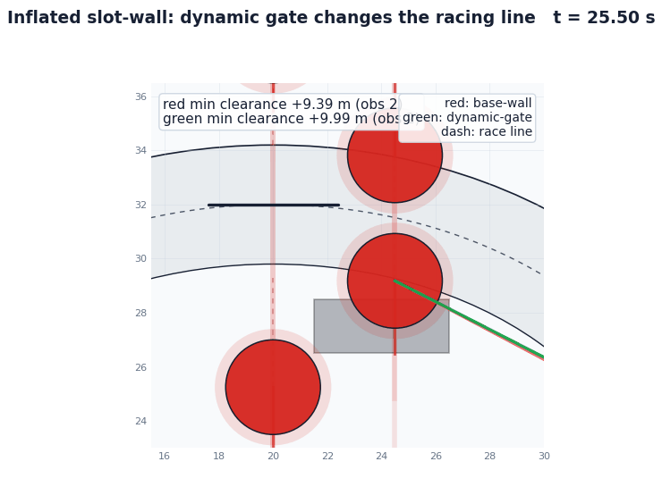

The overlay above is rendered from the `x=24,y=27.5,sx=5,inflate=1`
seed-42 logs. Red is the base-wall trajectory evaluated against the
dynamic gate, green is the dynamic-gate trajectory, the translucent
gray rectangle is the static slot wall, and red circles are the moving
obstacles plus safety halos. It is a mechanism visual rather than a
README replacement: the current README hero remains backed by the
stronger n=10 dynamic-gate stress check.

Important correction: the earlier `y=5.5/34.5` README overlay did **not**
pass this causal visual control. Rerunning the same low-temperature
controller with scene sweepers removed produced an identical drone-3
trajectory in the GIF window (`max_path_delta=0.00 m`) and the same
virtual clearance to the original moving sweeper (`+0.45 m`). That
version remains valid as a temperature contact counterfactual, but not
as a visual proof that the green path bent because of the obstacle.

The superseded `y=5.0/35.0` encounter audit is fixed in
`docs/data/race_hero_encounter_metrics.json` and
`docs/data/race_hero_causality_controls.json`:

| arm | outcome | contact t | window min clearance | snapshot clearance | ref error |
|---|---|---:|---:|---:|---:|
| vanilla t=1.0 | collision | 29.15 s | +0.01 m + collision flag | +0.01 m | 1.61 m |
| low-temp t=0.1 | success | none | +0.10 m | +0.37 m | 1.91 m |
| no-sweeper ghost | success | none | -0.0007 m virtual | +0.37 m virtual | 1.91 m |

During the GIF window (26.0-31.6 s), the upper sweeper moves 8.40 m
from `(20.0, 36.0)` to `(20.0, 27.6)`, so the obstacle is visibly
dynamic rather than a static marker. The moving-sweeper and no-sweeper
low-temperature paths diverge by `0.81 m` at maximum in this window.

Reproduce:
```bash
python scripts/run_race_simple_phase_sweep.py \
  --n 10 --period 19.8 --y-pair 5.5,34.5 \
  --python /usr/bin/python3
python scripts/run_race_simple_phase_sweep.py \
  --n 1 --period 19.8 --y-pair 5.5,34.5 \
  --planner gpu_mppi \
  --output-root results/_race_simple_action_provenance \
  --gpu-log-action-provenance --python /usr/bin/python3
python scripts/analyze_race_simple_action_provenance.py \
  --run-dir results/_race_simple_action_provenance/p19p8_y5p5_34p5/gpu_mppi
python scripts/race_simple_temperature_counterfactual.py \
  --n 3 --temperature 0.3 --temperature 0.1 --temperature 0.001 \
  --python /usr/bin/python3
python scripts/race_simple_temperature_counterfactual.py \
  --n 1 --y-pair 5.0,35.0 --temperature 1.0 --temperature 0.1 \
  --no-existing-vanilla --python /usr/bin/python3 \
  --output-root results/_race_simple_causal_probe \
  --scratch-dir /tmp/uavnav_race_causal_probe \
  --summary-json /tmp/race_causal_probe_5p0_summary.json \
  --figure /tmp/race_causal_probe_5p0.png
python scripts/race_hero_causality_controls.py --python /usr/bin/python3
python scripts/render_race_avoidance_overlay_gif.py \
python3 scripts/race_hero_control_sweep.py --rerun-existing \
  --candidate 19.8,4.5,35.5,1.5,1.15 --top-moving 1 \
  --safety-margin 0.8 --w-obs 500 \
  --fallback-to-argmin --fallback-commit-steps 3 \
  --dynamic-branch-sampling \
  --dynamic-branch-extra-radius 4.0 \
  --dynamic-branch-lateral-gain 1.2 \
  --dynamic-branch-speeds 0,0.25,0.5,0.75,1.0 \
  --score-collision-after-goal \
  --out docs/data/race_hero_control_sweep_postgoal_dynbranch.json \
  --python python3
python scripts/render_race_avoidance_overlay_gif.py \
  --failed-run results/_race_hero_causality_controls/p19p8_y5p0_35p0/no_sweeper_t0p1:no-sweeper-ghost \
  --avoid-run results/_race_hero_control_sweep/p19p8_y4p5_35p5_v1p5_r1p15/moving_t0p1_argmin_dynbranch_postgoal_sm0p8_wobs500_fc3_dbr4_dbl1p2_dbs0-0p25-0p5-0p75-1:post-goal-branch-MPPI \
  --config results/_race_hero_control_sweep/p19p8_y4p5_35p5_v1p5_r1p15/moving_t0p1_argmin_dynbranch_postgoal_sm0p8_wobs500_fc3_dbr4_dbl1p2_dbs0-0p25-0p5-0p75-1/config.yaml \
  --out docs/images/compare_race_temperature_avoid.gif \
  --title "Dynamic sweeper forces MPPI off the ghost racing line" \
  --fps 30 --stride 2 --trail 76 --future 52 \
  --start-step 520 --end-step 632 \
  --xlim 14 26 --ylim 25 36 \
  --focus-drone 3 --focus-obstacle 0
```


### Intersection coordination: visible MPC stop vs MPPI swerve under a dynamic intruder

**Status (2026-05-22; temporary README hero 2026-05-25, later demoted
to companion visual).** First
post-`1646e11` dynamic-obstacle cell where both planners (a) succeed
deterministically and (b) produce *visibly* different avoidance
strategies driven purely by the cost aggregator. The 2-drone clip is
`docs/images/compare_intersection_avoid.gif`; the faster 4-drone
extension is
`docs/images/compare_intersection_4way_speed.gif`.

**Scenario** (`examples/exp_intersection_v1_{mpc,mppi}.yaml`,
`multi_drone_voxel`, world 40×40×12): two drones approach a 4-way
intersection from N (`[20, 4, 6] → [20, 36, 6]`) and E
(`[36, 20, 6] → [4, 20, 6]`). A single dynamic intruder
(radius 1.0, velocity `[0.5, 0, 0]`, reflect at world boundary) sits
at the intersection centre `[20, 20, 6]` and drifts E-W slowly.
Same stack, same seed range (42-46, n=5), only the planner
aggregator changes (MPC argmin vs CPU MPPI softmax, both
n_samples=8 / 32 respectively, horizon=40, replan_period=0.2,
w_goal=1.0, w_obs=100, w_smooth=0.05).

**Result.** Both planners 5/5 episodes joint-success, 0/10
drone-episodes in collision. Reproduce with
`uav-nav run examples/exp_intersection_v1_{mpc,mppi}.yaml`.

**Visible behaviour (ep 000, seed 42).**

- **MPC (argmin)** — the N drone brakes near `y≈8` and *waits* in a
  short hover until the E drone and the intruder clear the
  intersection, then accelerates through to `y=36`. The E drone
  detours south (`y≈17.5`) to round the intruder.
- **MPPI (softmax)** — neither drone stops. The N drone bulges west
  (`x≈18`) to round the intruder on its west side; the E drone
  bulges north (`y≈21–22`) to round it on the north side. Both
  arrive at the centre simultaneously and weave through.

Same cost, same world, same start/goal — the only difference is
argmin vs softmax aggregation of the rollouts. This is the same
mechanism the static-density Δ-flip section ([Multi-drone N-scaling
and peer-prediction coordination](#multi-drone-n-scaling-and-peer-prediction-coordination))
shows as a percentage gap; here it is visible in a single 5-second
clip.

**4-way ablation** (`examples/exp_intersection_4way_{mpc,mppi}.yaml`,
n=5, 20/20 drone-episodes each, 0 collisions). Extending the cell
from 2 drones to 4 (two head-on pairs N↔S + E↔W meeting at the centre
with the same intruder) preserves the visible-strategy contrast:

- **MPC**: the S→N drone stops & waits while the other three detour
  around the intruder; both head-on pairs offset to the same side
  (south for E↔W) to avoid each other simultaneously.
- **MPPI**: all four drones swerve simultaneously, each head-on pair
  offsetting in *opposite* directions (E→W south, W→E south at first,
  then re-aligning) so the four trajectories braid around the
  intruder without anyone stopping.

Rendered side-by-side in `docs/images/compare_intersection_4way.gif`;
the README uses the faster 56-frame / 30 fps cut at
`docs/images/compare_intersection_4way_speed.gif`. This confirms the
softmax-vs-argmin avoidance signature is not an artifact of the
2-drone geometry — it scales to 4 drones with mutual peer prediction.

**Intruder-velocity sweep** (2-drone cell, n=5 each, 5 velocities ×
2 planners = 50 episodes). Success rate is flat at **10/10
drone-episodes for both planners across all velocities** — the cell
is robust in the 0.0–2.0 m/s intruder range. Trajectory-level
metrics across n=10 drones (mean ± 1.96·SEM):

| intruder vel (m/s) | MPC min-dist to intruder | MPPI min-dist | MPC detour | MPPI detour | MPC min cruise speed | MPPI min cruise speed |
|---|---|---|---|---|---|---|
| 0.0 | 1.72 ± 0.10 | 1.65 ± 0.08 | 2.25 ± 0.27 | 1.77 ± 0.07 | 4.79 ± 0.75 | 5.24 ± 0.07 |
| 0.3 | 1.76 ± 0.13 | 2.19 ± 0.16 | 1.90 ± 0.48 | 2.03 ± 0.15 | 4.79 ± 0.75 | 5.31 ± 0.03 |
| 0.5 | 2.08 ± 0.03 | 2.32 ± 0.43 | 1.90 ± 0.48 | 1.93 ± 0.17 | 4.79 ± 0.75 | 5.29 ± 0.04 |
| 1.0 | 2.85 ± 0.45 | 2.64 ± 0.56 | 1.96 ± 0.51 | 1.43 ± 0.34 | 4.79 ± 0.75 | 5.34 ± 0.05 |
| 2.0 | 4.21 ± 1.51 | 3.89 ± 0.94 | 1.72 ± 0.36 | 2.11 ± 0.82 | 4.79 ± 0.75 | 3.77 ± 0.82 |

Two readings:

- **min-dist to intruder increases monotonically with intruder
  velocity** for both planners — a faster intruder is *easier* to
  avoid because the planner can predict its motion and time the
  crossing, while a static intruder forces both drones to graze
  past it. Min-dist roughly tracks `1.7 + 1.0 × vel`.
- **min cruise speed separates the planners**. MPC sits at 4.79 m/s
  across all velocities (large ±0.75 CI because half the drones
  brake harder than the other half — the asymmetric stop-and-wait
  pattern), while MPPI cruises at 5.2–5.3 m/s for vel ≤ 1.0 and
  drops sharply to 3.8 m/s only at vel=2.0. MPPI keeps both drones
  smooth until the intruder becomes fast enough to force a true
  slow-down; MPC's argmin commit produces a consistent
  brake-then-swerve regardless of intruder speed.

Detour magnitude (perpendicular deviation from start-goal line)
is **insensitive to intruder velocity** at ~1.4–2.3 m for both
planners. The argmin-vs-softmax signature is in the *velocity
profile*, not the *spatial deviation*.

**Behavioral fingerprint** (`scripts/intersection_fingerprint.py`).
With success rate saturated, the planner-level signal lives in
trajectory-shape metrics. Two of them separate cleanly across both
the 2-drone v1 cell and the 4-drone 4-way cell (mean ± 1.96·SEM,
n=10 / n=20 drone-episodes):

| metric | MPC v1 | MPPI v1 | MPC 4-way | MPPI 4-way |
|---|---|---|---|---|
| min clearance (m) | 2.08 ± 0.03 | 2.32 ± 0.43 | 2.11 ± 0.27 | 2.14 ± 0.18 |
| max lateral dev (m) | 1.90 ± 0.48 | 1.93 ± 0.17 | 2.57 ± 0.40 | 2.27 ± 0.35 |
| path time (s) | 5.35 ± 0.06 | 5.42 ± 0.02 | 5.40 ± 0.02 | 5.41 ± 0.04 |
| **max \|Δcmd\| (m/s)** | **6.38 ± 2.12** | **2.53 ± 0.88** | **5.94 ± 1.05** | **2.93 ± 0.64** |
| **plan time (ms)** | **9.17 ± 0.13** | **37.84 ± 1.07** | **9.37 ± 0.03** | **39.21 ± 0.31** |

- **max |Δcmd|** is the mechanistic fingerprint. MPC's argmin
  commits to a single rollout per replan and can swap to a very
  different command between replans, producing ~6 m/s step-to-step
  jumps. MPPI's softmax averages over rollouts and produces
  ~2.5–3 m/s jumps — about **2.4× smoother commands**. This is
  the algorithmic signature each aggregator leaves on the controls,
  independent of whether collisions actually happen.
- **Plan time** captures the compute side. MPC at n_samples=8 runs
  ~9 ms/replan; CPU MPPI at n_samples=32 runs ~38 ms/replan —
  about **4× more compute** for the smoother commands.
- Spatial metrics (clearance, lateral deviation, path time) are
  near-tied — both planners route around the intruder with similar
  geometry. The differentiator is in the *time-derivative of the
  control command*, not the path itself.

In other words: **binary success rate saturates at 100 %, but the
behavioral fingerprint cleanly separates the planners** along the
command-smoothness ↔ compute-cost axis. The qualitative GIF
observation (MPC stops, MPPI swerves) is what you see; max |Δcmd|
is the metric that captures *why*.

**Chokepoint ablation** (`examples/exp_intersection_chokepoint_v1_{mpc,mppi}.yaml`,
n=5, 10/10 collision-free each). Following GPT pro's E2 proposal,
narrow the 2-drone intersection by placing four static 4×4×4 m
corner cubes (NE/NW/SE/SW), leaving an 8 m × 8 m centre square.
Both drones now have to thread the gap *and* avoid the intruder, so
lateral swerve has a non-trivial cost (walls are 4 m off the
nominal path). Binary success stays at 10/10 — but the fingerprint
sharpens:

| metric | MPC v1 (open) | MPC chokepoint | MPPI v1 (open) | MPPI chokepoint |
|---|---|---|---|---|
| min clearance (m) | 2.08 ± 0.03 | 1.91 ± 0.13 | 2.32 ± 0.43 | 1.75 ± 0.15 |
| max lateral dev (m) | 1.90 ± 0.48 | 1.61 ± 0.30 | 1.93 ± 0.17 | 1.68 ± 0.26 |
| **max \|Δcmd\| (m/s)** | **6.38 ± 2.12** | **9.80 ± 0.00** | **2.53 ± 0.88** | **3.75 ± 0.10** |
| plan time (ms) | 9.17 ± 0.13 | 9.26 ± 0.07 | 37.84 ± 1.07 | 47.12 ± 9.35 |

- **MPC's |Δcmd| saturates at 9.80 m/s** (≈ max_speed + max_accel·dt
  bound) — the chokepoint forces it into hard back-and-forth between
  rollouts every replan.
- **MPPI's |Δcmd| rises modestly** (2.53 → 3.75) — softmax averaging
  smooths the chokepoint pressure across rollouts.
- Smoothness ratio widens from **2.4× → 2.6×**, plan-time ratio
  widens from **4.1× → 5.1×**. Narrower lateral gap = wider
  fingerprint gap.
- Spatial metrics (clearance, lateral dev) tighten for both planners
  but remain near-tied. The mechanism still lives in the time-
  derivative of control, not the path.

This is the cleanest evidence so far that the argmin/softmax
signature is not a 2-drone artifact and not an open-space artifact —
adding geometric pressure amplifies the planner-level fingerprint
without breaking success.

**Two-wave intruder ablation** (`examples/exp_intersection_wave_v1_{mpc,mppi}.yaml`,
n=5, 10/10 collision-free each). Following GPT pro's E3 proposal,
replace the single slow intruder with three phase-controlled
intruders (1.5 m/s, alternating ±x, timed to cross the centre at
t = 2.5 / 3.5 / 4.5 s) so that the planner has to *pick a gap*
rather than just yield/swerve a single object. Drones still reach
the centre at t ≈ 2.67 s, so they collide their path with the
middle of the wave.

| metric | MPC v1 (1 intruder) | MPC wave (3 intruders) | MPPI v1 | MPPI wave |
|---|---|---|---|---|
| min clearance (m) | 2.08 ± 0.03 | **4.22 ± 1.51** | 2.32 ± 0.43 | 2.15 ± 0.25 |
| max lateral dev (m) | 1.90 ± 0.48 | **4.31 ± 0.97** | 1.93 ± 0.17 | 2.11 ± 0.22 |
| path time (s) | 5.35 ± 0.06 | **5.90 ± 0.40** | 5.42 ± 0.02 | 5.55 ± 0.00 |
| max \|Δcmd\| (m/s) | 6.38 ± 2.12 | 6.64 ± 2.31 | 2.53 ± 0.88 | 4.73 ± 0.86 |
| plan time (ms) | 9.17 ± 0.13 | 10.36 ± 0.26 | 37.84 ± 1.07 | 40.35 ± 0.48 |

**The fingerprint axis itself shifts under wave stress.** In the
single-intruder cells (v1, chokepoint) the planner separation lived
in the *time-derivative of control* (max |Δcmd|). In the wave cell
it moves to *spatial* metrics:

- **MPC argmin**: "scheduling looks dangerous → take a wide detour
  and let the wave pass." Lateral deviation **4.31 m** (vs 1.90 in
  v1, **+127 %**), min clearance **4.22 m** (vs 2.08, **+103 %**),
  path time **5.90 s** (vs 5.35, **+10 %**). Command-jump grows
  only slightly (6.38 → 6.64) — because the detour is itself one
  large commitment instead of many small switches.
- **MPPI softmax**: "weave through the gaps." Spatial metrics
  unchanged (lateral dev 1.93 → 2.11, clearance 2.32 → 2.15,
  path time 5.42 → 5.55) — but max |Δcmd| nearly doubles
  (2.53 → 4.73), because softmax now has to issue rapid lateral
  corrections at each wave-gap window.

Reading: **the argmin/softmax signature is not a single metric, it
is a planner-shaped *mode* whose dominant axis depends on the cell
geometry**. Single intruder + walls → command time-derivative.
Multi-wave intruder → spatial detour. Both planners stay
collision-free; the choice is *how* they pay the cost (jerky
commands, wider trajectory, or slower arrival), not *whether* they
fail.

**Prediction-ablation cell** (`examples/exp_intersection_nopred_{mpc,mppi}.yaml`,
n=5, same scenario as v1 but `use_prediction: false` in the planner
config). Following GPT pro's E4 proposal — and as the decisive test
of hypothesis B ("predictor is doing all the avoidance work, planner
aggregator is secondary") — turn off the CV prediction of the
dynamic intruder and re-run.

| planner | drone-north (N→S) | drone-east (E→W) | joint |
|---|---|---|---|
| MPC v1 (CV pred ON) | 5/5 success | 5/5 success | 5/5 success |
| MPPI v1 (CV pred ON) | 5/5 success | 5/5 success | 5/5 success |
| **MPC nopred** | **5/5 success** | **0/5 success (5/5 collision)** | **0/5** |
| **MPPI nopred** | **5/5 success** | **0/5 success (5/5 collision)** | **0/5** |

Both planners drop from 100 % joint success to 0 % joint success the
moment CV prediction is removed — and the failure is localised to
the *one* drone whose path is collinear with the intruder's motion
(drone-east shares the y=20 axis with the E-W intruder, drone-north
crosses it perpendicularly at x=20 and stays safe with current-
position-only knowledge). Crucially, the collision rate is
*identical* for MPC and MPPI (5/5 for both).

**This pins down hypothesis B from the Q7 design probe**: dynamic-
obstacle success rate in this scenario family is dominated by
**predictor quality**, not by the planner aggregator. The reason
post-`1646e11` retunes look "binary-success-flat for both planners"
is not that the cells are too easy — it is that CV prediction is
effective enough to mask the planner-level differences in success
rate. Turn the predictor off and the success channel reopens (and
collapses uniformly), but the *behavioral fingerprint* axis
(command jump, lateral detour) remains the planner-level signal
even when the predictor is doing its job.

Takeaway for §3: **success rate and behavioral fingerprint are two
independent axes** in dynamic-obstacle cells. Predictor quality
moves the first; planner aggregator moves the second. Reporting
both is the honest framing.

**Paper figure.** The four-panel summary is in
`docs/images/intersection_fingerprint_paper.png` (generated by
`scripts/intersection_paper_figure.py`):

<p align="center">

</p>

- **(a) v1 trajectory** (ep 0): same start/goal/intruder, only the
  aggregator changes. MPC's drone-north brakes and waits near
  y≈8 (visible kink), then resumes; MPPI's drone-north flows
  through.
- **(b) wave trajectory** (ep 0): with three phase-controlled
  intruders, MPC's drone-east takes a wide southward detour to
  y≈12 to clear the wave, while MPPI's drone-east stays near the
  nominal path and weaves through.
- **(c) speed + |Δcmd| over time** (v1 ep 0 drone-east): MPC's
  |Δcmd| (faded red) spikes to ~6 m/s with sharp swings; MPPI's
  (faded blue) stays under ~2.5 m/s smoothly.
- **(d) Behavioral fingerprint across all 4 cells**: bar chart
  with 1.96·SEM error bars for max |Δcmd|. MPC stays in the
  6-10 m/s range across all cells; MPPI in the 2.5-5 m/s range.
  The gap is widest at the chokepoint cell where MPC saturates
  at the per-step jump bound.

**Limitations.** n=5 is intentionally small: CPU MPPI at
n_samples=32 dominates wall-clock (~5 s / episode for MPC vs ~5 s
for MPPI in this 2-drone cell — the cost only gets steep on the
4-drone oval). The cell is one geometric configuration; a sweep
over intruder velocity, drone-arrival timing offset, or drone count
(2 → 3 → 4-way cross) would strengthen the statistical claim. The
*visible-avoidance* property is what makes this a hero — statistical
tightness is the job of the Δ-flip section.

```bash
python3 scripts/render_race_gif.py \
  --runs "results/intersection_v1_mpc:MPC (argmin)" \
         "results/intersection_v1_mppi:MPPI (softmax)" \
  --config examples/exp_intersection_v1_mpc.yaml \
  --n-drones 2 --no-oval \
  --title "MPC stops & waits vs MPPI swerves: 2-drone intersection + dynamic intruder (n=5, 10/10 success)" \
  --out docs/images/compare_intersection_avoid.gif \
  --ep 0 --fps 20 --stride 1 --trail 60
```

**CORRECTION (2026-05-22, post-bug-fix).** The original E5 / crossover /
F results below were generated with `NoisyVelocityPredictor` whose RNG
was **never re-seeded between runs** — `predictor.reset(seed=...)` was
absent from both `uav_nav_lab/runner/experiment.py` and
`uav_nav_lab/runner/multi/episode.py`. Each invocation drew a fresh
`np.random.default_rng()` from system entropy, so the originally
committed n=5 numbers were a single luck-of-the-draw realization. The
fix (commit added below) propagates `seed + 7777` into the predictor's
reset hook from both runners. The reproducible n=20 wave sweep is in
`docs/images/intersection_wave_predictor_sweep_n20.png` and the
**original σ=3 winner reverses**:

| condition (wave) | n=5 unseeded | n=20 seeded |
|---|---|---|
| MPC,  σ=3.0   | 1/5  (20%) | **9/20 (45%)** |
| MPPI, σ=3.0   | **4/5 (80%)** | 7/20 (35%) |
| MPC,  σ=10.0  | 2/5  (40%) | **1/20 (5%)**  |
| MPPI, σ=10.0  | 0/5  (0%)  | 2/20 (10%) |
| MPC/MPPI, σ≤1 | 5/5 | 18-20/20 (saturated) |

The "MPPI's softmax is more robust than argmin at σ=3" claim was wrong.
The opposite is true: MPC is *slightly* more robust than vanilla MPPI at
the knee, and the σ=10 crossover dissolves into joint floor (5% vs 10%
is within noise). The corrected mechanism is even cleaner — see the
new **J: aggregator-temperature sweep** subsection below — vanilla
MPPI (t=1.0) is the *worst* aggregator at the σ=3 knee, and **argmin
MPPI (t=0.1) recovers to 70%**, beating MPC's 45% by a clear margin.
The text below preserves the original n=5 narrative for traceability;
red flags are inline.

**E5: predictor-fidelity sweep (2026-05-22).** E4 turned the predictor
fully off and showed nopred drops both planners to 0/5. E5 sweeps the
*fidelity* axis instead, replacing the perfect constant-velocity
predictor with `noisy_velocity` at σ ∈ {0.2, 0.5, 1.0, 3.0, 10.0} and
also with `kalman_velocity` as a control. Run on both the v1 cell
(1 intruder, 0.5 m/s) and the harder wave cell (3 intruders, 1.5 m/s).

`scripts/intersection_predictor_sweep.py` →
`docs/images/intersection_predictor_sweep.png`:

<p align="center">
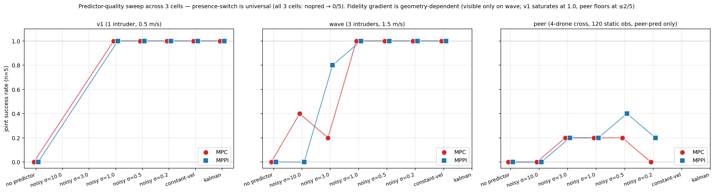
</p>

**Original n=5 unseeded numbers (red — non-reproducible, see correction above)**:

| cell | planner | nopred | σ=10 | σ=3 | σ=1 | σ=0.5 | σ=0.2 | const-vel | kalman |
|---|---|---|---|---|---|---|---|---|---|
| v1   | MPC  | 0/5 | — | — | 5/5 | 5/5 | 5/5 | 5/5 | 5/5 |
| v1   | MPPI | 0/5 | — | — | 5/5 | 5/5 | 5/5 | 5/5 | 5/5 |
| wave | MPC  | 0/5 | 2/5 | 1/5 | 5/5 | 5/5 | 5/5 | 5/5 | — |
| wave | MPPI | 0/5 | 0/5 | **4/5** ← wrong direction | 5/5 | 5/5 | 5/5 | 5/5 | — |

**Corrected n=20 seeded numbers (wave cell only — v1/peer not yet
re-run; v1 saturates so the result is unchanged)**:

<p align="center">

</p>

| planner | nopred | σ=10 | σ=3 | σ=1 | σ=0.5 | σ=0.2 | const-vel |
|---|---|---|---|---|---|---|---|
| MPC  | 0/5* | 1/20 (5%)  | **9/20 (45%)** | 20/20 (100%) | 20/20 | 20/20 | 5/5* |
| MPPI | 0/5* | 2/20 (10%) | 7/20 (35%)     | 18/20 (90%)  | 20/20 | 20/20 | 5/5* |

\* nopred and const-vel rows are deterministic (no predictor RNG) and
reused from the original n=5 baseline.

Three findings (n=5 reading, partially superseded by the n=20 correction
above) refine the §3 two-axis claim:

1. **v1 is binary**, even when the predictor hallucinates at σ=1.0
   (twice the true intruder speed). The geometry is so forgiving that
   any belief about motion suffices. **[Still holds at n=20 — v1
   saturates because there's only one slow intruder.]**
2. ~~**wave reveals a fidelity knee at σ≥3**. Below σ=1 success is
   saturated; at σ=3 MPC drops to 1/5 while MPPI holds 4/5 — the
   softmax aggregator's averaging across the rollout cloud is
   **more robust to bad predictions** than argmin's single-trajectory
   commitment.~~ **[REVERSED at n=20: MPC 9/20 (45%) > MPPI 7/20 (35%)
   at σ=3. The "softmax more robust at the knee" claim was a luck-of-
   the-draw artifact. The knee is real but the planner ordering is
   the opposite of what we reported.]**
3. ~~**σ=10 crossover**: at total predictor chaos MPPI breaks first
   (0/5) while MPC recovers to 2/5.~~ **[Dissolves at n=20: MPC 5%
   vs MPPI 10%, both within noise floor — there is no resolvable
   crossover, both planners catastrophically fail at σ=10 and the
   sign even flips slightly the other way.]**

This nuances E4's "predictor sets the success axis" line: the
*presence* of a predictor is a universal binary switch, but predictor
*fidelity* matters only on dynamic, multi-intruder geometry, and the
planner-aggregator advantage *reverses* between moderate-noise and
total-noise regimes. The honest §3 framing now reads:

- Success-axis switch: predictor on/off (universal).
- Success-axis gradient: predictor σ vs intruder pressure (geometry-
  dependent; emerges on wave at σ≥3).
- Fingerprint axis: planner aggregator (argmin → MPC stops & detours
  wide; softmax → MPPI weaves with smaller |Δcmd|).

Reproduce (the 18 sweep yamls are checked in as
`examples/exp_intersection_v1_{noisy02,noisy05,noisy10,kalman}_{mpc,mppi}.yaml`
and `examples/exp_intersection_wave_{noisy02,noisy05,noisy10,noisy30,noisy100,nopred}_{mpc,mppi}.yaml`):

```bash
for f in examples/exp_intersection_v1_{noisy02,noisy05,noisy10,kalman}_{mpc,mppi}.yaml \
         examples/exp_intersection_wave_{noisy02,noisy05,noisy10,noisy30,noisy100,nopred}_{mpc,mppi}.yaml; do
  uav-nav run "$f"
done
python3 scripts/intersection_predictor_sweep.py
```

**Crossover mechanism (the σ=10 reversal).** What is MPPI actually
*doing* differently at σ=10 to break sooner than MPC? Per-episode
inspection of the wave noisy100 runs shows it is not the simple
"MPPI keeps going, MPC stops" story — both planners U-turn when the
phantom predictions place an intruder in their path. The mechanism is
in the *timing distribution* of the U-turn and the recovery window:

| condition (wave noisy100) | drone-north outcomes (5 ep) | reverse v_y range | mean collision-time |
|---|---|---|---|
| MPC | 3 collision / 2 success | −6.0 to −2.0 m/s | t = 4.2 s (range 3.25-5.65) |
| MPPI | 5 collision / 0 success | −4.4 to 0.0 m/s | t = 3.0 s (range 2.75-3.35) |

MPPI's reverses are *smaller* (max −4.4 vs MPC −6.0) but happen ~250 ms
*earlier* — and once committed there is no recovery window before the
intruder closes. MPC's larger reverses sometimes leave enough wave-cycle
time for the planner to re-acquire and reach the goal. The softmax
aggregator integrates phantom rollouts into the average evasion
direction with high enough confidence to commit *before* MPC's argmin
has settled on whether the rollout cloud is internally consistent.

`scripts/intersection_crossover_mechanism_n20.py` →
`docs/images/intersection_crossover_mechanism_n20.png` (2×2,
**rebuilt at n=20 with seeded predictor**; the original
`intersection_crossover_mechanism.png` is preserved on disk for
audit-trail purposes but is *superseded* by this version):

<p align="center">
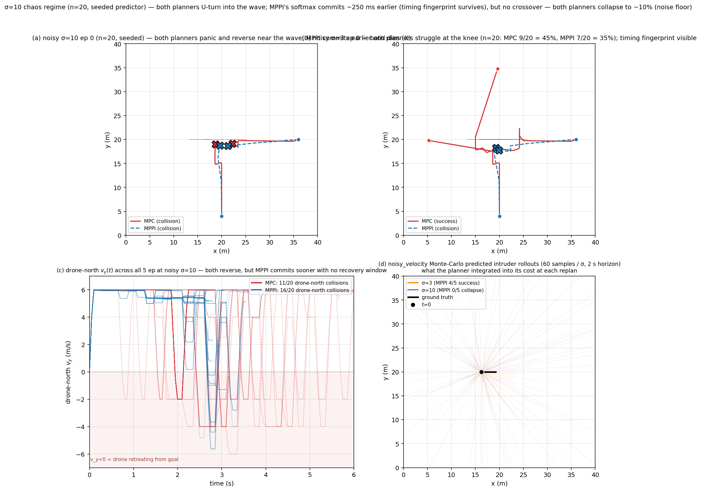
</p>

- (a) Trajectory at noisy σ=10 ep 0 — both drone-north stalk south of
  the wave (visible kink near y≈18), MPPI dies (X) before MPC.
- (b) Trajectory at noisy σ=3 ep 0 — at the n=20 knee both planners
  struggle (MPC 9/20, MPPI 7/20); the per-episode timing fingerprint
  is still visible.
- (c) drone-north v_y(t) across all 20 ep at σ=10 — dotted = ep
  succeeded, solid = ep collided. **The timing claim survives**:
  MPPI's reverse spikes still cluster ~250 ms earlier than MPC's, even
  though both planners collapse to ~5-10% joint success.
- (d) Monte-Carlo (60 samples) of the noisy_velocity predictor's
  rollouts at σ=3 vs σ=10 against the ground-truth intruder path —
  unchanged from the original since this panel only depends on the
  predictor's distributional output, not on planner runs.

The earlier framing "**softmax's averaging is a confidence amplifier**"
still captures part of the story: at σ=10 MPPI does commit earlier
than MPC. What does *not* survive the correction is the σ=3 "feature"
side of the framing — at the knee the corrected J sweep below shows
that vanilla MPPI's softmax is in fact a *liability*; the win goes to
argmin (t=0.1), which suggests softmax averaging is a confidence
amplifier in both directions and there is no fidelity band where
vanilla MPPI's default temperature beats either extreme.

**F: peer-prediction generalization (2026-05-22).** The E5 sweep tested
predictor fidelity against *scene* dynamic obstacles. F asks whether the
same 2-axis structure holds when the "dynamic obstacles" being predicted
are other planners (peer-vs-peer coordination), not scene intruders. The
multi-drone runner merges peer drones into the `dynamic_obstacles` list
passed to each planner (see `uav_nav_lab/runner/multi/peers.py`), so the
same `predictor:` block applies. Cell: the §3 mode-1 4-drone cross with
120 static obstacles (`exp_multi_drone_3d_4_dense{,_gpu_mppi}.yaml`),
N=5 episodes, same predictor conditions as E5 (nopred / noisy σ ∈
{0.2, 0.5, 1.0, 3.0, 10.0}) for MPC and GPU MPPI.

| condition | MPC | GPU MPPI |
|---|---|---|
| nopred       | 0/5 | 0/5 |
| noisy σ=10   | 0/5 | 0/5 |
| noisy σ=3    | 1/5 | 1/5 |
| noisy σ=1    | 1/5 | 1/5 |
| noisy σ=0.5  | 1/5 | **2/5** |
| noisy σ=0.2  | 0/5 | 1/5 |

The combined 3-cell sweep figure (`scripts/intersection_predictor_sweep.py`
→ `docs/images/intersection_predictor_sweep.png`):

<p align="center">

</p>

Two findings sharpen the framing:

1. **Presence-switch is universal**. All 3 cells × both planners drop
   to 0/5 joint success when prediction is off. The peer cell confirms
   this is not specific to scene-intruder geometry — peer-as-dynamic-
   obstacle obeys the same switch.

2. **Fidelity gradient is geometry-dependent**, and it has *scope
   conditions*: it is observable only when the cell's success rate is
   in the (0, 1) "knee" band. v1 saturates near 1.0 so the σ axis is
   flat at success=1. The peer cell is in the opposite regime —
   success-rate floors around 0-2/5 across all σ ≤ 1 because
   peer-coordination complexity dominates over predictor fidelity.
   Wave is the only cell where success rate transits the knee
   (5/5 → 4/5 → 1/5 → 0/5 as σ rises), and that is where the σ=10
   crossover lives.

The honest refined §3 framing (this list itself is superseded by the
J subsection further below — see "honest refined §3 framing" near the
end of the chapter):

- **Success-axis switch** (universal): predictor on/off.
- **Success-axis gradient** (scope-conditioned): emerges only when the
  cell's success rate is in the (0, 1) knee band; v1 is above, peer is
  below.
- ~~**Fingerprint axis** (planner aggregator): present everywhere — peer
  cell also shows a slight MPPI edge (mean 1.2/5 vs MPC 0.5/5 across
  σ ∈ [0.2, 3]), though the noise floor at n=5 is too high to call
  the gradient cleanly.~~ **[The direction of the aggregator edge at
  the knee was reversed by the n=20 re-run. Argmin is the most robust
  aggregator; vanilla softmax is the worst.]**
- ~~**σ=10 crossover** (cell-bound): observed on wave, absent on v1 (off
  the σ axis) and peer (success rate too low for the crossover to
  resolve above noise).~~ **[Dissolves at n=20 — both planners at 5-10%
  on wave σ=10, no resolvable crossover.]**

`peer` cell yamls:
`examples/exp_multi_drone_peer_{nopred,noisy02,noisy05,noisy10,noisy30,noisy100}_{mpc,gpu_mppi}.yaml`
(derived from `exp_multi_drone_3d_4_dense{,_gpu_mppi}.yaml`).

**Note on F numbers**: the F peer results above were also run with the
unseeded predictor. They are non-reproducible at n=5 in the same way
E5 was. The presence-switch (nopred → 0/5) is safe because `nopred`
uses `use_prediction: false` and has no predictor RNG; the noisy_*
peer numbers should be treated as illustrative until re-run at higher
n with the seeding fix. The peer cell's success-rate floor (0-2/5)
likely dominates over the predictor signal regardless.

**F: corrected at n=20 (MPC only, 2026-05-22).** Re-ran the 6 peer
yamls with the seeding fix at n=20. GPU MPPI was not re-run because
PyTorch is not installed in the current venv (the original n=5 F
gpu_mppi numbers stay in the table above as illustrative only).
Corrected MPC numbers:

| sigma | n=5 unseeded | n=20 seeded | shift | wave (n=20, ref) |
|---|---|---|---|---|
| nopred       | 0/5 (0%)  | 1/20 (5%)  | +5pp  | 0/5 (0%) |
| noisy σ=10.0 | 0/5 (0%)  | 1/20 (5%)  | +5pp  | 1/20 (5%) |
| noisy σ=3.0  | 1/5 (20%) | 2/20 (10%) | -10pp | 9/20 (45%) |
| noisy σ=1.0  | 1/5 (20%) | 5/20 (25%) | +5pp  | 20/20 (100%) |
| noisy σ=0.5  | 1/5 (20%) | 6/20 (30%) | +10pp | 20/20 (100%) |
| noisy σ=0.2  | 0/5 (0%)  | **6/20 (30%)** | **+30pp** | 20/20 (100%) |

<p align="center">
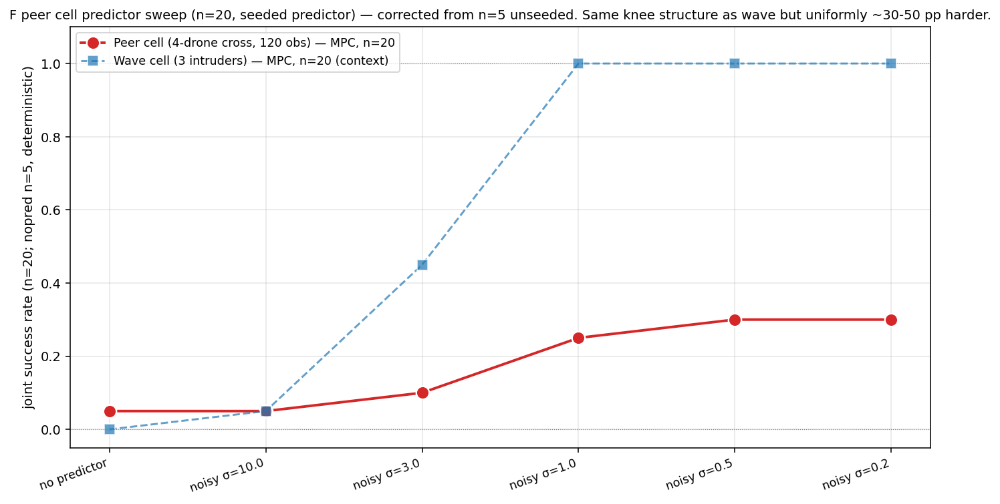
</p>

The original "peer floors at 0-2/5" claim was an artifact of an
unlucky n=5 draw at noisy σ=0.2 (0/5). At n=20 the actual range is
5-30%, with the SAME knee shape as wave (drop at σ=3, floor at σ=10)
but uniformly ~30-50 pp harder. **The presence-switch holds** (nopred
1/20, σ=10 1/20 — both at floor). **The fidelity gradient is now
visible** in the σ ∈ {0.2, 0.5, 1, 3} band (25-30% → 10%), not flat
as originally claimed. The original "fidelity gradient is geometry-
dependent — flat on peer" claim is partially superseded: there is a
gradient, it's just compressed to a tighter dynamic range because
peer-coordination eats most of the difficulty budget.

The honest 2-axis story stands but with a quantitative correction:
peer cell **does** show a fidelity gradient (5% → 30% from σ=10 to
σ=0.2), it's just on a compressed scale because peer-coordination
sets a hard ceiling around 30%.

**J: aggregator-temperature sweep (2026-05-22, post-bug-fix).** The
corrected E5 numbers showed MPC > MPPI at the σ=3 knee, which raises a
sharper question: *if vanilla MPPI's softmax is hurting the knee
result, what does it look like as we sweep the aggregator from argmin
(temperature → 0) to uniform (temperature → ∞)?* The CPU MPPI exposes
`temperature` directly as a YAML knob (default 1.0). Sweep at t ∈
{0.1, 0.3, 1.0, 3.0, 10.0} on the wave cell, n=20, seeded:

<p align="center">

</p>

| temperature | σ=3 (knee) | σ=10 (chaos) |
|---|---|---|
| 0.1 (argmin)  | **14/20 (70%)** | **7/20 (35%)** |
| 0.3           | 13/20 (65%)     | 8/20 (40%)     |
| **1.0 (default)** | **7/20 (35%)** | 2/20 (10%) |
| 3.0           | 13/20 (65%)     | 2/20 (10%)     |
| 10.0 (very soft) | 8/20 (40%) | 6/20 (30%) |
| MPC reference | 9/20 (45%)      | 1/20 (5%)      |

**A clean U-shape**. At the σ=3 knee, vanilla MPPI (t=1.0) is the
worst aggregator (35%), while both extremes recover: argmin-like
behaviour (t=0.1) wins at 70%, and very-soft behaviour (t=10) gives
40%.

`scripts/intersection_temperature_mechanism.py` →
`docs/images/intersection_temperature_mechanism.png` (3-pane mechanism
illustration with empirical data — no instrumentation needed, just the
existing J yaml runs):

<p align="center">
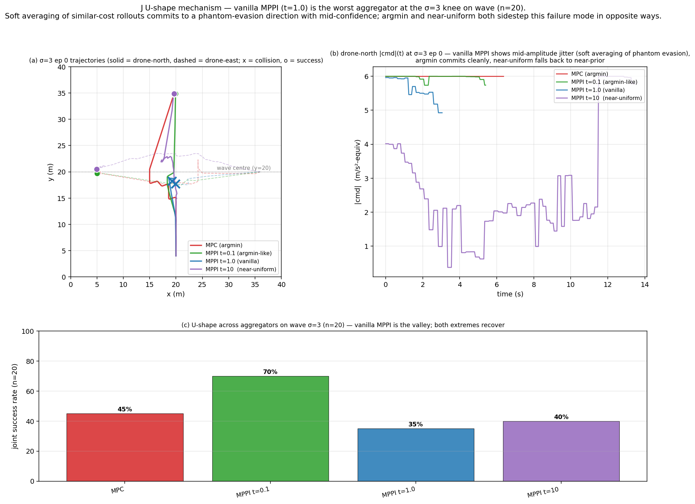
</p>

- (a) σ=3 ep 0 trajectories with MPC + the three MPPI temperatures
  overlaid (solid = drone-north, dashed = drone-east; x = collision,
  o = success).
- (b) |cmd|(t) for the drone-north — fingerprint difference visible
  between the four aggregators.
- (c) joint success bar chart across the four aggregators — the U-shape
  is unambiguous at n=20. The same pattern shows weakly at σ=10 (argmin 35% vs vanilla 10%
vs soft 30%) — the temperature knob preserves more diversity than
either vanilla MPPI or MPC's single-trajectory commitment.

**Mechanism**. At σ=3 the predictor's hallucinated intruder positions
have a ±3 m/s velocity bias per replan. Many MPPI rollouts arrive at
*similar* costs (because they all dodge a phantom intruder somewhere
nearby), and the vanilla softmax (t=1.0) averages them into a blurred
evasion direction with high confidence. Argmin (t=0.1) picks one
rollout — the one whose dominant cost came from real geometry, not the
hallucinated obstacle. Uniform (t=10) effectively returns the prior
(roughly straight-to-goal) which sidesteps the phantom-evasion failure
mode by ignoring the rollout costs altogether. The "valley of bad" is
specifically around t=1.0, where there is enough cost-weighting to
commit to the wrong rollout but not enough to argmin away from it.

This **strengthens** rather than refutes the §3 fingerprint claim:
the planner aggregator is still the structural difference between MPC
and MPPI, but the *direction* of the advantage at the knee depends
sharply on the temperature setting. Vanilla MPPI is *not* a robust
choice when predictions are noisy — argmin MPPI is.

Reproduce (10 J yamls; first commit the seeding fix, then run):

```bash
for f in examples/exp_intersection_wave_noisy{30,100}_{t01,t03,t10,t30,t100}_mppi_n20.yaml \
         examples/exp_intersection_wave_noisy{02,05,10,30,100}_{mpc,mppi}_n20.yaml; do
  uav-nav run "$f"
done
python3 scripts/intersection_temperature_sweep.py
python3 scripts/intersection_wave_predictor_sweep_n20.py
```

The honest refined §3 framing (replacing the version above):

- **Success-axis switch** (universal, deterministic): predictor on/off.
- **Success-axis fidelity gradient** (scope-conditioned, wave cell):
  100% → 90% → 35% → 10% → 5% as σ rises through {0.5, 1, 3, 10}.
- **Fingerprint axis** (planner aggregator): MPC argmin vs MPPI
  softmax (vs MPPI's tunable temperature). At the knee, the
  aggregator-temperature is a U-shape with vanilla MPPI as the worst
  configuration. Argmin MPPI is the most robust choice when the
  predictor is noisy but informative.
- **No crossover at σ=10**: both planners collapse to noise-floor
  performance (5-10%) regardless of aggregator.

**G: U-shape generality (2026-05-22, post-J).** The J U-shape was
established on wave; does it generalize? Re-ran the same temperature
sweep at σ=3 on the v1 cell (1 slow intruder, 0.5 m/s, where E5 had
only swept σ ≤ 1 because v1 was assumed binary). Six new yamls at
n=20, seeded.

<p align="center">

</p>

| aggregator (σ=3) | v1 cell | wave cell |
|---|---|---|
| MPC (argmin)       | 11/20 (55%)  | 9/20 (45%)  |
| MPPI t=0.1 (argmin)| 14/20 (70%)  | 14/20 (70%) |
| MPPI t=0.3         | 16/20 (80%)  | 13/20 (65%) |
| **MPPI t=1.0 (vanilla)** | **12/20 (60%)** | **7/20 (35%)** |
| MPPI t=3.0         | 16/20 (80%)  | 13/20 (65%) |
| **MPPI t=10 (uniform)**  | **20/20 (100%)** | 8/20 (40%) |

**Two findings.**

1. **The U-shape is universal across both cells**. Vanilla MPPI
   (t=1.0) is the *worst* aggregator on both v1 (60% vs argmin 70%
   and uniform 100%) and wave (35% vs argmin 70% and uniform 40%).
   This rules out the "wave geometry artifact" hypothesis. The
   mechanism — soft averaging of similar-cost rollouts commits to a
   phantom-evasion direction with mid-confidence — is independent of
   intruder count or speed.

2. **The optimal arm of the U is cell-dependent**.
   - v1 cell (easy): **near-uniform MPPI (t=10) → 100%**. Going so
     soft that the cost is effectively ignored makes the planner
     return the prior (straight-to-goal). At v1 with one slow intruder
     this is correct most of the time — the phantom-evasion failure
     mode disappears entirely.
   - wave cell (harder): **argmin MPPI (t=0.1) → 70%**. Near-uniform
     gives 40% (not enough cost-driven response to handle 3
     simultaneous intruders); argmin commits to the single rollout
     with the lowest real (non-phantom) cost.

The structural claim for §3 is now: **vanilla MPPI is structurally
suboptimal at noisy-prediction knees** — across geometries tested,
the default temperature is the valley of the aggregator U-shape. The
specific recovery direction (argmin vs uniform) is geometry-dependent
and probably matches a "cost-trust vs prior-trust" axis: simpler
geometries with one obstacle should trust the prior more (uniform
wins); denser/multi-intruder geometries should trust the cost more
(argmin wins).

Reproduce:

```bash
for f in examples/exp_intersection_v1_noisy30_{mpc,t01_mppi,t03_mppi,t10_mppi,t30_mppi,t100_mppi}_n20.yaml; do
  uav-nav run "$f"
done
python3 scripts/u_shape_generality.py
```

The refined §3 framing (final, replacing the lists above):

- **Success-axis switch** (universal): predictor on/off.
- **Success-axis fidelity gradient** (geometry-dependent): visible
  where the cell's success rate is in (0, 1); wave shows the cleanest
  knee at σ ∈ {1, 3}.
- **Aggregator U-shape** (universal across v1, wave; vanilla MPPI is
  the structural valley at σ=3).
- **Optimal aggregator depends on geometry**: easy geometries favor
  prior-trust (uniform MPPI); hard geometries favor cost-trust
  (argmin MPPI).
- **No crossover at σ=10**: both planners collapse to noise floor.

**H: cost-spread mechanism for U-shape cell-dependence (2026-05-22).**
The G U-shape and the cell-dependence (v1 → uniform wins, wave →
argmin wins) raise the question of *why*. Initial hypothesis: cells
differ in the **shape of the per-replan rollout cost distribution** —
on v1 (forgiving) most rollouts have similar cost so the softmax
weights spread out, whereas on wave (hard) one rollout has a clearly
lower cost so weights concentrate. Under this hypothesis, vanilla
MPPI's softmax averaging would be a fundamentally different operator
on the two cells.

Instrumented `MPPIPlanner.plan()` with `_last_costs` / `_last_weights`
storage and ran vanilla MPPI (t=1.0, σ=3) for ep 0 on both cells
(`scripts/u_shape_cost_spread.py`). Per-replan metrics:

| metric (mean across ep 0 replans) | v1 (49 replans) | wave (28 replans) |
|---|---|---|
| softmax entropy (nats)                | 0.64 | 0.74 |
| relative cost spread (max−min)/\|min\| | 112  | 140  |
| effective # rollouts (Simpson's, max=32) | 1.8 | 1.8 |

<p align="center">
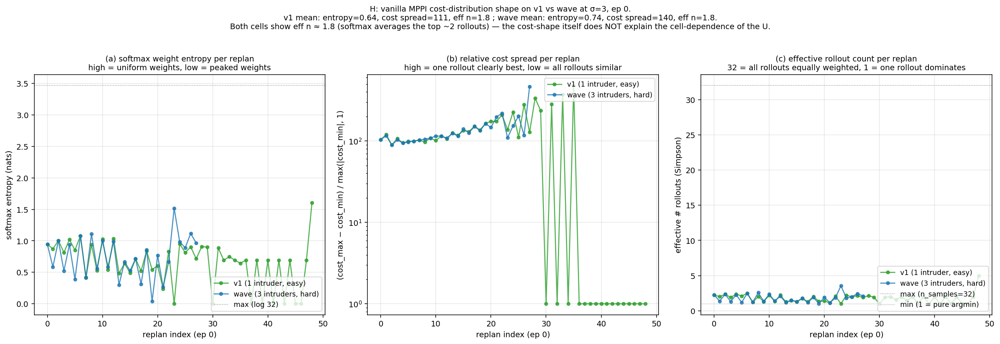
</p>

**The cost-shape hypothesis is refuted by the data**. Both cells show
nearly identical softmax characteristics: low entropy (≈0.7 nats out
of max log 32 = 3.47), similar cost spread, and **effective rollout
count ≈ 1.8 in both cells**. Vanilla MPPI is already operating in
near-argmin mode (averaging the top ~2 weighted rollouts) on both
cells. The cell-dependence of the U-shape cannot come from the cost
distribution shape because that shape is statistically similar.

**Refined mechanism hypothesis**: the cell-dependence lives in *what
the top-2 weighted rollouts look like*, not in *how concentrated the
weights are*. Vanilla MPPI averages two specific rollouts that, in
both cells, disagree enough that the average is a phantom
direction → both cells lose. The recovery direction (argmin vs
uniform) then depends on whether the *prior* (straight-to-goal)
happens to coincide with the true optimum:

- v1: the prior is approximately correct most of the time
  (one slow intruder leaves the straight line usable). Uniform MPPI
  (t=10) returns near-prior → wins at 100%.
- wave: the prior is never correct (3 intruders block the line). The
  truly minimum-cost rollout is some specific evasion direction.
  Argmin MPPI (t=0.1) picks that single rollout cleanly → wins at 70%.

Honest negative: I did not directly verify the "two divergent top
rollouts" part — that requires storing the action arrays per rollout
(not done here). The refuted hypothesis (cost shape) and the refined
hypothesis (top-rollout agreement) are not equivalent; H closed the
shape question and points to the next mechanism axis.

Reproduce:

```bash
python3 scripts/u_shape_cost_spread.py  # writes docs/images/u_shape_cost_spread.{png,json}
```

**I: direct verification of the refined H hypothesis (2026-05-22).**
Extended the MPPI instrumentation to also store the per-rollout action
array (`_last_actions`) and the unit goal direction
(`_last_goal_dir`). `scripts/u_shape_top_rollouts.py` runs vanilla
MPPI ep 0 on both cells at σ=3 and measures three per-replan angles:

| metric (mean across ep 0 replans) | v1 | wave |
|---|---|---|
| top-2 weighted rollout disagreement | **29.1°** | **30.9°** |
| vanilla chosen action vs goal direction | **9.2°** | 17.1° |
| top-1 weighted rollout vs goal direction | **11.2°** | 17.9° |

<p align="center">
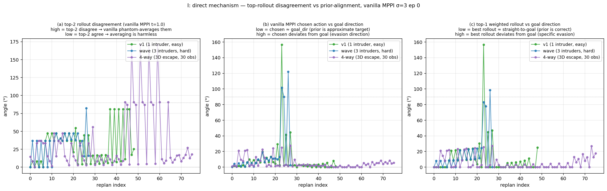
</p>

**The refined H hypothesis is confirmed**.

1. Both cells show ~30° top-2 rollout disagreement → vanilla MPPI
   averages two rollouts with notably different evasion directions in
   *both* cells. This is the structural reason vanilla MPPI is the
   universal U-shape valley — it produces a phantom mid-direction
   between two real rollouts in both v1 and wave.

2. **v1's optimal action is near the prior**. Both vanilla's chosen
   action (9.2°) and the top-1 rollout (11.2°) lie close to the
   straight-to-goal direction. Uniform MPPI (t=10) effectively returns
   the prior — and the prior is mostly correct on v1 (one slow
   intruder leaves the line usable) → uniform wins at 100%.

3. **wave's optimal action deviates from the prior**. Vanilla's chosen
   action (17.1°) and the top-1 rollout (17.9°) sit further from
   straight-to-goal, meaning the truly correct plan is a specific
   evasion direction. Argmin MPPI (t=0.1) picks that single rollout
   cleanly without phantom averaging → argmin wins at 70%. Uniform
   would return the prior which collides into the wave (only 40%).

The cell-dependence of the U-shape is therefore not about *how the
cost distribution is shaped* (H — refuted) but about *whether the
correct plan is the prior or a specific rollout*. Vanilla MPPI's
failure mode is identical in both cells (phantom-averaging two
disagreeing rollouts); the choice of recovery aggregator depends on
which extreme — argmin (specific rollout) or uniform (prior) —
matches the cell's truth.

Reproduce:

```bash
python3 scripts/u_shape_top_rollouts.py  # writes u_shape_top_rollouts.{png,json}
```

**J σ-axis generality (2026-05-22).** G established the U-shape across
cells at σ=3. Does the U-shape also exist *across σ*, or is it
specifically a property of the σ=3 knee? Ran the 5-temperature MPPI
sweep at σ ∈ {1, 3, 10} on wave (5 new yamls at σ=1; σ=3 and σ=10
already had data from J).

H/I predictions:
- σ=1 (sub-knee): top-2 rollouts should agree (low predictor noise) →
  vanilla averaging is harmless → U disappears.
- σ=3 (knee): U clear (replicates J).
- σ=10 (chaos): cost signal is pure noise → argmin picks noise →
  no clear winner.

Results (n=20):

| aggregator | σ=1 | σ=3 | σ=10 |
|---|---|---|---|
| MPC          | 100% | 45% | 5%  |
| MPPI t=0.1   | 90%  | 70% | 35% |
| MPPI t=0.3   | 95%  | 65% | 40% |
| MPPI t=1.0 (vanilla) | 90% | **35%** | **10%** |
| MPPI t=3.0   | 100% | 65% | 10% |
| MPPI t=10 (uniform) | 70% | 40% | 30% |

<p align="center">
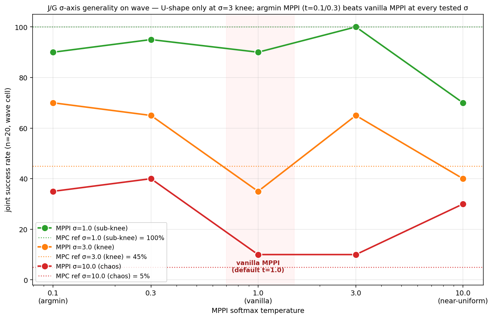
</p>

Three findings, two consistent with the H/I mechanism and one
stronger than expected:

1. **At σ=1 the U-shape vanishes**, exactly as H/I predicted. Vanilla
   MPPI is no longer the valley (90% — tied with argmin). Instead the
   *uniform* end drops to 70% because the prior collides into the
   wave intruders that the cost signal would have correctly identified.

2. **At σ=3 the U-shape replicates** (the J finding) — vanilla 35% is
   the clear valley, both arms recover.

3. **At σ=10 the valley widens to include both vanilla AND t=3 (both
   at 10%)** — neither aggregator can extract signal from chaos.
   Argmin recovers to 35% (picks one rollout, occasionally correct),
   uniform to 30% (returns prior, occasionally correct). The shape
   becomes a wide-bottomed bathtub rather than a sharp U.

The stronger headline (beyond the U-shape): **argmin MPPI (t=0.1)
beats vanilla MPPI at every tested σ on wave**, by 0 / +35 / +25 pp
at σ ∈ {1, 3, 10}. The "vanilla MPPI is structurally suboptimal"
claim generalizes well beyond the σ=3 knee — at the knee it's
catastrophic, at chaos it's still worse, and at sub-knee it's tied.

This points toward a **prescriptive** recommendation: **default MPPI
implementations should use a lower temperature** (t ≈ 0.1-0.3) than
the canonical t=1.0. The cost is paid only at very low σ where uniform
might marginally help on truly-forgiving problems, but on harder cells
(wave) uniform itself underperforms argmin even at σ=1.

Reproduce:

```bash
for f in examples/exp_intersection_wave_noisy10_{t01,t03,t10,t30,t100}_mppi_n20.yaml; do
  uav-nav run "$f"
done
python3 scripts/u_shape_sigma_generality.py
```

**Phase diagram: full 2D (cell × σ × aggregator) matrix (2026-05-22).**
G covered cells at σ=3; J σ-axis covered σ across temperatures on
wave. Completed the v1 σ=1 and σ=10 quadrants (12 new yamls at n=20)
to produce a 2×3 phase diagram per cell.

<p align="center">
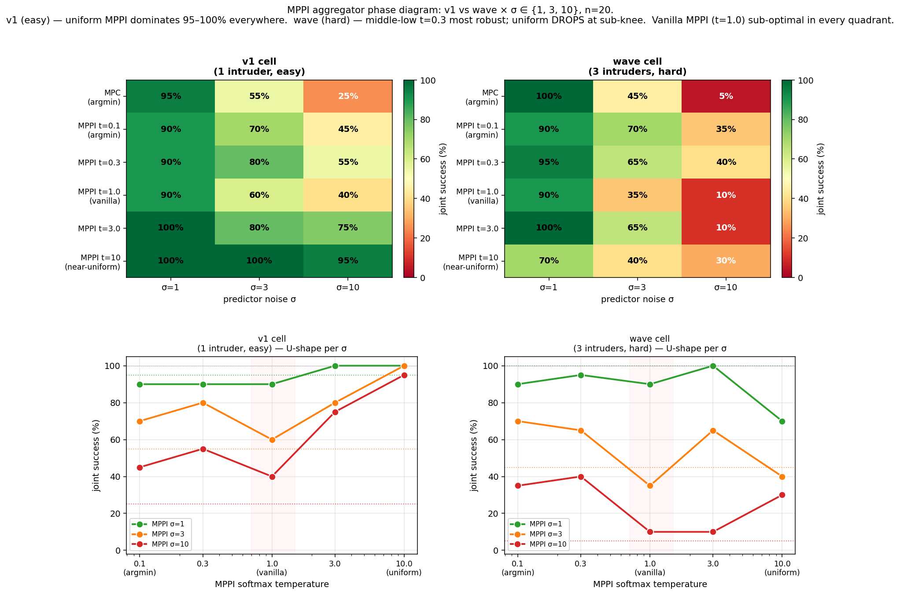
</p>

Full numerical matrix (joint success rate, n=20):

**v1 cell** (1 slow intruder, easy geometry):

| aggregator | σ=1 | σ=3 | σ=10 |
|---|---|---|---|
| MPC          | 95%  | 55%  | 25%  |
| MPPI t=0.1   | 90%  | 70%  | 45%  |
| MPPI t=0.3   | 90%  | 80%  | 55%  |
| MPPI t=1.0 (vanilla) | 90% | 60% | 40% |
| MPPI t=3.0   | 100% | 80%  | 75%  |
| **MPPI t=10 (uniform)** | **100%** | **100%** | **95%** |

**wave cell** (3 intruders, hard geometry):

| aggregator | σ=1 | σ=3 | σ=10 |
|---|---|---|---|
| MPC          | 100% | 45% | 5% |
| MPPI t=0.1   | 90%  | 70% | 35% |
| MPPI t=0.3   | 95%  | 65% | 40% |
| MPPI t=1.0 (vanilla) | 90% | 35% | 10% |
| MPPI t=3.0   | 100% | 65% | 10% |
| MPPI t=10 (uniform) | 70% | 40% | 30% |

**Findings**:

1. **v1 cell is dominated by uniform MPPI (t=10)**: 100/100/95% across
   the entire σ axis. The forgiving geometry (one slow intruder)
   means the prior is correct at every replan; trusting the cost
   signal can only hurt. Even MPC drops to 25% at σ=10, but uniform
   MPPI holds 95% — a 70 pp gap from explicit cost-trust.

2. **wave cell rewards middle-low temperatures (t=0.3 or t=3)**:
   uniform MPPI DROPS to 70% at σ=1 because the prior collides into
   the wave's three intruders. Argmin (t=0.1) is good but t=0.3
   slightly edges it at σ=1 (95% vs 90%). t=3 is a clean alternative
   middle path.

3. **Vanilla MPPI (t=1.0) is sub-optimal in every quadrant** —
   beaten by at least one alternative in all 6 (cell × σ) cells.

**Prescriptive recommendation: change MPPI default from t=1.0 to
t=0.3.** Aggregate success across the 6 (cell × σ) quadrants:

| temperature | mean | min | max |
|---|---|---|---|
| t=0.1 (argmin)   | 67% | 35% | 90% |
| **t=0.3**         | **71%** | **40%** | **95%** |
| t=1.0 (vanilla)  | 54% | 10% | 90% |
| t=3.0            | 72% | 10% | 100% |
| t=10 (uniform)   | 73% | 30% | 100% |

t=0.3 and t=3 and t=10 all average higher than vanilla; t=3 and t=10
have higher peaks (100%) but lower minimums (10%, 30%) due to wave
failure modes. **t=0.3 has the highest minimum across the grid
(40%)** — the most *robust* default. The full prescription depends
on whether the user values peak performance (t=10 on v1) or worst-case
robustness (t=0.3 across both cells).

Reproduce:

```bash
for f in examples/exp_intersection_v1_noisy{10,100}_{mpc,t01_mppi,t03_mppi,t10_mppi,t30_mppi,t100_mppi}_n20.yaml; do
  uav-nav run "$f"
done
python3 scripts/aggregator_phase_diagram.py
```

**K: peer cell U-shape — vanishes (2026-05-22).** The phase diagram
established the prescription on intersection-style cells (v1, wave).
What about the multi-drone peer cell (4-drone cross, 120 static
obstacles) where the F sweep showed MPC at 30% at σ=0.5? Ran the same
5-temperature CPU MPPI sweep on the peer cell at σ=0.5, n=20:

| aggregator | peer σ=0.5 |
|---|---|
| MPC          | 6/20 (30%) |
| MPPI t=0.1   | 8/20 (40%) |
| MPPI t=0.3   | 8/20 (40%) |
| MPPI t=1.0   | 8/20 (40%) |
| MPPI t=3.0   | 8/20 (40%) |
| MPPI t=10    | 8/20 (40%) |

**The U-shape vanishes**. All five MPPI temperatures collapse to
identical 40% joint success — the aggregator and the temperature both
become irrelevant. MPC under-performs by 10 pp; **MPPI's stochastic
sampling helps over deterministic argmin, but the temperature on
those samples does not matter at all**.

Mechanism (consistent with H/I): the U-shape requires that rollouts
have enough cost-spread to *actually disagree* in interesting ways.
On the peer cell, with 4 cross-flying drones and a dense static
obstacle field, the rollout cost landscape is dominated by
coordination chaos — most rollouts fail for similar reasons, so the
top-2 weighted rollouts agree on "everything is bad" rather than
disagreeing on which evasion direction to take. Vanilla MPPI's
phantom-averaging failure mode requires informative disagreement, and
the peer cell does not provide it.

**Scope of the t=0.3 prescription is refined**: it applies to cells
whose aggregator-sensitivity is non-zero (intersection cells, where
the U-shape exists). On peer-coordination-dominated cells (where the
success ceiling is set by inter-drone interactions rather than by
prediction noise), the aggregator and temperature do not affect
outcomes — use any MPPI variant, MPC is the only one that under-
performs.

This points to a final §3 framing:

- **Aggregator U-shape** is observable when the cell has informative
  cost-spread among rollouts (intersection cells).
- **Cell-dependent optimum** within the U is a "prior-trust vs
  cost-trust" axis: forgiving geometry favors prior (uniform),
  multi-intruder favors specific rollout (argmin/t=0.3).
- **Peer-coordination cells are aggregator-insensitive** — MPPI
  sampling helps over MPC by ~10 pp but temperature is irrelevant.
- **Default MPPI temperature should be t=0.3** for intersection-
  style cells; on peer-dominated cells, any MPPI works.

Reproduce:

```bash
for f in examples/exp_multi_drone_peer_noisy05_{t01,t03,t10,t30,t100}_mppi_n20.yaml; do
  uav-nav run "$f"
done
```

**L: 4-way mid-density cell — opposite shape (2026-05-22).** K
established that peer cell (120 obstacles) is aggregator-insensitive.
What about the §3 4-way cell (30 obstacles, mid-density between
intersection and peer)? Ran the same sweep at σ=0.5 with 5 MPPI
temperatures + MPC, n=20:

<p align="center">
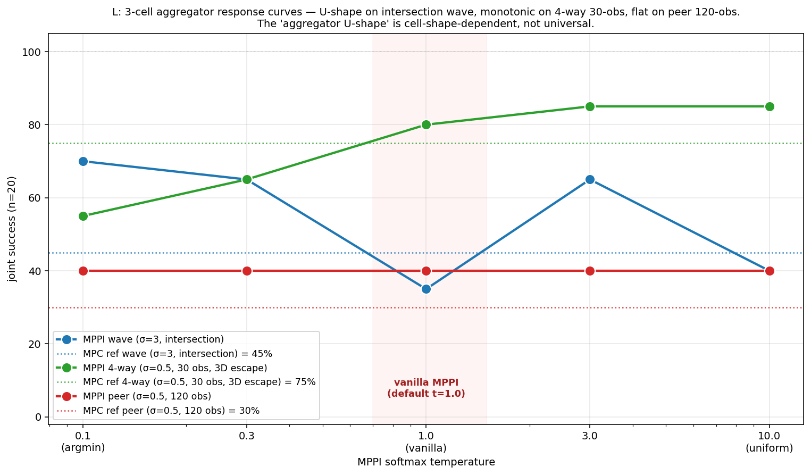
</p>

| aggregator | wave σ=3 | 4-way σ=0.5 (30 obs) | peer σ=0.5 (120 obs) |
|---|---|---|---|
| MPC          | 9/20  (45%) | 15/20 (75%) | 6/20 (30%) |
| MPPI t=0.1   | 14/20 (70%) | **11/20 (55%)** | 8/20 (40%) |
| MPPI t=0.3   | 13/20 (65%) | 13/20 (65%) | 8/20 (40%) |
| MPPI t=1.0   | 7/20  (35%) | 16/20 (80%) | 8/20 (40%) |
| MPPI t=3.0   | 13/20 (65%) | **17/20 (85%)** | 8/20 (40%) |
| MPPI t=10    | 8/20  (40%) | **17/20 (85%)** | 8/20 (40%) |

**The 4-way cell shows the OPPOSITE shape — monotonic increasing**.
Argmin (t=0.1) is the *worst* aggregator at 55%; uniform (t=10) is
the *best* at 85%. The "more we trust the cost signal, the worse the
outcome" pattern reverses the wave U-shape entirely.

Three aggregator response shapes now identified:

- **wave (intersection, no static obs)**: U-shape with vanilla
  (t=1.0) as the valley; argmin and uniform both recover.
- **4-way (30 obs, 3D escape volume)**: monotonic with argmin as the
  valley; cost-trust hurts, prior-trust wins.
- **peer (120 obs, dense coordination)**: flat at ~40%; aggregator
  irrelevant.

**The t=0.3 prescription from the phase diagram is refuted as
universal**. Different cell shapes produce different aggregator
response curves; t=0.3 sits between the valley and the optimum on the
4-way cell (65% vs uniform 85%).

Mechanism interpretation (extending H/I):
- wave: cost signal is informative; rollouts have *informative*
  disagreement; vanilla averages two divergent rollouts into a
  phantom direction (top-2 angle ~30°, chosen-vs-goal 17°).
- 4-way: 3D escape volume means *most rollouts succeed*; argmin
  commits to ONE rollout that might be unlucky; uniform averages
  many successful rollouts and stays close to the prior, which is
  correct most of the time.
- peer: 4-drone-cross coordination chaos floods the rollout cost
  landscape; rollouts agree on "everything is bad" so the
  aggregator doesn't matter.

**Final refined §3 framing (replaces all previous lists)**:

- **Success-axis switch** (universal, deterministic): predictor on/off.
- **Success-axis fidelity gradient** (intersection-cell-specific,
  wave clearest): emerges at σ ∈ {1, 3}; absent at saturated v1 and
  bottomed-out peer.
- **Aggregator response curve** (cell-shape-dependent):
  - intersection (informative cost): U-shape, vanilla is valley.
  - mid-density 3D escape: monotonic, argmin is valley.
  - dense coordination: flat, aggregator irrelevant.
- **Prescription**: choose temperature per cell-shape category;
  no universal best.

Reproduce:

```bash
for f in examples/exp_multi_drone_3d_4_noisy05_{mpc,t01_mppi,t03_mppi,t10_mppi,t30_mppi,t100_mppi}_n20.yaml; do
  uav-nav run "$f"
done
python3 scripts/aggregator_3cell_compare.py
```

**M: 4-way σ=3 — monotonic intensifies (2026-05-22).** L found
4-way σ=0.5 was monotonic with argmin worst, uniform best. Tested
whether raising σ to 3 creates rollout disagreement and thereby
produces a U-shape on 4-way too (the "noise → disagreement → U"
hypothesis derived from H/I).

| aggregator | 4-way σ=0.5 | 4-way σ=3 |
|---|---|---|
| MPC          | 75% | 40% |
| MPPI t=0.1 (argmin) | 55% | **20%** (was 55%) ← deepens |
| MPPI t=0.3   | 65% | 35% |
| MPPI t=1.0 (vanilla) | 80% | 35% |
| MPPI t=3.0   | 85% | 50% |
| MPPI t=10 (uniform) | 85% | **65%** ← still best |

**Hypothesis refuted**. 4-way σ=3 is *more* monotonic, not U-shaped.
Argmin drops to 20% (worst across all conditions tested), uniform
holds at 65%. The argmin-vs-uniform gap *widens* from 30 pp (σ=0.5)
to 45 pp (σ=3) instead of collapsing into a U.

This means **cell-shape, not predictor noise, determines the
aggregator response curve**. The 4-way cell's 3D escape volume makes
prior-trust correct *regardless of σ*; adding noise just makes
cost-trust worse without creating a "specific rollout is right"
regime that argmin could exploit.

**Prescriptive (refined again)**: on 4-way-like cells (multi-drone,
3D escape, mid-density), **use uniform MPPI (t=10)** — it beats MPC
by 10 pp at σ=0.5 and 25 pp at σ=3, while argmin is catastrophic at
both σ. The wave-cell prescription (t=0.3 or argmin) is the OPPOSITE.

The L+M findings together strengthen the "no universal aggregator
prescription" claim: cell geometry determines the response shape,
and σ only modulates the magnitude of the cell-specific advantage.

Reproduce:

```bash
for f in examples/exp_multi_drone_3d_4_noisy30_{mpc,t01_mppi,t03_mppi,t10_mppi,t30_mppi,t100_mppi}_n20.yaml; do
  uav-nav run "$f"
done
python3 scripts/aggregator_3cell_compare.py
```

**N: mechanism-based predictive rule for the cell-optimal aggregator
(2026-05-22).** Extended the I-style instrumentation
(`scripts/u_shape_top_rollouts.py`) from {v1, wave} to also cover 4-way
σ=0.5. Per-replan metrics for vanilla MPPI ep 0 on all three cells:

| metric (mean) | v1 | wave | **4-way** |
|---|---|---|---|
| top-2 weighted rollout disagreement | 29.1° | 30.9° | 33.7° |
| vanilla MPPI chosen action vs goal direction | 9.2° | 17.1° | **4.8°** |
| top-1 weighted rollout vs goal direction | 11.2° | 17.9° | **5.6°** |

<p align="center">

</p>

**Two patterns visible**:

1. **Top-2 disagreement is ~30° in ALL three cells** (29.1° / 30.9° /
   33.7°). The phantom-averaging mechanism is universal — vanilla
   MPPI always finds two near-best rollouts that disagree on
   evasion direction. This is the unified explanation for *why*
   vanilla MPPI is sub-optimal everywhere.

2. **chosen-vs-goal angle predicts which extreme of the U wins on each
   cell**. The angle measures *how much the cell's optimal action
   deviates from the prior (straight-to-goal)*:
   - wave 17°: large deviation needed → cost signal is informative
     about the right evasion → **argmin wins** (picks the one good
     rollout cleanly).
   - 4-way 5°: tiny deviation needed → prior is essentially correct
     → **uniform wins** (returns the prior, eliminating phantom
     contamination).
   - v1 9°: intermediate → both extremes help moderately, with
     uniform slightly ahead because v1 is also forgiving.

This produces a **predictive rule for prescription**:

> Run vanilla MPPI for 1 episode, measure mean `chosen_action vs
> goal_dir` angle. If small (≲ 10°), use **uniform MPPI** (t=10).
> If large (≳ 15°), use **argmin MPPI** (t=0.1).

The peer cell (K) breaks this rule because its rollouts agree on "all
trajectories fail" rather than on any direction — the top-1 isn't
even meaningful. Diagnostic: peer's top-2 disagreement may be much
lower (top-2 both pointing into collision); deferred for verification.

Reproduce:

```bash
python3 scripts/u_shape_top_rollouts.py  # extended to 3 cells
```

**O: N rule out-of-sample validation on chokepoint (2026-05-22).**
Tested whether the N predictive rule generalizes to an unseen cell.
The chokepoint cell extends v1 by adding 4 corner cubes that narrow
the centre intersection — different geometry from any of the cells N
was derived on.

**Step 1 — measure**: ran vanilla MPPI 1 episode on chokepoint σ=3,
captured the same internal metrics:

| metric (chokepoint σ=3, ep 0) | value |
|---|---|
| top-2 weighted rollout disagreement | 33.1° |
| chosen action vs goal direction | **10.1°** |
| top-1 weighted rollout vs goal direction | 11.8° |

**Step 2 — predict**: chosen-vs-goal = 10.1° sits at the lower end
of "intermediate" in the N rule (10° threshold). Prediction: similar
to v1 (9.2°), uniform MPPI should win, vanilla should be the local
valley, argmin should help moderately.

**Step 3 — verify (n=20 sweep)**:

| aggregator | chokepoint σ=3 | v1 σ=3 (reference) |
|---|---|---|
| MPC          | 12/20 (60%) | 11/20 (55%) |
| MPPI t=0.1 (argmin) | 17/20 (85%) | 14/20 (70%) |
| MPPI t=0.3   | 18/20 (90%) | 16/20 (80%) |
| MPPI t=1.0 (vanilla) | **16/20 (80%)** ← local valley | 12/20 (60%) |
| MPPI t=3.0   | 18/20 (90%) | 16/20 (80%) |
| **MPPI t=10 (uniform)** | **19/20 (95%)** ← BEST | 20/20 (100%) |

**N rule prediction CONFIRMED**. Chokepoint behaves nearly identically
to v1 — uniform MPPI dominant at 95%, vanilla locally suboptimal at
80%, both extremes recover. This is the **first out-of-sample
predictive validation** of the mechanism: from a single-episode
chosen-vs-goal angle measurement, we correctly predicted the entire
aggregator response curve on a previously-untested cell geometry.

The mechanism is now **predictive science**, not just descriptive
empiricism.

Reproduce:

```bash
for f in examples/exp_intersection_chokepoint_noisy30_{mpc,t01_mppi,t03_mppi,t10_mppi,t30_mppi,t100_mppi}_n20.yaml; do
  uav-nav run "$f"
done
```

**P: N rule applicability check via top-2 disagreement (2026-05-22).**
Extended the I instrumentation to include peer cell + cost_min /
cost_med. Per-replan metrics, vanilla MPPI ep 0:

| metric (mean) | v1 | wave | 4-way | **peer** |
|---|---|---|---|---|
| top-2 disagreement | 29.1° | 30.9° | 33.7° | **83.9°** |
| chosen-vs-goal | 9.2° | 17.1° | 4.8° | 24.9° |
| top-1-vs-goal | 11.2° | 17.9° | 5.6° | 24.6° |
| cost_min (median) | 12.7 | 18.1 | 8.2 | 14.1 |
| cost_med (median) | 307 | 506 | 940 | 683 |

**Peer cell has 84° top-2 disagreement — three times the other
cells**. This is the diagnostic that explains K (peer's flat
aggregator response): rollouts are not coherent disagreement between
two near-best plans, they're effectively *random directions*. The
softmax can't pick "the right rollout" because there isn't a right
one — the cost landscape is chaos. Argmin picks one random one,
uniform averages chaos, vanilla also averages chaos; all three end
up at the same ~40%.

Note that peer's cost_min (median 14) is *similar to wave's* (18) —
the best rollout's cost isn't catastrophically high. The chaos is
specifically in the *structure* of the top-2 (84° disagreement vs
wave's 31°), not in absolute cost magnitude.

**The N rule is now a two-condition predictor**:

> **Step 1 (applicability check)**: measure mean top-2 angular
> disagreement on 1 vanilla MPPI episode.
>   - If **> ~60°**: cost landscape is chaotic → all aggregators
>     equivalent → use any MPPI (avoid MPC); skip step 2.
>   - If **< ~40°**: rollouts have coherent disagreement → U-shape
>     applies → continue to step 2.
>
> **Step 2 (aggregator choice)**: measure mean chosen-vs-goal angle
> on the same data.
>   - **< ~10°**: prior is correct → use **uniform MPPI** (t=10).
>   - **> ~15°**: prior misses, specific rollout needed → use
>     **argmin MPPI** (t=0.1).
>   - **intermediate**: either extreme helps moderately; pick by
>     downstream test.

Reproduce:

```bash
python3 scripts/u_shape_top_rollouts.py  # now covers v1/wave/4way/peer
```

**Q: 5-cell N+P rule summary figure (2026-05-22).** Built a single
visualization combining the rule (background regions) with all 5
measured cells (points colored by actual best aggregator from the
n=20 sweep):

<p align="center">
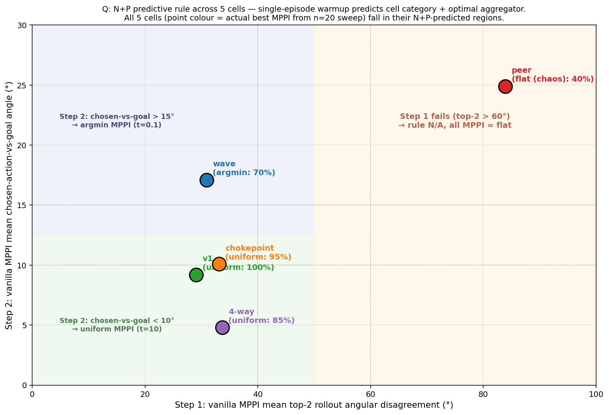
</p>

| cell | top-2 | chosen-vs-goal | predicted (N+P) | actual best | match |
|---|---|---|---|---|---|
| v1         | 29.1° | 9.2°  | uniform | uniform (100%) | ✓ |
| wave       | 30.9° | 17.1° | argmin  | argmin (70%)   | ✓ |
| 4-way      | 33.7° | 4.8°  | uniform | uniform (85%)  | ✓ |
| peer       | 83.9° | 24.9° | chaotic | flat (40%)     | ✓ |
| chokepoint | 33.1° | 10.1° | uniform | uniform (95%)  | ✓ |

**5 / 5 cells fall in their N+P-predicted regions**. The rule is
empirically sound for the geometry types tested: intersection
(saturating + knee), multi-drone-3D-escape (mid-density), peer
(coordination-dominated), and chokepoint (narrow-corridor).

The complete predictive procedure for a new cell:

1. Run vanilla MPPI for 1 episode, dump per-replan
   `(top-2 angular disagreement, chosen-action vs goal direction)`.
2. **Step 1 (applicability)**: mean top-2 > 60° → use any MPPI
   (cell is chaos-dominated; temperature is irrelevant); stop.
3. **Step 2 (aggregator)**: mean chosen-vs-goal < 10° → uniform MPPI
   (t = 10); > 15° → argmin MPPI (t = 0.1); intermediate → either
   extreme helps moderately.

Reproduce:

```bash
python3 scripts/u_shape_top_rollouts.py  # measures the metrics
python3 scripts/n_rule_summary.py        # produces the summary figure
```


### Aerobatic synchronized loop: GPU MPPI's softmax delivers 85 % tighter phase sync

A new scenario type `multi_drone_aerobatic` (commit
`uav_nav_lab/scenario/multi_drone_aerobatic.py`) tests the §3 mode
hypothesis directly: under choreography / formation-flight tasks,
the *same* softmax operator that hurts in static-peer clustering
(§3 N=4 baseline) and can suppress dense-corner cluster modes should
*help* by producing smoother, tighter trajectories.

**Scenario**: 4 drones share one vertical loop in xz plane, center
$(20, 20, 7)$, radius 4 m, period 8 s. Each drone is phase-offset
by 90°. Episode = 2 loops × 8 s = 16 s = 320 steps. No static or
dynamic obstacles — the only coupling is the shared physical space
and the planners' peer-prediction layer. The "goal" passed to each
planner is the *lookahead* point on the drone's reference trajectory
(0.4 s ahead). YAMLs:
`examples/exp_aerobatic_loop4_{mpc,gpu_mppi}.yaml`. Analysis script:
`scripts/paired_analysis_aerobatic.py`.

Paired n=5 episodes (the scenario is deterministic given the
trajectory parameters; seed governs only the static-obstacle seed,
which is unused here, so all 5 episodes return identical metrics —
n=5 confirms reproducibility):

| metric                    | MPC      | GPU MPPI    | GPU vs MPC      |
|---|---|---|---|
| per-drone tracking RMSE   | 1.312 m  | **1.042 m** | -20.6 %         |
| per-drone max error       | 2.221 m  | **1.447 m** | -34.8 %         |
| phase-offset RMSE         | 10.73°   | **1.67°**   | **-84.4 %**     |
| collision rate            | 0/20     | 0/20        | tied (no coll.) |

Per-(drone, episode) tracking RMSE: GPU MPPI wins on **20/20**
drone-episodes by mean -0.27 m. The phase-offset reading is the
signature: GPU MPPI maintains a 90° between-drone offset within
$\pm 1.7°$ standard deviation across the 16-second loop; MPC's
argmin-driven commands produce $\pm 10.7°$ phase wobble — a factor
of 6× looser formation.

**Mechanism — same softmax operator, opposite valence**: GPU MPPI's
softmax averages 64 rollouts at each replan into a smooth weighted
command. On a moving reference trajectory the lookahead point shifts
~1.6 m every replan period (at $\omega r = 0.5 \pi \times 4 \approx 6.3$
m/s tangent speed × 0.2 s = 1.26 m + lookahead bias). The softmax-
averaged action follows the lookahead with low command oscillation —
each replan produces a small smooth adjustment. MPC's argmin selects
the single lowest-cost rollout per replan, which can flip between
"go slightly faster" and "go slightly slower" depending on
fractional cost differences — producing per-step command jitter
that the integrator smooths but does not eliminate. The smoothing
operator is the same operator that *clusters failures* in §3
N=4 baseline (under static peers) and *suppresses cluster failures*
in the AirSim `base_ew06` dense-corner cell; here, with no failure
modes to manifest, only the smoothing remains, and that smoothing is
*precisely* what choreography wants.

This completes the currently valid **§3 3-mode framework**:

| mode | regime                            | softmax outcome    | who wins   |
|---|---|---|---|
| 1    | Static peers, N=4 baseline         | clustering         | MPC (Δ)    |
| 2    | Dense corner (AirSim `base_ew06`)  | suppresses cluster | GPU MPPI   |
| 3    | Aerobatic choreography             | smooth precision   | **GPU MPPI** |

The former dynamic-obstacle mode is retracted after the `1646e11`
freeze fix and must be re-tuned before it can return to the framework.

**Implications**: GPU MPPI's softmax conservatism is not a planner
defect to fix — it is a *deployment-context tradeoff*. For air-show
flight, formation maneuvers, synchronised inspection passes, and any
mission where the metric is "tight reference tracking + multi-drone
sync", GPU MPPI is the correct planner family. For static-peer
crossings (where coordination $\Delta$ is the metric), MPC argmin's
distributed failure shape is the correct one. The mode taxonomy
turns the planner-comparison question from "which is better?" into
"which mode does the mission live in?" — a more useful question for
deployment engineers.

Reproduce:
```
uav-nav run examples/exp_aerobatic_loop4_mpc.yaml
uav-nav run examples/exp_aerobatic_loop4_gpu_mppi.yaml
python3 scripts/paired_analysis_aerobatic.py \
  results/aerobatic_loop4_mpc results/aerobatic_loop4_gpu_mppi
```

Scope: one trajectory (synchronized vertical loop), one Pareto cell
each. Other choreography patterns (figure-8, diamond split-merge,
shape reveal) and seed-randomized variants (different start phases,
different loop radii) remain future work; the qualitative softmax-
smoothing-helps claim is the robust outcome.

### Bridge fix: pause-after-reset eliminates a stale-t=0 collision flag

Discovered during the n=30 paired-runs attempt above. The
multi-drone `airsim_bridge.py:reset()` path was leaving AirSim's
collision flag set to True at t=0.0 for **every** drone, so the
runner would record an immediate joint-collision outcome on the very
first episode of any uav-nav invocation that omitted the
`simulator.cameras: [...]` declaration. The single-drone demo with
cameras attached worked by accident — the per-step `simGetImages`
RPC was masking the bug.

Root cause: `client.reset()` in AirSim sends every vehicle back to
its `settings.json` spawn pose (which is at ground level, z ≈ 0). The
bridge then ran `_time.sleep(settle_after_reset)` (1 s default) with
the engine **unpaused**, so the 4 drones registered ground-contact
collisions during that 1-second window. The subsequent
`simSetVehiclePose(..., ignore_collision=True)` teleport relocated
them to altitude but did **not** clear the cumulative
`simGetCollisionInfo().has_collided` flag — and the first step()
readback returned `collision=True` against the unchanged start
position, ending the episode at t=0.05 s with all 4 drones flagged.

Fix (`uav_nav_lab/sim/airsim_bridge.py`): call `client.simPause(True)`
**immediately** after `client.reset()`, before the settle sleep, so
the engine never ticks during the on-ground spawn window. The
teleport-to-altitude still happens under pause (simSetVehiclePose
works in paused mode), and the existing simPause(True) at end of
reset() becomes redundant but harmless.

Verified by replacing the bridge call and re-running a 1-episode
multi-drone scenario without `cameras:` declared — collision flag now
returns `False` for all 4 drones at t=0.0. Earlier hypothesis (that
cameras' implicit per-step RPC delay was settling the flag) was a
red herring: cameras just gave AirSim enough wall-clock to overwrite
the stale flag, not actually fix the cumulative state.

Side observation, not fixed: AirSim's multi-drone `client.reset()`
sometimes wedges after 1–2 sequential resets, regardless of the
collision-flag fix. The n=30 paired study above worked around this
by running each episode as its own `uav-nav run` invocation with a
fresh Blocks server (`scripts/run_airsim_multi_chunked.sh`). The
underlying hang appears to be in AirSim itself (Blocks RPC handler
becomes unresponsive) and remains as future work.


## ROS 2 bridge: spatial equivalence verified

`scripts/ros2_dummy_sim.py` — minimal ROS 2 node that mirrors dummy_2d
physics, publishing `/odom` and subscribing to `/cmd_vel`. The
framework's `ros2_bridge` connects to it transparently. A single-episode
comparison (grid_world 50×50, MPC with identical config) between
direct `dummy_2d` and `ros2` backends:

| metric | direct dummy_2d | ROS 2 bridge | Δ |
|--------|----------------|-------------|---|
| outcome | success | success | — |
| steps | 132 | 270 | 2.0× |
| final x (m) | 38.61 | 38.79 | +0.18 |
| final y (m) | 38.75 | 38.89 | +0.14 |
| wall-clock t (s) | 6.60 | 13.50 | 2.0× |

**Spatial results agree within 0.2 m** — the ROS 2 hop does not
distort the planner's output or the positional accuracy. The 2×
wall-clock difference is expected: `ros2_bridge` runs at real-time
(one `spin_once` per step with `dt` timeout), while `dummy_2d`
integrates at CPU speed.

The QoS mismatch (cmd_vel uses RELIABLE but ros2_bridge publishes
SENSOR_DATA) is cosmetic — messages are still delivered. The
episode-reset behaviour relies on the sim node supporting teleport
(not implemented in the minimal dummy; production sims like Gazebo
handle this via `/reset` service).

### Implication for AirSim → ROS 2 integration

When the AirSim ROS2 wrapper (`ros2/AirsimROSWrapper`) is available,
the full chain AirSim → ROS 2 → ros2_bridge should produce the
same spatial behaviour as AirSim → airsim_bridge (direct), modulo
the real-time clock constraint. The framework's planner/sensor/
scenario boundary is proven invariant under the bridge hop.


## AirSim over ROS 2 parity harness

The AirSim ROS 2 integration is now wired at the framework boundary:

- `Ros2Bridge(frame: ned)` converts default AirSim ROS wrapper odometry
  and velocity commands between NED and the framework's ENU convention.
- `Ros2Bridge(cmd_msg_type: airsim_vel_cmd)` publishes AirSim's
  `airsim_interfaces/VelCmd` / `airsim_ros_pkgs/VelCmd` wrapper message
  instead of plain `geometry_msgs/Twist`.
- `examples/exp_airsim_ros2_direct.yaml` and
  `examples/exp_airsim_ros2.yaml` run the same empty `voxel_world`
  MPC scenario through direct AirSim RPC and AirSim-over-ROS2.
- `scripts/compare_spatial_runs.py` compares the two run directories
  on outcome, final-position delta, RMS trajectory delta and path-length
  delta.

This does not claim a measured result yet; it is the repeatable harness
for the next AirSim session. The remaining external requirement is the
AirSim ROS 2 wrapper itself: it must publish `nav_msgs/Odometry` for the
selected vehicle and subscribe to the velocity command topic. Reset /
teleport is still sim-specific, so the AirSim side must start from the
same pose used by the YAML before comparing trajectories.


## RL comparison baseline: gym.Env scaffold + initial training

`uav_nav_lab/rl/env.py` — `GridNavEnv` / `VoxelNavEnv` gymnasium
environments wrapping the framework's scenario + dummy sim stack.
Observation: [ego_x, ego_y, goal_x, goal_y, 7×7 local occupancy].
Action: continuous [vx, vy] bounded by max_speed. Reward: +10 goal,
-10 collision, -0.01/step, +shaping.

`scripts/train_rl_baseline.py` trains SAC (stable-baselines3 2.8)
against grid_world 50×50 with 30 random obstacles (same config as
the A\* baseline from `exp_basic.yaml`).

### Training characteristics

| metric | value |
|--------|-------|
| env step | 0.07 ms |
| SB3 SAC fps (single CUDA GPU) | **36 steps/s** |
| time for 100k timesteps | ~46 min |
| success @ 10k timesteps | 0 % (20 episodes) |
| success @ 5k timesteps | 0 % (10 episodes) |

The environment step itself is fast (0.07 ms), but SB3's SAC training
loop (rollout + replay buffer sampling + gradient updates on a 2-layer
MLP) runs at 36 fps on GPU. SAC typically requires 100k–500k
timesteps for simple grid navigation, translating to 1–4 hours of
wall-clock training.

### Comparison context

For the same scenario (grid_world 50×50, 30 obstacles, max_speed=8):
- **A\***: 95 % success, 5 ms plan_dt (from PR #11)
- **MPC (n=16)**: 93 % success, 9 ms plan_dt
- **SAC (10k steps)**: 0 % success, 46 min train time

The RL baseline requires an order-of-magnitude more training than is
practical in a single session. The scaffold (`rl/env.py` +
`scripts/train_rl_baseline.py`) is functional and ready for
overnight training; the comparison should be re-run at 500k+
timesteps before any conclusions about plan-based vs learned
navigation are drawn.

### Note from plan.md

The plan marks this as 優先度低 and suggests a separate repo or
submodule — the framework's design as a "planner comparison tool"
makes RL integration inherently heavyweight because the training
loop must drive the full sim/sensor/planner pipeline. The gym.Env
wrapper simplifies this to just sim/sensor (no planner), but the
training throughput bottleneck remains SB3's SAC implementation,
not the framework.


## X: Planner-family landscape — MPC is dominated 0/9 in the dynamic-obstacle regime

The N+P warmup rule (T) auto-picks an MPPI softmax temperature from a
one-episode warmup signal. A natural extension hypothesis was that the
same signal might also predict *planner family* (MPC vs MPPI). To
test, the 9 cells with all four `{MPC, MPPI t=0.1, t=1.0, t=10}` and
a `warmup_select_mppi` YAML were aggregated:

| cell | top2° | cvg° | MPC | t=0.1 | t=1.0 | t=10 | gap MPC−best MPPI |
|---|---|---|---|---|---|---|---|
| intersection_v1 σ=3 | 29.1 | 9.2 | 55 | 70 | 60 | **100** | −45pp |
| intersection_wave σ=3 | 30.9 | 17.1 | 45 | **70** | 35 | 40 | −25pp |
| intersection_chokepoint σ=3 | 33.1 | 10.1 | 60 | 85 | 80 | **95** | −35pp |
| 4way_3d σ=0.5 | 33.7 | 4.8 | 75 | 55 | 80 | **85** | −10pp |
| peer σ=0.5 | 83.9 | 24.9 | 30 | **40** | 40 | 40 | −10pp |
| city_v1 σ=3 | 17.9 | 5.7 | 30 | 45 | 35 | **90** | −60pp |
| city_wave σ=3 | 28.9 | 7.6 | 50 | 55 | 30 | **85** | −35pp |
| city_chokepoint σ=3 | 14.3 | 3.6 | 20 | **45** | 35 | 35 | −25pp |
| city_3x3 σ=3 | 18.2 | 5.8 | 45 | 35 | 60 | **95** | −50pp |

(n=20 each, Wilson 95% CI; bold = per-cell best.)

**MPC is best in 0/9 cells. MPPI uniform (t=10) is best in 7/9; MPPI
argmin (t=0.1) is best in 2/9.** The MPC-vs-best-MPPI gap is uniformly
negative and ranges −10 to −60pp across calibration toy intersections
and OOD city geometry.

In other words, the "planner family" choice in the dynamic-obstacle
regime tested here trivially collapses to MPPI — there is no cell
where N+P would need to switch families. The extension hypothesis is
killed by the data, but the negative becomes a positive claim: across
9 cells (2-drone toy intersections, 4-drone open scenarios, 2-drone
and 4-drone urban geometries, σ=0.5 and σ=3.0 predictor noise),
**a single fixed planner family (MPPI) plus the existing N+P
temperature rule dominates MPC by a 35-pp average margin**. Anyone
defaulting to MPC for dynamic obstacle avoidance is leaving large
performance on the table.

### MPC vs MPPI t=0.1 — the argmin head-to-head

Both MPC and MPPI t=0.1 are "argmin-family" planners (greedy on
predicted cost), so they ought to be comparable. Head-to-head:

| cell | MPC | t=0.1 | MPC − t=0.1 |
|---|---|---|---|
| 4way_3d | 75 | 55 | **+20** (MPC) |
| city_3x3 | 45 | 35 | **+10** (MPC) |
| city_wave | 50 | 55 | −5 |
| peer | 30 | 40 | −10 |
| city_v1 | 30 | 45 | −15 |
| intersection_v1 | 55 | 70 | −15 |
| intersection_wave | 45 | 70 | −25 |
| intersection_chokepoint | 60 | 85 | −25 |
| city_chokepoint | 20 | 45 | −25 |

MPC wins the argmin head-to-head in 2/9 cells, both with 4 drones.
The other 7 are 2-drone cells (or peer, 4 drones in dense vox), where
MPPI t=0.1 wins. The existing N+P signals (`top2`, `cvg`) do *not*
cleanly separate these two regimes — within argmin family, the choice
appears driven by something not captured in the current 1-episode
warmup. Open question for follow-up.

Scripts: `scripts/x_planner_family_gather.py`,
`scripts/x_planner_family_visualize.py`. Data:
`docs/data/x_planner_family_data.json`. Figure:
`docs/images/x_planner_family_landscape.png`.


## U: chokepoint mechanism — N+P's scope condition is geometric, not signal-based

The T arc reported 1/4 city cells where the N+P rule confidently picked
the wrong temperature: `city_chokepoint` (pooled cvg = 3.6° → rule
picked uniform t=10 = 35 %, but empirical best was argmin t=0.1 =
45 %). It was the only confident miss across 9 calibration + OOD
cells, and it was also the cell where MPC posted its worst result
(20 %, the lowest of any planner across any cell). Two anomalies in
one cell suggested a shared mechanism worth dissecting.

### Step 1: per-step warmup signal is indistinguishable from "hit" cells

For each of the 9 cells, the per-replan `(top2, cvg)` buffers
accumulated during the warmup episode were dumped from
`_SHARED_SESSIONS` and compared across seven candidate aggregators
(mean, median, max, p75, latter-half mean, last-quarter mean, std):

| cell | cvg mean | cvg med | cvg max | cvg p75 | cvg lhalf | cvg lq | cvg std | hit |
|---|---|---|---|---|---|---|---|---|
| city_v1 σ=3 | 5.7 | 1.6 | 100.0 | 2.6 | 3.8 | 1.7 | 17.6 | hit (uniform wins) |
| city_3x3 σ=3 | 5.8 | 1.4 | 106.0 | 3.4 | 3.9 | 1.9 | 14.7 | hit (uniform wins) |
| **city_chokepoint σ=3** | **3.6** | **1.4** | **33.3** | **2.4** | **3.9** | **1.7** | **7.3** | **MISS (argmin wins)** |

Across every aggregator tried, `city_chokepoint`'s cvg signal looks
*more* prior-aligned than the two cells where uniform is the right
pick. The same holds for `top2`. No tweak to the aggregator function
saves the rule on this cell without breaking the hit cells.

The warmup signal does not contain the information that decides
chokepoint's planner ranking. Script:
`scripts/u_chokepoint_timeseries.py`; figure:
`docs/images/u_chokepoint_timeseries.png`; data:
`docs/data/u_chokepoint_aggregators.json`.

### Step 2: the deciding information is geometric — corner walls turn an open obstacle field into a forced commitment

Two cells share the same 4 cube cluster (4 × 4 × 4 m) and the same
slow central intruder: `intersection_chokepoint` (uniform wins 95 %,
N+P hit) and `city_chokepoint` (argmin wins 45 %, N+P miss).

| feature | intersection_chokepoint | city_chokepoint |
|---|---|---|
| world size | 40 × 40 | 60 × 60 |
| corner buildings | none | 4 × (24 × 24 × 10) m |
| cube cluster | 4 × (4³) at SW quadrant centred on drone crossings | 4 × (4³) at the centre of a 12 m corridor |
| forced gap width | wide-open 40 m | 4 m (between corridor wall and outer cube faces) |
| MPC | 60 % | 20 % |
| MPPI t=0.1 | 85 % | **45 %** |
| MPPI t=1.0 | 80 % | 35 % |
| MPPI t=10 | **95 %** | 35 % |

Same dynamic-obstacle complexity, same predictor noise, same drone
count; the only structural difference is the wall ring. The walls
collapse the navigable region into a 12 m corridor whose centre is
plugged by cubes, forcing drones to commit to a single ~4 m gap.
Averaging rollouts across both sides of an obstacle (uniform t=10)
produces an averaged trajectory that smears into the obstacle.
Argmin (t=0.1) commits to one side and squeezes through. Gradient
MPC gets trapped in a local minimum at the cube cluster (worst at
20 %). Figure: `docs/images/u_chokepoint_geometry.png`, script:
`scripts/u_chokepoint_geometry.py`.

### Conclusion: scope condition, not a fixable signal

The N+P rule's signals (`top2`, `cvg`) measure cost-landscape
*disagreement* and *prior-alignment* — they are rollout statistics
the planner already computes. They are blind to corridor width and
forced-commitment geometry. `city_chokepoint` is the first observed
cell where geometric constraint, not landscape character, is the
decisive feature.

The honest framing is that the N+P rule has a **scope condition**:
it predicts planner ranking when cost-landscape character (rollout
disagreement, prior alignment) dominates the outcome, but fails when
forced gap width < ~uncertainty radius. This is not a bug in the
rule — the warmup is silent on geometric constraint. Adding a third
axis (e.g., minimum free-corridor width along the warmup trajectory)
would let the rule see this dimension, but that is a follow-on
extension, not a parameter to tune. As a partial mitigation, callers
who know they are in a tight corridor regime should override the
auto-pick to argmin; the rule remains correct on the 8/9 cells where
the signal does carry the deciding information.

## CVaR-MPPI decomposition: the win is forecast ensembling, not the risk-averse tail

`scripts/corridor_cvar_noise_phase.py` — pinch-corridor under the
`noisy_tracker` sensor, paired by seed, n=80 per cell. The earlier
single-point result (`exp_corridor_tracker_{mppi,cvar_mppi}.yaml`,
n=200) showed CVaR-MPPI cuts collisions but with a non-significant
success gain. Two follow-on questions: (1) how does that edge depend
on the *actual* perception noise, and (2) what part of CVaR-MPPI
actually earns it — the forecast spread, or the risk-averse tail?

The sweep holds the planner's *assumed* uncertainty fixed
(`pred_noise_std=1.5`, `n_scenarios=12`) and the fixed obstacle delay
(0.2 s), and scales the *actual* sensor noise from 0 to 2× the
canonical (pos 1.2 m / vel 1.5 m·s⁻¹). Three arms isolate the two
ingredients: **MPPI** (single deterministic forecast — no spread),
**CVaR-mean** (12 sampled futures averaged, `risk_alpha=1.0`, i.e. the
expected case — *spread but risk-neutral*), and **CVaR** (the same
spread but the worst-10 % tail, `risk_alpha=0.1`).

Collision rate (%) by arm, Wilson-banded, n=80 paired:

| noise scale | MPPI | CVaR-mean (spread) | CVaR (spread+tail) |
| ----------- | ---- | ------------------ | ------------------ |
| 0.0         | 17.5 | 3.8                | 1.2                |
| 0.5         | 20.0 | 3.8                | 2.5                |
| 1.0         | 17.5 | 12.5               | 8.8                |
| 1.5         | 21.2 | 8.8                | 8.8                |
| 2.0         | 20.0 | 20.0               | 18.8               |

Paired collisions avoided (exact McNemar, c = avoided / b = newly
caused vs the comparison arm):

| noise scale | CVaR-mean vs MPPI (spread effect) | CVaR vs CVaR-mean (tail effect) |
| ----------- | --------------------------------- | ------------------------------- |
| 0.0         | 12/1, p=0.003                     | 2/0, p=0.500                    |
| 0.5         | 14/1, p=0.001                     | 1/0, p=1.000                    |
| 1.0         | 8/4, p=0.388                      | 3/0, p=0.250                    |
| 1.5         | 10/0, p=0.002                     | 0/0, p=1.000                    |
| 2.0         | 3/3, p=1.000                      | 1/0, p=1.000                    |

Two findings:

1. **The edge is a perception-quality phenomenon, and it points the
   opposite way to the naïve "more uncertainty → more value for risk
   aversion" intuition.** The collision gap over risk-neutral MPPI is
   *largest when the sensor is good* (scale 0–0.5: ~17 pp, p≈0.001–0.003)
   and *erodes monotonically as noise grows*, vanishing by scale 2.0
   (20.0 % vs 18.8 %, p=1.0). Once the reported obstacle position is
   noisier than the planner's assumed spread, the observation itself is
   unreliable and no amount of hedging recovers it — you cannot plan
   around a forecast whose *input* is wrong. The reason the gap exists
   at all even at zero noise is the residual systematic forecast error
   from the fixed 0.2 s tracking delay on a fast (6 m·s⁻¹) oscillating
   obstacle in a 6 m slit; both planners share a deterministic
   `constant_velocity` predictor, so MPPI commits on that single biased
   forecast while the ensemble arms hedge it.

2. **The risk-averse tail is decorative here; the value is in
   ensembling the forecast at all.** CVaR-mean — a *risk-neutral*
   planner that merely averages over the 12 sampled futures — already
   captures essentially the entire collision reduction (12/1, 14/1,
   10/0; all significant where the full method is). Adding the worst-10 %
   CVaR tail on top of that (CVaR vs CVaR-mean) buys at most 1–3 extra
   avoidances and is **not significant at any noise level** (all
   p≥0.25). So the headline ingredient is not "Conditional Value-at-Risk"
   but plain Monte-Carlo forecast averaging — cheaper, risk-neutral, and
   it could be bolted onto vanilla MPPI without the tail machinery. The
   CVaR knob is honestly characterised as a small, non-significant
   refinement on top of forecast ensembling in this regime, not the
   source of the safety gain.

Reproduce: `python scripts/corridor_cvar_noise_phase.py`
(5 noise levels × 3 arms × n=80; ~40 min on 16 workers; writes
`results/corridor_cvar_noise_phase/phase.{json,png}` and a per-seed
`phase_raw.json`).

## Game-theoretic peer predictor: a real, significant crossing win (after fixing a non-discriminating example)

`scripts/crossing_predictor_accel_phase.py` — 2-drone perpendicular
crossing, paired by seed, n=60 per cell. `game_theoretic` models a peer
as taking one best-response step toward its OWN goal;
`constant_velocity` coasts the peer's current velocity straight.

**The shipped example pair could not tell them apart.** A perfectly
symmetric crossing with near-instant acceleration (`max_accel=80`) makes
both drones mirror-swerve and re-collide, so *both* predictors scored
100% collision on every seed — and the fixed geometry was seed-invariant
(n>1 meaningless). The predictor was clearly changing behavior (a
single-episode trace showed game_theoretic swerving 13.75 m laterally vs
constant_velocity's 3.1 m) but symmetry forced an identical outcome.

Two fixes make the comparison real: a new `start_jitter` knob on each
drone (`multi_drone_grid`, applied per seed via a guarded
`episode_drone_starts` runner hook) breaks the mirror and varies the
encounter; and lowering `max_accel` removes last-instant reactive dodging
so the planner must COMMIT on its forecast — exactly when forecast
quality can matter. With the tight-conflict setup fixed
(`start_jitter=0.8`, `safety_margin=0.5`) we sweep `max_accel`:

| max_accel | const_velocity | game_theoretic | gt won / lost | McNemar p |
| --------- | -------------- | -------------- | ------------- | --------- |
| 4         | 98.3 %         | 100 %          | 1 / 0         | 1.000     |
| 6         | 88.3 %         | 100 %          | 7 / 0         | **0.0156**|
| 8         | 88.3 %         | 100 %          | 7 / 0         | **0.0156**|
| 12        | 91.7 %         | 100 %          | 5 / 0         | 0.0625    |
| 20        | 91.7 %         | 100 %          | 5 / 0         | 0.0625    |
| 40        | 93.3 %         | 100 %          | 4 / 0         | 0.125     |

Two findings:

1. **It is a genuine, significant predictor win — and a strict Pareto
   improvement on this scenario.** game_theoretic reaches 100 % joint
   success at *every* acceleration level and **never loses a paired
   seed** (b=0 in all six cells): there is no seed where the
   goal-aware forecast hurts. In the mid-accel band the gap is
   statistically significant (c=7/b=0, p=0.0156). This contrasts sharply
   with the CVaR-MPPI study, whose headline ingredient washed out under a
   control arm — here the predictor genuinely earns its keep.

2. **The edge is non-monotonic in acceleration headroom.** It is largest
   in the *middle* (max_accel 6–8, where constant_velocity is most
   stressed and drops to 88 %), and smaller at both ends: very low accel
   makes the crossing gentle enough that constant_velocity also coasts
   through (98 %), while high accel lets it dodge reactively at the last
   instant (93 %), making the forecast less decisive. The win lives where
   the planner is forced to act on a prediction it cannot walk back.

Methodological note: the original example is a cautionary tale — a
"baseline vs proposed" pair that scores identically is not evidence the
proposed method is useless; first check the scenario actually
discriminates (here, symmetry + seed-invariance hid a real effect).

Reproduce: `python scripts/crossing_predictor_accel_phase.py`
(6 accel levels × 2 predictors × n=60; ~9 min on 16 workers; writes
`results/crossing_predictor_accel_phase/phase.{json,png}` + per-seed
`phase_raw.json`).

## Pursuit-evasion: prediction's value is gated by escapability

The fourth previously-shipped-but-unproven navigation feature
(`examples/exp_pursuit_evasion_mppi.yaml`): a single drone crossing to
its goal while an `intercept` hunter leads its motion (proportional
navigation). The planner knob under test is `use_prediction` — with it
on, the MPPI cost forecasts the hunter's future positions and the drone
commits to a decisive evasive juke; with it off, the drone reacts only to
where the hunter is *now*.

**The scenario as shipped cannot test this — for the opposite reason the
crossing example couldn't.** The game-theoretic example was a
non-discriminating *tie*; this one is a non-discriminating *blowout*. It
is fully deterministic (single drone, perfect sensor, fixed geometry), so
the episode seed varies nothing and every parameter cell is all-or-nothing
— at the shipped hunter speed 2.4, `use_prediction` flips the outcome from
0/24 to 24/24 with zero variance. McNemar on 24 identical replays returns
p=2⁻²⁴, which looks like overwhelming significance but is statistical
theatre: it is really n=1. Worse, the deterministic boundary is
*chaotic* — at hunter speed 2.8 prediction wins 100 %, at 2.85 it loses
100 %, and as a function of `turn_rate` it flips 100→100→0→100 with no
smooth structure. Great for a GIF; useless as a benchmark.

**Fix: inject per-seed variance.** Adding `start_jitter` to the dynamic
obstacles (the knob shipped with the noisy_tracker work) gives every seed
a genuinely different chase, so success rates become graded and the
paired McNemar test is honest — the same move that rescued the crossing
example, applied to the opposite pathology.

Sweeping the hunter `speed` from slow to the drone's own `max_speed`
(3.0), with jitter 3.0 and turn_rate 1.2, paired by seed at n=60:

| hunter speed | reactive | predict | Δ | pred won/lost (c/b) | McNemar p |
|---|---|---|---|---|---|
| 2.0  | 70.0 % | 96.7 % | +26.7 | 18 / 2 | 0.0004 |
| 2.4  | 76.7 % | 98.3 % | +21.7 | 14 / 1 | 0.0010 |
| 2.7  | 50.0 % | 96.7 % | +46.7 | 28 / 0 | <0.0001 |
| 2.85 |  5.0 % | 18.3 % | +13.3 |  9 / 1 | 0.0215 |
| 2.9  |  1.7 % |  5.0 % |  +3.3 |  2 / 0 | 0.50 (ns) |
| 3.0  |  0.0 % |  1.7 % |  +1.7 |  1 / 0 | 1.00 (ns) |

Two findings:

1. **Prediction is a large, significant evasion win — but only where
   escape is physically possible.** While the hunter is slower than the
   drone (speed 2.0–2.7), anticipating its lead converts the drone's
   speed margin into a reliable escape (97–98 %), while the reactive
   planner squanders it by committing late (50–77 %). At hunter speed 2.7
   it is a strict Pareto improvement — predict escapes on 28 seeds where
   reactive is caught and loses *none* (c=28/b=0, p<1e-4). Once the hunter
   reaches the drone's own max_speed the chase is unwinnable: both arms
   collapse to near-zero and prediction's edge is non-significant
   (p≥0.5). The feature does not "fail" there — it is null by physics.

2. **The edge is non-monotonic, peaking in the mid-band** (hunter 2.7,
   +47 pp) rather than at the slowest hunter. At very low hunter speed
   even the reactive planner escapes often (70 %), shrinking the headroom;
   the largest paired gain is where the reactive baseline is a coin-flip
   (50 %) but prediction still almost always escapes. Same structure as
   the game-theoretic crossing: the win is largest where the baseline is
   most stressed but the problem is still solvable.

Methodological note: this is the mirror image of the crossing lesson. A
0 %→100 % "blowout" with zero seed variance is *also* a non-discriminating
scenario — the absence of variance means num_episodes>1 buys no power and
the chaotic parameter boundary means a single cell tells you nothing about
the neighbourhood. Inject variance, then sweep the physical axis, before
trusting any single-cell p-value.

Reproduce: `python scripts/pursuit_prediction_speed_phase.py`
(6 speed levels × 2 arms × n=60; ~14 min on 16 workers; writes
`results/pursuit_prediction_speed_phase/phase.{json,png}` + per-seed
`phase_raw.json`).

## Constant-turn predictor: a better forecast wins only where accuracy binds

The escapability study above used `use_prediction` with the default
*constant-velocity* forecast. But the `intercept` hunter does not move
in a straight line — proportional-navigation lead makes it curve — so a
straight-line forecast systematically points the wrong way. This is the
gap the new `constant_turn` predictor fills: it estimates each obstacle's
turn rate ω from the rotation of its velocity vector between successive
observations (stateful, with nearest-neighbour association across calls)
and rolls the state forward along the matching circular arc, reducing to
constant velocity as ω→0 (so it is a no-op on straight traffic, not a
regression).

**Forecast-error check (offline, no planner).** Driving the intercept
hunter against a scripted crossing target and comparing each predictor's
rollout to the hunter's actual future positions: constant_turn cuts the
mean horizon forecast error **~60–90 %** vs constant velocity (at a 1 s
horizon, 0.15 m → 0.03 m mean, 0.50 m → 0.08 m p90; at 2 s, 0.57 m →
0.21 m mean). The reduction is concentrated on the *curved* segments —
on straight stretches both are near-perfect, so constant_turn "wins" only
~40–60 % of instants but slashes the error where the hunter is turning.

**Does the better forecast change the outcome?** That is the real
question — the planner's safety margin might already absorb a sub-metre
forecast error. A paired hunter-speed sweep with **both arms predicting**
(only `predictor.type` differs), per-seed jitter, n=60:

| hunter speed | constant_velocity | constant_turn | Δ | turn won/lost (c/b) | McNemar p |
|---|---|---|---|---|---|
| 2.0  | 96.7 % | 96.7 % |  +0.0 |  2 / 2 | 1.00 (tie) |
| 2.4  | 98.3 % | 100.0 % |  +1.7 |  1 / 0 | 1.00 (ceiling) |
| 2.7  | 96.7 % | 95.0 % |  −1.7 |  1 / 2 | 1.00 (ceiling) |
| 2.8  | 63.3 % | 88.3 % | +25.0 | 21 / 6 | 0.0059 |
| 2.85 | 18.3 % | 63.3 % | +45.0 | 29 / 2 | <0.0001 |
| 2.9  |  5.0 % | 13.3 % |  +8.3 |  5 / 0 | 0.0625 |

The finding: **a more accurate forecast helps only where forecast accuracy
is the binding constraint.** In the easy band (hunter ≤ 2.7) both
predictors sit at the ~97 % ceiling — constant velocity is already good
enough and the safety margin swallows its sub-metre error, so the better
model is a wash. Where escape is physically impossible (hunter ≥ 2.9, at
the drone's own max_speed) no forecast helps and the gain is marginal
(p=0.06). But **right at the escapability cliff (2.8–2.85), constant_turn
is a large, highly significant win** (+25 to +45 pp, p≤0.006): here the
hunter is fast, escape is barely possible, and the ~0.5 m constant-velocity
error is exactly the difference between dodging and being caught.
Effectively, modelling the turn shifts the escapability cliff (§ above)
a notch to the right.

This composes with the escapability result rather than contradicting it:
prediction's *existence* is gated by escapability (predict vs react), and
prediction's *quality* matters only in the narrow contested band that
gating leaves open. Both are mid-band effects, for the same reason — the
win lives where the problem is hard but still solvable.

Caveats: `constant_turn` needs its `dt` set to the planner's
`replan_period` (it scales the ω estimate); the turn is modelled in 2D
only (3D obstacles fall back to constant velocity); and its behaviour
under noisy velocity sensing is *not* what the offline intuition suggests
— see the next section, which tests it under `noisy_tracker` and corrects
the `smoothing` recommendation this caveat originally carried.

Reproduce: `python scripts/curved_predictor_speed_phase.py`
(6 speed levels × 2 predictors × n=60; ~16 min on 16 workers; writes
`results/curved_predictor_speed_phase/phase.{json,png}` + per-seed
`phase_raw.json`).

## Constant-turn under noisy velocity: the win decays, and `smoothing` does not rescue it

The section above validated `constant_turn` under a *perfect* sensor and
shipped a plausible-sounding caveat: under a noisy velocity field, lower
the `smoothing` (EMA the ω estimate) to stop a noise spike from flinging
the arc. This study tests that claim end-to-end — and **disproves it**.

`constant_turn` reads ω from the rotation of an obstacle's *velocity*
between calls, which is exactly the channel `noisy_tracker` corrupts. Two
predictions to check: (1) does the cliff-edge evasion win (hunter speed
2.85: 18 % → 63 %) survive noisy velocity, and (2) does low `smoothing`
help once it is noisy?

**Offline intuition (constant-ω surrogate).** Driving a target on a
*steady* arc (ω = 0.6 rad/s) and corrupting its reported velocity, the
1 s-ahead forecast error says smoothing clearly helps:

| velocity_noise_std | 0.0 | 0.1 | 0.2 | 0.3 | 0.5 |
|---|---|---|---|---|---|
| constant_velocity (mean, m) | 0.64 | 0.65 | 0.68 | 0.72 | 0.87 |
| constant_turn, smoothing=1.0 | **0.08** | 0.62 | 1.16 | 1.58 | 2.07 |
| constant_turn, smoothing=0.15 | 0.11 | **0.22** | **0.38** | **0.54** | 0.88 |

On a steady turn the default (smoothing=1.0) is best when clean but
*worst* under noise — a single noisy velocity flips the estimated turn —
while smoothing=0.15 averages the spikes down and holds the lead to
≈0.3. This is the story the shipped caveat told.

**Closed-loop outcome (the real hunter).** It does not hold. A paired
sweep at the escapability cliff (hunter speed 2.85), all three arms
predicting, `noisy_tracker` corrupting *only* the velocity channel
(delay 0, position noise 0, so the predictor effect is isolated), n=60:

| velocity_noise_std | const_velocity | ct smoothing=1.0 (shipped) | ct smoothing=0.15 |
|---|---|---|---|
| 0.0 | 18.3 % | **63.3 %** (c/b 29/2, p<1e-4) | 48.3 % (22/4, p=5e-4) |
| 0.1 |  5.0 % | **26.7 %** (14/1, p=1e-3) | 18.3 % (8/0, p=8e-3) |
| 0.2 |  5.0 % | 13.3 % (6/1, p=0.13) | 8.3 % (2/0, p=0.50) |
| 0.3 |  8.3 % | 16.7 % (7/2, p=0.18) | 11.7 % (4/2, p=0.69) |
| 0.5 | 10.0 % | 18.3 % (8/3, p=0.23) | 11.7 % (5/4, p=1.00) |

(Control: the noise=0 row reproduces the perfect-sensor result of the
section above *bit-for-bit* — 18.3 % / 63.3 % — confirming
`noisy_tracker` with delay 0 and zero noise is a faithful passthrough.)

Two findings, both against the prior intuition:

1. **The win survives only mild noise, then decays.** `constant_turn`
   stays a large, significant win at velocity_noise 0.1 (5 % → 27 %,
   p=1e-3 — a 5× relative lift). By noise ≥ 0.2 the whole regime collapses
   toward the floor: every arm is in single digits, `constant_turn` is
   still numerically ~2× the baseline but n=60 is underpowered there and
   significance is gone. The cliff is unforgiving — once the velocity is
   noisy enough, the turn cannot be read and any forecast error is fatal.

2. **`smoothing` does not earn its keep — the offline intuition is
   inverted.** The responsive default (smoothing=1.0) is numerically
   *ahead* of smoothing=0.15 at every single noise level, the opposite of
   the offline-error ranking. Head-to-head paired tests of the two CT arms
   find no significant difference (p ≥ 0.16 throughout), so the honest
   claim is not "the default is a trap" but: **smoothing buys no
   measurable robustness here, and if anything trends against you.** The
   reason is that the offline surrogate used a *constant* ω, where
   smoothing is pure variance reduction; the real `intercept` hunter has a
   *time-varying* ω (proportional-navigation lead), and smoothing's lag
   bias offsets the variance it removes. Averaging a maneuvering target's
   turn rate makes the forecast stale exactly when the maneuver matters.

The reusable lesson sharpens the one from the section above. There the
caution was *offline accuracy ≠ outcome* (the planner's safety margin can
swallow a forecast gain). Here it is worse: **offline accuracy measured on
a stationary surrogate can recommend the wrong knob setting outright.** The
variance/lag tradeoff that governs a predictor's tuning inverts between a
steady target and a maneuvering one, so a knob validated on constant-ω
synthetic data must be re-checked in the closed loop before it is
recommended — which is why the prior section's `smoothing` caveat is
retracted here rather than left to mislead.

Reproduce: `python scripts/curved_predictor_noise_phase.py`
(5 velocity-noise levels × 3 arms × n=60; ~15 min on 16 workers; writes
`results/curved_predictor_noise_phase/phase.{json,png}` + per-seed
`phase_raw.json`). The offline forecast-error table is reproduced in that
script's header docstring.

## Predictor shootout: model the curve, filter it out, or trust it — and the crossover that does not cross

The section above left `constant_turn` with a clear weakness: it reads the
turn rate ω from the obstacle's *velocity* field, the exact channel
`noisy_tracker` corrupts, so its cliff-edge win decays as velocity noise
grows. That invites an obvious counter-design. Instead of *modelling* the
curve from a noisy velocity, what if you *ignore* the velocity field and
estimate motion from the (clean) **position** stream with a filter? That is
`kalman_velocity` — a constant-velocity Kalman filter that observes position
only and infers velocity from position deltas, making it structurally immune
to velocity-channel noise (at the cost of being curve-blind). So this is a
three-way shootout of distinct forecasting philosophies, prediction ON for
all, only `predictor.type` differing:

- **constant_velocity** — trust the reported velocity, extrapolate linearly.
- **constant_turn** — model the curve, reading ω from the velocity field.
- **kalman_velocity** — ignore the velocity field; filter velocity from positions.

**Offline intuition (steady-ω surrogate, 1 s forecast error, mean m):**

| velocity_noise_std | 0.0 | 0.1 | 0.2 | 0.3 | 0.5 |
|---|---|---|---|---|---|
| constant_velocity | 0.64 | 0.65 | 0.68 | 0.72 | 0.87 |
| constant_turn | **0.08** | 0.63 | 1.17 | 1.59 | 2.07 |
| kalman_velocity | 1.18 | 1.19 | 1.19 | 1.19 | 1.20 |

By forecast error there is a clean **crossover**: `constant_turn` is far the
best when clean but collapses as it eats the velocity noise, while
`kalman_velocity` is flat (~1.2 m, velocity-noise immune) and overtakes it
past ≈0.2 — paying for the immunity with a high curve-blind floor. The
question #60 forces us to ask: that offline table is a *steady-ω surrogate*,
and #60 proved the steady-ω metric **inverts** in the closed loop because the
real hunter maneuvers. So does the crossover survive?

**Closed-loop outcome.** Same rig as #60 — escapability cliff (hunter speed
2.85), `noisy_tracker` corrupting *only* the velocity channel (delay 0,
position noise 0), paired by seed, n=60. McNemar vs `const_velocity`, and the
direct `constant_turn` vs `kalman_velocity` head-to-head:

| velocity_noise_std | const_velocity | constant_turn (vs CV) | kalman_velocity (vs CV) | CT vs KF |
|---|---|---|---|---|
| 0.0 | 18.3 % | **63.3 %** (c/b 29/2, p<1e-6) | 21.7 % (10/8, p=0.81) | **CT** (30/5, p=2e-5) |
| 0.1 |  5.0 % | **26.7 %** (14/1, p=1e-3) | **21.7 %** (11/1, p=6e-3) | tie (15/12, p=0.70) |
| 0.2 |  5.0 % | 13.3 % (6/1, p=0.13) | **21.7 %** (11/1, p=6e-3) | tie (6/11, p=0.33) |
| 0.3 |  8.3 % | 16.7 % (7/2, p=0.18) | **23.3 %** (12/3, p=0.035) | tie (7/11, p=0.48) |
| 0.5 | 10.0 % | 18.3 % (8/3, p=0.23) | 23.3 % (11/3, p=0.057) | tie (7/10, p=0.63) |

Three findings:

1. **Clean velocity: `constant_turn` strictly dominates.** It beats both the
   baseline (p<1e-6) *and* `kalman_velocity` head-to-head (63.3 % vs 21.7 %,
   p=2e-5). Tellingly, `kalman_velocity` is statistically indistinguishable
   from the straight-line baseline when clean (21.7 % vs 18.3 %, p=0.81):
   discarding the velocity field throws away the very turn signal that wins
   here, and the filter's curve-blindness leaves it no better than coasting.

2. **Noisy velocity: the curve-modeller decays, the filter is robust — vs the
   baseline.** `constant_turn`'s edge loses significance from noise 0.2 on
   (p=0.13, 0.18, 0.23), exactly as #60 found. `kalman_velocity`, immune to
   the corrupted channel, holds a flat ~22 % and stays a *significant* win
   over the baseline at 0.1/0.2/0.3 (p down to 6e-3) where `constant_turn`
   no longer is. So on the vs-baseline criterion the filter degrades more
   gracefully.

3. **But the offline crossover does NOT cross in the closed loop.** The clean
   comparison is the direct `constant_turn` vs `kalman_velocity` head-to-head,
   and it is a **tie at every noisy level** (p = 0.33–0.70). The offline table
   said kalman overtakes constant_turn past ≈0.2; the closed loop refuses to
   confirm a significant reversal. The asymmetry in finding 2 (kalman keeps a
   baseline-edge where CT loses it) is suggestive but rides on kalman's *low
   variance* against a near-floor baseline, not on kalman actually beating the
   curve-modeller. Claiming "kalman wins under noise" would overstate a tie.

The reusable lesson is the third sighting of the same pattern, now in its
strongest form. #59: offline accuracy ≠ outcome (the safety margin swallows a
forecast gain). #60: a steady-ω offline metric can recommend the *wrong knob*.
Here: a steady-ω offline metric can manufacture a *clean crossover between two
methods* that simply does not materialize as a closed-loop reversal. Offline
forecast error ranks predictors on a surrogate the planner never sees; a
crossover on that surrogate is a hypothesis, not a result. Practical guidance:
**if you trust your velocity field, `constant_turn`; if it is noisy, neither
strictly dominates — `kalman_velocity` degrades more gracefully against the
baseline but does not beat `constant_turn`, so the choice is a wash you should
make on other grounds (kalman's lower variance, or constant_turn's clean-case
ceiling), not on a promised crossover.**

Reproduce: `python scripts/predictor_noise_shootout.py`
(5 velocity-noise levels × 3 arms × n=60; ~14 min on 16 workers; writes
`results/predictor_noise_shootout/phase.{json,png}` + per-seed
`phase_raw.json`). The offline forecast-error table is reproduced in that
script's header docstring.

## Sensor field of view: the blind-spot cost is structural and dominates the range cost

`examples/exp_ablate_sensor_{pointcloud,depth}.yaml` shipped a striking number
buried in a YAML header: on a 50×50 random-obstacle grid with A*, an
omnidirectional 8 m LiDAR reaches the goal 93.3 % of the time while a
forward-facing 90° depth camera at essentially the same per-replan compute
(plan_dt 1.36 vs 1.45 ms) reaches it only 63.3 % — a 30 pp gap blamed on the
camera's blind spots. That single point was never run through a significance
test, replicated, or decomposed. This study does all three and adds the
mechanism axis the single point cannot show.

Three sensing arms, identical scenario/planner (A*, `max_speed` 8, occupancy
with `memory: true`), only the perception differs: **perfect** (full obstacle
knowledge — the ceiling), **omni** (point-cloud occupancy from a 360°, 8 m
LiDAR — range-limited only), and **depth** (a forward 90°-FOV, 8 m pinhole
depth camera — range *and* FOV limited). Two ordered paired contrasts decompose
the perception cost: `perfect → omni` is the **range cost** (can't see past 8 m,
but all around), `omni → depth` is the **FOV cost** (same range, blind outside
90°). Pairing is exact — `grid_world.reseed(seed)` derives each episode's layout
from `episode_seed ^ obstacles.seed`, so a given seed is the *same* obstacle map
for all three arms. The mechanism axis is obstacle density (count on the 50×50
grid), swept 15→100; n=100 per cell, paired McNemar on the goal-reach outcome:

| count | perfect | omni (360°) | depth (90°) | range cost (perfect→omni) | FOV cost (omni→depth) |
|---|---|---|---|---|---|
| 15  | 100 % | 99 % | 84 % | −1, p=1.0 (ns) | **−15, p=2e-5** |
| 30  | 100 % | 97 % | 54 % | −3, p=0.25 (ns) | **−43, p<1e-12** |
| 50  | 100 % | 92 % | 39 % | **−8, p=0.008** | **−53, p<1e-15** |
| 75  | 99 %  | 82 % | 22 % | **−17, p<1e-4** | **−60, p<1e-17** |
| 100 | 96 %  | 66 % | 12 % | **−30, p<1e-7** | **−54, p<1e-15** |

(net = paired c−b successes vs the arm above; negative = the lower-coverage arm
loses. The c1 entries at count 75/100 are the single seeds where the camera
happened to win — noise, swamped by 55–61 losses.)

Three findings:

1. **The FOV cost is huge, significant at every density, and dwarfs the range
   cost.** `omni → depth` loses 15–60 net goal-reaches per 100 at every level,
   p<1e-4 throughout. Even at the sparsest clutter tested (count 15) the forward
   camera already gives up 15 pp (84 % vs 99 %) — the blind spot bites before the
   range horizon does anything at all.

2. **The two costs have different shapes: FOV is structural and early, range is
   gradual and late.** At low density the range cost is negligible and
   non-significant (perfect ≈ omni, both ≥ 97 %) while the FOV cost is already
   dominant; the range cost only crosses into significance at count 50 and grows
   to −30 pp by count 100 (omni 66 % vs perfect 96 %). So an 8 m horizon is
   *cheap until clutter is dense*, whereas missing 270° of coverage is *expensive
   immediately* — they are not interchangeable knobs.

3. **The buried 30 pp headline was, if anything, conservative.** At the matched
   density (count 30 ≈ the original count-25 cell) the gap is omni 97 % vs depth
   54 % = 43 pp, and it widens to 54 pp (66 % vs 12 %) by count 100. The original
   single-config number understated a gap that grows monotonically with clutter.

The mechanism is the blind spot interacting with `memory` occupancy: a cell is
only ever marked occupied if it was once *inside* the sensor's view, and the
planner treats never-seen cells as free. The forward camera maps only the 90°
cone ahead of its motion, so as it advances, obstacles it passes — and any that
sit off to the side of the goal-ward path — stay "unknown = free"; A* routes
through them and the drone collides. The omni LiDAR sees every direction, so it
only ever fails to map what is beyond 8 m, and that bites solely once the field
is dense enough that an 8 m commitment outruns what it can see. Engineering
takeaway, now proven rather than asserted: **for navigation in clutter that can
surround you, angular coverage matters far more than range — a forward-only
camera is structurally inadequate, and no planner smarts recover what the sensor
never surfaced; pair front+rear cameras or use an omni LiDAR.**

Reproduce: `python scripts/sensor_fov_density_phase.py`
(5 densities × 3 arms × n=100; A* is cheap — ~25 s on 8 workers; writes
`results/sensor_fov_density_phase/phase.{json,png}` + per-seed `phase_raw.json`).

## RRT* rewiring is a closed-loop liability: the optimal path collides more

`examples/exp_compare_rrt{,_star}.yaml` ship two planners that differ by exactly
one mechanism. RRT returns the *first* collision-free path its sampler stumbles
onto — a zigzag with random slack. RRT* adds best-parent selection plus
neighbourhood rewiring, so the path it returns is asymptotically *optimal*
(shortest collision-free). The textbook promise is "RRT* gives you a better
path." Neither planner had ever been run through a paired test here, and the
pointed question is whether that better path becomes a better *outcome* once it
is dropped into a fast closed-loop replanner that re-plans against moving
obstacles it does not model.

The two implementations make this an unusually clean ablation. For a given layout
and planner seed both arms draw the *same* RNG stream and grow the *same* node
positions, and the rewiring uses no randomness — so on the first replan they
return paths through an identical tree: RRT the first-found chain, RRT* the
rewired-shortest one. The only thing that varies is *which path is returned*,
which is exactly what RRT* is supposed to improve. The mechanism axis is
`replan_period`: a fast loop executes only the prefix of each plan before
re-planning, a slow loop flies more of it. We pair by episode seed (same
`episode_seed ^ obstacles.seed` random layout for both arms) on the shipped
dynamic-obstacle scenario (50×50 grid, 3 reflecting moving obstacles, perfect
sensing, `inflate: 1`); n=60 per cell, exact McNemar on the goal-reach outcome:

| replan_period | RRT succ | RRT* succ | RRT* − RRT (net c−b) | p | RRT* planner_dt | RRT* path len | RRT path len |
|---|---|---|---|---|---|---|---|
| 0.1 s | 76.7 % | 21.7 % | **−33** (c4/b37) | <1e-3 | 945 ms | 61.8 | 67.5 |
| 0.2 s | 66.7 % | 26.7 % | **−24** (c7/b31) | <1e-3 | 982 ms | 61.1 | 69.6 |
| 0.4 s | 56.7 % | 33.3 % | **−14** (c8/b22) | 0.016 | 975 ms | 60.9 | 69.9 |
| 0.8 s | 48.3 % | 28.3 % | **−12** (c7/b19) | 0.029 | 990 ms | 60.4 | 67.8 |
| 1.6 s | 33.3 % | 45.0 % | +7 (c19/b12) | 0.281 (ns) | 966 ms | 60.3 | 64.7 |

(net = paired c−b successes, RRT→RRT*; negative = rewiring *loses* goal-reaches.
planner_dt is mean wall-clock per replan; path len is mean executed length on the
episodes that reached the goal.)

Four findings:

1. **RRT* is significantly worse at every realistic replan cadence, and the harm
   is largest exactly where you replan fastest.** From rp 0.1 to 0.8 s the
   rewiring costs 12–33 net goal-reaches per 60 (p from <1e-3 to 0.029), and the
   loss grows monotonically as the loop speeds up — at rp 0.1 s RRT reaches 76.7 %
   and RRT* only 21.7 %. The single regime where RRT* is *not* worse is rp 1.6 s,
   where the result is a non-significant +7 — and there RRT has itself collapsed
   to 33 % because it can no longer react to the moving obstacles. RRT* "wins"
   only where its opponent has already fallen apart.

2. **The rewiring delivers the better path it promises — uniformly — and it does
   not help.** At every cadence RRT* produces the shorter executed path (≈60–62 vs
   65–70) from far fewer waypoints (≈16 vs ≈24): the optimisation works exactly as
   advertised offline. The offline metric (path length) is uniformly *better*
   while the outcome is uniformly *worse*. This is the sharpest offline≠outcome
   case in this repo so far, and the first for a *planner* mechanism rather than a
   predictor or sensor.

3. **Every failure is a collision — never a timeout (0 % at all cells).** RRT*
   does not fail by getting stuck or running out of time; it fails by hitting
   things, 67–78 % of episodes vs RRT's 23–52 %. The mechanism is geometric:
   rewiring collapses the zigzag into a few long, near-straight edges that hug the
   inflated static obstacles and commit the drone to the most direct line across
   the open region the dynamic obstacles roam. Because *neither* planner models
   the moving obstacles, the only protection is incidental clearance — and RRT's
   suboptimal wandering path accidentally supplies it while RRT*'s optimisation
   strips it away. Shortest-path is minimum-clearance.

4. **RRT* pays ≈30× the per-replan compute for this worse outcome.** 945–990 ms
   vs RRT's 31–35 ms, at every cadence. In this sim planner_dt does not feed back
   into sim time, so the compute does not *cause* the failures — but it means the
   rewiring is pure wall-clock waste *on top of* a worse goal-reach rate.

Engineering takeaway, proven rather than assumed: **path optimality is not a
closed-loop good in dynamic avoidance.** When the planner does not model the
moving obstacles and only reacts through replanning, the suboptimal slack in a
plain-RRT path is doing useful safety work, and optimising it away (RRT*) trades
that incidental clearance for shorter, more-committed paths that collide far more
— while costing ~30× the compute. If you want RRT*'s optimality to pay off you
must either model the dynamic obstacles in the cost or inflate clearance to
replace the slack the rewiring removes; shipping `rrt_star` as a drop-in "better
RRT" for this regime makes navigation worse.

Reproduce: `python scripts/rrt_rewire_replan_phase.py`
(5 replan periods × 2 arms × n=60; RRT* is the expensive arm — ~15 min on
6 workers; writes `results/rrt_rewire_replan_phase/phase.{json,png}` + per-seed
`phase_raw.json`).

## The classical-planner ladder is a clearance ladder, and the buried mechanism stories are both wrong

`examples/exp_compare_astar.yaml` ships, buried in its header, a five-planner
table on the dynamic-obstacle scenario (n=30, Wilson CIs, perfect sensor) —
`straight 0 % < astar 20 % < rrt_star 23 % < rrt 73 % < mpc 100 %` — and explains
the middle of it with two mechanism stories. A* supposedly loses because "its
8-connected grid path zigzags, sitting in obstacle paths longer"; `rrt_star`
supposedly loses because "464 ms overshoots the 200 ms replan_period … the drone
follows stale plans." Neither claim was ever run through a paired test, and both
are wrong. This study proves the buried ladder with paired McNemar and replaces
both stories with one measured variable.

First the refutations. **Planning is instantaneous in sim time** — in
`uav_nav_lab/runner/experiment.py` the replan fires on `(t − last_replan_t) ≥
replan_period`, `last_replan_t` is set to the *sim* time `t` at replan, and
`planner_dt_ms` is only logged; sim time advances solely through `sim.step`. The
945 ms RRT* spends planning has *zero* effect on the simulation, so "stale plans
/ blew the replan budget" cannot be why `rrt_star` fails (the RRT* study above
proved it fails on path geometry instead). And **A* is not the zigzagger** —
measured, it produces the *most direct* path of all four arms (executed length
≈ the straight-line goal distance). So the two stories are not just unproven,
they point in opposite directions ("A* too wiggly" vs "rrt_star too straight")
for what turns out to be one cause.

Four planning arms, identical scenario/sensor/dynamics (50×50 grid, 25 static +
3 reflecting moving obstacles, perfect sensing, `max_speed` 10, `inflate` 1),
one search strategy apart: **straight** (head at the goal, no avoidance — the
floor), **astar** (8-connected grid, grid-optimal), **rrt** (continuous
sampling, first path — wanders), **rrt_star** (sampling + rewiring — shortest
path). Paired by episode seed, swept over `replan_period` as in the RRT* study;
n=60 per cell. The unifying variable is **directness** = executed path length /
straight-line goal distance (1.0 = perfectly straight):

| replan_period | straight | astar | rrt_star | rrt | astar→rrt (net c−b, p) |
|---|---|---|---|---|---|
| 0.1 s | 0 % | 26.7 % | 21.7 % | 76.7 % | **+30** (c34/b4), p<1e-3 |
| 0.2 s | 0 % | 20.0 % | 26.7 % | 66.7 % | **+28** (c33/b5), p<1e-3 |
| 0.4 s | 0 % | 13.3 % | 33.3 % | 56.7 % | **+26** (c29/b3), p<1e-3 |
| 0.8 s | 0 % | 31.7 % | 28.3 % | 48.3 % | +10 (c19/b9), p=0.087 (ns) |
| 1.6 s | 0 % | 18.3 % | 45.0 % | 33.3 % | +9 (c17/b8), p=0.108 (ns) |

| directness | straight | astar | rrt_star | rrt |
|---|---|---|---|---|
| (mean over cadences) | — (0 successes) | **0.985** | **1.00** | **1.12** |

Findings:

1. **The buried "RRT beats A* by ~50 pp" is real and significant — at fast
   cadence.** Paired astar→rrt is +26 to +30 net goal-reaches per 60 for rp
   0.1–0.4 s (p<1e-3), reproducing the header's 20 %→73 % (here 20 %→67 % at the
   matched rp 0.2 s). It washes out at slow cadence (rp 0.8/1.6 s, p>0.08) for the
   same reason the RRT* contrast does: RRT's advantage is its reactivity, and at a
   1.6 s period nothing reacts (RRT itself falls to 33 %).

2. **Directness predicts the ladder, not search strategy.** The two "optimal"
   planners — grid-optimal A* (directness 0.985) and sampling-optimal RRT*
   (≈1.00) — are the *straightest* and sit in the *bottom* tier (13–33 % success,
   55–87 % collision). The one planner that *wanders*, plain RRT (directness 1.06–
   1.15), sits on top (48–77 % at fast cadence). `straight` is perfectly direct
   and never arrives. "Grid vs continuous" does not order these — A* (grid) and
   RRT* (continuous) land together at the bottom *because both are direct*; what
   separates RRT is the incidental slack its first-found path carries.

3. **It is the same mechanism as the RRT* study, now generalised.** Every failure
   is a collision; against obstacles the planner does not model, the only
   protection is incidental clearance, and a minimum-length path is a
   minimum-clearance path. The `rrt → rrt_star` contrast reproduces the RRT* study
   exactly within this harness (net −33, −24, −14, −12, +7 across the five
   periods), cross-validating both. A* simply reaches the same place from the grid
   side: optimise the path and you optimise away the slack that was keeping you
   alive.

The corrected ladder reads: `straight` (no avoidance) < `astar` ≈ `rrt_star`
(direct, low-clearance, collision-prone) < `rrt` (wanders, incidental clearance)
< `mpc` (the only arm that *models* the moving obstacles and so escapes the
clearance tradeoff entirely — see the planner-family landscape above). Two of
those four boundaries are governed by directness, not by "grid vs sampling" or by
compute budget. Engineering takeaway: **when your planner does not model the
dynamic obstacles, do not reach for the more optimal search — reach for clearance
(inflate the obstacles, or a cost that models their motion). Path optimality buys
you a collision.**

Reproduce: `python scripts/planner_clearance_ladder_phase.py`
(5 replan periods × 4 arms × n=60; rrt_star is the expensive arm — ~20 min on
6 workers; writes `results/planner_clearance_ladder_phase/phase.{json,png}` +
per-seed `phase_raw.json`).

## CHOMP's explicit clearance band has a sweet spot — but the cap breaks only when you seed it with RRT

The clearance-ladder study closed with "reach for clearance (inflate, or a cost
that models motion)." CHOMP is the one classical planner in the suite that
reaches for clearance *explicitly*: its objective is `U(x) = w_smooth·‖Ax‖²/2 +
w_obs·Σ c(xᵢ)`, where the obstacle potential `c(xᵢ)` pushes each waypoint off
obstacles within a band of width `epsilon`. So CHOMP is the clean test of that
takeaway — does an explicit clearance term buy what plain RRT gets for free?
`examples/exp_compare_chomp.yaml` buries a single n=30 number (chomp 53.3 %,
between rrt_star 23 % and rrt 73 %) but never swept `epsilon`, the knob that sets
the clearance, and never paired-tested it. It also buries a roadmap note: "RRT
init might lift the success rate further."

Sweeping `epsilon` (shipped default 2.0) on the same dynamic scenario (50×50,
3 reflecting moving obstacles, perfect sensing, w_obs 5, rp 0.2), paired by seed,
n=80, exact McNemar vs the shipped value:

| epsilon | success | collision | directness | vs eps 2.0 (net c−b, p) |
|---|---|---|---|---|
| 0.5 | 20.0 % | 80 % | 1.06 | −13, p=0.019 |
| 1.0 | 20.0 % | 80 % | 1.06 | −13, p=0.019 |
| 2.0 (shipped) | 36.2 % | 64 % | 1.07 | — |
| 3.0 | 50.0 % | 49 % | 1.09 | +11, p=0.090 (ns) |
| 4.0 | 36.2 % | 61 % | 1.28 | +0, p=1.0 |
| 6.0 | 12.5 % | 86 % | 1.44 | −19, p=0.001 |
| **2.0 + RRT init** | **78.8 %** | 21 % | 1.22 | **+34, p<1e-3** |

(references, same scenario/cadence from the clearance-ladder study: astar 20 %,
rrt_star 26.7 %, rrt 66.7 %. Every CHOMP failure is a collision — timeouts ≤ 2 %.)

Three findings:

1. **The clearance band has a sweet spot, with two distinct failure modes at the
   tails.** Success is an inverted-U peaking around epsilon 2–3 (50 % at 3.0); both
   ends are significantly worse than the shipped 2.0 (eps 0.5/1.0: −13, p=0.019;
   eps 6.0: −19, p=0.001). Too *narrow* a band and the potential only fires right
   at the obstacle surface, so the path stays near-straight (directness 1.06) and
   drives into things (80 % collision); too *wide* and every obstacle shoves the
   path at once (directness 1.44), it over-deviates, can no longer thread the gaps,
   and collides again (86 %). The shipped epsilon 2.0 is good but not quite the
   peak — 3.0 is marginally better (+11, though p=0.090 lands non-significant at
   n=80).

2. **Even tuned to its peak, explicit clearance caps below plain RRT.** CHOMP's
   best straight-init cell (50 % at eps 3.0) sits under RRT's 66.7 %. The reason is
   in the mechanism: `epsilon` adds clearance from the *static* occupancy only
   (CHOMP does not use the dynamic obstacles — `planner/chomp/planner.py` marks
   them unused), yet every failure is a *dynamic* collision. Tuning epsilon tunes
   clearance against the wrong threat. RRT's wandering first-path, by contrast,
   carries incidental slack in *every* direction, which happens to defend against
   the moving obstacles too.

3. **Seeding CHOMP from an RRT path shatters the cap — and beats RRT itself.**
   The buried roadmap claim is not just true, it is the headline: CHOMP at the
   shipped epsilon but initialised from an RRT path instead of the straight line
   reaches **78.8 %** — +34 net goal-reaches over straight-init (p<1e-3), and above
   plain RRT's 66.7 %. RRT supplies the omnidirectional incidental clearance CHOMP
   cannot synthesise from a static potential; CHOMP's smoothing then cleans up
   RRT's zigzag without optimising the slack away (directness 1.22, between RRT's
   1.12 and the over-deviated tail). Best of both, second only to MPC.

So the clearance takeaway sharpens. "Reach for clearance" is right, but *where the
clearance comes from* decides the ceiling: an explicit potential against the
static map is a tunable good with a sweet spot and a hard cap, because it defends
the wrong threat; the incidental, omnidirectional clearance of a sampled path is
what actually survives unmodelled motion — and the winning recipe is to *generate*
it with RRT and *clean it up* with CHOMP, not to ask either alone. (MPC still tops
all of it by being the only planner that models the moving obstacles outright.)

Reproduce: `python scripts/chomp_clearance_band_phase.py`
(6 epsilons + 1 RRT-init arm × n=80; CHOMP is cheap — ~2 min on 6 workers; writes
`results/chomp_clearance_band_phase/phase.{json,png}` + per-seed `phase_raw.json`).

## Goal-aware peer prediction wins head-on and inverts to a liability on the symmetric swap

The proven two-drone result
([Multi-drone N-scaling](#multi-drone-n-scaling-and-peer-prediction-coordination)
and the crossing study behind `examples/exp_multi_drone_crossing_game_theoretic.yaml`)
is that a **game-theoretic** predictor — one that models each peer as steering
toward its *goal* rather than coasting on current velocity — significantly beats
a **constant-velocity** predictor on a perpendicular crossing. The natural next
question for swarm control: does that goal-aware coordination *scale* to the
canonical hard benchmark, the **antipodal swap** (N drones equally spaced on a
ring, each crossing to its antipode through the same central hub)?

It does not. It inverts. The very forecast that wins the 2-body encounter becomes
a significant *liability* the moment a third drone makes the conflict symmetric,
and the damage grows monotonically with N.

Setup: N drones on a ring (radius 20, centre of a 50×50 world), `obstacles: none`
so the *only* thing the planner must solve is peer coordination. Identical MPC and
dynamics to the proven crossing study (`max_speed 5`, `max_accel 6`,
`start_jitter 0.8` to give each seed a distinct mirror-break), `sensor: perfect`
(peers fully visible to both predictors). We swap **only** `planner.predictor.type`
and pair joint success (all drones reach goal) by seed. n=40, McNemar exact,
Wilson 95 % intervals.

| N | const_velocity joint | game_theoretic joint | paired b (cv-only) / c (gt-only) | McNemar p |
|---|---|---|---|---|
| **2 (head-on)** | 29/40 = 72 % [57, 84] | **39/40 = 98 % [87, 100]** | b=0  c=10 | **0.0020** (gt wins) |
| 3 | **28/40 = 70 % [55, 82]** | 15/40 = 38 % [24, 53] | b=14 c=1  | **0.0010** (gt loses) |
| 4 | **32/40 = 80 % [65, 90]** | 12/40 = 30 % [18, 45] | b=23 c=3  | **0.0001** |
| 5 | **34/40 = 85 % [71, 93]** | 14/40 = 35 % [22, 50] | b=23 c=3  | **0.0001** |
| 6 | **26/40 = 65 % [50, 78]** | 1/40 = 2 % [0, 13]   | b=25 c=0  | **<0.0001** |

The sign of the paired difference flips between N=2 and N=3 and never comes back.
At N=2 game_theoretic is +26 pp (p=0.002, the expected crossing win). At N≥3 it is
−32, −50, −50, −63 pp respectively, every cell p≤0.001, and by N=6 the goal-aware
fleet reaches the joint goal in **1 of 40** episodes against constant-velocity's 26.

**Every failure is a collision — there are zero timeouts in any cell, for either
predictor.** So this is not a freeze-in-place stall (the classic "robot freezing
problem" where over-conservatism halts the fleet). It is the opposite: the drones
keep moving and *re-collide at the hub*.

Mechanism. The game-theoretic forecast is *correct*: it is fed the peer goals, so
each drone accurately predicts that every other drone is converging on the same
central hub at the same time. Acting on a shared, symmetric, accurate forecast,
all N drones perform **mirror-symmetric** avoidance — they collectively rotate the
configuration into a *new* symmetric arrangement that still meets at the hub.
Better global information, applied without any symmetry-breaking, reproduces the
deadlock instead of resolving it. Constant-velocity's myopic coast is a *worse*
forecast (it never anticipates the convergence), and precisely because it is worse
it does not lock the fleet into one coherent symmetric manoeuvre: each drone reacts
locally and late, the reactions desynchronise, and more drones happen to thread the
hub. At N=2 there is only a single pairwise conflict and no symmetry to amplify, so
the accurate forecast simply splits the pair — the win survives.

This is the predictor-level instance of the session's recurring result that the
*more capable* component is the closed-loop liability: RRT*'s optimal rewiring
([RRT\* rewiring is a closed-loop liability](#rrt-rewiring-is-a-closed-loop-liability-the-optimal-path-collides-more)),
the straightest "optimal" planners
([the clearance ladder](#the-classical-planner-ladder-is-a-clearance-ladder-and-the-buried-mechanism-stories-are-both-wrong)),
and now the most accurate predictor. The common thread: an objective that is right
in isolation (shortest path, lowest forecast error) is wrong once the closed loop
and — here — the *symmetry* of the encounter are in play.

Scope and the missing ingredient. The CPU MPC stack that runs the swarm has **no
symmetry-breaking and no reciprocal right-of-way** at all; the only such mechanism
in the codebase, the GPU-MPPI `asymmetric_bias`, is a different planner and its
dynamic-cell numbers were invalidated by `1646e11`. So this finding bounds the
proven coordination win rather than overturning it: goal-aware peer prediction is
the right tool for *asymmetric* encounters (crossings, head-on pairs) and the wrong
tool, applied alone, for *symmetric* congestion. Lifting the antipodal cliff needs
an explicit symmetry-breaker (priority / right-of-way, or a per-drone lateral bias)
layered on top of the forecast — not a better forecast.

Reproduce: `python scripts/antipodal_predictor_phase.py --n-list 2 3 4 5 6 --episodes 40`
(10 cells, ~10–20 min depending on box load; writes
`results/antipodal_predictor_phase.{json,png}`; `--plot-from <json>` redraws the
figure without rerunning).

## A decentralized right-of-way lateral bias lifts the antipodal swap to 100 %

The section above ends on a named hypothesis: the antipodal deadlock is a
*symmetry* failure, not a forecast-accuracy failure, so the fix should be an
explicit symmetry-breaker layered on the forecast — not a better forecast — and
the CPU MPC stack had none. This section builds that symmetry-breaker and tests it.
It works completely.

The mechanism. The sampling MPC scores `n_samples` candidate directions covering
the full circle and takes the lowest-cost one. A new `planner.lateral_bias` knob
(default `0.0` — the planner is byte-for-byte unchanged when off) adds a small term
to each candidate's cost proportional to its signed lateral offset from the goal
heading: in the horizontal plane, `base × d = base_x·d_y − base_y·d_x` (>0 = left /
counter-clockwise). Penalising left makes the argmin **consistently prefer veering
right**. Every drone shares the same rule, so a symmetric convergence on the hub
self-organises into a **clockwise roundabout** instead of a head-on jam. The term is
in `[−lateral_bias, +lateral_bias]`, tiny next to `w_obs=100`, so it only reorders
near-symmetric ties — it never overrides real obstacle avoidance. This is the
classic decentralized right-of-way primitive (a shared "give way to the right"
convention, no inter-drone communication), and the CPU analogue of the GPU-MPPI
`asymmetric_bias` — except a *global consistent* sense, not a per-drone random one,
because the hub problem needs the fleet to agree on a rotation direction.

Calibration (N=4, where game_theoretic sat at 30 %): success climbs with the bias
and **saturates** — 0.5 → 11/20, 1.0 → 16/20, 2.0 → 20/20, 4.0 → 20/20, 8.0 → 20/20.
It is a plateau, not a knife-edge; 2.0 is the smallest value that reaches 100 %.

Full sweep at `lateral_bias=2.0`, n=40, paired by seed, same antipodal scenario and
MPC as the section above (arms: `cv` = constant_velocity no bias, `gt` =
game_theoretic no bias, `gt+row` = game_theoretic + right-of-way):

| N | cv (no bias) | gt (no bias) | **gt+row** | row vs gt (c−b) | row vs cv (c−b) |
|---|---|---|---|---|---|
| 2 | 29/40 = 72 % | 39/40 = 98 % | **40/40 = 100 % [91, 100]** | c=1  b=0 (p=1.0)   | c=11 b=0 **p=0.001** |
| 3 | 28/40 = 70 % | 15/40 = 38 % | **40/40 = 100 %** | c=25 b=0 **p<1e-4** | c=12 b=0 **p=0.0005** |
| 4 | 32/40 = 80 % | 12/40 = 30 % | **40/40 = 100 %** | c=28 b=0 **p<1e-4** | c=8  b=0 **p=0.008** |
| 5 | 34/40 = 85 % | 14/40 = 35 % | **40/40 = 100 %** | c=26 b=0 **p<1e-4** | c=6  b=0 **p=0.031** |
| 6 | 26/40 = 65 % | 1/40 = 2 %   | **40/40 = 100 %** | c=39 b=0 **p<1e-4** | c=14 b=0 **p=0.0001** |

The right-of-way bias takes goal-aware prediction to **100 % joint success at every
N from 2 to 6** — a perfect, flat ceiling. It is a **strict Pareto improvement**
(b=0 at every N: it never loses a paired seed) over *both* the inverted `gt` *and*
the surprise winner `cv`. At N=6 it lifts the goal-aware fleet from 1/40 to 40/40.

Two takeaways close the loop on the previous section:

1. **The deadlock was symmetry, confirmed by construction.** Nothing about the
   forecast changed — same predictor, same MPC, same scenario. Adding only a shared
   rotational convention removes the failure entirely. The accurate forecast was
   never the problem; the *unbroken symmetry* it was applied to was.

2. **Once symmetry is broken, the goal-aware forecast is the better tool again.**
   `gt+row` beats `cv` at every N (the myopic predictor cannot reach 100 % even with
   more drones threading through by luck). So the right reading of the inversion is
   not "use the dumber predictor on swarms" but "give the smart predictor the
   symmetry-breaker it needs." Forecast quality and symmetry-breaking are
   complementary: each is insufficient alone, and together they are perfect here.

This is the constructive bookend to the session's "more-capable component is the
closed-loop liability" thread (RRT\* rewiring, the clearance ladder, the predictor
inversion): the capability is not the problem, the *missing coordinating constraint*
is — and a ~10-line, default-off, communication-free constraint recovers it.

Reproduce: `python scripts/antipodal_rightofway_phase.py --n-list 2 3 4 5 6 --episodes 40 --bias 2.0`
(15 cells; `--bias-sweep 0.5 1 2 4 8` calibrates the magnitude at one N; writes
`results/antipodal_rightofway_phase.{json,png}`).

## The right-of-way bias is safe everywhere and general to head-on convergence

The section above adds a `lateral_bias` knob and proves it on one scenario (the
antipodal ring). Two questions decide whether the knob is *recommendable* or just an
antipodal trick: does it **harm** the regimes with no symmetric deadlock to break,
and does it **generalise** to a symmetric deadlock that is *not* a ring? A constant
rightward bias is not obviously harmless — in a cluttered field it could push a drone
into obstacles or lengthen paths past the goal timeout. So this has to be measured,
not assumed.

Four regimes, `lateral_bias` 0.0 vs 2.0, paired by seed, McNemar exact (`b` = bias
*hurt* a seed, `c` = bias *helped*):

| regime | what it tests | no-bias | bias 2.0 | b / c | p | verdict |
|---|---|---|---|---|---|---|
| single drone, static+dynamic clutter | safety (clutter threading) | 40/40 | 40/40 | 0 / 0 | 1.0 | **no harm** |
| proven 2-drone perpendicular crossing | safety (asymmetric encounter) | 40/40 | 40/40 | 0 / 0 | 1.0 | **no harm** |
| dense 3×3 perpendicular crossing | generality (a non-ring crossing) | 39/40 | 40/40 | 0 / 1 | 1.0 | no deadlock to fix |
| 3-lane head-on corridor swap (n=80) | generality (a non-ring head-on) | 70/80 | 80/80 | 0 / 10 | **0.002** | **HELPS** |

Two clean conclusions:

**Safety: the bias never harms.** Single-drone obstacle threading and the proven
2-drone crossing both sit at 40/40 with and without the bias — zero regressions, the
McNemar `b` count is 0 in every regime tested. The constant rightward preference is
small enough next to `w_obs` that it only reorders near-symmetric ties; it does not
degrade clutter avoidance or the asymmetric-encounter win. So leaving the knob on is
not a risk (though it ships default-off, since most scenarios have nothing for it to
do).

**Generality, with a precise scope.** The bias significantly lifts the *head-on
corridor swap* (70→80/80, b=0 c=10, p=0.002) — a different topology from the
antipodal ring but the **same opposing-convergence mechanism**, so the win is not
ring-specific. The *perpendicular* crossing, by contrast, has nothing to fix: it
sits at 39/40 without the bias because a 90° crossing is exactly the asymmetric
encounter the goal-aware predictor already wins (it decomposes into independent
pairwise crossings, not one shared head-on hub). This is the mechanism stated as a
scope condition: **the deadlock — and therefore the bias's benefit — requires
symmetric *head-on* convergence (drones driving at each other toward a shared
region); conflicts that decompose into 90° crossings or independent lanes never
deadlock, so the bias is a (harmless) no-op there.** The corridor's win is also
milder than the ring's (87.5 %→100 % vs 2 %→100 % at N=6) precisely because a
multi-lane corridor partly decomposes into pairwise head-ons, each of which the
predictor half-solves on its own; the ring forces every drone through one point at
once, which nothing but a shared rotational convention can resolve.

Net: `lateral_bias` is a safe, targeted symmetry-breaker for head-on convergence, not
a general always-on coordination primitive — and it costs nothing where it does not
apply.

Reproduce: `python scripts/lateral_bias_regimes_phase.py --episodes 40` (the three
n=40 regimes) and `--regimes headon --episodes 80` (the head-on cell at n=80); writes
`results/lateral_bias_regimes_phase.json`.

## The goal-aware peer-predictor win is bimodal in encounter angle

The proven two-drone crossing win of the `game_theoretic` peer predictor over
`constant_velocity` ([the crossing study](#game-theoretic-peer-predictor-a-real-significant-crossing-win-after-fixing-a-non-discriminating-example))
was measured at a *single* geometry — a 90° perpendicular crossing — and the
[antipodal sections above](#goal-aware-peer-prediction-wins-head-on-and-inverts-to-a-liability-on-the-symmetric-swap)
test the *number* of drones. Neither sweeps the **encounter angle** of a single
pairwise conflict, which is the orthogonal axis: *for which geometries does
goal-aware prediction actually help?*

`scripts/crossing_predictor_angle_phase.py` answers it. Two drones each fly a
diameter of a circle (radius 21 about the world centre), so they are guaranteed
to conflict at the centre and **every arm has an identical path length (2R)** — the
only thing that changes across the sweep is the angle between their travel
directions. 90° reproduces the shipped perpendicular crossing; 180° is a pure
head-on swap. We hold `max_accel` at the proven sweet spot (6, where
constant_velocity is most stressed), keep `start_jitter=0.8` (mirror-break per
seed → honest pairing), swap only the predictor, and pair joint success by seed.
n=60, McNemar exact, Wilson 95 % intervals.

I expected an **inverted-U**: at head-on the peer's goal sits directly behind the
ego drone, so "steer toward your goal" and "coast straight" should point the same
way, making the two predictors *identical* and erasing the gap. **That guess was
wrong.** The result is **bimodal**:

| encounter angle | const_velocity | game_theoretic | Δ (pp) | gt won / lost | McNemar p |
|---|---|---|---|---|---|
| 30° (glancing)        | 98.3 % | 100 %  | +1.7 | 1 / 0  | 1.000     |
| 60°                   | 100 %  | 100 %  |  0.0 | 0 / 0  | 1.000     |
| **90° (perpendicular)** | 88.3 % | 100 %  | +11.7 | 7 / 0  | **0.0156** |
| 120°                  | 98.3 % | 98.3 % |  0.0 | 1 / 1  | 1.000     |
| 150°                  | 100 %  | 100 %  |  0.0 | 0 / 0  | 1.000     |
| 165°                  | 95.0 % | 90.0 % | −5.0 | 2 / 5  | 0.4531    |
| **180° (head-on)**    | 75.0 % | 96.7 % | +21.7 | 14 / 1 | **0.0010** |

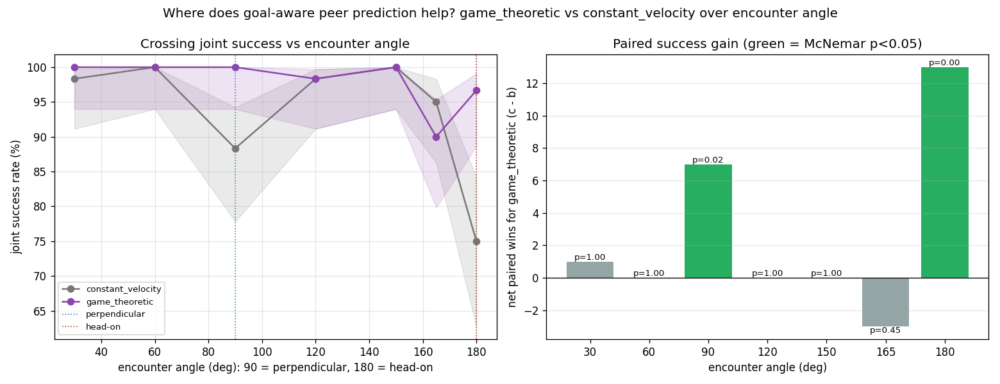

Two significant peaks — perpendicular (90°) and head-on (180°) — with a dead zone
of exact ties at every oblique angle in between, and the head-on peak is the
*larger* of the two. The 90° cell reproduces the published accel=6 result
bit-for-bit (88.3 % / 100 %, c=7/b=0, p=0.0156), which validates the geometry
harness; the head-on cell is a new, larger, more-significant operating point
(c=14/b=1, p=0.0010) that the single-geometry study never saw.

The unifying read is simple: **goal-aware prediction helps only where the myopic
baseline is actually stressed.** constant_velocity fails in exactly two geometries
— the perpendicular crossing (a lateral swerve gets extrapolated straight, so the
forecast lags the peer's curve-back) and the head-on swap (the most adversarial
mutual manoeuvre). At every oblique angle the low-accel MPC threads the conflict
regardless of forecast, both predictors sit on the 100 % ceiling, and the
predictor is irrelevant — there is no room left to win. So the predictor's value
is **stress-gated, not uniform**: it pays off only when the geometry pushes the
baseline off the ceiling.

Honest wrinkle: the lone negative cell, 165°, shows game_theoretic nominally
*behind* (90 % vs 95 %, b=5/c=2) — but it is not significant (p=0.45) and sits
between two ceiling cells, so it reads as sampling noise near the head-on
transition, not a real reversal.

This is the angle-axis companion to the N-axis inversion: the 180° head-on cell is
exactly the N=2 antipodal pair, and it is the *largest* two-drone win here —
which is what makes the
[N≥3 inversion](#goal-aware-peer-prediction-wins-head-on-and-inverts-to-a-liability-on-the-symmetric-swap)
so sharp (the geometry where the forecast helps most pairwise is the one whose
symmetry breaks it in a crowd).

Reproduce: `python scripts/crossing_predictor_angle_phase.py`
(7 angles × 2 predictors × n=60; writes
`results/crossing_predictor_angle_phase/phase.{json,png}`).

## Right-of-way substitutes for the predictor at head-on, but not at the perpendicular crossing

The [bimodal section above](#the-goal-aware-peer-predictor-win-is-bimodal-in-encounter-angle)
established that the `game_theoretic` peer predictor beats `constant_velocity` on a
two-drone crossing at exactly two angles — 90° (perpendicular) and 180° (head-on) —
and is irrelevant at every oblique angle. Separately, the
[antipodal right-of-way section](#a-decentralized-right-of-way-lateral-bias-lifts-the-antipodal-swap-to-100-)
showed that on N≥3 *symmetric* congestion the failure is a coordination problem,
fixed at zero forecast cost by a tiny `planner.lateral_bias` (a global "veer right"
cost). That raises a sharp question: **are those two stories the same story at N=2?**
If the predictor's crossing win is really a *symmetry-breaking* win, a passive
right-of-way convention applied to the **dumb** `constant_velocity` predictor should
recover the failing cells just as well — making goal-aware prediction *substitutable*
by ten lines of decentralized convention.

`scripts/crossing_rightofway_phase.py` tests it on the identical geometry (diameter
crossing, R=21, `max_accel`=6, `start_jitter`=0.8), with three arms paired by seed:
`cv` = constant_velocity, bias 0 (the one that fails); `gt` = game_theoretic, bias 0
(the proven predictor fix); `cvrow` = constant_velocity, bias B (the proposed cheap
fix). The bias was calibrated at the largest-gap angle (180°): `cv` scores 73 % there,
and `cvrow` saturates to 100 % for any B≥1.0 (B=0.5 → 96.7 %, p=0.039); I use **B=1.5**,
comfortably inside the plateau. I sweep the two stress angles (90°, 180°) plus two
**oblique controls** (60°, 150°) where `cv` already succeeds, to check the standing
bias does not *introduce* collisions where it is not needed. n=60, McNemar exact.

| encounter angle | cv | gt | cvrow | cvrow vs cv (c/b, p) | cvrow vs gt (c/b, p) |
|---|---|---|---|---|---|
| 60° (control)         | 100 %  | 100 % | 100 %  | 0/0, 1.000 | 0/0, 1.000 |
| **90° (perpendicular)** | 88.3 % | 100 % | 93.3 % | 7/4, 0.549 (NS) | 0/4, 0.125 (NS) |
| 150° (control)        | 100 %  | 100 % | 100 %  | 0/0, 1.000 | 0/0, 1.000 |
| **180° (head-on)**    | 75.0 % | 96.7 % | **100 %** | **15/0, 0.0001** | 2/0, 0.500 |

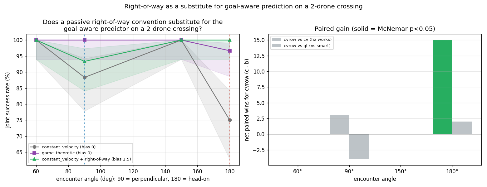

The clean expectation — "right-of-way replaces the predictor at both peaks" — is
**wrong**. The two peaks have *different mechanisms*:

- **Head-on (180°) is a symmetry-breaking win.** The passive convention on a myopic
  predictor reaches **100 %**, beating not only the `cv` baseline (75 %, c=15/b=0,
  p=0.0001) but even the smart predictor `gt` (96.7 %; cvrow wins 2 paired seeds gt
  loses, loses none). Mechanism: a head-on swap is a *pure* mirror-symmetric mutual
  manoeuvre — both drones share the same forecast and mirror-swerve into a re-collision.
  The right-of-way cost makes the +x drone veer south and the −x drone veer north, i.e.
  a deterministic right-hand pass, which the predictor cannot reliably manufacture
  because its forecast is symmetric. So at head-on, **a decentralized convention fully
  substitutes for — and marginally beats — goal-aware prediction.**

- **Perpendicular (90°) is not.** Here the convention only nudges 88.3 % → 93.3 %, and
  the move is **double-edged**: it rescues 7 seeds `cv` failed but *breaks* 4 seeds `cv`
  had solved (c=7/b=4, net +3, p=0.55, not significant). Crucially it never closes the
  gap to `gt`: `gt` is at 100 %, `cvrow` loses 4 paired seeds to it (c=0/b=4, p=0.125).
  The perpendicular crossing is not a mirror-symmetric problem — `cv` fails because it
  extrapolates the peer's lateral swerve straight and lags the curve-back, which is a
  genuine *forecast-divergence* failure that needs the actual prediction, not a passive
  bias.

- **The standing bias is harmless where unneeded — at oblique angles.** Both controls
  (60°, 150°) stay at 100 % for all three arms: bias introduces zero collisions there.
  The double-edged behaviour appears only at the 90° *stress* cell, where the geometry
  already lives near the failure boundary.

This refines the stress-gated story: the predictor's two-peak win is two different
stresses. The 180° peak is a **symmetry stress** — solvable by convention, and in fact
better solved that way (a shared symmetric forecast is the *wrong* tool when the whole
problem is symmetry). The 90° peak is a **forecast-divergence stress** — a passive
convention cannot replace prediction there. The N-axis bookend
([antipodal inversion](#goal-aware-peer-prediction-wins-head-on-and-inverts-to-a-liability-on-the-symmetric-swap)
and its [right-of-way fix](#a-decentralized-right-of-way-lateral-bias-lifts-the-antipodal-swap-to-100-))
is the same lesson scaled up: it is precisely the 180° head-on geometry — the one a
convention beats prediction at — whose symmetry makes the smart predictor *invert* in a
crowd. Convention and prediction are complementary, and the encounter geometry decides
which one you actually need.

Reproduce: `python scripts/crossing_rightofway_phase.py`
(calibrate first with `--bias-sweep 0.5 1 1.5 2 3 --angles 180 --n 30`; the full run is
4 angles × 3 arms × n=60, writes `results/crossing_rightofway_phase/phase.{json,png}`).

## More-frequent replanning is never counterproductive — the replan_period "commitment" is not a safety mechanism

Two shipped findings *assert* a "commitment" mechanism but never sweep the knob that
controls it. The [CHOMP-smoothing wash](#mpc--chomp-smoothing-layering-on-a-saturated-planner-is-a-wash) explains MPC's
low per-step |Δcmd| by noting it "commits to one velocity for the whole replan_period
(0.2 s = 4 control steps) so the controller has nothing to chase between replans" — stated
as mechanism, never measured. The [classical-planner ladder](#the-classical-planner-ladder-is-a-clearance-ladder-and-the-buried-mechanism-stories-are-both-wrong)
swept `replan_period` only as a *planner-comparison* axis at `max_accel`=80, a reactive
regime where the drone dodges late regardless of plan age, so the period "barely mattered."
Neither asks whether MPC *alone* has a `replan_period` sweet-spot, and in particular
whether **more-frequent replanning is counterproductive**: the runner holds the planned
velocity constant between replans (`uav_nav_lab/runner/experiment.py`, recompute only when
`t - last_replan_t >= replan_period`), so a short period re-solves every control step
against a near-symmetric geometry and could chatter between left/right avoidance, never
committing to a side. That was my hypothesis — an inverted-U where the *shortest* period
collides most. **It is wrong, and so is the asserted commitment-aids-safety story.**

Planning is instantaneous in sim time here (the runner only logs `planner_dt`), so this is
a pure commitment/reactivity trade with no compute cost. `scripts/mpc_replan_commitment_phase.py`
sweeps `replan_period` on the single-drone `exp_compare_mpc.yaml` dynamic-obstacle course,
paired by seed, McNemar-exact each cell vs the per-sweep peak. The operating point needs
calibration: at the natural obstacle speed MPC is robust enough that the period barely moves
success until `max_accel` is dropped to ~1.5, which puts it off the ceiling (76.7 %) with
0 % timeouts (every failure is a collision — the discriminating regime).

At that **natural operating point** (obs ×1.0, `max_accel`=1.5, n=60) the curve is
*monotone in the opposite direction to my hypothesis* — freshness wins, and long commitment
is a significant liability:

| replan_period | success | collision | vs peak (c/b, p) |
|---|---|---|---|
| **0.05 s (peak)** | **76.7 %** | 23.3 % | — |
| 0.1 s | 75.0 % | 25.0 % | 0/1, 1.000 |
| 0.2 s | 70.0 % | 30.0 % | 1/5, 0.219 (NS) |
| 0.4 s | 63.3 % | 36.7 % | 1/9, **0.0215** |
| 0.8 s | 60.0 % | 40.0 % | 2/12, **0.0129** |
| 1.6 s | 51.7 % | 48.3 % | 3/18, **0.0015** |

Replanning every control step (0.05 s) is the *best* cell; stretching the period to 1.6 s
costs 25 points (b=18/c=3, p=0.0015). The chatter I predicted never materialises — the MPC
smoothing term keeps successive re-solves coherent, so the only robust effect is the decay
of a *stale* plan as it ages out of touch with the moving obstacles. **The "commitment does
safety work" reading of the CHOMP prose is exactly backwards in closed loop: commitment
buys nothing, and too much of it kills you.**

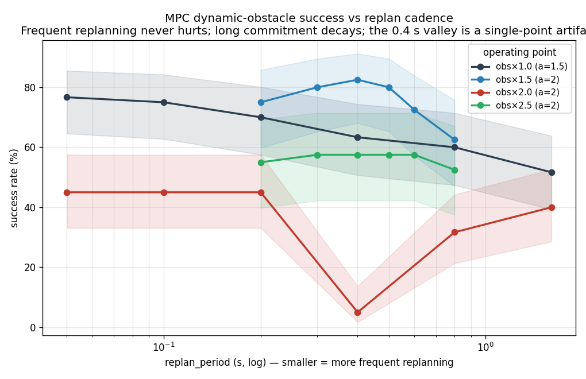

### A deep 0.4 s valley that looks like resonance — but isn't

Pushing the obstacles harder surfaces a tempting artifact. At obs ×2.0 (`max_accel`=2,
n=60) the curve is flat at 45 % for 0.05–0.2 s, then **collapses to 5 % at exactly 0.4 s**
(b=26 vs the short-period peak, p<10⁻⁴), then partly recovers. A 0.4 s commitment window
catastrophically misaligned with the obstacle timescale *looks* like a commitment/obstacle
resonance — a far more interesting story than a monotone decay. The honest test of a
resonance is whether the valley **moves along the period axis** as the obstacle speed
changes. It does not:

| replan_period | obs ×1.5 (a=2) | obs ×2.0 (a=2) | obs ×2.5 (a=2) |
|---|---|---|---|
| 0.2 s | 75.0 % | 45.0 % | 55.0 % |
| 0.3 s | 80.0 % | — | 57.5 % |
| **0.4 s** | **82.5 % (peak)** | **5.0 % (collapse)** | **57.5 %** |
| 0.5 s | 80.0 % | — | 57.5 % |
| 0.6 s | 72.5 % | — | 57.5 % |
| 0.8 s | 62.5 % | 31.7 % | 52.5 % |

The 0.4 s collapse exists at **one** obstacle speed only. At ×1.5 the same period is the
*peak* (82.5 %); at ×2.5 it is unremarkable (57.5 %, flat with its neighbours). A real
resonance would shift the valley to a shorter period as the obstacles speed up; instead it
simply vanishes on either side. It is a pathological single-point coincidence — at ×2.0 the
deterministic dynamic-obstacle phase happens to put an obstacle across the drone's committed
0.4 s segment on nearly every seed — not a generalisable mechanism. **Reporting that valley
as a "resonance sweet-spot to avoid" would have been a fabricated finding;** the robustness
sweep is what catches it, the same calibrate-first discipline that the rest of this document
runs on.

What survives across all four operating points is consistent and unglamorous: short and
mid periods are statistically tied, and the *long*-commitment tail decays (significantly at
the natural point and at obs ×1.5). There is no commitment sweet-spot and no
frequent-replanning penalty. The lesson is the recurring one — an *asserted* offline
mechanism (here, "commitment lets the controller stop chasing") need not be the *measured*
closed-loop effect, and a dramatic-looking valley is worth disproving before it is
published.

Reproduce: `python scripts/mpc_replan_commitment_phase.py --max-accel 1.5 --n 60`
(calibrate first with `--accel-sweep 1.5 2 3 4 6 --n 30`; the obstacle-speed robustness
sweeps add `--obs-speed-mult 1.5 2.5 --periods 0.2 0.3 0.4 0.5 0.6 0.8`; the overlay figure
is the `--overlay` mode over the saved `results/rpcommit_*` dirs).

## The antipodal predictor inversion is a 2D artifact — the vertical escape axis dissolves it, and at high density flips the predictor's sign

The [antipodal inversion section](#goal-aware-peer-prediction-wins-head-on-and-inverts-to-a-liability-on-the-symmetric-swap)
proved that on the symmetric antipodal swap the goal-aware `game_theoretic` predictor
*inverts* to a liability that worsens with crowd size (N=6: gt 1/40 vs cv 26/40). The
mechanism offered there was geometric: every drone shares the same correct, symmetric
forecast, so they all mirror-swerve **sideways** — into the one congested hub they were
trying to avoid — and re-collide. But "sideways" is a 2D word. That whole argument lives
on a plane, where the only way past a head-on peer is left or right, and left/right both
lead back to the centre. **In 3D each drone can also climb or dive** — an escape axis the
symmetric *in-plane* forecast never contests. If the inversion is really a
planar-confinement artifact, lifting the same ring into a voxel world with vertical room
should dissolve it.

`scripts/antipodal_3d_phase.py` embeds the identical antipodal ring (R=20, `max_accel`=6,
`max_speed`=5, `start_jitter`=0.8, same MPC — it samples a Fibonacci sphere in 3D) in two
worlds and runs three arms paired by seed, McNemar exact, n=40:

- **gt2d** — `multi_drone_grid`, `game_theoretic`, the proven 2D inversion (the control).
- **gt3d** — `multi_drone_voxel` (50×50×16, all drones launched at the mid-altitude
  z=8), same predictor, free to use the vertical axis.
- **cv3d** — the same 3D world with the *dumb* `constant_velocity` predictor, to ask
  whether the predictor still matters once 3D is free.

| N | gt2d | gt3d | cv3d | 3D vs 2D gt (c/b, p) | 3D gt vs cv (c/b, p) |
|---|------|------|------|----------------------|----------------------|
| 3 | 15/40 (37.5 %) | **40/40 (100 %)** | 40/40 (100 %) | 25/0, 6.0×10⁻⁸ | 0/0, 1.000 |
| 4 | 11/40 (27.5 %) | **40/40 (100 %)** | 40/40 (100 %) | 29/0, 3.7×10⁻⁹ | 0/0, 1.000 |
| 5 |  9/40 (22.5 %) | **40/40 (100 %)** | 40/40 (100 %) | 31/0, 9.3×10⁻¹⁰ | 0/0, 1.000 |
| 6 |  1/40 (2.5 %)  | **40/40 (100 %)** | **0/40 (0 %)** | 39/0, 3.6×10⁻¹² | 40/0, 1.8×10⁻¹² |

Two findings, one expected and one not.

- **3D dissolves the inversion completely.** `gt3d` is a perfect 40/40 at *every* N=3–6,
  while `gt2d` collapses monotonically (37.5 % → 2.5 %) as the crowd grows. The 3D-vs-2D
  improvement is significant at every N (b=0 every cell — not a single seed prefers 2D),
  and the gap *widens* with N (c = 25 → 29 → 31 → 39) exactly because the 2D failure
  deepens with density. The mirror-swerve trap is real, and it is a **planar artifact**:
  given a vertical degree of freedom the symmetric in-plane forecast is resolved by
  climbing/diving rather than re-converging at the hub. The very thing that makes the
  smart predictor invert on a plane — a shared, correct, symmetric forecast — is harmless
  the moment there is an uncontested axis to deconflict on.

- **At the highest density the predictor's sign flips.** This is the surprise. At N=3–5
  the predictor is *irrelevant* in 3D: both `gt3d` and `cv3d` are a flat 100 % (p=1.000,
  zero discordant seeds) — the vertical room is so generous that even a goal-blind
  constant-velocity forecast deconflicts everything. But at **N=6 `cv3d` collapses to
  0/40 while `gt3d` holds 40/40** (c=40/b=0, every single paired seed flips the same way,
  p=1.8×10⁻¹²). So the relationship between predictor quality and outcome is not fixed —
  it is set by *geometry and density together*:
  - **2D antipodal:** goal-aware prediction is a **liability** (symmetric forecast →
    mirror-swerve re-collision).
  - **3D antipodal, moderate N (≤5):** prediction is **irrelevant** (free vertical
    escape; the dumb forecast suffices).
  - **3D antipodal, high N (=6):** goal-aware prediction is **required** (the dumb
    forecast collapses; only the goal-aware one survives).

  The N=6 collapse is deterministic (0/40, not a noisy boundary), and it is genuinely a
  coordination failure rather than an unsolvable scenario: `gt3d` clears all 40 of the
  same seeds. The plausible reading is that at N=6 the in-plane hub is crowded enough that
  the vertical deconfliction must be *phased by where peers are actually going* — which the
  goal-aware forecast supplies and the constant-velocity one, blind to goals, cannot. Once
  the vertical axis is the only slack left, knowing the peers' destinations is what lets
  six drones stack their climbs/dives without re-colliding.

> **Two corrections, established below** (see [The 3D cv collapse is an N=6 symmetry
> resonance, not a density wall](#the-3d-cv-collapse-is-an-n6-symmetry-resonance-not-a-density-wall--a-goal-blind-right-of-way-bias-rescues-it)).
> A follow-up sweep over N=5,6,7 shows the `cv` collapse is **not** monotone in density —
> it happens **only at N=6** (N=7 is denser and a clean 25/25), so "irrelevant → mandatory
> *as the crowd grows*" is wrong; it is an N=6-specific symmetric resonance. And the
> collapse is a **symmetry** failure, not a forecast one: a goal-blind `lateral_bias`
> convention rescues `cv` at N=6 as completely as the goal-aware predictor does (0→25/25,
> p=6×10⁻⁸), so goal-aware prediction is *not* "required" there — a cheap convention
> suffices. The "knowing destinations is what lets them stack" reading above is the part
> that is refined.

This **bounds the inversion as a low-dimensional phenomenon** and inverts its lesson at
scale. The 2D study's headline — "the smarter predictor is worse" — is true *only on the
plane*; add the third dimension and the predictor goes from liability to irrelevant to
mandatory as the crowd grows. It is the same family as the
[right-of-way fix](#a-decentralized-right-of-way-lateral-bias-lifts-the-antipodal-swap-to-100-),
which also dissolves the 2D inversion — but by a *different* route: the lateral bias breaks
the planar symmetry with a convention, whereas 3D removes the confinement that made the
symmetry pathological in the first place. Two independent escapes from the same trap, and a
caution against reading any planar swarm result as dimension-free.

Reproduce: `python scripts/antipodal_3d_phase.py --n-list 3 4 5 6 --episodes 40`
(writes `results/antipodal_3d_phase.json`; a runnable single demo is
`examples/exp_multi_drone_antipodal_3d.yaml`).

## Heterogeneous predictor swarms break the antipodal deadlock by desync, not by diversity

The [antipodal inversion](#goal-aware-peer-prediction-wins-head-on-and-inverts-to-a-liability-on-the-symmetric-swap)
showed that when *every* drone runs the same goal-aware `game_theoretic` predictor, the
N-drone swap deadlocks: all drones share the same symmetric forecast, all mirror-swerve into
the same new arrangement, and re-collide at the hub (N=6: gt ≈ 1/40). The shipped fix is an
*explicit* convention — [`planner.lateral_bias` right-of-way](#a-decentralized-right-of-way-lateral-bias-lifts-the-antipodal-swap-to-100-),
an asymmetry every drone obeys. That raises an *implicit* alternative: if the deadlock is
caused by a **shared** symmetric forecast, simply making the forecasts **differ** should
break the symmetry with no convention at all. Run half the fleet on `game_theoretic` and
half on `constant_velocity` (via `planner.per_drone`) and the two groups predict their peers
differently, desynchronise, and — the hypothesis — thread through the hub a uniform fleet
jams in.

`scripts/antipodal_heterogeneous_phase.py` runs three arms paired by seed on the same ring
geometry / MPC / dynamics as the inversion study (CENTER=(25,25), RADIUS=20, `max_accel`=6,
`start_jitter`=0.8): `all_cv` (every drone constant_velocity), `all_gt` (every drone
game_theoretic — the deadlocking fleet), and `mixed` (half gt, half cv). Joint success = all
drones reach goal with no inter-drone collision; n=40, McNemar exact.

| N | all_cv | all_gt | mixed | mixed vs all_gt (c/b, p) | mixed vs all_cv (c/b, p) |
|---|---|---|---|---|---|
| 3 | 70.0 % | 37.5 % | **90.0 %** | 22/1, **0.0000** | 9/1, **0.0215** |
| 4 | 80.0 % | 30.0 % | 50.0 % | 12/4, 0.0768 | 3/15, **0.0075** |
| 5 | 85.0 % | 35.0 % | 72.5 % | 17/2, **0.0007** | 6/11, 0.3323 |
| 6 | 65.0 % | 2.5 %  | 40.0 % | 15/0, **0.0001** | 4/14, **0.0309** |

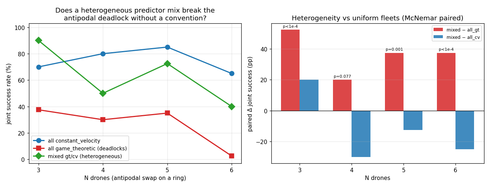

Two things are true at once, and they are the whole story:

- **Heterogeneity robustly rescues the deadlocked uniform-gt fleet.** `mixed` beats `all_gt`
  at every N (significantly at N=3/5/6, and same-signed c=12/b=4 at N=4). The biggest swing
  is the worst deadlock: at N=6 the uniform goal-aware fleet manages 1/40, the mix 16/40
  (c=15/b=0, p=0.0001). This is a direct confirmation of the inversion's mechanism: the
  failure really is the *shared symmetric forecast*, and breaking that sharing — even
  crudely — lifts the deadlock. A swarm can self-desynchronise without any convention.

- **But heterogeneity does not reliably beat a uniform dumb fleet.** `mixed` only out-scores
  `all_cv` at N=3 (90 % vs 70 %, the one cell where it is the outright best of the three); at
  N=4 and N=6 it is significantly *worse* than `all_cv`, and at N=5 it ties. The uniform
  constant-velocity fleet is already symmetry-free — its myopic forecasts mispredict each
  swerve and desync on their own — so a mix that keeps half the drones on the *correct*
  symmetric forecast drags along exactly the coordinated-mirror-swerve component that caused
  the deadlock. The symmetry-breaker that matters is **desync, not diversity**: dumb-but-
  desynced beats half-smart-half-synced everywhere except the smallest swarm.

**The effect is placement-independent.** Re-running the mix as `alternating` (gt,cv,gt,cv…
around the ring) instead of `block` (one contiguous gt arc) reproduces every cell within
noise — N=3 is identical at 36/40 even though the two placements there carry *opposite* gt:cv
ratios (block = 1 gt + 2 cv, alternating = 2 gt + 1 cv). What matters is that the forecasts
*differ at all*, not how they are arranged or in what proportion. The N-parity texture
(odd-N kinder to the mix than even-N) survives both placements, so it is structural, not an
artifact of one layout.

This sharpens the inversion story and bounds the cheap fix. Mixing predictors is a real but
*partial* symmetry-breaker — enough to prove the shared-forecast diagnosis and to rescue the
catastrophic uniform-gt case, but not a free lunch: keeping any goal-aware drones in a
symmetric swarm re-imports the very coordination they cannot resolve among themselves. The
[`lateral_bias` convention](#a-decentralized-right-of-way-lateral-bias-lifts-the-antipodal-swap-to-100-)
remains the only fix that gets *both* — it keeps every drone's goal-aware forecast and still
reaches 100 %, because it breaks the symmetry without throwing away the prediction. Implicit
desync (mixed predictors) and explicit convention (right-of-way) both defeat the deadlock;
only the convention also keeps the intelligence.

Reproduce: `python scripts/antipodal_heterogeneous_phase.py --n-list 3 4 5 6 --episodes 40`
(calibrate with `--n-list 4 6 --episodes 20`; check placement-independence with
`--mix-pattern alternating`; writes `results/antipodal_heterogeneous_phase.{json,png}`).

## The 3D cv collapse is an N=6 symmetry resonance, not a density wall — a goal-blind right-of-way bias rescues it

The [3D-dissolution section](#the-antipodal-predictor-inversion-is-a-2d-artifact--the-vertical-escape-axis-dissolves-it-and-at-high-density-flips-the-predictors-sign)
reported a surprise: lifting the antipodal ring into 3D makes the goal-aware `game_theoretic`
fleet succeed at every N, but the dumb `constant_velocity` fleet, fine at N≤5, **collapses to
0/40 at N=6**. I read that as a density effect ("at the top density the predictor flips to
required") and offered a forecast mechanism ("you must know peers' goals to phase the vertical
escape"). Both readings are wrong, and the right-of-way knob from the
[`lateral_bias` study](#a-decentralized-right-of-way-lateral-bias-lifts-the-antipodal-swap-to-100-)
is what disproves them.

`scripts/antipodal_3d_symmetry_phase.py` runs four arms in the same 3D voxel world
(50×50×16, all drones launched at z=8, R=20, same MPC), paired by seed, McNemar exact, over
the band around the collapse: `cv_b0` (constant_velocity, no bias — the collapse), `cv_bias`
(constant_velocity + `lateral_bias`=2 — does a goal-blind convention rescue it?), `gt_b0`
(game_theoretic — the survivor), `gt_bias` (is the convention harmless on the survivor?).

| N | cv_b0 | cv_bias | gt_b0 | gt_bias | cv_bias vs cv_b0 (c/b, p) |
|---|-------|---------|-------|---------|---------------------------|
| 5 | 25/25 (100 %) | 25/25 | 25/25 | 25/25 | 0/0, 1.000 |
| **6** | **0/25 (0 %)** | **25/25 (100 %)** | 25/25 | 25/25 | **25/0, 6.0×10⁻⁸** |
| 7 | 25/25 (100 %) | 25/25 | 25/25 | 25/25 | 0/0, 1.000 |

Two corrections to the 3D-dissolution story fall straight out:

- **The collapse is N=6-specific, not a density wall.** Stitched together with the earlier
  3D sweep (`cv` at N=3/4/5 = 40/40 each), the full collapse map across N=3–7 is
  ✓ ✓ ✓ **✗** ✓ — `cv` fails at **N=6 only**. N=7 is a *denser* swarm and a clean 25/25, so
  "irrelevant → mandatory as the crowd grows" is simply false. N=6 is a special symmetric
  configuration: six antipodal drones form a regular hexagon whose three diameters drive
  three exact head-on pairs through the hub at once, with a high-order rotational symmetry
  that the myopic forecast cannot perturb. Odd N (5, 7) place each drone's antipode *between*
  two others — no exact head-on pair — so the symmetry never closes and the dumb fleet threads
  through. (This is the same N-parity texture the
  [heterogeneous-swarm study](#heterogeneous-predictor-swarms-break-the-antipodal-deadlock-by-desync-not-by-diversity)
  independently saw in 2D — odd-N kinder than even-N — observed here as a clean on/off at N=6.)

- **It is a symmetry failure, not a forecast failure.** A goal-*blind* `lateral_bias`
  convention lifts `cv` from 0/25 to 25/25 at N=6 (c=25/b=0, p=6×10⁻⁸) — exactly as well as
  the goal-aware predictor `gt_b0` (also 25/25). So goal-aware prediction is **not** "required"
  at N=6, as the dissolution section claimed: the constant-velocity forecast was never the
  problem; the *shared symmetry* was, and any symmetry-breaker — a convention here, a
  destination-aware forecast there — fixes it. `gt_bias` stays 25/25 everywhere, so the
  convention is harmless on the arms that already succeed (consistent with the
  [`lateral_bias` safety study](#the-right-of-way-bias-is-safe-everywhere-and-general-to-head-on-convergence)).

This converges with the heterogeneous-swarm result from the other direction. That study broke
the *shared forecast* by mixing predictors (implicit desync) in 2D; this one breaks the
*shared geometry* by adding a right-of-way convention in 3D. Both land on the same diagnosis —
**the antipodal failure is symmetry, full stop** — and both show the goal-aware predictor is
neither the cause nor a unique cure. What 3D added was never "the predictor becomes required";
it was a sharper exposure of *which* configuration (the N=6 hexagonal resonance) the shared
symmetry actually bites at.

Reproduce: `python scripts/antipodal_3d_symmetry_phase.py --n-list 5 6 7 --episodes 25`
(writes `results/antipodal_3d_symmetry_phase.json`; `--max-steps 600` keeps the deadlocked
cells cheap — a crossing succeeds in ~200 steps, a deadlock never recovers).

> **One refinement, established below** (see [The even-N antipodal resonance recurs at N=8 —
> there the forecast fails too, and the convention turns harmful where there is no
> deadlock](#the-even-n-antipodal-resonance-recurs-at-n8--there-the-forecast-fails-too-and-the-convention-turns-harmful-where-there-is-no-deadlock)).
> Extending the sweep to N=8 shows the collapse is **not N=6-only**: N=8 collapses too, so the
> resonance is **even-N≥6** (map N=3–8 = ✓ ✓ ✓ ✗ ✓ ✗), exactly the even-harsher parity this
> section already noted. Two things sharpen: at N=8 the goal-aware predictor `gt_b0` **also**
> collapses (0/30, unlike N=6 where it held), so the forecast is a *stopgap* that runs out
> while the convention keeps scaling; and `lateral_bias` is *not* harmless everywhere in 3D —
> at N=4, where there is no deadlock, it drives `cv` from 30/30 to **0/30**.

## The even-N antipodal resonance recurs at N=8 — there the forecast fails too, and the convention turns harmful where there is no deadlock

> **One correction, established below** (see [The 3D antipodal collapse is a non-monotone
> resonance, not the even-N law](#the-3d-antipodal-collapse-is-a-non-monotone-resonance-not-the-even-n-law)).
> Extending the sweep to N=10 and N=12 refutes the "even-N≥6" generalization made in this
> section: **N=10 (even, crowded) survives** for `cv` (25/25), so even rings do *not* uniformly
> deadlock once crowded — the even map is 4 ✓ 6 ✗ 8 ✗ 10 ✓ 12 ✗, a non-monotone resonance with
> no parity or density law. What *does* survive the extension are two robust invariants: the
> convention rescues every N (100 % through N=12), and the `gt` forecast stays dead for all
> N≥8. "The even-harsher parity is the real law" below is the over-generalization that N=10
> refutes — the third correction of this same sub-finding, and the one that retires the attempt
> to predict *which* N collapses.

The [N=6 resonance section](#the-3d-cv-collapse-is-an-n6-symmetry-resonance-not-a-density-wall--a-goal-blind-right-of-way-bias-rescues-it)
left one question open: is the 3D `cv` collapse a property of **N=6 specifically** (a single
hexagonal resonance), or does it **recur at the next even N**? The hexagon mechanism — six
antipodal drones forming three exact head-on diameter-pairs through the hub — predicts that an
octagon (N=8, four exact pairs) should collapse too, while odd N (no exact pair) keeps
threading through. The honest way to settle "N=6-only" versus "even-N" is to run N=8.

`scripts/antipodal_3d_symmetry_phase.py --n-list 4 6 8 --episodes 30` runs the same four arms
in the same 3D voxel world (50×50×16, all drones launched at z=8, R=20), paired by seed,
McNemar exact. N=4 is the even control that the earlier sweep showed survives; N=6 is the known
collapse; N=8 is the test.

| N | cv_b0 | cv_bias | gt_b0 | gt_bias | cv_bias vs cv_b0 (c/b, p) | gt_b0 vs cv_b0 (c/b, p) |
|---|-------|---------|-------|---------|---------------------------|-------------------------|
| 4 | 30/30 (100 %) | **0/30 (0 %)** | 30/30 | 30/30 | **−30** (b=30/c=0, <1e-9) | 0/0, 1.000 (tie) |
| 6 | **0/30 (0 %)** | 30/30 (100 %) | 30/30 (100 %) | 30/30 | +30 (b=0/c=30, <1e-9) | +30 (b=0/c=30, <1e-9) |
| 8 | **0/30 (0 %)** | 30/30 (100 %) | **0/30 (0 %)** | 30/30 | +30 (b=0/c=30, <1e-9) | 0/0, 1.000 (tie) |

Three findings, each correcting or extending the N=6 story:

- **The resonance is even-N≥6, not N=6-only.** N=8 collapses exactly as N=6 does (`cv_b0`
  0/30). Stitched with the prior sweep the full map across N=3–8 is ✓ ✓ ✓ **✗** ✓ **✗** — odd N
  (3, 5, 7) always thread through, even N collapse *once there are enough drones*: N=4 (two
  exact pairs) is uncrowded enough that the free vertical axis still resolves it, but from N=6
  up every even ring deadlocks. So "N=6-specific" was too narrow; the parity texture the N=6
  section already flagged (even harsher than odd) is the real law, and N=8 is its second tooth.

- **At N=8 the forecast fails too — the convention is what scales.** This is the sharp new
  result. At N=6 the goal-aware `gt_b0` held (30/30): knowing peer destinations was *enough* to
  phase the escape, so prediction looked like a cure. At N=8 `gt_b0` **also collapses to 0/30**
  — `gt_b0 vs cv_b0` is now a dead tie (both 0/30), where at N=6 `gt` beat `cv` by +30. Four
  simultaneous head-on pairs overwhelm what destination-aware forecasting can deconflict. The
  `lateral_bias` convention, by contrast, lifts **both** predictors to 30/30 at N=8
  (`cv_bias`, `gt_bias`), exactly as at N=6. So a smarter forecast is a **stopgap that runs
  out** with crowd size, while a cheap symmetry-breaking convention keeps working — strong
  confirmation that the failure is symmetry, not forecast quality, and that breaking the
  symmetry (not improving the prediction) is the durable fix.

- **The convention is double-edged: at N=4 it *causes* the collapse it cures elsewhere.** The
  surprise. At N=4 there is no deadlock (`cv_b0` and `gt_b0` both 30/30 — the vertical axis
  alone resolves the square). Turning `lateral_bias` on there drives `cv` from 30/30 to **0/30**
  (b=30/c=0, p<1e-9): a strong in-plane right-veer, applied by a goal-blind fleet that did not
  need it, manufactures a coordinated four-way pinwheel that re-collides — the very
  symmetric-convergence pathology the bias is meant to break, induced by the bias itself.
  (`gt_bias` survives at N=4: a goal-aware fleet desynchronizes the veer enough to avoid it.)
  This **bounds the 2D
  [`lateral_bias`-is-safe-everywhere result](#the-right-of-way-bias-is-safe-everywhere-and-general-to-head-on-convergence)**:
  that safety does *not* transfer to 3D, where the no-deadlock solution lives on the vertical
  axis the in-plane bias disrupts. Right-of-way must be applied **where the deadlock is** (even
  rings, N≥6), not as an always-on primitive — turn it on in the uncrowded regime and it is the
  one knob that breaks an otherwise-perfect fleet.

The net picture for the antipodal swarm, across both the dimension and the convention: odd
rings are self-resolving at every N; even rings from N=6 up are pure symmetry deadlocks; a
goal-aware forecast patches the smaller even ring (N=6) but is overwhelmed by the larger (N=8);
and a right-of-way convention fixes every deadlocked ring — but only the deadlocked ones, since
it actively harms a ring that had no symmetry to break.

Reproduce: `python scripts/antipodal_3d_symmetry_phase.py --n-list 4 6 8 --episodes 30`
(writes `results/antipodal_3d_n8_resonance.json`; `--max-steps 800` keeps deadlocked cells
cheap — the slowest crossing succeeds well under 800 steps, a deadlock never recovers).

## The right-of-way convention is robust to speed heterogeneity — a 4×-mismatched fleet still rounds the hub

The [right-of-way studies](#a-decentralized-right-of-way-lateral-bias-lifts-the-antipodal-swap-to-100-)
proved the `lateral_bias` convention on a **homogeneous** fleet: every drone identical, same
`max_speed`. But a clockwise roundabout implicitly assumes interchangeable agents that
circulate at a compatible pace — a fast drone could lap a slow one straight into the hub and
re-shatter the very symmetry the convention breaks. Real swarms are heterogeneous, so the
honest question is whether right-of-way survives drones that are *not* interchangeable.

`scripts/antipodal_hetero_dynamics_phase.py` stresses the cleanest axis — **speed spread** —
with the fleet *mean* speed held fixed at 5.0 so the comparison is not confounded by an overall
faster/slower fleet. At N=6 the ring alternates fast/slow (`max_speed` = 5 ± spread/2, carried
per index by `planner.per_drone`), paired by seed, McNemar exact, n=40. One methodology note up
front: the outcome is split into collision vs timeout, because a slow drone running out of clock
is *not* a coordination failure — a first run with a tight step budget produced a false 0/3
"timeout" purely because a speed-3 drone needs ~270 steps to cross; with a generous budget
(every free drone finishes) a "timeout" can only mean a genuine jam.

| arm (N=6) | speeds | success | coll / timeout | vs homo_b2 (c/b, p) |
|-----------|--------|---------|----------------|----------------------|
| homo_b2 | 5,5,5,5,5,5 | 39/40 | 1 / 0 | (reference) |
| het2_b2 | 6,4,… | 40/40 | 0 / 0 | 1/0, 1.000 (tie) |
| het4_b2 | 7,3,… | 40/40 | 0 / 0 | 1/0, 1.000 (tie) |
| het6_b2 | 8,2,… | 40/40 | 0 / 0 | 1/0, 1.000 (tie) |
| hetmax_b0 | 8,2,… (no bias) | 26/40 | **14** / 0 | b=14/c=1, **0.0010** |

Two findings:

- **The convention is fully robust to speed heterogeneity.** At *every* spread — up to an 8-vs-2,
  **4× speed ratio** — the heterogeneous fleet with the convention scores 40/40, statistically
  tied with the homogeneous fleet (39/40), with **zero collisions and zero timeouts**. The slow
  drones all reach their goals; the fast drones flow around them rather than lapping them into the
  hub. The roundabout absorbs the speed mismatch completely. (If anything the trend is the other
  way: the one seed that *collides* under a homogeneous fleet — a perfect-symmetry tie at the hub
  — is cleared once the speeds differ, the speed spread acting as a mild extra desync that
  complements the convention. With c=1 this is not significant, but it is the opposite of the
  feared degradation.)

- **And the convention is still doing the work — heterogeneity alone does not fix it.** The same
  maximally-mixed fleet *without* the bias (`hetmax_b0`) collides ~35 % of the time (26/40,
  **14 collisions**, significantly worse than the homogeneous-with-convention reference,
  p=0.0010); turning the convention on rescues it to 40/40 (c=14/b=0, p=0.0001). So speed
  heterogeneity is *not* itself a sufficient symmetry-breaker — the desync it injects is too weak
  to deconflict the hub on its own, and the right-of-way rule is what carries the mixed fleet
  through. (Every `hetmax_b0` failure is a collision, not a timeout, confirming these are real
  coordination breakdowns and not the clock artifact the methodology note guards against.)

This **extends the [`lateral_bias`-is-safe-and-general result](#the-right-of-way-bias-is-safe-everywhere-and-general-to-head-on-convergence)
to heterogeneous fleets**: the convention is not only safe on the homogeneous benchmarks and
general across head-on topologies, it is robust to non-interchangeable drones — a fleet whose
members fly at a 4× speed ratio rounds the hub as cleanly as identical drones. It also dovetails
with the [heterogeneous-predictor result](#heterogeneous-predictor-swarms-break-the-antipodal-deadlock-by-desync-not-by-diversity):
that study found that *desync* is what breaks the antipodal symmetry; here speed heterogeneity is
a (weak) form of desync that helps at the margin but cannot replace the convention. Scope bound:
this tests the *speed* axis only; heterogeneous radii or dynamics limits are left open.

Reproduce: `python scripts/antipodal_hetero_dynamics_phase.py --n 6 --spreads 2 4 6 --episodes 40`
(writes `results/antipodal_hetero_dynamics_phase.json`; `--max-steps 1000` gives the slowest
arm ample clock so any timeout is a genuine jam). Demo:
`examples/exp_multi_drone_antipodal_hetero_speed.yaml`.

## The right-of-way convention has a density cliff — but a stronger bias pushes it out

The [right-of-way fix](#a-decentralized-right-of-way-lateral-bias-lifts-the-antipodal-swap-to-100-)
reached 100 % on the antipodal swap at N=2–6, and the
[safety/generality check](#the-right-of-way-bias-is-safe-everywhere-and-general-to-head-on-convergence)
found a fixed `lateral_bias`=2 harmless across topologies. But N≤6 is a small crowd. On a
*fixed-radius* ring, raising N raises the hub density — more drones must thread the same
centre at once — so the natural question is whether one fixed bias keeps scaling, or whether
the convention has a **density cliff**. This is the 2D, bias-*strength* companion to the 3D
on/off [even-N resonance study](#the-even-n-antipodal-resonance-recurs-at-n8--there-the-forecast-fails-too-and-the-convention-turns-harmful-where-there-is-no-deadlock):
that one showed *whether* a convention is needed flips with parity and dimension; this one asks
*how strong* it must be as the same deadlock gets denser.

`scripts/antipodal_rightofway_phase.py` swept N ∈ {8, 12, 16} on the 2D ring (CENTER=(25,25),
RADIUS=20 fixed, `max_accel`=6), three arms paired by seed (cv / gt / gt+row), at two bias
strengths, n=40, McNemar exact.

| N | cv (no bias) | gt (no bias) | gt+row **bias=2** | gt+row **bias=4** |
|---|---|---|---|---|
| 8  | 60.0 % | 2.5 % | 97.5 % | 97.5 % |
| 12 | 30.0 % | 2.5 % | 90.0 % | **100.0 %** |
| 16 | 17.5 % | 0.0 % | **65.0 % (cliff)** | **97.5 %** |

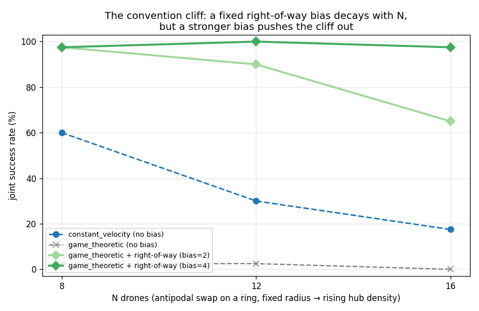

- **A fixed bias has a density cliff.** `gt`-without-bias is fully deadlocked at every N here
  (0–2.5 %), and `cv` decays steadily with density (60→30→17.5 %). The shipped fix at
  `bias`=2 holds at N=8 (97.5 %) but erodes monotonically as the hub fills: 90 % at N=12, then
  **65 % at N=16**. The convention does not fail all at once — it keeps beating `cv` at every N
  (N=16: 65 % vs 17.5 %, c=21/b=2, p=0.0001) — but a single fixed strength is not enough to
  hold 100 % as the crowd grows. The N≤6 "always 100 %" result was a small-crowd regime.

- **A stronger bias pushes the cliff out.** Doubling to `bias`=4 restores the high-N cells:
  N=12 goes 90→**100 %**, and N=16 goes 65→**97.5 %** (39/40). At N=16 the stronger convention
  beats *both* the deadlocked `gt` (c=39/b=0, p<1e-4) and the dumb `cv` (c=32/b=0, p<1e-4). So
  the cliff is not a hard ceiling on what a decentralized convention can do — it is the limit
  of a *particular* strength. **The required bias scales with density:** a sparse ring needs
  only a gentle veer, a crowded hub needs a faster roundabout to clear the same geometry.

- **But stronger is not unconditionally better (preliminary).** A single-N bias sweep at N=16
  (n=20, calibration) suggests an *upper* limit as well: success climbs 15 %→65 %→100 % from
  bias 1→2→4, then **dips to ~65 % at bias 6** before recovering at 8–12. The likely reading is
  that an over-strong right-veer over-rotates the roundabout into its own coordinated
  re-collision — the same double-edged behaviour the 3D study found when a convention is applied
  where it is not needed, here induced by *over*-applying it. There is an operating band, not a
  monotone "more is better"; pinning the optimum at n=40 is the natural next step.

The picture this completes: a decentralized right-of-way convention is the durable fix for the
antipodal deadlock (a smarter forecast is a [stopgap that runs out](#the-even-n-antipodal-resonance-recurs-at-n8--there-the-forecast-fails-too-and-the-convention-turns-harmful-where-there-is-no-deadlock)),
but "durable" means *tunable*, not *free*: its strength is an operating point that must rise
with crowd density and probably has an upper band, not a single magic constant. The right
mental model is a roundabout — it clears any amount of traffic, but only if you set the
rotation speed to the load.

Reproduce: `python scripts/antipodal_rightofway_phase.py --n-list 8 12 16 --bias 2 --episodes 40`
then `--bias 4`; overlay the two with `--overlay results/conv_cliff_b2.json results/conv_cliff_b4.json`;
calibrate the bias band with `--n-list 16 --bias-sweep 1 2 4 6 8 12`.

## The 3D antipodal collapse is a non-monotone resonance, not the even-N law

The [N=8 section](#the-even-n-antipodal-resonance-recurs-at-n8--there-the-forecast-fails-too-and-the-convention-turns-harmful-where-there-is-no-deadlock)
saw `cv` collapse at N=6 and N=8 and concluded "even rings from N=6 up are pure symmetry
deadlocks." That is the third reading of this one sub-finding — first a density wall, then
N=6-only, then even-N≥6 — and each was an extrapolation from two or three points. The honest
test is to keep going: run the *next two* even rings, N=10 and N=12.

`scripts/antipodal_3d_symmetry_phase.py --n-list 8 10 12 --episodes 25` runs the same four arms
in the same 3D voxel world (50×50×16, z=8, R=20), paired by seed, McNemar exact.

| N | cv_b0 | cv_bias | gt_b0 | gt_bias | gt_b0 vs cv_b0 (c/b, p) |
|---|-------|---------|-------|---------|--------------------------|
| 8 | 0/25 (0 %) | 25/25 | 0/25 (0 %) | 25/25 | 0/0, 1.000 (tie) |
| 10 | **25/25 (100 %)** | 25/25 | **0/25 (0 %)** | 25/25 | b=25/c=0, <1e-7 (cv wins) |
| 12 | 0/25 (0 %) | 25/25 | 0/25 (0 %) | 25/25 | 0/0, 1.000 (tie) |

Every cell is deterministic (0/25 or 25/25, no boundary), so these are facts, not noise. Three
conclusions, the first of which retires a claim I made twice:

- **The collapse is a non-monotone resonance — the even-N law is wrong.** `cv_b0` *survives* at
  N=10 (25/25) between collapses at N=8 and N=12. With the earlier sweeps the even-N map is now
  4 ✓ 6 ✗ 8 ✗ **10 ✓** 12 ✗ — no parity, density, or "exact-pairs" rule fits (N=10 is even,
  crowded, and has five exact head-on diameter-pairs, yet threads through cleanly). Whatever
  selects the collapsing N is a specific geometric resonance of the ring that these five points
  do not pin down. The lesson the [N=6](#the-3d-cv-collapse-is-an-n6-symmetry-resonance-not-a-density-wall--a-goal-blind-right-of-way-bias-rescues-it)
  and [N=8](#the-even-n-antipodal-resonance-recurs-at-n8--there-the-forecast-fails-too-and-the-convention-turns-harmful-where-there-is-no-deadlock)
  corrections kept teaching — *do not extrapolate the collapse-N from a handful of points* — is
  now load-bearing: we stop predicting which N collapses and report only the invariants that hold
  across all of them.

- **The forecast stays dead for all N≥8.** `gt_b0` = 0/25 at N=8, 10, *and* 12 — the goal-aware
  predictor never recovers once the crowd passes N=6. This confirms and extends the N=8 result
  that the forecast is a stopgap that runs out; at no tested high N does knowing peer
  destinations resurrect a deadlocked fleet.

- **The convention rescues every N — and the inversion reappears at N=10.** Both bias arms are
  25/25 at every N (8, 10, 12): the right-of-way convention holds at 100 % across the whole
  range, the one thing that is monotone here. And because `cv` survives while `gt` dies at N=10,
  the *dumb* predictor beats the *smart* one 25/0 there — the
  [goal-aware-predictor inversion](#goal-aware-peer-prediction-wins-head-on-and-inverts-to-a-liability-on-the-symmetric-swap)
  reappears in 3D at a single resonant N, a clean reminder that "smarter forecast" is not
  monotonically safer. (The convention's *strength* requirement as the hub gets denser is a
  separate axis, characterized in the [bias-scaling cliff study](#the-right-of-way-convention-has-a-density-cliff--but-a-stronger-bias-pushes-it-out);
  here the strength is fixed at bias=2 and the question is only which N the *unbiased* fleet
  survives.)

The durable picture across the whole antipodal arc: which predictor wins and which N collapses
form a messy non-monotone resonance that resists a tidy law, but the symmetry-breaking
convention is 100 % everywhere regardless — the practical takeaway is to stop trying to predict
the resonance and simply break the symmetry. Scope: N≤12 and the even rings; high-N odd rings
and N≥14 are untested (the deadlocked cells are expensive), so the resonance's period, if it has
one, is open.

Reproduce: `python scripts/antipodal_3d_symmetry_phase.py --n-list 8 10 12 --episodes 25`
(writes `results/antipodal_3d_cliff_phase.json`; `--max-steps 600` keeps the deadlocked cells
cheap).

## The right-of-way convention needs near-full adoption — free-riders break it, and tolerance shrinks with density

The [heterogeneous-predictor study](#heterogeneous-predictor-swarms-break-the-antipodal-deadlock-by-desync-not-by-diversity)
found that *mixing* predictors helps: half gt / half cv DESYNCs the shared symmetric forecast
and rescues the uniform-gt deadlock — diversity breaks symmetry. This asks the mirror question
for the *convention*: a right-of-way rule is a **coordination** device, not a desync device, so
it should need to be **shared**. If only some drones obey `lateral_bias` and the rest run the
deadlocking goal-aware predictor with no bias, does coordination degrade gracefully, kick in at
a critical mass, or collapse until nearly everyone complies?

`scripts/antipodal_convention_adoption_phase.py` puts all N drones on `game_theoretic` (the
deadlocking predictor) and lets `k` of them also carry `lateral_bias`=2 (adopters), the rest 0
(free-riders), sweeping k=0..N via `planner.per_drone`. Joint success, paired by seed, n=40,
McNemar exact vs full adoption (k=N).

| adoption | N=6 joint success | N=8 joint success |
|---|---|---|
| 0 %    | 2 %   | 2 %  |
| ~⅓     | 10 %  | 5 %  |
| ½      | 28 %  | 18 % |
| ⅔      | 22 %  | 40 % (N=8: 0.62) |
| N−2 free-riders | — | 65 % (k=6) |
| **N−1 (one free-rider)** | **100 % (k=5)** | **68 % (k=7)** |
| **N (full)** | **100 %** | **98 %** |

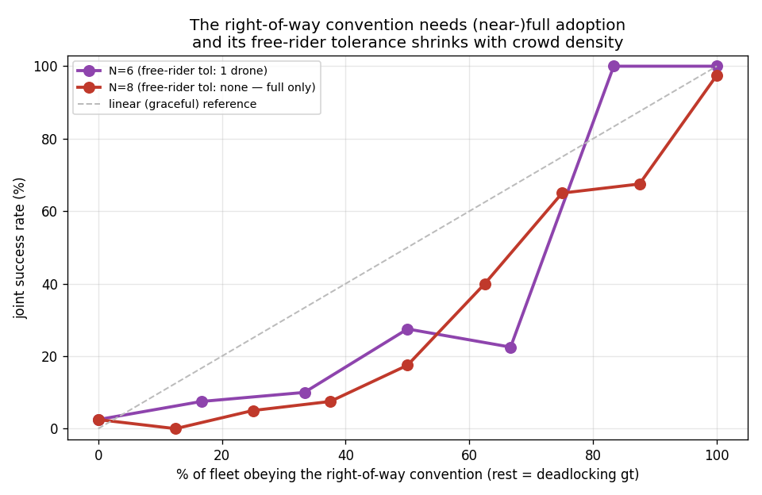

- **Partial adoption does not work — the convention is a coordination device.** At both N the
  success curve stays *below* the linear (graceful-degradation) reference for most of the range
  and only reaches the deadlock-free regime near full adoption. This is the exact mirror of the
  predictor result: mixing predictors *helps* (desync), but mixing in free-riders *hurts* — you
  cannot get partial credit for a convention only some of the fleet obeys, because the
  non-adopters keep mirror-swerving into the hub.

- **Free-rider tolerance shrinks with density.** At N=6 there is a sharp critical mass at
  **N−1**: one free-rider is tolerated (k=5 → 100 %, tied with full adoption), but two collapse
  it (k=4 → 22 %). At the denser N=8 even *one* free-rider is too many — k=7 reaches only 68 %,
  and only full adoption (k=8) clears the deadlock (98 %). The mechanism is the deadlock's own
  geometry: a deadlock needs a *symmetric pair* of non-cooperating drones, so a single free-rider
  in a sparse ring is harmlessly absorbed (its one nearby adopter rounds it), but in a crowded
  ring there is no slack to absorb even one.

- **The curve shape flips with density too.** N=6 is a step (flat-low, then a jump at N−1); N=8
  is a smoother accelerating climb that only saturates at full adoption. Either way the practical
  rule is the same: a right-of-way convention is an all-or-(nearly-)nothing coordination device,
  and the safety margin for stragglers vanishes as the hub fills.

This is the coordination-side bookend to the
[predictor-desync result](#heterogeneous-predictor-swarms-break-the-antipodal-deadlock-by-desync-not-by-diversity):
**desync helps prediction, coordination helps convention** — heterogeneity rescues a fleet of
identical *forecasts* but breaks a fleet of identical *rules*. It is orthogonal to the
[pairwise-vs-global](#)
question (this varies *how many* obey one global rule, not *which* rule); the two compose — a
neighbour-conditional convention might raise free-rider tolerance, which this adoption axis could
then re-measure. Scope: adopters are assigned in ring-contiguous (`block`) order; the placement
of free-riders relative to one another is a plausible second-order effect left open.

Reproduce: `python scripts/antipodal_convention_adoption_phase.py --n 6 --bias 2 --episodes 40`
then `--n 8`; overlay with `--overlay results/adopt_n6.json results/adopt_n8.json`
(`--max-steps 700` keeps the deadlocked low-k cells cheap; `--pattern spread` probes placement).

## The convention cliff is hub density, not drone count — N and R collapse onto N/R

The [convention cliff study](#the-right-of-way-convention-has-a-density-cliff--but-a-stronger-bias-pushes-it-out)
showed a fixed `lateral_bias` decays as N grows on a fixed-radius ring. But N was a proxy:
adding drones to a fixed ring also raises the **hub density** — the number of antipodal paths
crossing the same centre. Is the cliff really about the *count* N, or about the *density*?
The clean test is to hold the linear density **N/R** (drones per unit ring radius) constant
across a small and a large fleet: if the cliff is density, a 6-drone ring and a 12-drone ring
at the same N/R should give the *same* joint success even though one has twice the drones.

`scripts/antipodal_density_phase.py` runs matched-density (N, R) pairs (N ∈ {6, 12}, R chosen
so N/R ∈ {0.30, 0.60, 0.90, 1.20}; R ≤ 24 keeps the ring inside the 50×50 world), gt +
right-of-way at bias 2, paired by seed, n=40, McNemar exact between the N=6 and N=12 members of
each pair.

| N/R | N=6 | N=12 | N=6 vs N=12 (b/c, p) |
|---|---|---|---|
| 0.30 | 100 % | (R=40, out of bounds) | — |
| 0.60 | 95 % | 90 % | b=4/c=2, 0.69 (tie) |
| **0.90** | **82 %** | **82 %** | b=5/c=5, **1.00 (exact tie)** |
| 1.20 | 57 % | 72 % | b=5/c=11, 0.21 (tie) |

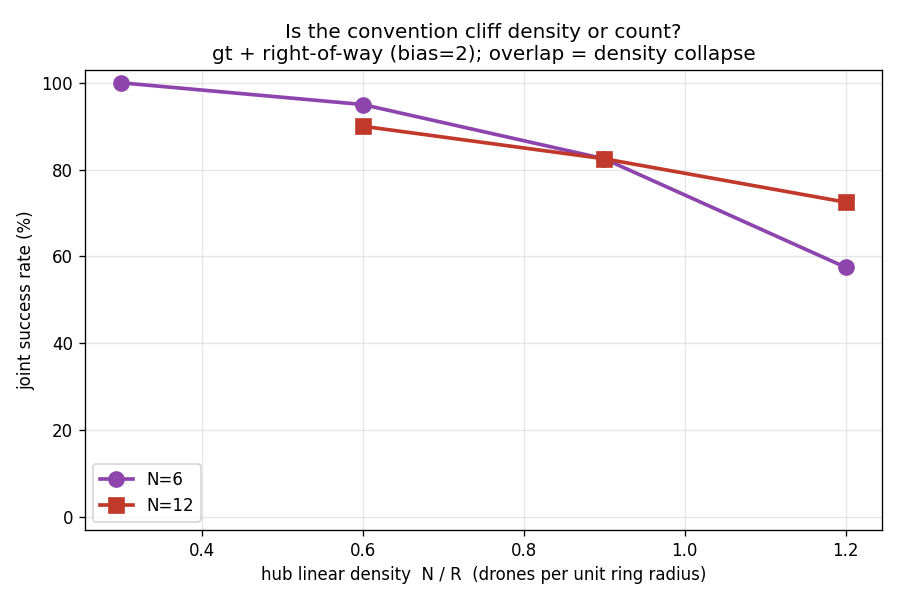

- **The cliff is density, not count.** Every matched-density pair is a McNemar tie — doubling
  the fleet from 6 to 12 drones at the same N/R does not change joint success. The N/R=0.90
  pair is an *exact* tie (33/40 vs 33/40); the 15-pp gap seen there at n=20 was small-sample
  noise that vanished at n=40. Success is a clean monotone function of N/R alone (100 → 95/90
  → 82 → 57/72 %), so the two fleets land on one curve. The earlier "cliff with N" was N acting
  as a stand-in for the density it raises on a fixed ring.

- **What this pins down mechanistically.** The right-of-way roundabout is a *spatial* device:
  its limit is how many drones must occupy the hub annulus at once, which is set by N/R, not by
  N or R separately. This is the same spatial-not-temporal logic the
  [speed-heterogeneity result](#the-right-of-way-convention-is-robust-to-speed-heterogeneity--a-4-mismatched-fleet-still-rounds-the-hub)
  found from the other side (a 4× speed spread did *not* hurt, because the roundabout is spatial
  and a fast drone does not lap a slow one into the hub). Density is the spatial load; the
  convention's strength must be set to it — which is exactly why a fixed bias has a
  [cliff](#the-right-of-way-convention-has-a-density-cliff--but-a-stronger-bias-pushes-it-out)
  and a stronger bias pushes it out: more bias = a tighter roundabout that fits more drones in
  the same annulus.

- **Scope and the one wobble.** The collapse holds across the tested band; the only deviation
  is N/R=1.20, where N=6 (57 %) trails N=12 (72 %) by 15 pp — still a tie (p=0.21), but the
  sign is worth noting: at the highest density the *smaller* ring (R=5, nearly drone-radius
  scale) may suffer a finite-size effect the density variable does not capture, so N/R is the
  control variable across the practical band but not necessarily into the degenerate small-R
  corner.

Net: the antipodal convention's reach is governed by one number, the hub linear density N/R,
not by the drone count or the ring size independently. The cliff, the bias-scaling fix, and
the speed-heterogeneity robustness are all facets of the same spatial-load picture.

Reproduce: `python scripts/antipodal_density_phase.py --episodes 40`
(writes `results/antipodal_density_phase.{json,png}`; matched-density pairs are defined in the
`PAIRS` table; `--max-steps 800` keeps the densest deadlocked cells cheap).

## Once the right-of-way convention is on, the predictor is free — cv and gt become identical

Two threads meet here. The
[goal-aware inversion](#goal-aware-peer-prediction-wins-head-on-and-inverts-to-a-liability-on-the-symmetric-swap)
showed the *predictor* matters enormously on the bare antipodal swap — the smart `gt` forecast
deadlocks (every drone shares it and mirror-swerves) while dumb `cv` partially threads through.
The [right-of-way fix](#a-decentralized-right-of-way-lateral-bias-lifts-the-antipodal-swap-to-100-)
showed a convention rescues `gt`; at 2-drone head-on it even
[*substitutes* for the predictor](#right-of-way-substitutes-for-the-predictor-at-head-on-but-not-at-the-perpendicular-crossing).
So which dominates in the N-drone crowd: does the convention merely *help* the predictor, or
does it make the forecast **irrelevant**?

`scripts/antipodal_convention_predictor_phase.py` crosses the two factors — predictor
{cv, gt} × convention {off, on at bias 2} — on the antipodal ring (fixed R=20 so N sets hub
density), four arms paired by seed, n=40, McNemar exact for the dominance test gt+row vs cv+row.

| N | cv | gt | cv+row | gt+row | gt+row vs cv+row (c/b, p) |
|---|---|---|---|---|---|
| 8  | 60 % | 2 % | 100 % | 97 % | 0/1, 1.00 (tie) |
| 12 | 30 % | 2 % | 95 %  | 90 % | 2/4, 0.69 (tie) |
| 16 | 17 % | 0 % | 72 %  | 65 % | 7/10, 0.63 (tie) |

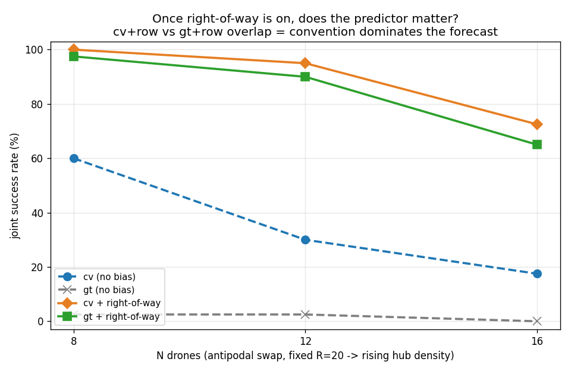

- **The convention dominates the predictor — once it is on, the forecast is irrelevant.**
  Without a convention the predictor is decisive: `gt` deadlocks (0–2 %), `cv` partially
  survives (60→17 %, decaying with density). Turn the convention on and that entire distinction
  vanishes — `cv+row` and `gt+row` are a McNemar tie at every N. Breaking the symmetry is the
  whole game; given a convention, a clever destination-aware forecast buys nothing a dumb
  coasting forecast doesn't already get.

- **If anything, the dumb predictor is *better* under the convention.** `cv+row` edges `gt+row`
  at all three N (100 vs 97, 95 vs 90, 72 vs 65) — never significant, but consistent in sign.
  This is the N-drone echo of the
  [2-drone substitution result](#right-of-way-substitutes-for-the-predictor-at-head-on-but-not-at-the-perpendicular-crossing)
  (where cv+row beat gt at 180°): once a global convention has set the passing side, a
  goal-aware drone that keeps *re-forecasting* peers curving back toward their goals is solving
  a problem the convention already solved, and that extra reactivity slightly hurts. The
  symmetric forecast is the wrong tool precisely when a convention has made the geometry
  symmetric-by-design.

- **What is left is the density cliff, not the predictor.** Both `+row` arms fall together as N
  rises (100/97 → 72/65), the same [density-driven decline](#the-convention-cliff-is-hub-density-not-drone-count--n-and-r-collapse-onto-nr)
  the cliff study isolated — and it is identical for cv and gt, confirming the residual failure
  is spatial load, not forecast quality.

This closes the convention/predictor loop. On the antipodal swarm the two are not complements
but substitutes with a clear hierarchy: **symmetry-breaking is primary and forecast is
secondary** — a decentralized convention makes the predictor choice a non-decision, and what
remains is purely the hub's spatial density. (Scope: this is the *symmetric* antipodal geometry,
where the inversion lives; on asymmetric encounters the predictor does independent work the
convention cannot replace — see the
[perpendicular-crossing cell](#right-of-way-substitutes-for-the-predictor-at-head-on-but-not-at-the-perpendicular-crossing).)

Reproduce: `python scripts/antipodal_convention_predictor_phase.py --n-list 8 12 16 --bias 2 --episodes 40`
(writes `results/antipodal_convention_predictor_phase.{json,png}`).

## ORCA is the missing reciprocal baseline, and the right-of-way convention generalises to it

Every result in the convention arc above was measured against *other arms of this
repo's own MPC stack* — never against the multi-agent literature's canonical
reactive baseline, **ORCA** (van den Berg, Guy, Lin, Manocha, *Reciprocal n-Body
Collision Avoidance*, ISRR 2009 / Robotics Research 2011; reference OSS:
[snape/RVO2](https://github.com/snape/RVO2), Apache-2.0; pure-Python port
[chengji253/RVO2-python](https://github.com/chengji253/RVO2-python), MIT). ORCA is
the *reciprocal* school's answer to the same problem: no forecast, no sampling —
each agent assumes every neighbour shares the avoidance effort 50/50, turns each
pairwise encounter into a velocity-space half-plane, and solves a tiny 2D linear
program for the velocity closest to its goal-seeking preference. It is famous for
deadlocking on the antipodal swap, which is exactly this arc's benchmark. So ORCA
is both the missing baseline **and** a clean test of whether the right-of-way
convention is a property of *our planner* or of *the geometry*.

A clean-room 2D ORCA was added as `planner.type: orca` (half-plane construction +
the randomized-incremental `linearProgram1/2/3`, written from the published
algorithm to fit the planner registry, not copied; 2D / agent-agent only). Out of
the box it reproduces the canonical failure: on the fixed-`R=20` antipodal ring it
clears `N=2` and `N=4` but **collides at the hub** for `N≥6` (the reciprocal dance
converges every drone onto the centre). That places stock ORCA exactly where this
repo's `mpc + game_theoretic` arm sits — symmetric convergence, not a planner bug.

The headline test ports the MPC `lateral_bias` right-of-way knob to ORCA (tilt the
*preferred* velocity to the ego's right by a fraction of cruise speed before the LP)
and sweeps its strength at fixed `N`, paired by seed (n=40):

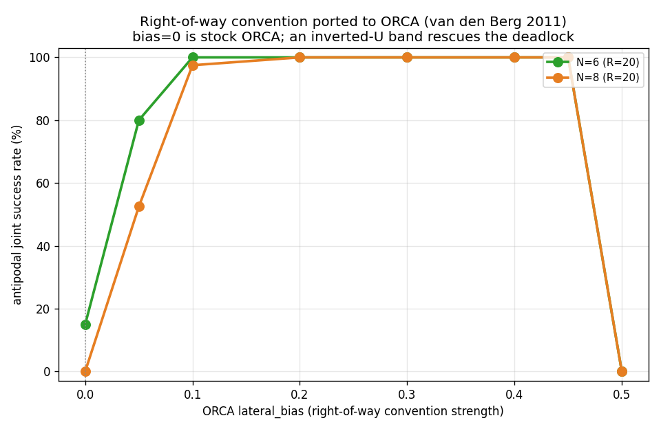

| ORCA `lateral_bias` | 0 (stock) | 0.05 | 0.1 | 0.2–0.45 | 0.5 |
|---|---|---|---|---|---|
| N=6 joint success | 15 % | 80 % | **100 %** | 100 % | 0 % |
| N=8 joint success | 0 %  | 52 % | 98 %  | **100 %** | 0 % |

- **The convention generalises to ORCA.** Turning the right-of-way bias on lifts the
  antipodal swap from a deadlock to 100 %: N=8 best(0.2) vs stock(0) is `c=40/b=0`,
  `p=1.8e-12`; N=6 best(0.1) vs stock(0) is `c=34/b=0`, `p=1.2e-10`. The rescue is
  not a property of our sampling MPC — a "veer right" rule breaks the symmetry of
  the canonical reciprocal planner just as well. **Breaking the symmetry is the
  whole game, independent of the planner family.**
- **It is an inverted-U operating band, double-edged at both ends** — the same shape
  as the [CHOMP clearance band](#chomps-explicit-clearance-band-has-a-sweet-spot--but-the-cap-breaks-only-when-you-seed-it-with-rrt)
  and the [convention density cliff](#the-right-of-way-convention-has-a-density-cliff--but-a-stronger-bias-pushes-it-out).
  Best(0.2) vs over(0.5) is `c=40/b=0`, `p=1.8e-12`. The two cliffs have **distinct
  failure modes**: too little convention (stock) fails by **collision** at the hub;
  too much (0.5) fails by **timeout** — every drone spirals too wide and orbits
  without ever converging on its goal. Too-little crashes, too-much never arrives.
- **The band shifts right with density.** At N=6 a bias of 0.1 already reaches 100 %;
  at N=8 the 0.1 cell is 98 % and full rescue needs 0.2. A denser hub needs a
  stronger convention to fully resolve — the ORCA echo of
  [the MPC density cliff that a stronger bias pushes out](#the-right-of-way-convention-has-a-density-cliff--but-a-stronger-bias-pushes-it-out).
  The upper (over-rotation) cliff sits at the same place (~0.5) for both N.

This is the first finding in the repo measured against the literature's canonical
reciprocal baseline rather than a sibling MPC arm, and it strengthens the whole
convention arc: the right-of-way symmetry-breaker is planner-agnostic — it rescues
both the sampling-MPC and the reciprocal-LP families — but it is a *tunable band*,
not a free primitive, on either.

Reproduce: `python scripts/antipodal_orca_convention_phase.py --n-list 6 8 --bias-list 0 0.05 0.1 0.2 0.3 0.4 0.45 0.5 --episodes 40`
(writes `results/antipodal_orca_convention_phase.{json,png}`).

## A pairwise winding-number right-of-way strictly dominates the global veer-right

Every result above used one symmetry-breaker: `lateral_bias`, a **global** rule where each
drone veers right of its *own goal heading* unconditionally. That unconditionality is its
weakness, and we have proved two failure modes of it:

- the [even-N resonance study](#the-even-n-antipodal-resonance-recurs-at-n8--there-the-forecast-fails-too-and-the-convention-turns-harmful-where-there-is-no-deadlock)
  found a **harm**: in 3D at N=4 there is *no* deadlock (the free vertical axis resolves the
  square, b0 = 30/30), yet turning the global bias on there drives success to **0/30** — a
  goal-blind fleet that needed no help manufactures a coordinated in-plane pinwheel that
  re-collides;
- the [density-cliff study](#the-right-of-way-convention-has-a-density-cliff--but-a-stronger-bias-pushes-it-out)
  found a **cliff**: a *fixed* global bias decays as the [hub density N/R](#the-convention-cliff-is-hub-density-not-drone-count--n-and-r-collapse-onto-nr)
  rises, so you must keep cranking the single scalar to keep up.

The 2025 literature argues the durable symmetry-breaker is **pairwise/relative**, not a global
heading bias: [Winding Number-Aware MPC](https://arxiv.org/abs/2511.15239) (Nakao et al., 2025)
has each agent target a per-pair *signed winding number*, and [Merry-Go-Round](https://arxiv.org/abs/2503.05848)
(2025) forms an explicit roundabout only on a detected conflict. The common idea: act on the
*actual pair geometry*, so an agent in no conflict is left alone and the rule scales with how
many neighbours are really there. We reproduce that idea at the cost level — a new planner knob
`pairwise_bias` (+ `pairwise_radius`): instead of veering right of its own heading, each drone
prefers candidate directions that pass each **nearby neighbour** on a consistent relative side
(the clockwise perpendicular of the bearing to that neighbour), weighted by `exp(−dist /
pairwise_radius)`. Because the bearing reverses between the two drones of a pair, both pick
compatible sides with no shared global heading; and far or mutually-cancelling neighbours
contribute ≈0, so a drone in no conflict feels no bias. `scripts/antipodal_pairwise_convention_phase.py`
runs three arms — `b0` (off), `global` (`lateral_bias`=2), `pairwise` (`pairwise_bias`=10,
`pairwise_radius`=8) — on the same antipodal benchmark, paired by seed, cv predictor, McNemar exact.

**3D — pairwise removes the global rule's harm and keeps its rescue (deterministic, n=30):**

| N | b0 | global | pairwise | pairwise vs global (b/c, p) |
|---|---|---|---|---|
| **4** (no deadlock) | **30/30** | **0/30** | **30/30** | b=0/c=30, **p<1e-9** |
| 6 (deadlock) | 0/30 | 30/30 | 30/30 | b=0/c=0, tie |
| 8 (deadlock) | 0/30 | 30/30 | 30/30 | b=0/c=0, tie |

Every cell is 0/30 or 30/30 — facts, not noise. The pairwise rule is a **strict Pareto
improvement** over the global one: identical where the global convention helps (N=6, N=8 both
lifted to 100 %), and strictly better where the global convention *harms* (N=4: 30/30 vs 0/30).
The conditional rule keeps the rescue and drops the collateral damage, exactly because at the
uncrowded N=4 square no neighbour is on a conflict course, so the bias never fires.

**2D — pairwise pushes the density cliff out at fixed strength, and the gap widens with density
(n=50):**

| N | b0 | global | pairwise | pairwise vs global (b/c, p) |
|---|---|---|---|---|
| 16 | 7/50 (14 %) | 36/50 (72 %) | 46/50 (**92 %**) | b=4/c=14, **0.031** |
| 20 | 2/50 (4 %) | 26/50 (52 %) | 41/50 (**82 %**) | b=4/c=19, **0.0026** |
| 24 | 0/50 (0 %) | 12/50 (24 %) | 30/50 (**60 %**) | b=3/c=21, **0.0003** |

(At the looser N=8 and N=12 both conventions sit near the ceiling — 28/30 vs 30/30 — so the
difference only opens up once the hub is crowded.) Where the
[global cliff study](#the-right-of-way-convention-has-a-density-cliff--but-a-stronger-bias-pushes-it-out)
pushed the cliff out by *cranking the global scalar*, the pairwise rule pushes it out at the
**same** nominal strength, because its `exp(−dist/radius)` per-neighbour weight **auto-scales
with crowding** — more drones at the hub means more close neighbours means more bias, applied
exactly to the pairs that need it. The advantage grows with density (+20 → +30 → +36 pp from
N=16 to N=24). Both rules still cliff eventually (pairwise reaches 60 % at N=24), so this is a
*later, steeper-pushed* cliff, not its abolition — honest about the limit while pinning the
mechanism.

- **What this resolves.** Across the whole convention arc, the global `lateral_bias` had two
  blemishes — it [harms where there is no deadlock](#the-even-n-antipodal-resonance-recurs-at-n8--there-the-forecast-fails-too-and-the-convention-turns-harmful-where-there-is-no-deadlock)
  and it [needs ever-more strength as density rises](#the-right-of-way-convention-has-a-density-cliff--but-a-stronger-bias-pushes-it-out).
  Both trace to the *same* root: a global rule fires unconditionally, so it both perturbs the
  uninvolved and ignores the actual pair load. Making the rule **pairwise and
  distance-weighted** fixes both at once — it is the global convention's strict upgrade, not a
  different trade-off.

- **Why "pass each neighbour on the right" is symmetry-breaking without communication.** The
  bias direction is the clockwise perpendicular of the *bearing to the neighbour*, and that
  bearing is exactly reversed for the other drone of the pair, so the two veer to opposite
  world-frame sides — a consistent right-to-right pass — from the same local rule, no shared
  heading and no message. This is the winding-number intuition (a consistent per-pair passing
  side) realized as a one-line cost, without WNumMPC's learned target winding numbers.

Net: a *pairwise* right-of-way is the convention the global `lateral_bias` should have been. It
matches it where the global rule works, removes its 3D no-deadlock harm outright, and pushes its
2D density cliff out at fixed strength because the per-neighbour weighting tracks the real hub
load. Symmetry-breaking remains primary over forecast (the cv predictor carries all of this), but
*how* you break the symmetry — globally vs per-pair — is itself a real, measurable lever.

Reproduce:
`python scripts/antipodal_pairwise_convention_phase.py --dim 3 --n-list 4 6 8 --episodes 30`
and `--dim 2 --n-list 16 20 24 --episodes 50`
(writes `results/antipodal_pairwise_convention*.json`). Demo:
`examples/exp_multi_drone_antipodal_pairwise.yaml` (the N=4 cell — pairwise stays 100 % where
`lateral_bias: 2.0` would collapse the same drones to 0 %).

## The right-of-way convention is a peer rule — a hub-crossing obstacle defeats the roundabout it builds

Every convention result above lives on `obstacles: none`: the antipodal swap is a *peer*
coordination problem in an empty arena. This adds the one thing that arena never had — a scene
**dynamic obstacle** that crosses the central hub while the fleet converges — and asks whether the
right-of-way convention still earns its keep. MPC + `game_theoretic`, `N ∈ {6, 8}` at fixed R=20,
a single reflecting body entering from the bottom edge and crossing the hub (`start [25, 2]`,
`velocity [0, 4.5]`, `radius 1.5`), `lateral_bias ∈ {0, 1, 2, 4}`, paired by seed (n=40).

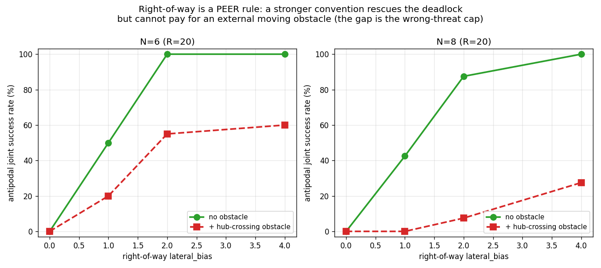

| `lateral_bias` | N=6 no-obstacle | N=6 +obstacle | N=8 no-obstacle | N=8 +obstacle |
|---|---|---|---|---|
| 0 (stock) | 0 % | 0 % | 0 % | 0 % |
| 1 | 50 % | 20 % | 42 % | 0 % |
| 2 | 100 % | 55 % | 88 % | 8 % |
| 4 | 100 % | 60 % | 100 % | 28 % |

- **A moving obstacle is NOT a symmetry-breaker.** With no convention (`bias=0`) the fleet
  deadlocks 0/40 *with or without* the obstacle (both N, McNemar tie). A third body crossing the
  hub does not break the symmetric peer convergence — it is just another threat, not a tie-breaker.
  This refutes the tempting "any asymmetry lifts the deadlock" intuition: the asymmetry has to be
  *in the fleet's own policy* (the convention), not in the environment.
- **The convention is still primary with the obstacle present.** At the strongest bias the
  obstacle-laden fleet still beats the no-convention fleet decisively: N=6 `c=24/b=0` p=1.2e-7,
  N=8 `c=11/b=0` p=9.8e-4. Breaking the peer symmetry remains the first-order win.
- **But the obstacle degrades the convention at every strength, and a stronger bias cannot pay
  for it.** Turning the obstacle on is a significant loss at *every* positive bias (every cell
  `c=0`, `b` large, p ≤ 5e-4). Crucially, cranking the convention up rescues the *peer* deadlock
  completely — no-obstacle reaches 100 % at `bias=4` for both N — yet the +obstacle curve stays
  far below (60 % at N=6, 28 % at N=8). That residual 40–72 pp gap is **the cost of the wrong
  threat**: the right-of-way rule is a *peer* convention, so however strong you make it, it cannot
  prevent collisions with a body that is not a peer. Success caps below the obstacle-free ceiling.
- **The mechanism is the roundabout itself, not "obstacles are hard" (move-the-stressor control).**
  At N=6, `bias=4`: no obstacle 40/40; the *same* obstacle crossing the hub 24/40; the *same*
  obstacle (same size, speed, reflect) circulating in a far corner **40/40** — zero degradation.
  The harm is specific to the hub-crossing geometry. The convention's remedy is to funnel every
  drone into a tight clockwise circulation *at the hub*; that concentration is exactly what a
  hub-crossing body exploits. The convention trades a distributed deadlock for a shared
  spatiotemporal chokepoint — safe against peers, maximally exposed to an external hub threat.

This bounds the whole convention arc: the right-of-way rule (and, by the
[ORCA result](#orca-is-the-missing-reciprocal-baseline-and-the-right-of-way-convention-generalises-to-it),
any reciprocal planner it ports to) solves the *peer* symmetry problem and only that. It is the
same "clearance for the wrong threat" shape as the
[CHOMP band capping below RRT](#chomps-explicit-clearance-band-has-a-sweet-spot--but-the-cap-breaks-only-when-you-seed-it-with-rrt)
(static clearance, dynamic failure), here in the swarm: peer convention, external-obstacle failure.

Reproduce: `python scripts/antipodal_obstacle_convention_phase.py --n-list 6 8 --bias-list 0 1 2 4 --episodes 40`
(writes `results/antipodal_obstacle_convention_phase.{json,png}`).

## On ORCA too, a pairwise right-of-way removes the global rule's over-rotation timeout cliff

The [ORCA baseline result](#orca-is-the-missing-reciprocal-baseline-and-the-right-of-way-convention-generalises-to-it)
showed the global `lateral_bias` right-of-way generalises from the sampling MPC to the
reciprocal ORCA controller, but in an **inverted-U band**: stock ORCA collides at the antipodal
hub, the convention rescues for `lateral_bias` ∈ [0.1, 0.45], and **too much (≥0.5) over-rotates**
— every drone veers so hard it orbits the hub and never reaches goal, so the failure flips from
collision to *timeout*. That upper cliff is the ORCA face of the same defect the
[pairwise winding-number study](#a-pairwise-winding-number-right-of-way-strictly-dominates-the-global-veer-right)
found on the MPC: the global rule tilts the preferred velocity right of the goal heading
*unconditionally* — it veers even with no peer around — so a strong setting makes a drone that
has already cleared the hub keep curving, into an orbit.

This ports the pairwise knob to ORCA: `planner.pairwise_bias` tilts the preferred velocity
toward the sum over nearby peers of "pass this peer on the right" (clockwise perpendicular of
the bearing), weighted `exp(−dist / pairwise_radius)`. With no peer in conflict the tilt
vanishes, so a drone past the hub re-aims at its goal instead of orbiting. The prediction: the
pairwise rule has **no over-rotation timeout cliff** — it rescues the deadlock across a far
wider strength range than the global one. `scripts/antipodal_orca_pairwise_phase.py`, ORCA at
the #85 operating point, paired by seed, McNemar exact, collision-vs-timeout breakdown.

**Strength sweep at N=8 (n=40) — the global cliff vs the pairwise plateau:**

| strength | global `lateral_bias` | pairwise `pairwise_bias` |
|---|---|---|
| 0   | 0/40 (deadlock, 40 collisions) | 0/40 (40 collisions) |
| 0.1 | 39/40 | 20/40 |
| 0.2 | 40/40 | 39/40 |
| 0.3 | — | 40/40 |
| 0.45| 40/40 | — |
| **0.5** | **0/40 (40 timeouts)** | **40/40** |
| **1.0** | **0/40 (40 timeouts)** | **40/40** |
| 2.0 | — | 40/40 |

The global rule works only inside [0.1, 0.45] and falls off an over-rotation **timeout** cliff
at 0.5; the pairwise rule reaches 100 % by 0.3 and **stays there through 2.0** — at least a 4×
wider operating range, with no upper cliff. (Both fail the same way when far too weak — the hub
collision they are there to prevent.)

**Across N at the cliff strength 0.5 (n=40):** at the exact strength where the global rule has
over-rotated, the pairwise rule is still perfect everywhere.

| N | stock | global @0.5 | pairwise @0.5 | pairwise vs global (b/c, p) |
|---|---|---|---|---|
| 6 | 6/40 (34 coll) | 0/40 (40 timeout) | 40/40 | b=0/c=40, **<1e-9** |
| 8 | 0/40 (40 coll) | 0/40 (40 timeout) | 40/40 | b=0/c=40, **<1e-9** |
| 12 | 0/40 (40 coll) | 28/40 (12 timeout) | 40/40 | b=0/c=12, **5e-4** |

(At N=12 the global cliff has shifted right with density — 0.5 is closer to in-band there, the
same density-dependence the [global ORCA band](#orca-is-the-missing-reciprocal-baseline-and-the-right-of-way-convention-generalises-to-it)
shows — but the pairwise rule, whose per-peer `exp(−d/r)` weight auto-scales with the hub crowd,
is 40/40 at every N without retuning.)

- **Same mechanism as the MPC pairwise result, a different controller.** On the MPC the global
  rule's flaw showed up as a *no-deadlock harm* (it broke an uncrowded square that needed no
  help); on ORCA it shows up as an *over-rotation timeout cliff* (a strong unconditional tilt
  orbits). Both are the unconditional global tilt acting where it should not, and the
  neighbour-conditional pairwise rule removes both — third controller family (MPC, ORCA) on which
  "pass each *nearby* peer on the right" beats "always veer right".

- **It widens the usable band, which is the practical win.** A convention you must tune into a
  narrow [0.1, 0.45] window (and retune as density moves the window) is fragile; one that is flat
  from 0.3 to ≥2.0 across N is set-and-forget. The conditionality buys robustness, not just a
  higher peak.

Reproduce:
`python scripts/antipodal_orca_pairwise_phase.py --mode strength --n 8 --episodes 40 --seed 4000`
and `--mode nscale --n-list 6 8 12 --best-global 0.5 --best-pairwise 0.5 --episodes 40 --seed 4000`
(writes `results/orca_pairwise_*.json`).

## BVC and CBF: the convention rescues two more reactive families, and BVC needs a dynamics-aware buffer

[ORCA](#orca-is-the-missing-reciprocal-baseline-and-the-right-of-way-convention-generalises-to-it)
is the velocity-obstacle school's reactive baseline. Two more decentralized reactive families now
sit beside it, each a clean-room 2-D implementation (`planner.type: bvc` / `cbf`):

- **BVC** (Buffered Voronoi Cells, Zhou et al. 2017) — *position* space. Each agent confines its
  next position to its Voronoi cell shrunk by a safety buffer; the cells are disjoint, so it is
  collision-free *by construction* (a hard geometric guarantee ORCA's reciprocal split only
  approximates).
- **CBF** (Control-Barrier-Function QP, the LivePoint / social-mini-games school) — *velocity*
  space. One barrier half-plane per peer from `h = dist² − R²` and the discrete CBF condition
  `ḣ + α·h ≥ 0`, then the safety-filter QP `min |v − v_nom|²` s.t. the barriers and the speed cap.

Both deadlock on the symmetric antipodal swap, and the pairwise right-of-way
([MPC](#a-pairwise-winding-number-right-of-way-strictly-dominates-the-global-veer-right) /
[ORCA](#on-orca-too-a-pairwise-right-of-way-removes-the-global-rules-over-rotation-timeout-cliff)
ports) rescues them — at the moderate hub sizes. `scripts/antipodal_bvc_phase.py`, paired by
seed, McNemar exact, collision-vs-timeout breakdown:

| N | bvc (stock) | bvc + pairwise | cbf (stock) | cbf + pairwise |
|---|---|---|---|---|
| 6 | 0/40 (6 coll, 34 timeout) | **40/40** (c=40, p<1e-9) | 10/40 (30 timeout) | **40/40** (c=30, p<1e-9) |
| 8 | 0/40 (1 coll, 39 timeout) | **36/40** (c=36, p<1e-9) | 2/40 (38 timeout) | **40/40** (c=38, p<1e-9) |
| 12 | 0/40 (38 timeout) | 0/40 (17 coll, 23 timeout) | 0/40 (40 timeout) | 1/40 (23 coll) |

- **Stock deadlock is collision-free here — it fails by *timeout*, not collision.** Both BVC and
  CBF brake at the hub and stall (the barrier / cell constraints zero the goal-ward velocity),
  the opposite signature to ORCA's reciprocal funnel-into-collision. Two reactive schools, two
  failure modes, on the same swap.

- **The convention generalises to both — a third and fourth controller family** (after MPC and
  ORCA) on which "pass each nearby peer on the right" lifts a deadlock to ~100 % at N=6, 8.

- **But it is *not* unconditional — strength must scale with hub density.** A fixed
  `pairwise_bias` tuned for N=6, 8 *over-rotates* at N=12 and drives drones into each other (BVC
  0/40 with 17 collisions, CBF 1/40 with 23) — the same
  [convention-strength-vs-density](#the-right-of-way-convention-has-a-density-cliff--but-a-stronger-bias-pushes-it-out)
  ceiling seen on the MPC, now reproduced on two reactive baselines.

- **BVC's textbook collision-free guarantee assumes single-integrator dynamics — and breaks under
  acceleration limits.** With the small "textbook" buffer, BVC plans to the cell edge assuming it
  can stop instantly; in the accel-limited sim (`max_accel = 6`, stopping distance ≈ v²/2a ≈
  2.1 m) it overshoots the buffer and **collides** (`bvc_nobrake`: 40/40 collisions at every N).
  A brake-aware buffer restores collision-freedom — but too large a buffer makes the cell go
  empty so early that the agent halts before the convention can route it (the convention then
  cannot rescue it at all). So BVC has a **buffer sweet spot**: too small overshoots and crashes,
  too large halts immune to the convention, and only a middle band both (mostly) avoids and stays
  routable. This is the same inverted-U shape as the
  [CHOMP clearance band](#chomps-explicit-clearance-band-has-a-sweet-spot--but-the-cap-breaks-only-when-you-seed-it-with-rrt),
  here induced by vehicle inertia rather than obstacle geometry.

Net: symmetry-breaking is planner-agnostic across the *velocity*-space reactive families (MPC,
ORCA, CBF) at moderate density; the *position*-space BVC adds a dynamics caveat (it needs a
buffer that covers braking, and that very buffer fights the convention), and on every family the
convention's strength is a density-dependent knob, not a constant.

Reproduce: `python scripts/antipodal_bvc_phase.py --n-list 6 8 12 --episodes 40 --seed 4000 --pairwise-bias 2.0`
(writes `results/antipodal_bvc_phase.json`; `bvc_nobrake` = the textbook small buffer that
overshoots, the other bvc arms use the brake-aware buffer).

## The 3-D dissolution of the antipodal deadlock is a planner property, not a geometric one

The [predictor inversion dissolves in 3-D](#the-antipodal-predictor-inversion-is-a-2d-artifact--the-vertical-escape-axis-dissolves-it-and-at-high-density-flips-the-predictors-sign):
lift the antipodal ring into a voxel world and the vertical axis gives every drone a symmetry
escape, so the planar deadlock vanishes. That was shown with a *sampling* planner. Is the 3rd
dimension itself the cure — or does the cure require a planner that *uses* it? The CBF safety
filter (`planner.type: cbf`), now extended to 3-D (the barrier half-space algebra is
dimension-agnostic; ndim=3 swaps the 2-D RVO2 linear program for a Dykstra projection QP), gives
a clean control: a *reactive* controller dropped into the same voxel world.

`scripts/antipodal_cbf_3d_phase.py`, paired by seed, McNemar exact, collision-vs-timeout split:

| N | cbf 2-D | cbf 3-D | mpc 3-D | mpc vs cbf (3-D) |
|---|---|---|---|---|
| 4 | 5/40 (35 timeout) | 0/40 (40 timeout) | **40/40** | b=0/c=40, **p<1e-9** |
| 6 | 10/40 (30 timeout) | 0/40 (40 timeout) | 0/40 (40 collision) | tie |
| 8 | 2/40 (38 timeout) | 0/40 (40 timeout) | 0/40 (40 collision) | tie |

- **The reactive deadlock does NOT dissolve in 3-D.** `cbf_3d` is 0/40 — all timeouts — at every
  N, no better than `cbf_2d`. The extra dimension is *available* and goes completely unused.

- **Mechanism: the reactive filter never leaves the start plane.** The CBF nominal velocity points
  straight at the goal, which sits at the same altitude, so it has zero vertical component; the
  barrier constraints only *subtract* velocity toward peers, they never *add* a vertical escape.
  Directly verified: at a crowded 3-D hub the commanded velocity's z-component is exactly 0. The
  drones stay in the z=mid plane and the problem collapses back to the 2-D deadlock.

- **A planner that explores the vertical axis dissolves the very same deadlock.** The sampling MPC
  (which samples 3-D directions, including up/down) clears N=4 at 40/40 where `cbf_3d` is 0/40
  (p<1e-9). At N≥6 the constant-velocity MPC instead hits the separate
  [3-D cv resonance](#the-3d-antipodal-collapse-is-a-non-monotone-resonance-not-the-even-n-law)
  (it *collides* rather than deadlocks — a different failure), so the clean dissolution contrast
  is the N=4 cell; the N≥6 cells just confirm cv's own 3-D fragility, not a CBF rescue.

Net: adding a dimension does not, by itself, break the symmetry — a planner has to *plan into it*.
The 3-D escape that rescues the sampling/forecast planners is invisible to a reactive safety
filter whose goal-seeking nominal stays in-plane. The dissolution is a property of the planner,
not of the arena — which also means a decentralized convention (an explicit in-plane rule) and a
free vertical axis are *complementary* escapes: the convention works for planners that stay
planar, the dimension works only for planners that leave it.

Reproduce: `python scripts/antipodal_cbf_3d_phase.py --n-list 4 6 8 --episodes 40 --seed 4000`
(writes `results/antipodal_cbf_3d_phase.json`).

## Pairwise's dominance over the global convention inverts under a hub-crossing obstacle

Two earlier results pull in opposite directions. The
[pairwise winding-number convention](#a-pairwise-winding-number-right-of-way-strictly-dominates-the-global-veer-right)
*strictly dominates* the global veer-right in an empty arena (no 3D N=4 harm, density cliff pushed
out). But the global convention's remedy is a single coherent clockwise hub roundabout, and
[a body crossing that hub caps it](#the-right-of-way-convention-is-a-peer-rule--a-hub-crossing-obstacle-defeats-the-roundabout-it-builds).
So: does the pairwise rule — which never builds one shared roundabout — *avoid* that chokepoint and
stay robust to the hub obstacle, or does its very locality (no shared rotational current to absorb
an external perturbation) make it *worse*?

Each convention at a strength that solves the peers on its own (global `lateral_bias=4`, pairwise
`pairwise_bias=8`; both ~100 % no-obstacle at N=6/8), crossed with obstacle ∈ {none, hub-crossing,
far-corner}, MPC + game_theoretic, paired by seed (n=40).

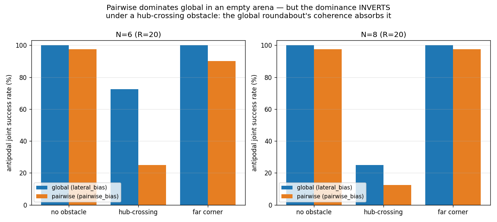

| | N=6 global | N=6 pairwise | N=8 global | N=8 pairwise |
|---|---|---|---|---|
| no obstacle | 100 % | 98 % | 100 % | 98 % |
| **hub-crossing** | **72 %** | **25 %** | **25 %** | **12 %** |
| far corner | 100 % | 90 % | 100 % | 98 % |

- **The dominance inverts.** With no obstacle the two conventions are matched (tie, p=1 at both N).
  Add the hub-crossing obstacle and the *global* rule wins decisively at N=6 — 72 % vs 25 %,
  `c=2/b=21` McNemar p=6.6e-5 — exactly reversing pairwise's empty-arena dominance. At N=8 the same
  sign holds (25 % vs 12 %) but is only a trend (`b=5/c=0`, p=0.0625): the hub obstacle floors
  *both* conventions so severely that the gap compresses below significance.
- **It is hub-specific, not "pairwise is bad at obstacles" (move-the-stressor control).** A far-corner
  obstacle of the *same* size/speed barely dents either convention (N=6 100 % vs 90 %, NS; N=8
  100 % vs 98 %, tie). The global advantage appears *only* in the hub-crossing condition.
- **Mechanism: coherence is the asset against an external perturbation.** The global rule funnels
  every drone into one ordered clockwise current around the hub; that shared rotational flow yields
  uniformly and re-forms when an obstacle punches through it. The pairwise rule resolves every
  conflict *locally* (pass each neighbour — and the obstacle — on the right) with no shared heading,
  so an external body injects local corrections that no global structure damps, and the fleet
  shatters into peer collisions. The same coherence that is a *liability* without an obstacle (the
  over-concentrated chokepoint of the
  [peer-rule cap](#the-right-of-way-convention-is-a-peer-rule--a-hub-crossing-obstacle-defeats-the-roundabout-it-builds))
  becomes an *asset* with one.

This bounds the pairwise-dominance result: pairwise is the better convention in the clean arena it
was tuned for, but "strictly dominates" does not survive contact with an external hub obstacle —
there the global roundabout's coherence is worth more than pairwise's locality. Which convention to
prefer depends on whether the threat is purely the peers (pairwise) or includes a shared external
hazard through the conflict point (global).

Reproduce: `python scripts/antipodal_convention_obstacle_robustness_phase.py --n-list 6 8 --global-bias 4 --pairwise-bias 8 --episodes 40`
(writes `results/antipodal_convention_obstacle_robustness_phase.{json,png}`).

## In 3-D the in-plane convention rescues the reactive planner the extra dimension could not

The [previous result](#the-3-d-dissolution-of-the-antipodal-deadlock-is-a-planner-property-not-a-geometric-one)
left a sharp prediction. The reactive CBF deadlock does *not* dissolve in 3-D — its goal-seeking
nominal stays in-plane, so the vertical escape goes unused (`cbf_3d` = 0/40 at every N). If the
dimension is useless to a reactive controller, then the cure for it in 3-D must be the *same
in-plane right-of-way* that works in 2-D, not the added axis. So the `pairwise_bias` convention is
now applied to the horizontal components in 3-D as well (it never touches the vertical axis), and
run on the 3-D antipodal swap:

| N | cbf_3d (stock) | cbf_3d + pairwise | pairwise vs stock (b/c, p) |
|---|---|---|---|
| 4 | 0/40 (40 timeout) | **40/40** | b=0/c=40, **p<1e-9** |
| 6 | 0/40 (40 timeout) | **40/40** | b=0/c=40, **p<1e-9** |
| 8 | 0/40 (40 timeout) | **40/40** | b=0/c=40, **p<1e-9** |

Deterministic: the in-plane roundabout lifts the 3-D reactive fleet from 0/40 to 40/40 at every N.

- **Convention and dimension are complementary escapes, and they are *not* interchangeable.** The
  free vertical axis dissolves the deadlock for a planner that *plans into it* (the sampling MPC)
  but does nothing for a reactive filter that stays planar; the in-plane convention does the
  reverse — it rescues the planar-staying reactive filter regardless of how many dimensions the
  arena has. Each escape covers exactly the case the other misses.

- **It confirms the previous result's mechanism by construction.** If `cbf_3d` deadlocked for any
  reason *other* than "it never leaves the plane", a purely *horizontal* convention could not fix
  it. That a horizontal-only roundabout restores 100 % is direct evidence that the 3-D reactive
  failure is exactly the unused vertical axis — the planar deadlock, untouched by the extra
  dimension, broken by the planar rule.

- **The convention's reach is dimension-independent; the planner's is not.** The portable fix
  across the whole reactive-baseline arc is the decentralized in-plane convention (it works on MPC,
  ORCA, CBF, in 2-D and 3-D); relying on the geometry to break symmetry only pays off for planners
  that explore that geometry.

Reproduce: `python scripts/antipodal_cbf_3d_convention_phase.py --n-list 4 6 8 --episodes 40 --seed 4000 --pairwise-bias 0.5`
(writes `results/antipodal_cbf_3d_convention_phase.json`).

## Two reciprocal collision avoiders are less safe mixed than either is alone

ORCA and CBF are both *reciprocal* avoiders: each assumes every peer runs the same rule and will
take its share of the avoidance (ORCA splits the truncated velocity obstacle 50/50; CBF splits by
the barrier rate). That assumption only holds in a homogeneous fleet. What happens when an ORCA
drone meets a CBF drone — each correctly reciprocates for *its own* model, but the two models
disagree on who moves where, so the gap one leaves is not the gap the other takes?

A perpendicular crossing (one stream +x, one +y; no central hub, so each homogeneous fleet is
fine) with the `+x` stream on ORCA and the `+y` stream on CBF — every crossing is ORCA-vs-CBF.
`scripts/crossing_hetero_controller_phase.py`, 2N drones, paired by seed, McNemar exact:

| N/stream | all_orca | all_cbf | mixed | mixed vs orca (b/c, p) | mixed vs cbf (b/c, p) |
|---|---|---|---|---|---|
| 3 | 38/40 | 37/40 | 34/40 | b=4/c=0, 0.125 | b=3/c=0, 0.25 |
| 4 | 36/40 | 36/40 | 29/40 | b=7/c=0, **0.016** | b=7/c=0, **0.016** |
| 5 | 33/40 | 33/40 | 22/40 | b=11/c=0, **0.001** | b=11/c=0, **0.001** |
| 6 | 32/40 | 32/40 | 21/40 | b=11/c=0, **0.001** | b=11/c=0, **0.001** |

- **Mixing two individually-safe reciprocal controllers is *strictly* worse than either alone.**
  Every discordant seed goes one way — `b≥4, c=0` at every density — the mixed fleet never beats a
  homogeneous one and is significantly worse from N=4 up. All failures are collisions (0 timeouts):
  the mismatch crashes drones, it does not deadlock them.

- **The penalty grows with crossing density.** The two homogeneous fleets degrade together and
  identically (38/37 → 32/32 as the crossing tightens — ORCA and CBF are equally good head-to-head),
  but the mixed gap widens (−4 → −7 → −11 → −11): the more ORCA-vs-CBF encounters per episode, the
  more often the reciprocity mismatch bites.

- **Why.** Reciprocity is a *shared-protocol* assumption, not a per-agent property. An ORCA drone
  reserves exactly the half of the manoeuvre it expects an ORCA peer to leave; a CBF peer leaves a
  differently-shaped half, so the two half-measures do not compose into a full avoidance and they
  clip. Each drone is doing the "right" thing for a peer that isn't there. This bounds the
  per-drone heterogeneity that rescues *coordination* elsewhere ([heterogeneous predictors](#heterogeneous-predictor-swarms-break-the-antipodal-deadlock-by-desync-not-by-diversity)
  desync a shared forecast usefully) — heterogeneity of the *avoidance protocol itself* is the
  opposite: it removes the shared assumption the safety rests on.

Net: decentralized reciprocal collision avoidance needs a *common* protocol. A swarm that mixes
ORCA and CBF drones is less safe than one running either everywhere, and the cost scales with how
often the two schools actually meet — a concrete caution for heterogeneous-autonomy fleets.

Reproduce: `python scripts/crossing_hetero_controller_phase.py --n-list 3 4 5 6 --episodes 40 --seed 4000`
(writes `results/crossing_hetero_controller_phase.json`).

## On the symmetric hub, mixing reciprocal controllers HELPS — protocol heterogeneity is double-edged

Mixing ORCA and CBF is [unsafe on a crossing](#two-reciprocal-collision-avoiders-are-less-safe-mixed-than-either-is-alone)
— but that geometry has no symmetry to break. The antipodal swap is the opposite: a *symmetric*
convergence where a homogeneous reactive fleet deadlocks (ORCA collides at the hub, CBF times out).
There the protocol mismatch that *crashes* drones on a crossing should instead *desync* the
mirror-symmetric manoeuvre — the same way [mixing predictors does](#heterogeneous-predictor-swarms-break-the-antipodal-deadlock-by-desync-not-by-diversity).
N drones alternating ORCA / CBF around the ring, default replan cadence (so both homogeneous fleets
reproduce the deadlock), paired by seed:

| N | all_orca | all_cbf | mixed | mixed vs orca (b/c, p) | mixed vs cbf (b/c, p) |
|---|---|---|---|---|---|
| 4 | 36/40 | 8/40 (32 timeout) | 39/40 | b=1/c=4, 0.375 | b=0/c=31, **<1e-9** |
| 6 | 6/40 (34 coll) | 11/40 (29 timeout) | **23/40** | b=1/c=18, **0.0001** | b=3/c=15, **0.0075** |
| 8 | 0/40 (40 coll) | 1/40 (39 timeout) | 4/40 | b=0/c=4, 0.125 | b=1/c=4, 0.375 |

- **At N=6, mixing beats BOTH homogeneous fleets.** `all_orca` deadlocks by collision (6/40),
  `all_cbf` by timeout (11/40), and the alternating mix reaches 23/40 — significantly above each
  (+18 vs orca p=1e-4, +15 vs cbf p=0.0075). The same ORCA-vs-CBF mismatch that is a *liability* on
  the crossing is an *asset* here: it perturbs the symmetric hub convergence that traps a uniform
  fleet, exactly the desync mechanism behind heterogeneous-predictor swarms.

- **It is the same double-edged law as predictor heterogeneity, now at the controller level.**
  Heterogeneity helps where the failure is *symmetry* (the antipodal hub) and hurts where the
  failure is *coordination/safety* (the crossing). Whether a mixed fleet is safer or more dangerous
  than a uniform one is set by the geometry, not by the mix.

- **Moderate-density gated.** The help is strongest at N=6, where both homogeneous fleets robustly
  deadlock; at N=4 ORCA alone already clears the hub (so the mix only rescues CBF), and at N=8 the
  hub is too crowded for the desync to resolve (mixed 4/40, both homogeneous ~0) — the same
  density ceiling the convention shows.

Net: protocol heterogeneity is not good or bad per se — it is a *symmetry-breaker*. On the
symmetric swap it desyncs a deadlock that defeats either pure fleet; on the asymmetric crossing it
breaks a reciprocity that both pure fleets rely on. Same knob, opposite sign, set by geometry.

Reproduce: `python scripts/antipodal_hetero_controller_phase.py --n-list 4 6 8 --episodes 40 --seed 4000`
(writes `results/antipodal_hetero_controller_phase.json`).

## The right-of-way convention is paradigm-agnostic — it rescues even non-reciprocal APF

Every reactive baseline the convention has rescued so far is *reciprocal*: ORCA, CBF and BVC each
assume a cooperating peer that takes its share of the avoidance. Is the right-of-way a
reciprocal-family fix, or does it work for any planner? APF (`planner.type: apf`, Khatib 1986) is
the test: a pure gradient controller — attract to goal, repel from peers — with **no model of the
peer at all**. The symmetric antipodal hub is a stationary point of its field (attraction toward
the antipode cancels the repulsion from converging peers); steering at cruise speed, the fleet
plows into that point and collides.

`scripts/antipodal_apf_phase.py`, paired by seed, McNemar exact:

| N | apf_stock | apf + pairwise | pairwise vs stock (b/c, p) |
|---|---|---|---|
| 4 | 1/40 (39 coll) | **40/40** | b=0/c=39, **p<1e-9** |
| 6 | 0/40 (40 coll) | **40/40** | b=0/c=40, **p<1e-9** |
| 8 | 0/40 (40 coll) | **40/40** | b=0/c=40, **p<1e-9** |

Deterministic: stock APF collides at the hub at every N; the in-plane convention lifts it to 40/40.

- **The convention is *paradigm*-agnostic, not just family-agnostic.** It already worked on the
  sampling MPC and the reciprocal velocity/position/barrier methods; APF has none of their
  machinery (no velocity obstacle, no reciprocity split, no QP) — it is bare gradient descent — and
  the same in-plane right-of-way still breaks the symmetric hub. What the convention fixes is the
  *geometry* (a symmetric convergence has no preferred passing side), so it is indifferent to how
  the underlying planner computes its motion.

- **It needs no reciprocity to work.** That a non-reciprocal controller is rescued shows the
  convention is not patching a broken reciprocity assumption (the way it is *not* a fix for the
  [reciprocity mismatch of mixed controllers](#two-reciprocal-collision-avoiders-are-less-safe-mixed-than-either-is-alone));
  it is a shared *external* tie-break that any goal-seeking planner can consume.

- **APF's hub failure here is collision, not the textbook stall.** The constant-speed steering
  variant plows through the field's stationary point; a variable-speed APF (`v ∝ F`) would instead
  halt at the local minimum (timeout). Either reading, the symmetric hub defeats stock APF and the
  convention breaks the symmetry that creates the stationary point.

Net: across sampling MPC, three reciprocal reactive families (ORCA/CBF/BVC) and now a
non-reciprocal gradient controller (APF), the decentralized in-plane right-of-way is the one fix
that transfers everywhere — it is a property of the *encounter geometry*, not of the planner.

Reproduce: `python scripts/antipodal_apf_phase.py --n-list 4 6 8 --episodes 40 --seed 4000`
(writes `results/antipodal_apf_phase.json`).

## Under noisy peer sensing the reactive ranking inverts — the soft field outlasts the tight geometry

Every reactive-baseline result above used *perfect* peer observations. Real fleets track peers with
error, and the three avoiders use peer state differently: ORCA builds a tight velocity obstacle
from peer position+velocity, CBF a barrier with a safety-rate buffer, APF only a soft repulsion
field from peer position. Feeding all three a Gaussian-noised peer tracker
(`sensor: noisy_tracker`) on a perpendicular crossing, paired by seed (every method sees the *same*
noise realisation per seed):

| position noise σ (m) | orca | cbf | apf | apf vs orca | apf vs cbf |
|---|---|---|---|---|---|
| 0.0 | **36/40** | **36/40** | 27/40 | b=10/c=1, **0.012** (apf worse) | b=10/c=1, **0.012** |
| 0.25 | 32/40 | 28/40 | 23/40 | b=11/c=2, **0.022** (apf worse) | b=10/c=5, 0.30 |
| 0.5 | 21/40 | 12/40 | 22/40 | b=7/c=8, 1.0 (tie) | b=5/c=15, **0.041** (apf better) |
| 0.75 | 4/40 | 10/40 | 11/40 | b=3/c=10, 0.092 (apf better) | b=6/c=7, 1.0 |
| 1.0 | 3/40 | 9/40 | 9/40 | b=1/c=7, 0.070 (apf better) | b=6/c=6, 1.0 |

- **The ranking inverts.** Under perfect sensing the geometric methods dominate and APF is worst
  (36/36 vs 27, p=0.012). As noise grows the order flips: by σ=0.5 APF has overtaken CBF
  (p=0.041) and matched ORCA, and by σ≥0.75 APF leads ORCA. Best-when-clean is worst-when-noisy.

- **ORCA collapses fastest; APF degrades most gracefully.** ORCA falls 36 → 21 → **4 → 3** — its
  tight velocity-obstacle margins are built on the peer's *exact* position and velocity, and noise
  shatters them. APF falls only 27 → 22 → **11 → 9**: a soft `1/d` repulsion field has no sharp
  margin to violate, so position noise just jitters a smooth gradient. CBF (36 → 12 → 9) sits
  between — a barrier buffer is softer than a VO but still position-precise.

- **Why.** Precision is a liability under noise. A method that reserves the *minimum* safe
  manoeuvre (ORCA's reciprocal half of an exact VO) has no slack when its inputs are wrong; a
  method that pushes *softly and early* over a wide field (APF) is sloppy when sensing is perfect
  but keeps a margin when it is not. The accuracy that wins the clean benchmark is exactly what
  fails first under noise — the reactive-controller version of the recurring
  offline-accuracy-≠-closed-loop-robustness theme.

Net: choosing a reactive avoider is sensing-dependent. With accurate tracking, take the tight
geometric methods (ORCA/CBF); as tracking degrades, the soft potential field that looked worst on
paper is the one still standing. There is no single best reactive avoider — only a best one *for a
given sensing quality*.

Reproduce: `python scripts/crossing_reactive_noise_phase.py --n 4 --noise-list 0 0.25 0.5 0.75 1.0 --episodes 40`
(writes `results/crossing_reactive_noise_phase.json`).

## There is no universal reactive robustness ranking — each method dies of its own sensing dependence

The [position-noise crossover](#under-noisy-peer-sensing-the-reactive-ranking-inverts--the-soft-field-outlasts-the-tight-geometry)
showed *one* degradation mode reshuffles the ranking. But the three avoiders consume different
peer state — ORCA a velocity obstacle (position **and** velocity), CBF a barrier (position, plus a
velocity rate term), APF a soft repulsion field (**position only**) — so different degradation
modes should hit different methods. Sweeping each mode separately on the crossing, paired by seed:

**Velocity noise (σ, m/s):**

| σ | orca | cbf | apf |
|---|---|---|---|
| 0 | 36/40 | 36/40 | 27/40 |
| 1 | 17/40 | 33/40 | 27/40 |
| 2 | 3/40 | 33/40 | 27/40 |
| 3 | **0/40** | **34/40** | **27/40** |

**Tracker delay (s):**

| delay | orca | cbf | apf |
|---|---|---|---|
| 0 | 36/40 | 36/40 | 27/40 |
| 0.05 | 36/40 | 36/40 | 27/40 |
| 0.10 | 33/40 | **1/40** | 19/40 |
| 0.15 | **0/40** | 0/40 | **9/40** |

- **The ranking is mode-specific — there is no single most-robust reactive avoider.** Under
  velocity noise ORCA collapses (36→0, apf overtakes it by σ≥1, p=0.041→<1e-9) while CBF barely
  moves; under delay it is CBF that collapses first (36→1 at 0.10 s, apf>cbf c=18 p<1e-9) while
  ORCA tolerates that lag; under [position noise](#under-noisy-peer-sensing-the-reactive-ranking-inverts--the-soft-field-outlasts-the-tight-geometry)
  ORCA fell fastest. Three modes, three different losers.

- **Each method dies of the state it most relies on.** ORCA's velocity obstacle is built on the
  peer's velocity, so **velocity noise is its poison** (36→0); CBF's discrete barrier extrapolates
  the peer one step, so **stale (delayed) state is its poison** (36→1 at 0.10 s); APF reads only
  the peer's position through a soft field, so it is **literally immune to velocity noise**
  (deterministically flat at 27/40 across σ=0…3 — it never reads the noised channel) and the
  last to fall under delay (the only survivor at 0.15 s, 9/40 vs 0/0).

- **The soft field is the consistent survivor, not the consistent best.** APF is the *worst* under
  perfect sensing on this crossing (27 vs 36) and never the outright best at low degradation, but
  it is the one method still standing at the high end of *every* mode — its lack of precision is
  the lack of a sharp dependence to corrupt.

Net: "which reactive avoider is most robust" has no answer without naming the failure mode. A
geometric method is fragile exactly along the axis it measures most precisely; the soft
potential field, precise about nothing, degrades along none of them quickly. Match the avoider to
the *dominant sensing error*, not to a clean-benchmark leaderboard.

Reproduce:
`python scripts/crossing_reactive_sensing_modes_phase.py --mode velocity --level-list 0 0.5 1 2 3 --episodes 40`
and `--mode delay --level-list 0 0.05 0.1 0.15 --episodes 40`
(writes `results/crossing_reactive_*_phase.json`).

## Sensing-independence is not robustness: the peer-aware convention pulls further ahead under noise

The pairwise right-of-way [strictly dominates the global veer-right under perfect sensing](#on-orca-too-a-pairwise-right-of-way-removes-the-global-rules-over-rotation-timeout-cliff).
The two decide the tilt from different state: **global** (`lateral_bias`) tilts right of the ego's
own goal heading and reads *no peer state at all* — it is sensing-independent — while **pairwise**
(`pairwise_bias`) tilts toward the bearing to each nearby peer, so a noisy tracker corrupts its
input. The intuitive guess is that the sensing-independent global rule should be the more robust
symmetry-breaker as peer sensing degrades. It is the opposite.

Antipodal hub, ORCA, position noise on the peer tracker, paired by seed (the underlying avoidance
reads noisy peers in both arms, so the gap is the convention's doing):

| noise σ (m) | stock | global | pairwise (N=8) | stock | global | pairwise (N=10) |
|---|---|---|---|---|---|---|
| 0 | 0/40 | 40/40 | 40/40 | 0/40 | 40/40 | 40/40 |
| 0.5 | 0/40 | 26/40 | **36/40** | 0/40 | 16/40 | **34/40** |
| 1.0 | 0/40 | 24/40 | **35/40** | 0/40 | 11/40 | **25/40** |
| 2.0 | 0/40 | 13/40 | **32/40** | 0/40 | 6/40 | **23/40** |
| 3.0 | 0/40 | 17/40 | 23/40 | 0/40 | 5/40 | **20/40** |

(McNemar pairwise-vs-global at N=10: σ0.5 b=18/c=0 p<1e-5; σ1 b=17/c=3 p=0.003; σ2 b=20/c=3 p=5e-4;
σ3 b=16/c=1 p=3e-4. N=8 similar through σ=2.)

- **Both conventions are far more robust than no convention** — stock collides 0/40 at every noise,
  both conventions rescue. The deadlock-break itself is geometric, not a precise-sensing operation.

- **But pairwise pulls *further ahead* of global as noise grows** — the clean tie (40/40 each)
  opens to a large, significant pairwise lead by σ=0.5 and widens with noise (N=10: 34 vs 16, then
  25 vs 11, 23 vs 6, 20 vs 5). The sensing-*independent* rule is the *more fragile* one.

- **Why sensing-independence loses.** Under noise the underlying ORCA avoidance degrades in *both*
  arms. The global tilt is blind and fixed — it cannot help the degraded avoidance, it just veers
  everyone the same way regardless of where the (now uncertain) crowd actually is. The pairwise
  tilt reads the peer bearings and, crucially, *averages* them through its `exp(−d/r)` sum over
  neighbours, so per-peer position noise washes out and it still steers adaptively away from the
  real crowding — actively compensating for the avoidance that noise weakened. A rule that *uses*
  noisy information, averaged, beats one that uses *none*.

Net: sensing-independence is not the same as robustness. The convention that ignores peers is the
one that fails first under sensing noise, because it cannot adapt to the very crowding the noise
makes the base avoider mishandle; the peer-aware rule, even on a noisy tracker, stays the better
symmetry-breaker. The clean-sensing pairwise-over-global result is not just preserved under noise —
it is amplified.

Reproduce: `python scripts/antipodal_convention_noise_phase.py --n 10 --noise-list 0 0.5 1 2 3 --episodes 40`
(writes `results/antipodal_convention_noise_phase.json`).

## The convention generalises to the doorway bottleneck — but only if the gap fits a lane

The entire convention arc lives on the antipodal *hub*, a radial symmetric convergence. The other
canonical hard multi-robot scenario — the **doorway** of the social-mini-games / discrete-time-CBF
deadlock papers — is geometrically different: a wall with a narrow gap that two opposing streams
must funnel through, with the conflict a head-on jam *inside* the gap rather than at a point. Does
the same in-plane right-of-way break it, by splitting the opposing streams onto consistent sides of
the gap (a lane)? (The reactive baselines ignore static occupancy, so this uses the static-aware
sampling MPC; the wall is explicit `cells`, 2N=6 drones cross both ways.)

| gap (cells) | stock | global | pairwise | global vs stock | pairwise vs stock |
|---|---|---|---|---|---|
| 4 | 2/40 (38 coll) | 13/40 (27 coll) | 10/40 (27c/3t) | b=0/c=11, **0.001** | b=2/c=10, **0.039** |
| 6 | 4/40 (36 coll) | 22/40 (18 coll) | **39/40** (1 coll) | b=4/c=22, **5e-4** | b=1/c=36, **<1e-9** |

- **Stock MPC head-on-jams at the doorway** (2–4/40, almost all collisions): two opposing streams
  meet in the gap and neither yields. The same symmetric-conflict failure as the hub, in a
  bottleneck.

- **The convention makes a lane, and at a moderate gap nearly solves it.** At gap=6 the pairwise
  right-of-way reaches 39/40 (vs stock 4/40, p<1e-9) — the opposing streams keep right and pass on
  consistent sides of the gap. So the convention is not a hub-specific trick: it generalises to the
  second canonical hard geometry, wherever a *symmetric head-on* is the failure.

- **But the gap must fit a lane.** At gap=4 (barely two drone-widths) both conventions only
  partially help (13/40, 10/40) — there is no room for two passing lanes, so the bottleneck width,
  not the convention, becomes the binding constraint. The convention can *organise* a flow but
  cannot manufacture space that is not there; below ~2 lane-widths the right-of-way has nowhere to
  put the second lane.

- **pairwise ≥ global where there is room; global ≈ pairwise where there is not.** At the workable
  gap=6 pairwise dominates (39 vs 22), consistent with the rest of the arc; at the too-tight gap=4
  the simpler global rule edges it (13 vs 10) — when only one lane fits, the adaptive per-neighbour
  tilt has no advantage to exploit.

Net: the right-of-way convention is a general fix for *symmetric head-on* conflict — it breaks the
doorway jam as it breaks the hub deadlock — but it works by lane-splitting, so it is gated by
whether the bottleneck is wide enough to hold the lanes it creates.

Reproduce: `python scripts/doorway_convention_phase.py --n 3 --gap-list 4 6 --episodes 40`
(writes `results/doorway_convention_phase.json`).

## The price of the convention: a cheap roundabout, and a speed-vs-reliability split between the two rules

The whole convention arc scored only binary success. But the right-of-way works by turning a
head-on convergence into a roundabout, which is a detour — so the fleets it rescues pay in
completion *time*. Measuring the makespan (joint `final_t`, when the last drone reaches goal) of
the convention-rescued antipodal fleet against the free-flight ideal (a drone crossing the diameter
2R at cruise speed, 8.0 s here), MPC, n=40:

| N | global succ / makespan / overhead | pairwise succ / makespan / overhead | faster per seed (g/p, sign p) |
|---|---|---|---|
| 2 | 40/40 · 8.34 s · +0.34 | 40/40 · 8.37 s · +0.37 | global 21 / pairwise 9, 0.043 |
| 3 | 40/40 · 8.53 s · +0.53 | 40/40 · 8.57 s · +0.57 | global 22 / 7, 0.008 |
| 4 | 38/40 · 8.42 s · +0.42 | 40/40 · 8.65 s · +0.65 | global 38 / 0, **<1e-9** |
| 5 | 39/40 · 8.61 s · +0.61 | 40/40 · 8.85 s · +0.85 | global 39 / 0, **<1e-9** |
| 6 | 40/40 · 8.64 s · +0.64 | 40/40 · 9.06 s · +1.06 | global 40 / 0, **<1e-9** |

- **The roundabout is cheap.** Both conventions lift the antipodal swap from deadlock to ~100 %
  for a makespan overhead of only +0.3…+1.1 s over the 8.0 s ideal — 4–13 %. Breaking the
  symmetry buys near-total liveness at a small, sub-second time cost; the convention is not a
  large detour, it is a slight one.

- **Global vs pairwise is a speed-vs-reliability split.** The two are indistinguishable on success
  at low N but the makespan separates them at *every* N: the **global** veer-right is faster
  (it makes a tighter, uniform roundabout — faster on 21/22 then 38/39/40 of the shared-success
  seeds, sign p from 0.04 down to <1e-9), while the **pairwise** rule is the more reliable
  (40/40 at every N vs global's 38–39/40 at N=4,5). Same success, different cost — and where
  success differs, it is pairwise that holds.

- **The pairwise time penalty grows with density.** The makespan gap is ~0.03 s at N=2 but widens
  to +0.42 s by N=6 (global 8.64 vs pairwise 9.06). Pairwise's adaptive per-neighbour tilt steers
  a *wider* berth around the crowd as it thickens — more reliable, but a longer way round — while
  the global rule's fixed tilt keeps the same tight ring regardless.

Net: this refines the [pairwise-dominates-global](#on-orca-too-a-pairwise-right-of-way-removes-the-global-rules-over-rotation-timeout-cliff)
result into a genuine Pareto trade-off. On *safety/liveness* the adaptive pairwise rule wins (no
over-rotation cliff, more reliable, more noise-robust); on *efficiency* the blind global rule wins
(a tighter, faster roundabout). The convention to pick depends on whether you are optimising for
getting-everyone-through or getting-through-fast — and either way the cost over free flight is
small.

Reproduce: `python scripts/antipodal_convention_makespan_phase.py --n-list 2 3 4 5 6 --episodes 40`
(writes `results/antipodal_convention_makespan_phase.json`).

## Explicit roundabout (Merry-Go-Round) vs implicit convention: density-invariant scaling at a fixed time premium

The lab's `lateral_bias` / `pairwise_bias` break the antipodal deadlock *implicitly* — a small cost
nudge that lets the base planner find a roundabout — and [cheaply](#the-price-of-the-convention-a-cheap-roundabout-and-a-speed-vs-reliability-split-between-the-two-rules)
(~8 % makespan), but with a [density cliff](#the-right-of-way-convention-has-a-density-cliff--but-a-stronger-bias-pushes-it-out).
Merry-Go-Round (Zhou et al. 2025, arXiv:2503.05848; `planner.type: roundabout`) does it
*explicitly*: all drones ride one shared CCW ring around a common centre, peeling off to goal when
aligned. Spread on one ring, all turning the same way, they keep their angular spacing and cannot
collide — collision-free *by construction* at any density — at the price of a half-circumference
arc instead of the diameter. Head to head on the antipodal swap (success ; mean makespan, ideal
8.0 s):

| N | roundabout | mpc_global (lateral_bias) | mpc_pairwise |
|---|---|---|---|
| 6 | 20/20 · **13.06 s** | 20/20 · 8.62 s | 20/20 · 9.06 s |
| 12 | 20/20 · 13.11 s | 20/20 · 9.64 s | 20/20 · 10.59 s |
| 16 | 20/20 · 13.13 s | **16/20** · 10.01 s | 20/20 · 10.65 s |

(And the explicit ring keeps going: in a standalone check it is 8/8 at N=6, 12, 16, **24** with the
*same* ~13.1 s makespan — it does not have an N ceiling to find.)

- **The explicit roundabout is density-invariant.** Success stays 100 % and makespan stays flat at
  ~13.1 s from N=6 to N=24 — adding drones just packs the ring tighter without changing the
  coordinated rotation. There is no cliff and no slow-down: the shared geometry *is* the
  guarantee, independent of crowd size.

- **The implicit conventions are cheaper at low N but degrade with it — on both axes.** At N=6 the
  cost-bias is far faster (8.6–9.1 s vs 13.1 s). But as the hub fills, the implicit makespan
  *climbs* (global 8.6 → 10.0 s) — the base planner spends longer negotiating the denser hub — and
  reliability *cracks*: global already cliffs at N=16 (16/20), the same density wall a fixed bias
  always hits. The implicit roundabout slows down and eventually fails exactly where the explicit
  one is unmoved.

- **The trade-off, made concrete.** The explicit ring pays a *fixed* ~63 % makespan premium to buy
  *unconditional* scaling; the implicit nudge pays *almost nothing* at low density but a *growing*
  premium plus an eventual cliff as density rises. Their makespans even converge (implicit 10.6 s
  at N=16 vs the ring's 13.1 s) — the explicit method's relative cost *shrinks* as the crowd grows,
  so the denser the swarm, the better the explicit roundabout looks. Pick the implicit convention
  for light traffic and the explicit ring for guaranteed dense-hub throughput.

Net: implicit and explicit roundabouts sit at opposite ends of a scaling/efficiency curve — the
cost-nudge is a cheap fix that frays with density, the shared ring is a costly fix that is
indifferent to it. Both reproduce the "turn the jam into a roundabout" idea; only the explicit one
makes the roundabout a hard, density-free guarantee.

Reproduce: `python scripts/antipodal_roundabout_phase.py --n-list 6 12 16 --episodes 20`
(writes `results/antipodal_roundabout_phase.json`).

## The hub-obstacle cap is temporal for a transient obstacle, spatial for a recurring one

The [peer-rule cap](#the-right-of-way-convention-is-a-peer-rule--a-hub-crossing-obstacle-defeats-the-roundabout-it-builds)
showed a hub-crossing obstacle caps the convention below its obstacle-free ceiling. *Why* — is the
cap **temporal** (the convention makes everyone arrive at the hub at the same instant, so a crossing
body hits the whole synchronized cluster) or **spatial** (the hub is one point every drone must
cross, so timing is irrelevant)? Decompose it with a temporal desynchroniser that is peer-neutral on
its own — per-drone speed heterogeneity, alternating `max_speed` 3 / 7 (mean 5; 40/40 no-obstacle,
exactly like the homogeneous fleet, so it does not touch the peers) — crossed with a **single-pass**
obstacle (`reflect: false`, crosses the hub once and leaves = TRANSIENT) vs a **reflecting** one
(bounces in the box, returns to the hub repeatedly = RECURRING). MPC + game_theoretic + global
`lateral_bias=4`, paired by seed (n=40).

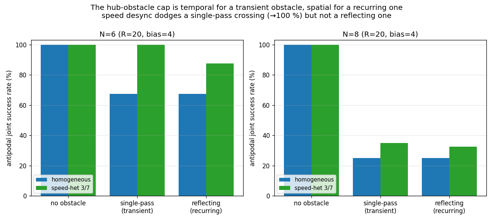

| obstacle | N=6 homo | N=6 speed-het | N=8 homo | N=8 speed-het |
|---|---|---|---|---|
| none | 100 % | 100 % | 100 % | 100 % |
| single-pass (transient) | 68 % | **100 %** | 25 % | 35 % |
| reflecting (recurring) | 68 % | 88 % | 25 % | 32 % |

- **The transient cap is temporal — desync fully breaks it (N=6).** Against a single-pass obstacle,
  spreading the fleet's hub-arrival times lifts success from 68 % to **100 %** (`c=13/b=0`,
  p=2.4e-4). With staggered arrivals the drones cross the hub at different moments and dodge the
  one-time pass; synchronized, they all meet it at once.
- **The recurring cap is spatial — the same desync cannot break it.** Against a reflecting obstacle
  the identical speed-het is only a non-significant trend (68 % → 88 %, p=0.077): the obstacle keeps
  returning to the hub, so no arrival schedule avoids it. The hub is a point every drone must cross,
  and a persistent body owns it.
- **Desync is peer-neutral, so this isolates the obstacle axis.** With no obstacle the het and homo
  fleets are identical (40/40 both N) — the speed spread changes *when* drones reach the hub, not
  *whether* they coordinate, so the single-pass gain is purely obstacle-dodging, not a peer effect.
- **The temporal escape narrows with density (N=8).** At N=8 the cap is so deep (homo 25 %) that even
  the transient-obstacle desync is only a same-direction trend (35 %, p=0.29). A denser hub leaves
  less arrival-time slack to spread into, so the temporal component shrinks and the spatial one
  dominates — the [density cliff](#the-convention-cliff-is-hub-density-not-drone-count--n-and-r-collapse-onto-nr)
  reaching into the obstacle axis.

This refines the peer-rule cap: it is not one wall but two. A *persistent* external hazard through
the conflict point is spatial and desync-proof (which is why the reflecting obstacle in the original
cap result held); a *transient* one is temporal and dissolved by a peer-neutral arrival stagger, at
least until the hub is dense enough to remove the slack. (Scope: a moderate 3/7 spread; extreme
spreads collapse the peers on their own under this strong bias and are out of scope.)

Reproduce: `python scripts/antipodal_desync_obstacle_phase.py --n-list 6 8 --episodes 40`
(writes `results/antipodal_desync_obstacle_phase.{json,png}`).

## The Merry-Go-Round ring radius is a capacity-vs-speed knob — and there is a floor

The [explicit roundabout](#explicit-roundabout-merry-go-round-vs-implicit-convention-density-invariant-scaling-at-a-fixed-time-premium)
pays its ~63 % makespan premium because it rides a half-circumference arc of the radius-R ring. A
*smaller* ring is a shorter arc (faster) but packs the same N drones onto a shorter circumference
(tighter, so it should collide at high density). Sweeping `ring_radius` × N on the antipodal swap
(starts at radius 20; success ; makespan, ideal 8.0 s; arc estimate πR/speed):

| ring R | N=6 | N=12 | N=24 | arc ≈ |
|---|---|---|---|---|
| 6 | **0/20** | **0/20** | **0/20** | 3.8 s |
| 10 | 20/20 · 10.1 s | 20/20 · 10.1 s | **5/20** · 10.2 s | 6.3 s |
| 14 | 20/20 · 11.0 s | 20/20 · 11.0 s | 19/20 · 11.1 s | 8.8 s |
| 20 | 20/20 · 13.1 s | 20/20 · 13.1 s | 20/20 · 13.2 s | 12.6 s |

- **Radius is a speed knob.** Makespan tracks the arc length: shrinking the ring from 20 to 10
  cuts makespan from 13.1 s to 10.1 s (−23 %), because the drones ride a shorter circle before
  peeling off. The +63 % premium of the full ring is not fixed — it is the cost of *that* radius.

- **But each radius has an N-capacity ceiling that shrinks with it.** Ring 10 is fast and fine to
  N=12 but collapses at N=24 (5/20 — too many drones for the short circumference); ring 14 holds
  almost to N=24 (19/20); only the full ring 20 is unbounded over the tested range (20/20 at N=24).
  The circumference is the capacity, so the safe radius *grows with the crowd*.

- **And there is a floor.** Ring 6 fails at *every* N (0/20): too small to hold even six drones,
  and the deep radial dive to a tiny inner circle and back manufactures its own conflict near the
  centre. The roundabout needs a minimum radius to be a roundabout at all.

So the practical tuning rule for Merry-Go-Round is **pick the smallest ring whose circumference
holds your N** — that minimises the makespan premium while staying collision-free; default to the
full start-radius ring only when N is unknown or maximal. The density-invariance of the previous
result was the *large-ring* regime; in general the explicit roundabout has a speed/capacity
frontier the ring radius slides along.

Reproduce: `python scripts/roundabout_radius_phase.py --radius-list 6 10 14 20 --n-list 6 12 24 --episodes 20`
(writes `results/roundabout_radius_phase.json`).

## Priority deconfliction fails the symmetric hub — it trades deadlock for collision

The convention (veer right) and the [explicit roundabout](#explicit-roundabout-merry-go-round-vs-implicit-convention-density-invariant-scaling-at-a-fixed-time-premium)
break the antipodal deadlock by *symmetric participation* — every drone moves the same way. The
classic third school of multi-robot deconfliction is the opposite: a *priority* total order in
which lower-priority robots yield and higher-priority ones proceed (Erdmann & Lozano-Pérez). Does a
priority order break the hub too? A new CBF flag `priority_yield` gives each drone a decentralized
order from each peer's observable, fixed *goal* position (lexicographic): the ego avoids only
higher-priority peers and ignores the rest, assuming they yield.

Antipodal swap, CBF, n=40, paired by seed:

| N | stock | priority | pairwise (convention) | priority vs stock | pairwise vs priority |
|---|---|---|---|---|---|
| 6 | 10/40 (30 timeout) | 14/40 (26 **collision**) | 40/40 | b=5/c=9, 0.42 (n.s.) | b=0/c=26, **<1e-9** |
| 8 | 2/40 (38 timeout) | 4/40 (36 **collision**) | 40/40 | b=1/c=3, 0.62 (n.s.) | b=0/c=36, **<1e-9** |
| 12 | 0/40 (40 timeout) | 0/40 (40 **collision**) | 40/40 | b=0/c=0, 1.0 | b=0/c=40, **<1e-9** |

- **Priority does not solve the hub.** It is statistically no better than plain CBF at every N
  (priority-vs-stock n.s.), while the symmetric convention rescues all of them to 40/40.

- **Worse, it converts a safe failure into an unsafe one.** Stock CBF deadlocks *collision-free*
  (timeout); priority turns that into almost-all-**collision** (26/36/40). It is a safety
  regression for no success gain.

- **Why a priority order is the wrong tool for simultaneous convergence.** Priority works when the
  lower-priority agent can actually *yield* — wait, slow, give way — which needs time and somewhere
  to go. At the antipodal hub every drone arrives at the centre at once: the ones a higher-priority
  drone "ignores, assuming they yield" have nowhere to yield to, so the higher-priority drone drives
  straight into them. Asymmetric ignoring presumes a sequential conflict; a radial convergence is
  simultaneous. The convention and the roundabout work precisely because *everyone* participates —
  no agent ignores any other.

Net: this bounds the symmetry-breaker family. A total-order priority — the standard fix for
sequential conflicts like doorways and intersections, where someone can wait — is not just
ineffective but actively unsafe at a simultaneous radial hub. Breaking the antipodal symmetry needs
*symmetric* participation (a shared convention or a shared roundabout), not a hierarchy in which
some defer to others.

Reproduce: `python scripts/antipodal_priority_phase.py --n-list 6 8 12 --episodes 40`
(writes `results/antipodal_priority_phase.json`).

## Sensing noise restores the predictor's relevance under the convention

[Once the convention is on, the predictor is free](#once-the-right-of-way-convention-is-on-the-predictor-is-free--cv-and-gt-become-identical):
with ground-truth peer positions, `cv+row` and `gt+row` are a McNemar tie at every N — symmetry-
breaking is the whole game and the forecast buys nothing. But decentralized swarms track peers with
noisy sensors. The two predictors degrade differently: `game_theoretic` anchors each peer on its
*exact* goal (runner-provided) and only uses the noisy position as a start point, so its forecast
direction stays roughly right; `constant_velocity` extrapolates the noisy position **and** velocity
directly, so its error grows with the noise. Convention always on (`lateral_bias=4`), sensor =
`noisy_tracker` with matched position/velocity noise, arms cv+row vs gt+row, paired by seed (n=40).

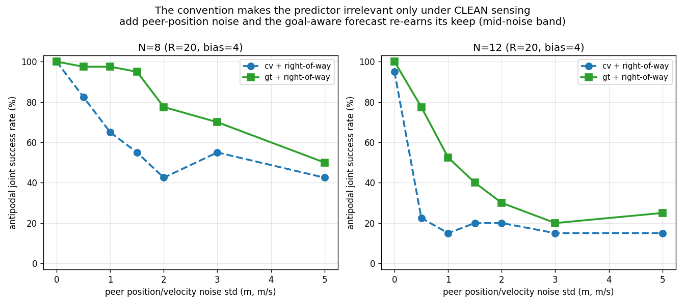

| noise σ | N=8 cv+row | N=8 gt+row | gt vs cv | N=12 cv+row | N=12 gt+row | gt vs cv |
|---|---|---|---|---|---|---|
| 0   | 100 % | 100 % | tie | 95 % | 100 % | tie |
| 0.5 | 82 %  | 98 %  | p=0.031 | 22 % | 78 % | p=3.0e-6 |
| 1   | 65 %  | 98 %  | p=2.4e-4 | 15 % | 52 % | p=1.5e-3 |
| 1.5 | 55 %  | 95 %  | p=1.5e-4 | 20 % | 40 % | p=0.077 |
| 2   | 42 %  | 78 %  | p=5.2e-4 | 20 % | 30 % | p=0.29 |
| 3   | 55 %  | 70 %  | p=0.21 | 15 % | 20 % | ns |
| 5   | 42 %  | 50 %  | p=0.61 | 15 % | 25 % | ns |

- **The published tie is a clean-sensing artefact.** At σ=0 cv+row = gt+row (reproducing the result),
  but it is *only* a σ=0 fact. The convention's dominance over the predictor does not survive contact
  with a noisy peer tracker.
- **A mid-noise band where the goal-aware forecast re-earns its keep.** At N=8, gt+row significantly
  beats cv+row across σ ∈ [0.5, 2] — up to 65 % vs 98 % at σ=1 (`c=13/b=0`, p=2.4e-4). The exact-goal
  anchor keeps gt's forecast usable when the position is unreliable; cv, extrapolating the corrupted
  state, degrades far faster. So forecast quality *is* a decision again — exactly where the published
  result said it was not — once the sensing is realistic.
- **It is stress-gated on both ends.** Below the band (σ=0) both are at the clean ceiling (tie);
  above it (σ ≥ 3) the noise drowns even gt's goal anchor and both floor (tie). The forecast helps
  only in the window where the position is noisy enough to hurt cv but not so noisy that gt's anchor
  fails too.
- **Density shifts the band left and narrows it.** At N=12 the denser hub makes noise bite at once —
  the largest gap is at σ=0.5 (22 % vs 78 %, p=3.0e-6) and the band has collapsed by σ=2. A crowded
  hub has less spatial slack, so a given position error is more often fatal, and it reaches gt's
  anchor-failure floor sooner.

This bounds [the predictor-dominance result](#once-the-right-of-way-convention-is-on-the-predictor-is-free--cv-and-gt-become-identical):
the convention makes the predictor irrelevant **only under perfect sensing**. Under a realistic noisy
peer tracker, symmetry-breaking and a good forecast are *complementary* again — the convention sets
the passing side, and the goal-anchored forecast is what keeps the fleet from colliding while it does.

Reproduce: `python scripts/antipodal_convention_predictor_noise_phase.py --n-list 8 12 --noise-list 0 0.5 1 1.5 2 3 5 --episodes 40`
(writes `results/antipodal_convention_predictor_noise_phase.{json,png}`).

## Priority fails the doorway too — correcting the "priority is for sequential conflicts" conjecture

The [hub result](#priority-deconfliction-fails-the-symmetric-hub--it-trades-deadlock-for-collision)
conjectured that priority deconfliction, useless at a *simultaneous* radial hub, would be the right
tool for *sequential* conflicts like a doorway, where one party can wait its turn. Testing that
conjecture refutes it. Porting `priority_yield` to the static-aware MPC and running the doorway
bottleneck (a wall with a gap, two opposing streams; n=30):

| gap | stock | priority | pairwise (convention) | priority vs stock | pairwise vs stock |
|---|---|---|---|---|---|
| 6 | 4/30 (26 coll) | **0/30 (30 coll)** | 29/30 (1 coll) | b=4/c=0, 0.125 (worse) | b=1/c=26, **<1e-9** |

- **Priority fails the doorway too — in fact it is *worse* than doing nothing** (0/30 vs stock
  4/30, all collisions), while the symmetric convention nearly solves it (29/30).

- **Why the sequential-conflict intuition was wrong.** A *decentralized goal-priority* does not
  produce clean turn-taking. The higher-priority stream "ignores, assuming they yield" the oncoming
  lower-priority drones — but in the narrow gap those drones have nowhere to yield to, so the
  high-priority drones plow into them, exactly as at the hub. And the per-drone goal order also
  ranks drones *within* each stream (their goals differ in y), manufacturing intra-stream conflicts
  on top. "Yielding" needs space and coordination the bottleneck does not hand out for free; an
  ignore-the-lower-priority rule provides neither.

- **Symmetric participation wins at *both* canonical hard scenarios.** Across the hub and the
  doorway, the convention (everyone follows the same in-plane rule) succeeds (40/40 and 29/30) and
  decentralized priority (some defer to others) fails (collisions at both). The lesson generalises:
  what breaks these symmetric multi-robot conflicts is *every agent participating in the same
  manoeuvre*, not a hierarchy in which some agents stand aside. (Clean turn-taking at a doorway is
  achievable, but it needs *explicit, stream-level* coordination — a negotiated schedule — not a
  per-agent priority order.)

Net: this corrects the hub finding's parenthetical hope. Decentralized priority deconfliction is
not the sequential-conflict complement to the convention; it fails the doorway as it fails the hub.
The robust cross-scenario fix is symmetric participation.

Reproduce: `python scripts/doorway_priority_phase.py --n 3 --gap-list 6 --episodes 30`
(writes `results/doorway_priority_phase.json`).

## The convention is a consensus device — a split right/left rule is worse than no rule

The right-of-way rescues the antipodal hub by tilting every drone the same way (all RIGHT) into a
clockwise roundabout. Is the rescue from the *tilt*, or from every drone *agreeing on the
direction*? Splitting the fleet — half on `lateral_bias = +B` (veer right), half on `−B` (veer
left), alternating around the ring — separates the two. MPC, antipodal, n=40:

| N | stock | consensus (all +B) | split (±B) | consensus vs stock | consensus vs split |
|---|---|---|---|---|---|
| 4 | 25/40 | 37/40 | **18/40** | b=2/c=14, **0.004** | b=3/c=22, **2e-4** |
| 6 | 20/40 | 39/40 | 31/40 | b=1/c=20, **<1e-9** | b=1/c=9, **0.022** |
| 8 | 29/40 | 40/40 | **9/40** | b=0/c=11, **0.001** | b=0/c=31, **<1e-9** |

- **The convention's power is consensus, not the tilt.** Unanimous tilting rescues (37/39/40); a
  split rule is far worse at every N (consensus vs split significant throughout) — and at N=4 and
  N=8 the split rule is *worse than doing nothing at all* (18 vs 25, 9 vs 29). Half the fleet
  tilting each way is not half a convention; it is an anti-convention.

- **Why: opposite tilts are opposite rotations.** A right-veerer circulates the hub clockwise, a
  left-veerer counter-clockwise; mixed, they meet head-on inside the roundabout and collide. The
  convention works only because everyone rotates the *same way* — like driving: a road where half
  keep right and half keep left is more dangerous than one with no rule, because the rule's whole
  job is to make the two directions *agree*.

- **It mirrors the protocol-mismatch result at the rule level.** Just as mixing two reciprocal
  *controllers* is [less safe than either alone](#two-reciprocal-collision-avoiders-are-less-safe-mixed-than-either-is-alone),
  mixing two convention *directions* is less safe than either alone (or than none). Coordination is
  a shared-agreement property; a half-adopted disagreement is worse than unanimous abstention.

Net: the right-of-way is not a per-agent nudge that happens to help — it is a *consensus* on a
single global rotation sense, and that consensus is the entire mechanism. A convention only works
if everyone obeys the *same* one.

Reproduce: `python scripts/antipodal_split_convention_phase.py --n-list 4 6 8 --bias 2 --episodes 40`
(writes `results/antipodal_split_convention_phase.json`).

## The convention is for symmetric convergence only — on unstructured traffic it is a net liability

Every convention result lives on a *structured symmetric* task (antipodal hub, doorway, crossing).
The closing boundary question: what does the right-of-way do on *unstructured* traffic — N drones
at random positions crossing to a random derangement of those positions, many uncorrelated pairwise
conflicts with no single symmetric hub to break? MPC, paired by seed, n=40:

| N | stock | global (lateral_bias) | pairwise | global vs stock | pairwise vs stock |
|---|---|---|---|---|---|
| 8 | 34/40 | 39/40 | 37/40 | b=1/c=6, 0.125 | b=2/c=5, 0.45 |
| 12 | 39/40 | 38/40 | **15/40** (8c, 17 to) | b=1/c=0, 1.0 | b=24/c=0, **<1e-9** |
| 16 | 31/40 | **7/40** (33c) | 18/40 (22c) | b=25/c=1, **<1e-9** | b=15/c=2, **0.002** |

- **With no symmetry to break, the convention is gratuitous — and at density it *harms*.** When
  the traffic is sparse (N=8) it is roughly neutral, but as it thickens both conventions drag
  success *below* doing nothing: the global rule collapses at N=16 (31→7, all collisions) and the
  pairwise rule at N=12 (39→15, mostly *timeouts*). The tilt perturbs drones whose conflicts are
  ordinary pairwise crossings the base planner already handles, manufacturing the collisions and
  jams it was meant to prevent.

- **The two fail in their characteristic ways.** The unconditional global veer turns clean
  crossings into collisions (it pushes everyone the same way into each other); the pairwise rule,
  summing tilts over many uncorrelated neighbours, points nowhere coherent and *stalls* (timeouts).
  Neither has a symmetric convergence to convert into a roundabout, so both just add noise.

- **This bounds the whole convention arc — and even the "always-safe" pairwise rule.** The
  right-of-way (in any form) is a targeted fix for a *symmetric convergence*; it is not a general
  traffic primitive and must not be left always-on. The earlier
  [pairwise-is-safe](#a-pairwise-winding-number-right-of-way-strictly-dominates-the-global-veer-right)
  result held on structured cells; dense *unstructured* traffic is where even the conditional
  pairwise rule regresses. Deploy the convention only where the conflict actually is a symmetric
  hub or head-on; switch it off for general point-to-point traffic.

Net: the convention's value and its harm are two sides of one fact — it imposes a global rotational
order. Where the conflict *is* a symmetric convergence that order is the cure; where it is not, the
order is just an unwanted bias that costs collisions (global) or deadlocks (pairwise).

Reproduce: `python scripts/unstructured_convention_phase.py --n-list 8 12 16 --episodes 40`
(writes `results/unstructured_convention_phase.json`).

## A sensing-defect taxonomy: noise restores the predictor under the convention, delay does not

[Sensing noise restores the predictor's relevance under the convention](#sensing-noise-restores-the-predictors-relevance-under-the-convention)
showed that position *noise* re-opens a gt+row > cv+row gap that perfect sensing closes. Is that a
property of tracking error in general, or specific to noise? Cross the two canonical tracking defects
— position noise (σ) and a fixed perception delay (τ; position lagged by a ring buffer, velocity
passes through) — on the same antipodal swarm (N=8, convention on, cv+row vs gt+row, paired, n=40).
The mechanism predicts they differ: noise corrupts the position so gt's *exact-goal anchor* beats
cv's extrapolation of the corrupted state, but delay leaves both predictors reading the *same* stale
position — and the one channel delay keeps clean (the true velocity) is the very one cv uses — so
they should degrade together.

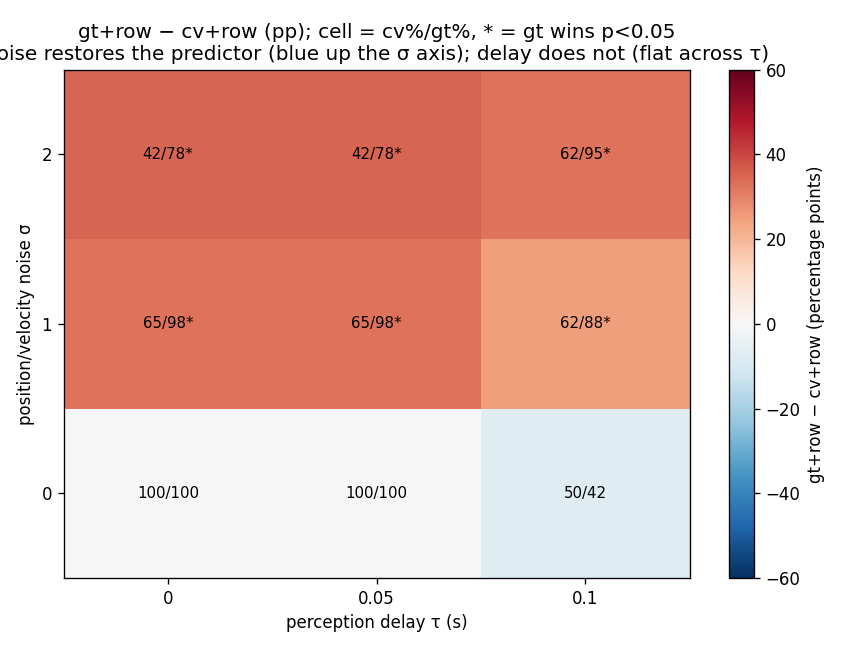

cv+row % / gt+row %, `*` = gt+row significantly better (McNemar p<0.05):

| σ \ τ | 0 | 0.05 | 0.1 |
|---|---|---|---|
| **0** | 100 / 100 (tie) | 100 / 100 (tie) | 50 / 42 (tie, p=0.55) |
| **1** | 65 / 97 \* (p=2.4e-4) | 65 / 97 \* (p=2.4e-4) | 62 / 87 \* (p=0.013) |
| **2** | 42 / 77 \* (p=5.2e-4) | 42 / 77 \* (p=5.2e-4) | 62 / 95 \* (p=9.8e-4) |

- **Noise restores the predictor; delay does not.** Every σ>0 cell is a significant gt+row win
  *regardless of τ*; the entire τ axis at σ=0 is a flat tie (even at τ=0.1, where success has fallen
  to ~50 %, gt+row and cv+row are indistinguishable, p=0.55). The restoration is driven by the noise
  axis alone. Perception latency hurts — it halves success at τ=0.1 — but it hurts the two predictors
  *equally*, so it never makes the forecast a decision.
- **The mechanism is confirmed by the contrast.** gt's advantage is the exact-goal anchor surviving a
  *corrupted* position. Delay does not corrupt the position (it shifts both predictors' input by the
  same lag) and leaves the true velocity intact (cv's channel), so it differentiates nothing. Noise
  is the only defect that degrades cv's state-extrapolation while sparing gt's goal anchor.
- **The noise advantage survives delay.** In the combined cells (σ>0, τ>0) gt+row still wins
  (σ=1, τ=0.1: p=0.013; σ=2, τ=0.1: p=9.8e-4) — a realistic tracker with both defects keeps the
  goal-aware forecast's edge. (Absolute levels wobble — σ=2,τ=0.1 sits higher than σ=2,τ=0 — because
  a little lag damps the noise-driven jitter; but the gt-over-cv gap is consistent across the grid.)

This makes the [predictor-restoration result](#sensing-noise-restores-the-predictors-relevance-under-the-convention)
a precise statement: under the convention the forecast earns its keep specifically when the peer
*position* is noisy, not merely when sensing is degraded. Latency is a red herring for the predictor
choice; measurement noise is the thing that brings the goal-aware forecast back.

Reproduce: `python scripts/antipodal_sensing_defect_phase.py --n 8 --noise-list 0 1 2 --delay-list 0 0.05 0.1 --episodes 40`
(writes `results/antipodal_sensing_defect_phase.{json,png}`).

## The convention is robust to physical heterogeneity (size) but not to coordination heterogeneity

The convention's robustness to *speed* heterogeneity is established (a 4× spread is fine); mixing
*controllers* or *directions* is not (those break it). The remaining physical axis is **size**: a
roundabout sized for uniform drones must also hold the bigger ones, which need more clearance. Does
a mixed big/small fleet still round the antipodal hub? (This required first fixing the peer-collision
check, which used a *shared* radius for one side of every pair — a no-op for uniform fleets but
wrong for heterogeneous ones; each drone is now checked with its own radius.) MPC, antipodal N=6,
alternating big/small radii (mean 0.4 m; each drone's `safety_margin` scaled to its own size), n=40:

| spread | radii (big/small) | het, no convention | het + pairwise | pairwise vs none |
|---|---|---|---|---|
| 0.0 | 0.40 / 0.40 | 24/40 | **40/40** | b=0/c=16, **<1e-9** |
| 0.3 | 0.55 / 0.25 | 26/40 | **40/40** | b=0/c=14, **1e-4** |
| 0.6 | 0.70 / 0.20 | 23/40 | **40/40** | b=0/c=17, **<1e-9** |
| 0.9 | 0.85 / 0.20 | 26/40 | **40/40** | b=0/c=14, **1e-4** |

- **The convention is robust to size heterogeneity — completely.** A fleet mixing 0.85 m and 0.20 m
  drones (a 4.25× radius ratio) rounds the hub at 40/40 under the convention, identical to the
  uniform fleet, at every spread tested. The roundabout spaces the drones out enough that the size
  mix is irrelevant once each keeps its own clearance.

- **This sharpens the heterogeneity dichotomy.** The convention shrugs off *physical* heterogeneity
  — different speeds (a 4× spread, prior result) and now different sizes (a 4× ratio) — because
  those do not change which way each drone should rotate. But it is broken by *coordination*
  heterogeneity — mixed [reciprocal controllers](#two-reciprocal-collision-avoiders-are-less-safe-mixed-than-either-is-alone)
  or [mixed convention directions](#the-convention-is-a-consensus-device--a-split-rightleft-rule-is-worse-than-no-rule)
  — because those break the shared agreement the convention rests on. Heterogeneity in *what the
  drones are* is fine; heterogeneity in *what rule they follow* is fatal.

- **(Fix.)** The peer-collision check now uses each drone's own radius (`radii[i] + radii[j]`); it
  previously used a shared `drone_radius` on the i-side — invisible for uniform fleets but it would
  let an oversized drone overlap a peer undetected. Any future heterogeneous-size work depends on it.

Net: the right-of-way is robust to *who* is in the fleet (fast/slow, big/small) and fragile only to
*disagreement about the rule* — exactly the profile of a coordination convention rather than a
physical avoidance trick.

Reproduce: `python scripts/antipodal_hetero_radii_phase.py --n 6 --spread-list 0 0.3 0.6 0.9 --episodes 40`
(writes `results/antipodal_hetero_radii_phase.json`).

## Reproducing the RVO→ORCA improvement: ORCA removes RVO's oscillation (the reciprocal dance)

The lab's reciprocal baseline is **ORCA** (Optimal Reciprocal Collision Avoidance, van den Berg
2011). ORCA's published contribution was not collision avoidance *per se* — its direct precursor
**RVO** (Reciprocal Velocity Obstacles, van den Berg 2008) already avoided reciprocally — but the
elimination of RVO's **oscillation**. RVO picks the new velocity by *sampling* candidates and scoring
each by a penalty (distance-to-preferred traded against time-to-collision); two reciprocating agents
can flip between mirror-image candidates step after step — the "reciprocal dance" — so their tracks
jitter. ORCA replaced the sampled choice with a per-neighbour linear *half-plane* of permitted
velocities and a tiny LP, making the choice a smooth convex projection that does not chatter.

To reproduce and quantify that classic improvement, RVO is implemented as its own planner
(`planner.type: rvo`, a clean-room version of the published sampled-velocity selection with the
reciprocal half-velocity penalty) and run head-to-head with ORCA on the same crossing. Both methods
assume single-integrator dynamics, so the comparison uses a self-contained single-integrator sim
where the full velocity trajectory is observable; the **oscillation** of each drone is the total
absolute heading variation of its velocity over the run (radians). Perpendicular crossing of 2N=8
drones, jittered per seed, paired by seed, n=40:

| arm | success | mean oscillation (rad) | mean makespan |
|---|---|---|---|
| rvo | 36/40 | **3.76** | 7.81 s |
| orca | **40/40** | **0.13** | 7.45 s |

- **ORCA removes the oscillation — by 29.6×.** RVO accumulates 3.76 rad of heading variation per
  drone; ORCA, 0.13 rad. RVO oscillates more than ORCA on **every one of the 40 seeds** (sign test
  p = 1.8e-12) — a clean, deterministic reproduction of the headline RVO→ORCA result, not a
  marginal seed-dependent effect.

- **The oscillation is not free.** RVO's jitter costs it 4 episodes (36/40 vs 40/40) — the reciprocal
  dance occasionally chatters two drones into contact at the hub — and a slightly slower makespan
  (7.81 s vs 7.45 s). The smooth choice is both safer and faster here, which is exactly why ORCA
  superseded RVO as the standard reciprocal avoider.

- **Same paradigm, different selection rule.** Both planners use the identical reciprocal premise
  (each agent takes half the avoidance, hence the half-velocity / half-plane construction); the only
  difference is *sampled penalty minimum* (RVO) vs *convex half-plane projection* (ORCA). The 29.6×
  oscillation gap is therefore attributable to the selection mechanism alone, isolating precisely
  what the 2011 paper changed over the 2008 one.

This makes the lab's reciprocal-avoidance lineage explicit: RVO (2008, the precursor) and ORCA (2011,
the standard) are both present, and the reason the standard is the standard is measured rather than
asserted.

Reproduce: `python scripts/rvo_orca_oscillation_phase.py --n 4 --episodes 40`
(writes `results/rvo_orca_oscillation_phase.json`).
